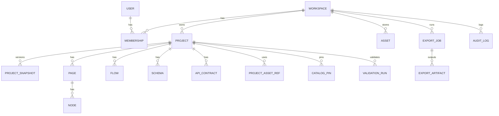

# WAA Studio 통합 기획 문서 v1.5.24
> 본 문서는 `v1.5.22`를 기준으로, 개발 착수 전 필수 산출물(OpenAPI/JSON Schema/UX Spec/PoC)을 **파일 단위로 고정**하고,
> 분할 문서를 SSOT로 운영하기 위한 규칙을 반영한 버전입니다.

- INDEX(분할본): `00_chapter-00.md`
- OpenAPI: `api/openapi.yaml`
- JSON Schema: `schemas/*.schema.json`
- UX Specs: `ux/*.md`
- PoC: `poc/*.md`

---

# 1. 문서 컨트롤

> **문서 역할**: `1. 문서 컨트롤` 범위의 요구사항/정의/결정사항을 “작업용 SSOT”로 유지한다.  
> **편집 원칙**: (1) v1 범위 우선, (2) add-only/비파괴 기본, (3) API·데이터·UX·Validation·AC를 함께 갱신.  
> **Owner(역할)**: PO/PM(기능 범위) · UX(화면/문구) · FE/BE(구현 계약) · QA(AC/테스트)  
> **관련 문서**:
> - [00_INDEX](00_chapter-00.md)
> - [25_결정-로그](25_chapter-25.md)
> - [23_로드맵](23_chapter-23.md)
> - [26_열린-질문](26_chapter-26.md)


## 1.1 문서 목적과 범위
- 본 문서는 WAA Studio의 **제품/UX/SSOT/정책/검증/백엔드 연동**을 한 곳에서 정의하는 “개발 기준(SSOT)”이다.
- 범위는 다음을 포함한다.
  - 프로젝트 생성(Domain/Template/Starter Kit)
  - Page Studio Hub & Spoke UX(Overlay/Isolation/Quick Return)
  - Flow/Data/API/Export/Business Studio의 역할과 연결 규칙
  - Figma Re-import(UI-only) 전략
  - 최소 Asset 경고(5MB 등) / Escape Hatch(Embed) / Validation(🟢🟡🔴)
  - SSOT Catalog/Models(도메인/템플릿/프리셋/계약)

## 1.2 버전/변경 관리 규칙
- 본문 스펙 변경은 **v1.5.x** 버전에서만 진행하고, 변경은 반드시 “결정 로그(25)”에 기록한다.
- “기획(문서)”과 “코드”는 상호 링크를 유지한다:
  - PR(또는 커밋)에는 **문서 섹션 번호**를 포함한다. 예: `Implements: 7.2 Domain 선택(필수)`

- v1.5.24 변경 요약(2025-12-19):
  - AI: AI Panel/Validation/Flow Overlay 연계를 “CommandBatch 제안 → 사용자 승인 → CommandBus 적용” 계약으로 SSOT화
  - 4.5 추가: v1 구현 블루프린트(최소 OpenAPI 엔드포인트 목록, DB ERD 수준 테이블 초안, FE 모노레포 구조)
  - API: `/ai/assist` 엔드포인트 및 요청/응답 타입(초안) 추가


- v1.5.17 변경 요약(2025-12-18):
  - 16(Export): Export Job 모델/API 계약 + 취소/재시도/로그/권한/ENV 스펙 보강
  - 17(Validation): Rule Registry(초기 세트) 확장 + Trigger/Go-to/메시지 표준화 보강
  - 14(Design Sync): Re-import 분류(Auto-safe/Review/New) + 텍스트/바인딩 보호 규칙 명시
  - 19(Catalog): 릴리즈 산출물(검증 리포트/Deprecated/호환성 요약) 명시
  - 20(Persistence): 로컬+서버 동기화/충돌 정책(기본안) 추가
  - 15(Asset): Validation 규칙 표 + 외부 URL allowlist/임계값/적용 타이밍 고정
  - 18(보안): Escape Hatch(Scoped CSS/JS Sandbox) 차단/허용 규칙 구체화

- v1.5.18 변경 요약(2025-12-18):
  - 7(New Project Wizard): 60초 해피패스(이름+템플릿) + Autopilot + 고급설정 드로어로 단순화, Review 단계 제거
  - 8(Page Studio): 생성 직후 샘플 1페이지 자동 오픈 + 우측 “다음 할 일(체크리스트)” 온보딩 패널 추가
  - 15(Asset): Asset 선택 UX를 Inspector 내 Asset Picker(모달/패널)로 일원화, ‘Asset Library’ 용어를 ‘Asset Library’(내장 패널)로 정리
  - 6(Project Dashboard): 빈 상태/추천 진입 및 ‘Continue 편집’ 동선이 Page Studio 우선 원칙을 따르도록 보정

- v1.5.19 변경 요약(2025-12-18):
  - 7(New Project Wizard): StarterKit 선택/설치의 정의를 Manifest 기반(SSOT)으로 고정, 설치 항목 요약/충돌 정책/업그레이드 원칙을 명문화
  - 2.1.z(Starter Kit / Feature Module Catalog): StarterKit 포함 항목 표준(페이지/섹션/컴포넌트/테마/자산/콘텐츠/온보딩/스키마/Mock/Flow 등) 정의 + StarterKit Manifest 스키마(제안) + 기본 제공 StarterKit 카탈로그(v1) + 예시 JSON 2종(General/Commerce) 추가

- **v1.5.21 (2025-12-18)**: 개발 착수 전 리스크 제거를 위한 “계약 고정” 보완
  - API Contract Index(최소 엔드포인트/공통 규칙) 추가
  - Catalog pin 정책(v1 고정) 및 Upgrade/Rollback 흐름 명문화
  - Design Sync Re-import 텍스트/콘텐츠 보호 규칙(기본 Protect) 확정
  - StarterKit Uninstall/Rollback 정책(add-only/idempotent/skip-and-report) 추가
  - Embed Bridge Protocol SSOT(이벤트/페이로드/권한 스코프) 추가
  - ApiContract versioning/managed block/merge 규칙 보강
- **v1.5.22 (2025-12-18)**: API Contract Index를 OpenAPI(Swagger) 초안으로 변환 가능한 표준 스키마 추가
  - OpenAPI 3.1 Skeleton(보안/헤더/에러/페이지네이션/ETag/Idempotency) 제공
  - API Contract Index ↔ OpenAPI 매핑 규칙(operationId/tags/$ref/x-waastudio 확장) 명문화


## 1.3 번호/용어/표기 규칙
- 섹션/하위 섹션 번호는 **숫자만 사용**: `1`, `1.1`, `1.1.1` …
- `S`, `X`, `A4-…` 같은 문자 프리픽스는 사용하지 않는다.
- 용어는 “용어집(24)”을 SSOT로 한다(본문에서 중복 정의 금지).

## 1.4 읽는 방법 및 SSOT 선언
- 개발 시작 순서 추천:
  1) **19~20(SSOT 카탈로그/모델)**을 먼저 확정
  2) 7~8(프로젝트 생성/페이지 허브) 구현
  3) 17(Validation) + 16(Export) + 14(Design Sync) 확장
  4) 13(Business Studio)로 Backend 스캐폴딩 연계
- SSOT(코드) 관점에서 가장 먼저 코드화해야 하는 것:
  - `DomainCatalog`, `TemplateCatalog`, `StarterKitCatalog`, `SchemaPresetCatalog`
  - `ProjectModel`, `PageModel`, `NodeModel`, `FlowModel`, `SchemaModel`, `AssetModel`
  - `ApiContractModel`, `BackendGenerationPlan`

---

## 1.5 상세 스펙
### 1.5.1 v1.4 상세 기획 이관
- (해당 섹션은 v1.4 원문에서 직접적인 상세 블록을 찾지 못해, v1.5 기준 체크리스트만 제공)

### 1.5.2 v1.5 정규화 체크리스트(필수)
- UI 구성(화면 요소/레이블/도움말/빈 상태)
- 상태(State): loading/empty/error/success
- 데이터 모델: 필드/타입/기본값/저장 위치(SSOT)
- 액션/이벤트: 주요 트리거 + 단축키/자동 동작
- Validation: 규칙 + 메시지 + 발생 타이밍(🟢🟡🔴 연동)
- Acceptance Criteria: 완료 조건 5~10개

---

# 2. 제품 정의와 철학

> **문서 역할**: `2. 제품 정의와 철학` 범위의 요구사항/정의/결정사항을 “작업용 SSOT”로 유지한다.  
> **편집 원칙**: (1) v1 범위 우선, (2) add-only/비파괴 기본, (3) API·데이터·UX·Validation·AC를 함께 갱신.  
> **Owner(역할)**: PO/PM(기능 범위) · UX(화면/문구) · FE/BE(구현 계약) · QA(AC/테스트)  
> **관련 문서**:
> - [03_핵심-개념](03_chapter-03.md)
> - [04_시스템-개요](04_chapter-04.md)
> - [05_사용자-여정](05_chapter-05.md)
> - [23_로드맵](23_chapter-23.md)


## 2.1 제품 한 줄 정의
WAA Studio는 **Page Studio를 메인 허브(Hub)**로 두고, 필요할 때만 다른 스튜디오를 잠깐 방문(Spoke)하는 **통합 제작 환경**이다.

## 2.2 핵심 메시지(Mantra)
- “개발자가 없어도 되는 툴”이 아니라, **“개발자가 되고 싶게 만드는 툴”**
- 템플릿/스타터킷으로 시작하되, 스키마/바인딩/플로우/계약(ApiContract)을 이해하며 성장하는 경험을 제공한다.

## 2.3 타겟 사용자와 기대 성과
- Non-dev: 빠른 시작(Template/Starter Kit), 안전장치(Policy/Validation), 막막함 제거(가이드 레이어)
- Hybrid-maker(기획+디자인+FE): JSON→Schema, Flow 연결, 빠른 검증/배포
- Dev/Enterprise: Design Sync, Escape Hatch(Embed), Backend 스캐폴딩(Contract-first), 감사/권한

---

## 2.4 상세 스펙
### 2.4.1 v1.4 상세 기획 이관
- (해당 섹션은 v1.4 원문에서 직접적인 상세 블록을 찾지 못해, v1.5 기준 체크리스트만 제공)

### 2.4.2 v1.5 정규화 체크리스트(필수)
- UI 구성(화면 요소/레이블/도움말/빈 상태)
- 상태(State): loading/empty/error/success
- 데이터 모델: 필드/타입/기본값/저장 위치(SSOT)
- 액션/이벤트: 주요 트리거 + 단축키/자동 동작
- Validation: 규칙 + 메시지 + 발생 타이밍(🟢🟡🔴 연동)
- Acceptance Criteria: 완료 조건 5~10개

---

# 3. 핵심 개념

> **문서 역할**: `3. 핵심 개념` 범위의 요구사항/정의/결정사항을 “작업용 SSOT”로 유지한다.  
> **편집 원칙**: (1) v1 범위 우선, (2) add-only/비파괴 기본, (3) API·데이터·UX·Validation·AC를 함께 갱신.  
> **Owner(역할)**: PO/PM(기능 범위) · UX(화면/문구) · FE/BE(구현 계약) · QA(AC/테스트)  
> **관련 문서**:
> - [04_시스템-개요](04_chapter-04.md)
> - [19_ssot-카탈로그](19_chapter-19.md)
> - [20_ssot-모델](20_chapter-20.md)
> - [17_validation-엔진](17_chapter-17.md)


## 3.1 Hub & Spoke UX
- Hub(Page Studio)에서 최대한 해결하고, Spoke는 **Overlay/Isolation**으로 열어 컨텍스트 전환 비용을 줄인다.
- Spoke 작업 후 **Quick Return(ESC/Done)** 으로 즉시 복귀한다(선택/스크롤/캠 유지).

## 3.2 SSOT(단일 출처)
- 모델/카탈로그/정책/계약은 “한 곳에서만 정의”되고, UI는 이를 읽어 렌더링한다.
- “추천/템플릿/프리셋/키워드 힌트”는 감이 아니라 **Catalog**로 고정한다.

## 3.3 정책(Policy) 우선순위
- 적용 우선순위: **TagPolicy → StylePolicy → ComponentPolicy**
- 사용자 오버라이드는 “정책 허용 범위 내”에서만 가능하며, Validation이 최종 안전망이다.

## 3.4 점진적 고도화 전략
- v1.5.0은 “완벽한 자동화”보다 **확실한 UX/경고/게이트**를 우선한다.
- 예: 이미지 최적화는 후속이더라도, 대용량 업로드 경고는 즉시 제공한다.
- Backend 생성도 “바로 생성”이 아니라 **Plan→리뷰→적용**을 기본으로 한다.

---

## 3.5 상세 스펙

### 3.5.3 추가 이관: 공통 UX 원칙(컨텍스트 유지)
- **브레드크럼 기반 컨텍스트 유지**
- Studio 간 점프 시, 상단에 “어디에서 왔는지”를 항상 표시하여 사용자가 길을 잃지 않게 한다.
- **Back 동작 단순화**
- 브레드크럼의 좌측에 “이전 Studio로 돌아가기” 버튼을 제공하여, 브라우저 `뒤로가기`와 혼동되지 않도록 한다.
- **멀티 윈도우/탭 고려 (v2 이후)**
- v1에서는 단일 브라우저 탭 기준으로 동작하지만, v2에서는 Data & API Studio를 별도 탭/창으로 띄우는 옵션을 고려한다.


#### [v1.5.16 Addendum] Hub & Spoke 전환 비용 최소화 + 대규모 캔버스 성능/안정성

- **대규모 캔버스 Virtualized Rendering(필수)**
  - Layers Tree / Outline / Board / React Flow 노드 리스트는 기본적으로 가상화(virtualization)한다.
  - 화면 밖(Offscreen) 요소는 렌더링/이벤트 처리에서 제외하고, 선택/드래그 대상만 “활성 영역”으로 승격한다.
  - 기준: **노드 1,000+ / 레이어 5,000+**에서도 편집 입력(드래그/줌/선택)이 끊기지 않도록 “프레임 예산(16ms)” 기반으로 처리한다.

- **Incremental Validation 디바운스 + 2단계 실행**
  - “빠른 검사(Fast Pass)”는 동기 처리(필수값/참조 존재/정책 위반 핵심만).
  - “느린 검사(Slow Pass)”는 디바운스(기본 200ms) + 취소 가능 토큰으로 비동기 처리(그래프/의존성/대규모 정책 검사).
  - TopBar 🟢🟡🔴는 Fast Pass 기준으로 즉시 반응하고, Slow Pass는 결과 패널/리포트로 합산한다.

- **스튜디오 복귀 상태(Selection/Scroll/Zoom) 100% 복원**
  - Spoke(Overlay/Isolation/Full Studio) 진입 시, Hub(Page Studio)의 **뷰포트/선택/우측 패널 탭**을 스냅샷 저장한다.
  - Quick Return(ESC/Done) 시 “진입 직전 상태”로 복구(사용자 길 잃음 방지).
  - 복구 실패(데이터 변경/삭제) 시에도 “최소 안전 복구”: 가장 가까운 상위 노드 선택 + 캔버스 중앙 정렬.

- **가이드/툴팁 레이어는 ‘한 번만’ + 즉시 해제**
  - On-Canvas Starter Guide는 isFirstVisit 기준 1회만 노출하고, 사용자가 편집을 시작하면 즉시 Fade-out + 다시 표시하지 않음.

- **오류/중단 시 Recover UX**
  - Re-import/Install/Generate 같은 “대형 작업”은 **Apply 전 스냅샷 + Rollback 버튼(1-click)**을 기본 제공한다.


##### Onboarding & Starter Kit (Feature Module)
### 2.1.z Starter Kit / Feature Module Catalog (Schema + Mock API + UI + Flow) — SSOT 구조

> 배경: 기능 정의가 완벽하더라도, 사용자가 “Blank Canvas”에서 막막함을 느끼면 이탈한다.
> 해결: 단순 템플릿(레이아웃) 수준을 넘어, **데이터/API/컴포넌트/플로우가 세트로 묶인 기능 모듈**을 제공한다.

#### 핵심 개념
- **Feature Module(= Starter Kit Module)**: 아래 자원을 ‘설치(Install)’ 단위로 묶은 패키지
- Data: Schema Preset(엔티티/필드/관계)
- API: Mock API Preset(에디터 프리뷰/테스트용) + (선택) Backend Studio 생성 힌트
- UI: Page/Section/Component 블록(재사용 가능한 구성 요소)
- Flow: ActionFlow 템플릿(로그인/저장/목록조회/네비게이션 등)
- Seed: 샘플 데이터/콘텐츠(선택)

#### 적용 UX(권장)
- **New Project Wizard**: Domain 선택 후, (선택) “Starter Kit 설치”에서 추천 모듈을 제안(멀티 선택)
- **Page Studio**: Insert 패널에 “Modules” 탭 제공 → 모듈 Drag & Drop 시 필요한 자원(스키마/플로우 포함)을 자동 추가
- **Component Studio / Flow Studio**: 모듈이 제공하는 템플릿/플로우를 라이브러리처럼 탐색

#### SSOT 설계 원칙
- 모듈은 “코드 실행”이 아니라 **ProjectModel에 적용되는 Command/패치(Install Plan)** 로 정의한다.
- 설치 후에도 Undo/Redo 및 Audit Log가 가능해야 한다.
- 프로젝트마다 설치된 모듈 버전을 기록하고, 업그레이드(마이그레이션) 가능성을 남긴다.

#### 타입 정의(제안)
```ts
type FeatureModuleId = string;
type FeatureModuleVersion = string; // ex) '1.0.0'

interface FeatureModuleCatalog {
  version: string; // catalog version, ex) '2025.12.16'
  modules: Record<FeatureModuleId, FeatureModuleDefinition>;
}

interface FeatureModuleDefinition {
  id: FeatureModuleId;
  version: FeatureModuleVersion;
  label: string;
  description: string;
  iconKey?: string;
  tags?: string[];

  // 추천 연결(옵션): Domain/Template와 연결
  recommendedForDomains?: Array<{ domainId: string; weight: number }>;
  recommendedTemplates?: Array<{ templateId: string; weight: number }>;

  // 설치 계획: ProjectModel에 적용될 변경들의 ‘선언’
  installPlan: FeatureModuleInstallPlan;
}

type InstallOp =
  | { op: 'addSchemaPreset'; presetId: string; alias?: string }
  | { op: 'addMockApiPreset'; presetId: string; alias?: string }
  | { op: 'addComponentTemplates'; templateIds: string[] }
  | { op: 'addPageTemplates'; pageTemplateIds: string[] }
  | { op: 'addFlowTemplates'; flowTemplateIds: string[] }
  | { op: 'addSeedData'; seedId: string }
  | { op: 'registerBackendHints'; keywords: string[]; modules: string[] };

interface FeatureModuleInstallPlan {
  ops: InstallOp[];

  // (v1.5.16) 설치 취소/제거를 위한 ‘역연산’ 계획(권장)
  // - 모듈 제거(Uninstall) 또는 설치 직후 Rollback(1-click)에서 사용
  // - uninstall 시 데이터 파괴 위험이 큰 op는 기본적으로 “보류+승인” 정책을 따름(DEC 필요)
  rollbackPlan?: FeatureModuleRollbackPlan;

  // 설치 후 사용자에게 보여줄 안내(선택)
  postInstallTips?: string[];
}

type RollbackOp =
  | { op: 'removeSchemaEntities'; entityIds: string[]; mode: 'soft' | 'hard' }
  | { op: 'removeMockApis'; apiIds: string[] }
  | { op: 'removeComponentTemplates'; templateIds: string[] }
  | { op: 'removePageTemplates'; pageTemplateIds: string[] }
  | { op: 'removeFlowTemplates'; flowTemplateIds: string[] }
  | { op: 'removeSeedData'; seedId: string };

interface FeatureModuleRollbackPlan {
  ops: RollbackOp[];
  // 사용자 확인 메시지(선택): “이 모듈을 제거하면 n개의 리소스가 삭제됩니다.”
  confirmMessage?: string;
}
```

#### ProjectModel에 기록(제안)
```ts
interface InstalledFeatureModule {
  moduleId: FeatureModuleId;
  version: FeatureModuleVersion;
  installedAt: string; // ISO
  installedBy?: string;
  // 설치 시 생성된 리소스들의 매핑(추적/업그레이드/제거용)
  artifacts?: {
    schemaEntityIds?: string[];
    mockApiIds?: string[];
    componentTemplateIds?: string[];
    pageIds?: string[];
    flowIds?: string[];
  };
}

interface ProjectModel {
  // ...
  installedModules?: InstalledFeatureModule[];
}
```

#### StarterKit 구성 항목(표준) — “키트에 들어가는 것”의 범위 정의

> StarterKit은 “프로젝트를 **바로 편집/확장 가능한 상태**로 만들어 주는 초기 패키지”다.  
> 템플릿이 **레이아웃/겉모습 중심**이라면, StarterKit은 **섹션/컴포넌트/자산/콘텐츠/가이드/데이터(선택)**까지 포함할 수 있다.

**포함 가능 항목(카테고리)**
- **UI 자원**
  - `pages`: 샘플 페이지 템플릿(예: Home, Pricing, About)
  - `sections`: 섹션 프리셋(예: Hero, Features, FAQ, CTA)
  - `components`: 컴포넌트 템플릿(예: Card, FormField, ProductCard)
- **디자인/스타일**
  - `themePreset`: 색상/타이포/라운드/그리드 기본 테마 프리셋
  - `styleTokens`: spacing/font/color 토큰 셋(프로젝트에 “추가” 형태로 설치)
  - `componentVariants`: 버튼/카드/입력폼 등 variant 프리셋(선택)
- **자산(Assets)**
  - `assetPack`: 샘플 이미지/아이콘/로고 placeholder(가능하면 내부 업로드 기반)
  - `fontPack`(옵션): 폰트 프리셋(라이선스 정책 선행 필요)
- **콘텐츠/데이터**
  - `copyPack`: 섹션별 샘플 카피(한/영), CTA/FAQ 문구
  - `seedData`(옵션): 커머스 상품 더미, 이벤트 일정 더미 등(에디터 프리뷰/데모 목적)
- **기능(지원 시)**
  - `flows/actions`: 기본 액션/플로우 템플릿(예: 문의 폼 제출, 모달 열기, 네비게이션)
  - `validationPreset`(옵션): 해당 도메인에 자주 쓰는 검증 규칙 추천 세트
- **데이터/API(선택)**
  - `schemaPreset`: 엔티티/필드/관계 프리셋(SSOT Catalog 기반)
  - `mockApiPreset`: 에디터 프리뷰/테스트용 Mock API 프리셋
  - `backendHints`: Backend Studio 생성 힌트 키워드(초기에는 “추천/가이드” 중심)
- **가이드(강력 권장)**
  - `onboardingChecklist`: Page Studio 첫 진입 체크리스트(5~10개)
  - `tips`: 추천 작업 경로/툴팁(선택)

---

#### StarterKit Manifest(정의서) — SSOT 스키마(제안)

> 원칙: StarterKit은 “감”이 아니라 **Manifest(데이터)로 정의**되고, UI는 이를 읽어 설치/미리보기/리포트를 렌더링한다.  
> (New Project Wizard의 StarterKit 선택 UI는 이 Manifest를 그대로 사용한다.)

```ts
type StarterKitId = string;
type StarterKitVersion = string; // semver-ish: "1.0.0"

type DomainId = string;   // General/Commerce/Event/Content/...
type TemplateId = string; // Template Catalog id
type PresetId = string;   // Schema/Mock/Theme/Copy/Checklist preset id

type InstallPolicyMode = 'add-only' | 'add-prefer-new' | 'merge-with-review';
type ConflictResolution = 'skip-and-report' | 'create-new-and-report' | 'block';

interface StarterKitRecommendation {
  recommendedForDomains?: Array<{ domainId: DomainId; weight: number }>;
  recommendedTemplates?: Array<{ templateId: TemplateId; weight: number }>;
}

interface StarterKitPreview {
  // Wizard에서 “설치될 것”을 미리 요약하기 위한 최소 정보
  summaryBullets: string[]; // 예: ["샘플 1페이지(랜딩) + 6개 섹션", "온보딩 체크리스트 5개", "자산 12개"]
  counts?: {
    pages?: number;
    sections?: number;
    components?: number;
    assets?: number;
    flows?: number;
    schemaEntities?: number;
    mockApis?: number;
  };
}

type StarterKitInstallOp =
  | { op: 'addPageTemplates'; pageTemplateIds: string[] }
  | { op: 'registerSectionPresets'; sectionPresetIds: string[] }
  | { op: 'registerComponentTemplates'; componentTemplateIds: string[] }
  | { op: 'addThemePreset'; presetId: PresetId }
  | { op: 'addStyleTokenSet'; presetId: PresetId }
  | { op: 'importAssetPack'; assetPackId: string }
  | { op: 'addCopyPack'; presetId: PresetId }
  | { op: 'addOnboardingChecklist'; presetId: PresetId }
  | { op: 'addSchemaPreset'; presetId: PresetId; alias?: string }
  | { op: 'addMockApiPreset'; presetId: PresetId; alias?: string }
  | { op: 'addFlowTemplates'; flowTemplateIds: string[] }
  | { op: 'addValidationPreset'; presetId: PresetId }
  | { op: 'addBackendHints'; tags: string[] };

interface StarterKitInstallPlan {
  policy: {
    mode: InstallPolicyMode;           // v1 기본: 'add-only'
    onConflict: ConflictResolution;    // v1 기본: 'skip-and-report'
    idempotent: boolean;               // true 권장(중복 설치 방지)
  };
  ops: StarterKitInstallOp[];

  // 설치 후 “첫 진입 경험”을 확실히 하기 위한 포커스 지점
  postInstall?: {
    openPageTemplateId?: string;  // 설치 후 열어줄 샘플 페이지(또는 템플릿 기본 샘플)
    selectNodeHint?: string;      // 첫 선택 노드 힌트(선택)
    showOnboarding?: boolean;     // 기본 true
  };
}

interface StarterKitManifest {
  id: StarterKitId;
  version: StarterKitVersion;
  name: string;
  description: string;

  // 타겟/분류
  domainTags: DomainId[];      // 예: ["General"], ["Commerce"]
  difficulty?: 'beginner' | 'intermediate' | 'advanced';
  intentTags?: string[];       // 예: ["Landing", "MVP", "Campaign"]

  // 추천/자동 적용(Autopilot)
  recommendation?: StarterKitRecommendation;

  // Wizard 미리보기(요약/카운트)
  preview: StarterKitPreview;

  // 실제 설치 계획(선언)
  installPlan: StarterKitInstallPlan;

  // 호환성/제약
  compatibility?: {
    minStudioVersion?: string;
    requires?: {
      enableFlows?: boolean;    // Flow 엔진 필요 여부
      enableMockApi?: boolean;  // Mock API 필요 여부
    };
  };

  // 업그레이드 정책(v1 권장: 보수적)
  upgradePolicy?: {
    defaultMode: 'add-new-presets-only' | 'migrate-with-review';
    notes?: string[];
  };
}
```

---

#### 설치/충돌/업그레이드 규칙(v1.5.x 권장)

- **Add-only(기본)**: 기존 사용자 작업물(페이지/컴포넌트/텍스트/스타일)은 **절대 파괴하지 않는다.**
- **Idempotent(권장)**: 동일 `StarterKitId@version`을 중복 설치해도 중복 생성되지 않는다(artifact 추적/체크섬 기반).
- **Conflict Report(필수)**: 충돌 시 기본은 `skip-and-report`로 처리하고, 리포트에 “무엇이 왜 적용되지 않았는지”를 남긴다.
- **Upgrade(보수적)**: v1에서는 자동 마이그레이션을 최소화한다.
  - 기본: `add-new-presets-only`(새 프리셋/섹션만 추가)
  - 필요 시: `migrate-with-review`(리뷰 승인 기반)

---

#### 기본 제공 StarterKit 카탈로그(v1) — 7종(권장)

> 아래 카탈로그는 “초보자도 바로 성공 경험을 얻는 것”을 목표로 한다.  
> 모든 키트는 **온보딩 체크리스트**를 포함하고, 기본 설치 모드는 **add-only**다.

1) **sk.general.landing.v1 — General Landing Starter**
   - 타겟: General / Landing / beginner
   - 포함:
     - Pages: `Landing(Home)` 1개(샘플), `Pricing`(옵션) 1개
     - Sections: Hero, Features(3-up), Social Proof, FAQ, CTA, Footer (총 6)
     - Components: Button, Card, IconList, FAQItem, PricingTable(옵션)
     - ThemePreset: `theme.blue.clean.v1`
     - AssetPack: `assetpack.generic.placeholders.v1`(히어로/아바타/로고 placeholder)
     - CopyPack: `copy.general.landing.ko-en.v1`
     - Onboarding: `onboarding.firstpage.landing.v1`(5개)
   - 목적: “60초 안에 텍스트/이미지 교체 + 섹션 추가 + 미리보기” 달성

2) **sk.general.portfolio.v1 — Portfolio Starter**
   - 타겟: General / Portfolio / beginner
   - 포함:
     - Pages: Portfolio(Home), About, Contact
     - Sections: ProjectGrid, Timeline, Skills, Testimonials, ContactCTA
     - Components: ProjectCard, BadgeList, ContactForm(기본)
     - AssetPack: 프로필/프로젝트 썸네일 placeholder
     - Onboarding: “프로젝트 3개 등록 → 소개 문구 수정 → 연락 링크 연결”

3) **sk.content.blog.v1 — Content/Blog Starter**
   - 타겟: Content / Blog / beginner
   - 포함:
     - Pages: BlogList, BlogPost, About
     - Sections: PostList, CategoryChips, NewsletterCTA
     - Components: PostCard, AuthorBox, RichTextBlock
     - (옵션) SchemaPreset: `schema.blog.v1`(Post/Author/Category) — v1에서는 “추천” 중심
     - Onboarding: “첫 글 샘플 수정 → 카드 추가 → 공유/프리뷰”

4) **sk.event.campaign.v1 — Event Campaign Starter**
   - 타겟: Event / Campaign / beginner
   - 포함:
     - Pages: EventLanding, Schedule, Venue/Map
     - Sections: Countdown, Agenda, Speakers, Tickets(CTA), FAQ
     - Components: ScheduleTable, SpeakerCard, TicketCTA
     - AssetPack: 행사 배너/스피커 이미지 placeholder
     - Onboarding: “타이틀/날짜 변경 → 티켓 링크 연결 → 섹션 추가”

5) **sk.commerce.mini-store.v1 — Commerce Mini Store Starter**
   - 타겟: Commerce / MVP / intermediate
   - 포함(에디터 프리뷰 중심):
     - Pages: StoreHome, ProductDetail, CartDrawer(또는 CartPage)
     - Sections: ProductGrid, ProductHighlights, Reviews, ShippingInfo
     - Components: ProductCard, PriceTag, QuantitySelector, CartItemRow
     - (옵션) SchemaPreset: `schema.commerce.basic.v1`(Product/CartItem/Order)
     - (옵션) MockApiPreset: `mock.commerce.basic.v1`(/products, /product/:id, /cart)
     - Flows(지원 시): addToCart → openCart, changeQty → updateCart, checkoutCTA → navigate
     - AssetPack: 상품 썸네일 placeholder 12개
     - Onboarding: “상품 카드 텍스트 수정 → 이미지 교체 → 장바구니 동작 확인”

6) **sk.saas.waitlist.v1 — SaaS Waitlist Starter**
   - 타겟: General / SaaS / beginner
   - 포함:
     - Pages: WaitlistLanding
     - Sections: Hero, ValueProps, Integrations, Pricing(옵션), EmailCapture, FAQ
     - Components: EmailForm(기본), FeatureCard
     - (옵션) Flow: onSubmitEmail → toast(또는 mock API)
     - Onboarding: “가치 제안 3개 수정 → 폼 라벨/버튼 변경 → 공유 링크 확인”

7) **sk.local.restaurant.v1 — Local/Restaurant Starter**
   - 타겟: General / Local Business / beginner
   - 포함:
     - Pages: Home, Menu, Location/Hours, Reservation(CTA)
     - Sections: MenuGrid, Gallery, MapEmbed(가이드), Reviews
     - Components: MenuItemCard, OpeningHours
     - Onboarding: “메뉴 6개 채우기 → 위치/시간 수정 → 예약 링크 연결”

---

#### StarterKit 예시 Manifest(JSON) — 2종(General / Commerce)

> 아래 JSON은 Catalog에 저장되는 형태(예시)다.  
> 실제 구현에서는 `presetId / templateId` 등이 SSOT Catalog의 ID를 참조한다.

**A) General Landing Starter (`sk.general.landing.v1`)**
```json
{
  "id": "sk.general.landing.v1",
  "version": "1.0.0",
  "name": "General Landing Starter",
  "description": "60초 안에 첫 페이지를 편집/미리보기까지 완료할 수 있는 기본 랜딩 키트",
  "domainTags": ["General"],
  "difficulty": "beginner",
  "intentTags": ["Landing", "FirstPage"],
  "recommendation": {
    "recommendedForDomains": [{ "domainId": "General", "weight": 1.0 }]
  },
  "preview": {
    "summaryBullets": [
      "샘플 랜딩 1페이지 + 섹션 6개",
      "Blue 테마 프리셋 적용",
      "온보딩 체크리스트 5개 포함"
    ],
    "counts": { "pages": 1, "sections": 6, "components": 5, "assets": 12, "flows": 0 }
  },
  "installPlan": {
    "policy": { "mode": "add-only", "onConflict": "skip-and-report", "idempotent": true },
    "ops": [
      { "op": "addPageTemplates", "pageTemplateIds": ["page.landing.home.v1"] },
      { "op": "registerSectionPresets", "sectionPresetIds": ["sec.hero.v1", "sec.features.3up.v1", "sec.socialproof.v1", "sec.faq.v1", "sec.cta.v1", "sec.footer.v1"] },
      { "op": "registerComponentTemplates", "componentTemplateIds": ["cmp.button.v1", "cmp.card.v1", "cmp.iconlist.v1", "cmp.faqitem.v1", "cmp.pricingtable.v1"] },
      { "op": "addThemePreset", "presetId": "theme.blue.clean.v1" },
      { "op": "importAssetPack", "assetPackId": "assetpack.generic.placeholders.v1" },
      { "op": "addCopyPack", "presetId": "copy.general.landing.ko-en.v1" },
      { "op": "addOnboardingChecklist", "presetId": "onboarding.firstpage.landing.v1" }
    ],
    "postInstall": { "openPageTemplateId": "page.landing.home.v1", "showOnboarding": true }
  },
  "upgradePolicy": { "defaultMode": "add-new-presets-only" }
}
```

**B) Commerce Mini Store Starter (`sk.commerce.mini-store.v1`)**
```json
{
  "id": "sk.commerce.mini-store.v1",
  "version": "1.0.0",
  "name": "Commerce Mini Store Starter",
  "description": "상품/상세/장바구니 프리뷰가 가능한 커머스 MVP 키트(에디터/Mock 중심)",
  "domainTags": ["Commerce"],
  "difficulty": "intermediate",
  "intentTags": ["Commerce", "MVP"],
  "recommendation": {
    "recommendedForDomains": [{ "domainId": "Commerce", "weight": 1.0 }]
  },
  "preview": {
    "summaryBullets": [
      "스토어 홈/상품상세/장바구니 구성",
      "기본 상품 스키마 + Mock API(선택) 포함",
      "장바구니 플로우 템플릿 포함(지원 시)"
    ],
    "counts": { "pages": 2, "sections": 5, "components": 8, "assets": 12, "flows": 3, "schemaEntities": 3, "mockApis": 3 }
  },
  "installPlan": {
    "policy": { "mode": "add-only", "onConflict": "skip-and-report", "idempotent": true },
    "ops": [
      { "op": "addPageTemplates", "pageTemplateIds": ["page.store.home.v1", "page.store.product-detail.v1"] },
      { "op": "registerSectionPresets", "sectionPresetIds": ["sec.productgrid.v1", "sec.producthighlights.v1", "sec.reviews.v1", "sec.shippinginfo.v1", "sec.footer.v1"] },
      { "op": "registerComponentTemplates", "componentTemplateIds": ["cmp.productcard.v1", "cmp.pricetag.v1", "cmp.quantityselector.v1", "cmp.cartitemrow.v1", "cmp.button.v1", "cmp.card.v1", "cmp.badge.v1", "cmp.modal.v1"] },
      { "op": "addSchemaPreset", "presetId": "schema.commerce.basic.v1" },
      { "op": "addMockApiPreset", "presetId": "mock.commerce.basic.v1" },
      { "op": "addFlowTemplates", "flowTemplateIds": ["flow.add-to-cart.v1", "flow.update-cart.v1", "flow.checkout-cta.v1"] },
      { "op": "importAssetPack", "assetPackId": "assetpack.commerce.products.placeholders.v1" },
      { "op": "addCopyPack", "presetId": "copy.commerce.basic.ko-en.v1" },
      { "op": "addOnboardingChecklist", "presetId": "onboarding.firstpage.commerce.v1" }
    ],
    "postInstall": { "openPageTemplateId": "page.store.home.v1", "showOnboarding": true }
  },
  "compatibility": { "requires": { "enableFlows": true, "enableMockApi": true } },
  "upgradePolicy": { "defaultMode": "add-new-presets-only", "notes": ["v1에서는 자동 마이그레이션을 최소화하고 신규 프리셋 추가 중심으로 업그레이드한다."] }
}
```
#### 모듈 예시(개념)
- **Auth / Login Module**
- Schema: User
- Mock API: /login, /me
- UI: Login Page Template + Login Form Component
- Flow: onSubmit → callAPI(/login) → setAuthState → navigate
- **Board / CRUD Module**
- Schema: Post, Comment
- Mock API: list/create/update/delete
- UI: List Page + Detail Page + Editor Form
- Flow: load list, save, delete confirm

> 구현 난이도 절감을 위해 v1.3에서는 **Mock API Preset은 ‘에디터 프리뷰/테스트’ 용도로만** 먼저 도입하고,
> 실제 Backend Studio 자동 생성은 “힌트/제안” 레벨부터 단계적으로 확장한다.

#### [Addendum | Hub & Spoke] On-Canvas Starter Kit (Template Annotation Layer)
신규 프로젝트 생성 직후(또는 첫 진입) 사용자가 “어디서부터 손대야 할지” 막막하지 않도록, 템플릿 위에 **일시적 안내 레이어(Annotation Layer)**를 오버레이한다.
- **UX 동작**
- Page Studio 진입 시 템플릿 구조(Header/Main/CTA 등) 위에 반투명 오버레이 + 툴팁 가이드가 표시된다.
- 사용자가 캔버스를 클릭하거나 편집을 시작하면 **자연스럽게 Fade-out** 된다.
- 옵션: “다시 보지 않기”, “가이드 다시 보기(Help 메뉴)” 제공
- **구현 요구(SSOT 제안)**
- Template/Starter Kit 카탈로그에 가이드 메타를 포함한다.
- `guideAnnotations`: 위치/타겟/문구/우선순위/표시 조건
- CanvasCore는 `isFirstVisit(projectId, pageId)`를 체크해 렌더링 여부를 결정한다.
- 타겟 지정은 **ID 기반 매핑**을 기본으로(재가져오기/재배치에도 안정적)

```ts
// (SSOT) Template Guide Annotation — v1 제안
export type GuideTargetRef =
  | { kind: "nodeId"; nodeId: string }
  | { kind: "selector"; selector: string } // fallback (권장 X)

export interface GuideAnnotation {
  id: string;
  target: GuideTargetRef;
  title: string;
  body?: string;
  placement?: "top"|"right"|"bottom"|"left";
  priority?: number;
  showWhen?: "firstVisit"|"always";
}
```


1. Topbar `+ 새 페이지` 버튼 클릭 or Pages 탭 `+` 버튼 클릭
2. S2 새 페이지 생성 모달에서:
- 이름, 타입(Page/Popup/Fragment), Target Size/Platform 설정
- (선택) 기본 템플릿 또는 빈 페이지
3. 생성 후 동작:
- Board 뷰에 새 Page 카드 자동 배치
- Focus 뷰로 자동 전환 (옵션)
- Left Panel Pages 리스트에도 즉시 추가
- --


##### Design Sync (Figma Re-import UI only)
### 3.5.1 v1.4 상세 기획 이관
- (해당 섹션은 v1.4 원문에서 직접적인 상세 블록을 찾지 못해, v1.5 기준 체크리스트만 제공)

### 3.5.2 v1.5 정규화 체크리스트(필수)
- UI 구성(화면 요소/레이블/도움말/빈 상태)
- 상태(State): loading/empty/error/success
- 데이터 모델: 필드/타입/기본값/저장 위치(SSOT)
- 액션/이벤트: 주요 트리거 + 단축키/자동 동작
- Validation: 규칙 + 메시지 + 발생 타이밍(🟢🟡🔴 연동)
- Acceptance Criteria: 완료 조건 5~10개

---

# 4. 시스템 개요

> **문서 역할**: `4. 시스템 개요` 범위의 요구사항/정의/결정사항을 “작업용 SSOT”로 유지한다.  
> **편집 원칙**: (1) v1 범위 우선, (2) add-only/비파괴 기본, (3) API·데이터·UX·Validation·AC를 함께 갱신.  
> **Owner(역할)**: PO/PM(기능 범위) · UX(화면/문구) · FE/BE(구현 계약) · QA(AC/테스트)  
> **관련 문서**:
> - [03_핵심-개념](03_chapter-03.md)
> - [19_ssot-카탈로그](19_chapter-19.md)
> - [20_ssot-모델](20_chapter-20.md)
> - [16_export-bundling](16_chapter-16.md)


## 4.1 스튜디오 구성도
- **Project Dashboard**: 프로젝트 탐색/생성 진입점
- **New Project Wizard**: Domain 필수 + Template/StarterKit 옵션
- **Page Studio(Hub)**: 페이지/캔버스/인스펙터 + 오버레이/인플레이스 편집
- **Flow Studio/Overlay**: 트리거/액션 흐름 정의 + 요약/미리보기
- **Component Studio**: 템플릿/정책/구조 편집(주로 Isolation Mode)
- **Data & API Studio**: Schema/Mock Data/Mock API + ApiContract 승격
- **Business Studio(Backend)**: ApiContract 기반 Backend 스캐폴딩
- **Export Studio**: 번들/프리뷰/배포
- **Validation**: 전 스튜디오에 걸친 실시간 검증(🟢🟡🔴)

## 4.2 핵심 데이터 모델(개요)
- Project → Pages → Nodes/Components
- Nodes ↔ Bindings(Data/Schema) ↔ Flows(Action)
- Assets(이미지/미디어) ↔ Validation(Warning/Error)
- ApiContract(기능정의) ↔ BackendGenerationPlan(생성 계획)

## 4.3 엔진/아키텍처 원칙(요약)
- UI는 상태를 직접 난사하지 않고 Engine/Controller/Domain Service를 통해 변경한다.
- 변경은 Command 기반으로 기록 가능해야 하며(undo/redo 등), Validation은 Incremental로 동작한다.

---

## 4.4 상세 스펙
### 4.4.1 v1.4 상세 기획 이관
- (해당 섹션은 v1.4 원문에서 직접적인 상세 블록을 찾지 못해, v1.5 기준 체크리스트만 제공)

### 4.4.2 v1.5 정규화 체크리스트(필수)
- UI 구성(화면 요소/레이블/도움말/빈 상태)
- 상태(State): loading/empty/error/success
- 데이터 모델: 필드/타입/기본값/저장 위치(SSOT)
- 액션/이벤트: 주요 트리거 + 단축키/자동 동작
- Validation: 규칙 + 메시지 + 발생 타이밍(🟢🟡🔴 연동)
- Acceptance Criteria: 완료 조건 5~10개

---

## 4.5 v1 구현 블루프린트(개발 착수용: OpenAPI/DB/FE/AI)

> 본 절은 **개발 착수 즉시 필요한 “최소 계약(SSOT)”**을 한 곳에 모은다.
> - 목적: 프론트/백엔드/DB/AI가 각자 개발을 시작해도 **계약 불일치로 다시 뜯는 일을 최소화**
> - 원칙: 실제 스키마/프로토콜은 `api/openapi.yaml`, `schemas/*.schema.json`을 SSOT로 하며,
>   본 절의 표/ERD/구조는 그 **초안(Implementation Blueprint)** 으로 유지한다.

### 4.5.1 v1 기준 “최소 OpenAPI 엔드포인트 목록(초안)”

> 공통 규칙(요약)
> - 모든 요청: `X-Workspace-Id` 헤더(멀티 워크스페이스) + `Authorization: Bearer <token>`(권한)
> - 생성/실행 계열: `Idempotency-Key` 권장(중복 실행 방지)
> - 수정/삭제 계열: `ETag`/`If-Match` 기반 낙관적 잠금(충돌 방지)
> - 오류: 표준 에러 포맷(문서 1.5 / OpenAPI Skeleton 규칙)을 따른다.

| Tag | Method | Path | 목적 | v1 메모(ETag/Idempotency 등) |
|---|---:|---|---|---|
| Auth | POST | `/auth/login` | 로그인(토큰 발급) | 초기엔 email+password 또는 SSO 중 1개만 |
| Auth | POST | `/auth/refresh` | 토큰 갱신 | Refresh rotation 권장 |
| Workspace | GET | `/workspaces` | 내 워크스페이스 목록 |  |
| Workspace | GET | `/workspaces/:id` | 워크스페이스 상세 |  |
| Project | GET | `/projects` | 프로젝트 목록 | pagination |
| Project | POST | `/projects` | 프로젝트 생성 | **Idempotency-Key** |
| Project | GET | `/projects/:projectId` | 프로젝트 조회(요약/메타) |  |
| Project | GET | `/projects/:projectId/snapshot` | 프로젝트 SSOT 스냅샷(읽기) | ETag 반환 |
| Project | PUT | `/projects/:projectId/snapshot` | 프로젝트 SSOT 스냅샷(쓰기) | **If-Match(ETag)** |
| Page | POST | `/projects/:projectId/pages` | 페이지 생성 | Idempotency-Key |
| Page | GET | `/projects/:projectId/pages` | 페이지 목록 |  |
| Page | GET | `/projects/:projectId/pages/:pageId` | 페이지 단건 |  |
| Node | POST | `/projects/:projectId/pages/:pageId/nodes` | 노드 생성(컴포넌트 인스턴스) | Idempotency-Key |
| Node | PATCH | `/projects/:projectId/pages/:pageId/nodes/:nodeId` | 노드 일부 수정 | If-Match(페이지 ETag) |
| Flow | POST | `/projects/:projectId/flows` | Flow 생성 | Idempotency-Key |
| Flow | GET | `/projects/:projectId/flows` | Flow 목록 |  |
| Flow | PATCH | `/projects/:projectId/flows/:flowId` | Flow 수정 | If-Match |
| Schema | POST | `/projects/:projectId/schemas` | JSON Schema 생성/등록 | Idempotency-Key |
| Schema | GET | `/projects/:projectId/schemas` | Schema 목록 |  |
| Mock API | POST | `/projects/:projectId/mock-apis` | Mock API 생성 | Idempotency-Key |
| ApiContract | POST | `/projects/:projectId/api-contracts:adopt` | Mock → ApiContract “채택(승격)” | Idempotency-Key |
| ApiContract | GET | `/projects/:projectId/api-contracts` | ApiContract 목록 |  |
| Catalog | GET | `/catalog/releases` | Catalog 릴리즈 목록 | 전역/조직 스코프 |
| Catalog | POST | `/projects/:projectId/catalog-pin` | 프로젝트 Catalog Pin 고정 | Idempotency-Key |
| Asset | POST | `/assets:presign` | 업로드 presigned URL 발급 | Idempotency-Key |
| Asset | POST | `/assets` | 업로드 결과 등록(메타) | Idempotency-Key |
| Asset | GET | `/assets/:assetId` | Asset 조회 |  |
| Validation | POST | `/projects/:projectId/validate` | Validation 실행 | Idempotency-Key |
| Validation | GET | `/projects/:projectId/validation-runs/:runId` | Validation 결과 조회 |  |
| Export | POST | `/projects/:projectId/exports` | ExportJob 생성(비동기) | **Idempotency-Key** |
| Export | GET | `/projects/:projectId/exports/:jobId` | ExportJob 상태/요약 |  |
| Export | GET | `/projects/:projectId/exports/:jobId/logs` | 로그 조회 | pagination |
| Export | POST | `/projects/:projectId/exports/:jobId:cancel` | Export 취소 |  |
| AI | POST | `/ai/assist` | AI 제안(설명/CommandBatch) | **서버는 적용 금지** |
| AI | GET | `/ai/usage` | AI 사용량/쿼터 | (선택) |

> 참고: v1에서는 “Snapshot API(프로젝트 전체 JSON)”를 중심으로 시작하고,
> 이후 Page/Node/Flow 단위 세분화 API를 단계적으로 확대한다(성능/동시편집/충돌 처리 성숙도에 따라).

---

### 4.5.2 DB 테이블 초안(ERD 수준)

> 목표: v1에서 필요한 **Project SSOT 저장 + ExportJob/Validation/Asset/CatalogPin** 까지만 먼저 안정화.
> (세부 도메인 확장: 21장 “확장성”에서 점진 적용)

#### ERD (Mermaid)


#### 핵심 테이블(권장 컬럼)
- `user`
  - `id (uuid)`, `email`, `name`, `status`, `created_at`, `updated_at`
- `workspace`
  - `id`, `name`, `plan`, `created_at`, `updated_at`
- `membership`
  - `id`, `user_id(FK)`, `workspace_id(FK)`, `role`, `created_at`
- `project`
  - `id`, `workspace_id(FK)`, `name`, `domain_key`(일반/커머스/이벤트 등), `starter_kit_id?`, `catalog_pin_id?`, `created_by`, `created_at`, `updated_at`
- `project_snapshot`
  - `id`, `project_id(FK)`, `checksum`(sha256), `etag`, `schema_version`, `json`(jsonb), `created_at`
  - *메모:* v1은 “전체 스냅샷 저장(append-only)” + 최신 포인터를 `project.current_snapshot_id`로 두는 방식을 추천
- `page`
  - `id`, `project_id(FK)`, `name`, `route`, `order`, `created_at`, `updated_at`
- `node`
  - `id`, `project_id(FK)`, `page_id(FK)`, `parent_id?`, `type_key`, `props_json(jsonb)`, `style_json(jsonb)`, `order`, `created_at`, `updated_at`
- `flow`
  - `id`, `project_id(FK)`, `name`, `graph_json(jsonb)`, `created_at`, `updated_at`
- `schema`
  - `id`, `project_id(FK)`, `name`, `json_schema(jsonb)`, `created_at`, `updated_at`
- `api_contract`
  - `id`, `project_id(FK)`, `name`, `openapi_json(jsonb)`, `version`, `status(draft|adopted|deprecated)`, `created_at`, `updated_at`
- `asset`
  - `id`, `workspace_id(FK)`, `kind(image|font|video|file)`, `mime`, `byte_size`, `hash`, `storage_key`, `width?`, `height?`, `duration?`, `created_by`, `created_at`
- `project_asset_ref`
  - `id`, `project_id(FK)`, `asset_id(FK)`, `usage(logo|favicon|page|component)`, `created_at`
- `catalog_pin`
  - `id`, `project_id(FK)`, `catalog_release_id`, `created_at`
- `export_job`
  - `id`, `workspace_id(FK)`, `project_id(FK)`, `status`, `mode(dev|stage|prod)`, `idempotency_key`, `input_snapshot_checksum`, `catalog_pin_id`, `created_by`, `created_at`, `started_at?`, `finished_at?`
- `export_artifact`
  - `id`, `export_job_id(FK)`, `kind(zip|log|report)`, `storage_key`, `byte_size`, `checksum`, `created_at`
- `validation_run`
  - `id`, `project_id(FK)`, `scope(project|page|flow)`, `target_id?`, `status`, `result_json(jsonb)`, `created_by`, `created_at`
- `audit_log`
  - `id`, `workspace_id(FK)`, `actor_user_id`, `action`, `resource_type`, `resource_id`, `meta_json(jsonb)`, `created_at`

---

### 4.5.3 FE 폴더/패키지 구조(모노레포 포함)

> 결론(권장): **모노레포(pnpm workspaces + Turborepo)** 로 시작한다.
> - 장점: Studio UI / Core Engine / Schema / OpenAPI Client / Design System을 “한 번에” 버전 관리
> - 운영: 배포는 `apps/studio-web`(Next.js) 단일 앱부터 시작, 이후 필요 시 `apps/runtime-preview`, `apps/admin` 확장

#### 추천 구조(초안)
```text
waa-studio/
  apps/
    studio-web/                 # Next.js (Dashboard/Wizard/Page/Flow/Data/Business/Export)
    api-server/                 # NestJS (OpenAPI 구현 + Job/Queue + Storage)
    worker/                     # Export/Validation/Derivatives 비동기 워커(선택: api-server에 통합 가능)
  packages/
    core-engine/                # EditorEngine, CommandBus, Undo/Redo, Domain services
    core-model/                 # ProjectModel/FlowModel/Schema types (SSOT TS)
    policy/                     # Validation rules, Tag/Style/Component/Export 정책
    api-client/                 # OpenAPI 기반 타입/클라이언트(생성물)
    ui-kit/                     # Design System (blue theme), 공통 컴포넌트
    editor-ui/                  # Canvas/Inspector/Overlays (core-engine 위에서 동작)
    schemas/                    # JSON Schemas (SSOT) + 검증 도구
    utils/                      # shared utils
  docs/
    WAA-Studio_통합기획_*.md     # 본 기획서(SSOT)
    adr/                        # 결정 로그(25)와 연동
  tooling/
    openapi/                    # openapi generator 스크립트
    db/                         # migrations, seed
  package.json
  pnpm-workspace.yaml
  turbo.json
```

#### FE 내부(Studio Web) 권장 레이어
- `features/*` (Studio 별 화면/흐름)
- `editor/*` (Canvas/Inspector/Overlay UI)
- `core/*`는 **직접 import 금지**(항상 `core-engine` 패키지로만 의존)
- 상태 변경은 `CommandBus`로만(Undo/Redo + Validation 증분 트리거 일관화)

---

### 4.5.4 AI 기능 v1 최소 인터페이스(SSOT 계약)

> 기획 원칙(요약): **AI는 비서이며, 결과는 “Command 목록(또는 설명)”** 으로만 반환한다.
> - AI는 **승인 전 ProjectModel을 직접 변경하지 않는다**
> - 실제 적용은 Editor의 `CommandBus`에서만 수행(Undo/Redo/Validation 트리거 일관성)

#### (1) FE ↔ AI 계약(요청/응답 타입, 초안)
```ts
export type AiScope = "pageStudio" | "flowOverlay" | "validation" | "dataApiStudio";
export type AiIntent = "proposeCommands" | "proposeFix" | "explain";

export interface AiContext {
  projectId: string;
  projectSnapshotChecksum: string;        // 재현성/감사용 키
  selection?: { type: "page" | "node" | "flow"; id: string };
  projectSlice: unknown;                   // 크기 제한을 위해 "부분 스냅샷" 권장
  validationIssues?: Array<{
    issueId: string;
    severity: "info" | "warning" | "error";
    message: string;
    targetRef?: { type: "page" | "node" | "flow"; id: string };
  }>;
}

export interface AiAssistRequest {
  scope: AiScope;
  intent: AiIntent;
  prompt: string;
  context: AiContext;
  constraints?: {
    maxCommands?: number;                  // ex) 50
    allowCreatePages?: boolean;
    allowDeleteResources?: boolean;        // v1 권장: false
  };
}

export interface Command {
  type: string;                            // e.g. "AddPage", "UpdateNodeProps"
  payload: unknown;
}

export interface CommandBatch {
  id: string;
  title: string;
  summary: string;
  commands: Command[];
  risk?: "low" | "medium" | "high";
  diffPreview?: unknown;                   // 변경 요약(선택)
}

export interface AiAssistResponse {
  requestId: string;
  mode: "commands" | "explain";
  explanation?: string;
  proposals?: CommandBatch[];
}
```

#### (2) v1 최소 API
- `POST /ai/assist`
  - 입력: `AiAssistRequest`
  - 출력: `AiAssistResponse`
- 서버 책임:
  - 요청 로그/감사(프롬프트, scope, projectChecksum, actor) 저장
  - **proposals 생성만 수행**(적용은 금지)
  - (선택) context 크기 제한/PII 마스킹/레이트리밋
- 에디터 책임:
  - proposals를 사용자에게 보여주고(미리보기/리스크 표시) “적용” 시에만 CommandBus 실행
  - 적용 후 Validation 증분 실행 + Undo/Redo 보장

#### (3) SSOT 스키마 파일(권장)
- `schemas/ai.assist.request.schema.json`
- `schemas/ai.assist.response.schema.json`
- `schemas/command.batch.schema.json`

# 5. 사용자 여정

> **문서 역할**: `5. 사용자 여정` 범위의 요구사항/정의/결정사항을 “작업용 SSOT”로 유지한다.  
> **편집 원칙**: (1) v1 범위 우선, (2) add-only/비파괴 기본, (3) API·데이터·UX·Validation·AC를 함께 갱신.  
> **Owner(역할)**: PO/PM(기능 범위) · UX(화면/문구) · FE/BE(구현 계약) · QA(AC/테스트)  
> **관련 문서**:
> - [06_project-dashboard](06_chapter-06.md)
> - [07_new-project-wizard](07_chapter-07.md)
> - [08_page-studio](08_chapter-08.md)
> - [23_로드맵](23_chapter-23.md)


## 5.1 프로젝트 생성 → Page Studio 진입
**목표**: “첫 성공 경험(Time to First Page)”을 60초 이내로 달성한다.

- 해피패스(기본):  
  1) Dashboard에서 `+ New Project`  
  2) **프로젝트 이름(필수) + 템플릿(기본 선택)** → `Create`  
  3) 즉시 **Page Studio 진입 + 샘플 1페이지 자동 오픈 + 우측 온보딩(체크리스트)**

- 고급 설정(선택):  
  - 도메인/스타터킷/백엔드 힌트/스키마/피그마 임포트는 “고급 설정 드로어”에서만 노출(Progressive Disclosure)

- 첫 방문 UX:
  - **On-Canvas 안내 레이어**(핫스팟) + **우측 “다음 할 일(체크리스트)” 패널**을 함께 제공(둘 중 하나만 켜도 되지만 v1.5 기본은 둘 다)


## 5.2 페이지 제작(컴포넌트/스타일/레이아웃)
- 캔버스에서 편집(선택/드래그/리사이즈/스타일 수정)
- Inspector는 정책 기반 UI로 일관되게 동작

## 5.3 로직 연결(Flow)
- 컴포넌트 이벤트(onClick 등) → Flow 연결
- Board View에서는 Edge Label로 “이벤트→액션 요약”이 보인다.

## 5.4 데이터 연결(Data & API)
- JSON 붙여넣기 → Schema/Mock 자동 생성 → 바인딩 추천
- Mock API로 화면을 완성하고, 필요 시 ApiContract로 승격한다.

## 5.5 검증/배포(Export)
- Export 버튼이 🟢🟡🔴 상태로 현재 프로젝트 건강도를 표시
- Error는 배포 불가, Warning은 배포 가능(권장 위반)
- Export Studio에서 번들/프리뷰/배포 수행

---

## 5.6 상세 스펙
### 5.6.1 v1.4 상세 기획 이관
- (해당 섹션은 v1.4 원문에서 직접적인 상세 블록을 찾지 못해, v1.5 기준 체크리스트만 제공)

### 5.6.2 v1.5 정규화 체크리스트(필수)
- UI 구성(화면 요소/레이블/도움말/빈 상태)
- 상태(State): loading/empty/error/success
- 데이터 모델: 필드/타입/기본값/저장 위치(SSOT)
- 액션/이벤트: 주요 트리거 + 단축키/자동 동작
- Validation: 규칙 + 메시지 + 발생 타이밍(🟢🟡🔴 연동)
- Acceptance Criteria: 완료 조건 5~10개

---

# 6. Project Dashboard

> **문서 역할**: `6. Project Dashboard` 범위의 요구사항/정의/결정사항을 “작업용 SSOT”로 유지한다.  
> **편집 원칙**: (1) v1 범위 우선, (2) add-only/비파괴 기본, (3) API·데이터·UX·Validation·AC를 함께 갱신.  
> **Owner(역할)**: PO/PM(기능 범위) · UX(화면/문구) · FE/BE(구현 계약) · QA(AC/테스트)  
> **관련 문서**:
> - [07_new-project-wizard](07_chapter-07.md)
> - [08_page-studio](08_chapter-08.md)
> - [16_export-bundling](16_chapter-16.md)
> - [22_관측-분석](22_chapter-22.md)


## 6.1 정보 구조 및 리스트/필터
- 기본 뷰: 프로젝트 리스트(카드/테이블 전환 가능)
- 검색: 프로젝트명/설명/태그
- 필터: Domain, 상태(Active/Archived 등)
- 정렬: 최근 수정(기본), 이름, 생성일

## 6.2 프로젝트 카드/테이블 스펙
- 카드: 이름, Domain 배지, 최근 수정일, 소유자/워크스페이스, 상태
- 빠른 액션: Open, Duplicate, Archive(권한 필요), Export(권한/상태 필요)

## 6.3 빈 상태/추천 진입 UX
- Empty state: “새 프로젝트 만들기(Primary)” + “추천 템플릿/스타터킷(Secondary)”
- 최근 작업/즐겨찾기 섹션(선택)

---

## 6.4 상세 스펙

### 6.4.3 추가 이관: Dashboard 기본 개념(로그인 후 최초 진입/상태)
- 로그인 후 **최초 진입 화면**은 기본적으로 `Project List` 이다.
- 사용자가 관리/편집 가능한 Project 목록을 카드 형태로 보여준다.
- 진입 상황은 크게 두 가지:

  1. **진행 중인 프로젝트가 아무것도 없는 경우 (Empty State)**
  2. **하나 이상 존재하는 경우 (List State)**
### 6.4.1 v1.4 상세 기획 이관(목차 정렬)

##### Project List & 첫 진입 UX

##### 1 기본 개념

* 로그인 후 **최초 진입 화면**은 기본적으로 `Project List` 이다.
* 사용자가 관리/편집 가능한 Project 목록을 카드 형태로 보여준다.
* 진입 상황은 크게 두 가지:

  1. **진행 중인 프로젝트가 아무것도 없는 경우 (Empty State)**
  2. **하나 이상 존재하는 경우 (List State)**

##### 2 상단 헤더 영역

구성 요소:

1. **타이틀 + 설명**

   * 타이틀: `내 프로젝트`
   * 서브텍스트 (예시): `새 웹사이트를 만들거나 기존 프로젝트를 계속 편집할 수 있습니다.`

2. **검색 / 필터 바**

   * 검색 인풋:

     * Placeholder: `프로젝트 이름 / 도메인 / 태그로 검색`
   * 필터 (선택):

     * `정렬`: 최근 수정일 / 이름 / 생성일
     * `상태`: 활성 / 비활성(아카이브)
     * `도메인`: General / Commerce / Event / ... (멀티 선택 가능)

3. **주요 CTA 버튼**

   * `+ 새 프로젝트 만들기` 버튼 (Primary)

     * 클릭 시: **S2. New Project 플로우** 진입

##### 3 프로젝트 카드 리스트 상태 (프로젝트 ≥ 1개)

##### 1) 카드 레이아웃

* 기본 카드 구성 예:

```text
┌─────────────────────────────┐
│ 프로젝트 이름               │
│ [Domain] [상태뱃지] [플랫폼/타겟] │
│                             │
│ 마지막 수정: YYYY-MM-DD    │
│ 페이지 수: N               │
│                             │
│ [계속 편집하기]  ··· (메뉴)│
└─────────────────────────────┘
```

* 필드 상세:

  * 프로젝트 이름 (필수)
  * 도메인 배지 (예: General / Commerce / Event)
  * 상태 뱃지 (예: Active / Archived – v1.3에서는 Active만 사용해도 됨)
  * 플랫폼/타겟:

    * 예: `Responsive (Desktop 기준 1440px)`
  * 마지막 수정일
  * 페이지 수 (대략적인 규모 파악용)

* 카드 하단 버튼/메뉴:

  * `계속 편집하기` (Primary)

    * 기본 동작: 해당 프로젝트의 **Page Studio(S3)** 로 이동 (기본 Studio)
  * `···` (컨텍스트 메뉴)

    * 메뉴 예:

      * `Page Studio에서 열기` (기본)
      * `Component Studio에서 열기`
      * `Flow Editor에서 열기`
      * (선택) `프로젝트 이름 변경`
      * (선택) `아카이브`

##### 2) 리스트 정렬/페이징

* 정렬 기준:

  * 기본: `최근 수정한 순`
* 많은 프로젝트를 고려한 UX (v1.3에서는 개요만):

  * pagination 또는 infinite scroll 중 택 1 (후속 구현)

##### 4 Empty State (프로젝트 = 0개)

* 사용자에게 "이제 무엇을 해야 하는지"를 명확히 보여주는 UI가 필요.

구성 예:

```text
[아이콘: 빈 폴더 / 캔버스]

아직 생성된 프로젝트가 없습니다.
지금 바로 첫 번째 웹사이트를 만들어 보세요.

[Primary 버튼] 새 프로젝트 만들기
[Secondary 링크] 가이드 보기 (선택)
```

규칙:

* Topbar/헤더 구조는 동일하게 유지하되,
* 리스트 영역 대신 Empty State 일러스트 + 설명 + CTA를 전면에 배치.
* `새 프로젝트 만들기` 버튼은 **헤더 우측 + Empty State 내부** 두 곳에 있어도 OK.

##### 5 프로젝트 진입 시 기본 Studio 선택 규칙

* v1.3 기준 정책:

  * 일반 사용자는 대부분 **페이지를 먼저 만든다**는 가정.
  * 따라서 프로젝트 카드의 `계속 편집하기`를 누르거나 새 프로젝트를 만든 직후에는
    → **항상 Page Studio(S3)로 진입**한다.

* 예외/고급 사용자:

  * Component만 만드는 디자이너/운영자는

    * 프로젝트 카드의 컨텍스트 메뉴에서 `Component Studio에서 열기` 선택 가능.

---

##### 1 기본 개념

### 6.4.2 v1.5 정규화 체크리스트(필수)
- UI 구성(화면 요소/레이블/도움말/빈 상태)
- 상태(State): loading/empty/error/success
- 데이터 모델: 필드/타입/기본값/저장 위치(SSOT)
- 액션/이벤트: 주요 트리거 + 단축키/자동 동작
- Validation: 규칙 + 메시지 + 발생 타이밍(🟢🟡🔴 연동)
- Acceptance Criteria: 완료 조건 5~10개

---

# 7. New Project Wizard


> **상세 UX 스펙**: [ux/ux_new-project.md](ux/ux_new-project.md)

> **문서 역할**: `7. New Project Wizard` 범위의 요구사항/정의/결정사항을 “작업용 SSOT”로 유지한다.  
> **편집 원칙**: (1) v1 범위 우선, (2) add-only/비파괴 기본, (3) API·데이터·UX·Validation·AC를 함께 갱신.  
> **Owner(역할)**: PO/PM(기능 범위) · UX(화면/문구) · FE/BE(구현 계약) · QA(AC/테스트)  
> **관련 문서**:
> - [06_project-dashboard](06_chapter-06.md)
> - [08_page-studio](08_chapter-08.md)
> - [19_ssot-카탈로그](19_chapter-19.md)
> - [20_ssot-모델](20_chapter-20.md)
> - [14_design-sync-figma-import-re-import](14_chapter-14.md)


> v1.5.19부터 “프로젝트 생성”은 **초보/비개발자 기준**으로 재설계한다.  
> 원칙: **60초 해피패스 / Autopilot(추천값 자동 적용) / Progressive Disclosure(고급설정 숨김) / Hub 우선(Page Studio 먼저)**

## 7.1 목표 및 성공 지표
- **60초 해피패스**: `프로젝트 생성 → 템플릿 선택 → 바로 Page Studio 진입`을 **3클릭 내**로 완료
- **필수 입력 최소화**: 기본 모드에서 **필수는 “프로젝트 이름”만**
- **선택 피로 제거**: 도메인/스타터킷/백엔드/스키마/Figma Import는 기본 UI에서 제거
- 지표(권장):
  - `Time to First Page`(첫 페이지 편집 가능 시점) P50 ≤ 60s
  - Wizard 완료율, 첫 저장률, 첫 Export 시도율, 7일 재방문율

## 7.2 화면: 간소화된 “새 프로젝트 만들기”(1화면)
### 7.2.1 레이아웃(기본)
- 타이틀: `새 프로젝트 만들기`
- 입력(기본 모드)
  - `프로젝트 이름` (필수)
  - `템플릿` (기본 선택 상태, 사용자가 안 만져도 됨)
    - 카드/드롭다운 혼합: `Recommended` 4~8개 + `전체 보기`
- 하단 요약(1줄):
  - `선택된 템플릿으로 샘플 1페이지가 생성됩니다. (나중에 변경 가능)`
- CTA:
  - `Create` (Primary)
  - `취소` (Secondary)
  - `고급 설정` (텍스트 버튼/아이콘)

### 7.2.2 상태(State)
- `idle` / `validating` / `creating` / `failed` / `done`
- 버튼 정책:
  - 이름 미입력 시 `Create` 비활성 + 인라인 에러 `프로젝트 이름을 입력해 주세요`
  - 템플릿은 기본 선택이므로 비활성 조건에서 제외(단, 목록 로딩 실패 시 예외 처리)

### 7.2.3 오류 UX(최소)
- 생성 실패:
  - 토스트: `프로젝트 생성에 실패했습니다. 잠시 후 다시 시도해 주세요.`
  - 에러 상세(접기/펼치기): 오류 코드 + 재시도 버튼
- 이름 중복(서버 정책에 따라):
  - `동일한 이름의 프로젝트가 있습니다. 이름을 바꾸거나 계속 진행하세요.`(계속 진행 가능/불가 여부는 정책으로 고정)

## 7.3 Autopilot(추천값 자동 적용) 규칙
> 사용자가 “고르지 않아도” 프로젝트가 즉시 편집 가능하도록, 생성 시점에 권장 디폴트를 서버/클라이언트에서 자동 적용한다.

### 7.3.1 기본 디폴트(도메인 미선택)
- `domainId = General`(내부값)로 저장하되, UI에는 노출하지 않는다.
- `starterKitIds = []`(설치 없음) 또는 `Core` 1개(팀 정책) 중 택1
  - v1.5 기본 권장: **설치 없음 + 템플릿이 샘플 페이지를 제공**
- `schemaPresetId = null` (기본 없음)
- `backendHints = []` (기본 없음)

### 7.3.2 도메인 기반 추천(선택 적용)
- 고급 설정에서 도메인을 변경하면:
  - 템플릿 추천 리스트의 우선순위가 재정렬됨
  - “추천” 스타터킷/스키마/백엔드 힌트가 **미리 선택(권장)** 상태로 표시되지만,
  - 실제 적용은 `Create` 시점에 한 번만 확정(또는 생성 후 “적용” 버튼으로 분리)

### 7.3.3 “나중에 바꾸기” 정책(비파괴)
- 템플릿/도메인/스키마를 변경해도 **기존 페이지/노드는 자동 변환하지 않는다**(v1.5)
- 변경은 “추천 리소스 추가 설치/생성”만 트리거한다.
  - 예: `추천 섹션 추가`, `추천 데이터 스키마 생성`, `추천 Mock API 생성`

## 7.4 고급 설정(Advanced Drawer)
> 기본 UI에서는 숨기고, `고급 설정` 드로어에서만 노출한다.

### 7.4.1 구성(권장 섹션)
1) **Start from Figma(선택)**
   - 토글: `Figma Import로 시작`
   - 입력: `Figma File URL` / (선택) `Frame NodeId`
   - 검증: URL 형식 + 접근 토큰 유무(있는 경우)
2) **도메인(선택)**
   - 카드/드롭다운: General/Commerce/Event/Content/… (기존 목록 재사용)
3) **Starter Kit(선택)**
   - 추천 모듈 리스트(멀티 선택) + “설치될 리소스 요약”(Schema/Mock/UI/Flow)
   - 데이터 출처: **StarterKit Manifest Catalog(2.1.z)**
   - UI 요구: 각 키트는 `preview.summaryBullets + counts`를 사용해 “설치될 리소스 요약”을 즉시 표시
   - 설치 정책(v1): 기본은 **add-only + idempotent + skip-and-report**
4) **스키마/백엔드 힌트(선택)**
   - Schema Preset 선택(있다면)
   - Backend 힌트 키워드(태그 입력)
5) **기본 설정(선택)**
   - Viewport/Device preset, Theme token set(있다면)

### 7.4.2 적용 순서(결정 로그로 고정)
- Create 클릭 시:
  1) 프로젝트 생성(이름 + 선택된 템플릿)
  2) (선택) Figma Import job 시작(비동기)
  3) (선택) StarterKit 설치(비동기 가능)
  4) (선택) Schema/Mock/API/Flow 생성(StarterKit에 포함된 경우)
- 실패 시:
  - 프로젝트 자체는 생성 성공(가능하면) + 후속 작업만 실패로 기록(재시도 가능)

### StarterKit Uninstall/Rollback 정책(필수 고정, v1.5.21)

> 목표: StarterKit 설치 후에도 사용자가 안심하고 시도할 수 있게, “해제/되돌리기”의 범위를 안전하게 정의한다.

#### 설치 기록(InstalledKitRecord)
- `kitId`, `version`, `installedAt`, `installedBy`
- `installedResources[]`: `{ type: "page"|"sectionPreset"|"componentPreset"|"asset"|"themePreset"|"copyPack"|"flow", id: string, checksum?: string }`
- `mode`: `add-only`(v1 고정)

#### v1 Uninstall(해제) 기본 정책
- **UI 리소스만 제거 대상**: page/sectionPreset/componentPreset/asset/themePreset/copyPack
- 제거 조건(안전):
  - 해당 리소스가 “키트가 추가한 것”이고,
  - 이후 사용자에 의해 수정되지 않았으며(체크섬/수정 플래그),
  - 다른 리소스에서 참조되고 있지 않을 때만 제거
- 위 조건을 만족하지 못하면:
  - 삭제 대신 `orphaned`로 마킹하고 리포트에 표시(“수동 정리 필요”)

#### 스키마/데이터/플로우 처리(v1)
- 스키마/데이터/플로우는 **삭제 대신 disable**(또는 유지) 가 기본.
- 이유: 삭제는 파괴적이고 복구가 어려움. v1은 안정성 우선.

#### RollbackPlan(Manifest 필수 필드)
StarterKit Manifest는 아래 필드를 포함해야 한다.
- `rollbackPlan.level`: `safe` | `reviewRequired` | `destructive`
- `rollbackPlan.steps[]`: 역연산 가능 항목의 리스트(예: “remove added pages”, “unregister presets”…)
- `rollbackPlan.notes`: 사용자가 알아야 할 주의사항

#### Acceptance Criteria
- 같은 StarterKit을 여러 번 설치해도 중복 생성되지 않는다(idempotent).
- Uninstall 실행 시 사용자 편집 자산은 절대 자동 삭제되지 않는다.
- 해제 결과는 리포트로 제공되며, orphaned 항목이 명확히 노출된다.

## 7.5 생성 직후 동선: Hub(Page Studio) 우선
### 7.5.1 즉시 진입 규칙
- `Create` 성공 시:
  - 기본 진입은 **Page Studio(S3)** (Dashboard로 되돌리지 않음)
  - 열리는 페이지:
    - 템플릿이 제공하는 **샘플 1페이지**(Landing 등)
    - 템플릿이 빈 경우: 자동으로 “빈 페이지 1개” 생성 + 기본 섹션 1개(헤더/텍스트)

### 7.5.2 첫 진입 온보딩(우측 체크리스트)
- Page Studio 우측에 `다음 할 일` 패널을 기본 노출:
  1) 제목 텍스트 바꾸기
  2) 섹션 추가하기
  3) 버튼 링크 설정하기
  4) 이미지 교체하기(Asset Picker)
  5) 미리보기/공유 링크 확인
- 각 항목은 클릭 시:
  - 관련 노드 자동 선택 + 인스펙터 해당 섹션으로 스크롤 + (가능하면) 하이라이트

### 7.5.3 Review 단계 제거
- 별도 “Review Step”는 제거한다.
- 대신, 생성 화면 하단 1줄 요약 + 고급 드로어 내 “선택값 요약”으로 대체한다.

## 7.6 Acceptance Criteria (v1.5.19)
- 이름만 입력해도 프로젝트 생성이 가능하다.
- 템플릿을 선택하지 않아도(기본 선택) Page Studio에 샘플 1페이지가 열린다.
- 도메인/스타터킷/백엔드/스키마/Figma Import는 기본 UI에서 보이지 않고, 고급 설정에서만 노출된다.
- Create 이후 사용자는 Dashboard로 돌아가지 않고 Page Studio로 바로 진입한다.
- 첫 진입 시 우측 온보딩 체크리스트가 표시되고, 항목 클릭 시 관련 편집 위치로 안내된다.
- StarterKit 선택 시, Wizard에서 설치될 자원 요약(페이지/섹션/컴포넌트/자산/플로우 등)이 즉시 표시된다(Manifest 기반).
- StarterKit 설치는 기본 정책(add-only, idempotent, skip-and-report)을 따르며, 충돌은 리포트로 제공된다.

---

# 8. Page Studio


> **상세 UX 스펙**: [ux/ux_page-studio-onboarding.md](ux/ux_page-studio-onboarding.md)

> **문서 역할**: `8. Page Studio` 범위의 요구사항/정의/결정사항을 “작업용 SSOT”로 유지한다.  
> **편집 원칙**: (1) v1 범위 우선, (2) add-only/비파괴 기본, (3) API·데이터·UX·Validation·AC를 함께 갱신.  
> **Owner(역할)**: PO/PM(기능 범위) · UX(화면/문구) · FE/BE(구현 계약) · QA(AC/테스트)  
> **관련 문서**:
> - [09_inspector-ui-규칙](09_chapter-09.md)
> - [15_asset-handling](15_chapter-15.md)
> - [17_validation-엔진](17_chapter-17.md)
> - [16_export-bundling](16_chapter-16.md)


## 8.1 Canvas/Board/Inspector
### 8.1.1 첫 진입 온보딩(우측 체크리스트/가이드)
- 표시 조건:
  - (기본) 신규 생성 직후 첫 진입
  - (옵션) 사용자가 `도움말` → `온보딩 다시 보기`로 재오픈 가능
- 구성:
  - 우측 패널 `다음 할 일` 체크리스트(5개)
  - On-Canvas 핫스팟(선택): 체크리스트 항목과 연결된 위치에 번호/하이라이트
- 상호작용:
  - 체크리스트 항목 클릭 → 관련 노드 자동 선택 + Inspector 해당 섹션 자동 스크롤
  - 완료 체크는 “사용자 행동 기반”으로 자동(예: 텍스트 변경 감지) + 수동 체크도 허용

### 8.1.2 Asset Picker(Inspector 내 모달/패널)
> 원칙: **Asset ‘선택’ UX는 별도 스튜디오가 아니라 Inspector에서 즉시 처리**한다.

- 트리거:
  - 이미지/아이콘/배경 등 Asset 필드의 `Change` 버튼 클릭
- UI 형태(택1, v1.5 기본 권장: 패널)
  - (A) 우측 슬라이드 패널(Inspector 옆) 또는
  - (B) 중앙 모달(중형)
- 탭(최소): `Recent / Library / Upload / External(URL)`
- 필수 기능:
  - 검색(파일명/태그), 필터(타입), 최근 사용, 업로드(드래그&드롭)
  - 선택 적용 시: 즉시 노드에 반영 + Undo 가능
- 보안/정책:
  - External URL은 allowlist 정책을 즉시 검사(저장/Export 전에도 재검증)
- “관리” 진입:
  - Picker 안에서 `Open Asset Library` 링크로 “라이브러리(관리 패널)”로 이동(프로젝트 내장 패널)


- Canvas: 실제 편집(레이아웃/스타일/콘텐츠)
- Board: 페이지/로직 연결 가시화(Edge Label 포함)
- Inspector: 선택 노드의 스타일/데이터/액션을 정책 기반으로 편집

## 8.2 신규 페이지 생성(New Page Dialog)
- Page Kind(필수): Full Page / Popup / Fragment
- Start from(선택, 기본 Blank):
  - Blank / Page Template(Layout) / Duplicate Existing / Import from Figma
- Size(선택):
  - Popup: Small / Medium / Fullscreen + Custom(W,H)
  - Full Page: Desktop / Tablet / Mobile(뷰포트 프리셋) + Custom(선택)

생성 결과는 `pageSeed`에 기록한다:
- startFrom, templateId?, duplicatedFromPageId?, figmaRef?

## 8.3 Hub & Spoke UX 장치(5종)
### 8.3.1 On-Canvas Starter Kit / Template Annotation Layer
- 신규 프로젝트/페이지 첫 진입 시 템플릿 위에 반투명 안내 레이어(툴팁) 오버레이
- 클릭/편집 시작 시 자연스럽게 fade-out
- 템플릿 제작자는 `PageTemplateModel.guideAnnotations[]`로 가이드를 정의한다.

### 8.3.2 Interactive Edge Visualization (로직 가시성)
- Edge Label: `[이벤트] → [주요 액션]` 요약 태그
- Hover Preview: 연결 Flow의 요약(초기엔 텍스트 요약 리스트부터)
- 클릭 시 Flow Overlay로 즉시 진입

### 8.3.3 In-Place Edit: Isolation Mode (컴포넌트 심화 편집)
- Component Studio로 “이동”하되 UX는 모달처럼: Dim + Zoom-in
- ESC/완료로 원 위치/캠/선택 상태로 복귀

### 8.3.4 Quick JSON → Schema/Mock/Binding
- Inspector(Data)에서 JSON 붙여넣기
- 자동: Schema 생성/업데이트 → Mock Data 생성 → 바인딩 추천
- 정책: 크기 제한(예: 200KB) 초과 시 Warning/차단

### 8.3.5 Live Health Indicator (실시간 검증)
- Top Bar Export 버튼이 🟢 Ready / 🟡 Warning / 🔴 Error
- 클릭 시 Validation 패널 오픈
- 항목 클릭 시 해당 위치로 “Go to”

## 8.4 In-place/Overlay 전환 규칙
- Overlay/Isolation 진입 시 저장해야 하는 컨텍스트:
  - selection, scroll, camera/viewport, 열린 패널
- 복귀 시 해당 컨텍스트를 복원한다.

---

## 8.5 상세 스펙
### 8.5.1 v1.4 상세 기획 이관(목차 정렬)

##### Page Studio – 페이지 생성, Figma Import, Page Inspector v1.0

> 이 섹션은 Page Studio 관점에서 **페이지 생성 플로우, Figma Import, Page Inspector(Page Scope)** 를 상세 기획한다.
> A1~A3에서 정의된 도메인/모듈 구조를 전제로, A4 전체 UX 중 **“페이지를 만들고 관리하는 경험”**을 구체화한 SSOT 섹션이다.

##### 목표 및 UX 원칙

1. **진입 장벽 최소화**
   * 신규 프로젝트 생성 직후, 사용자가 복잡한 마법사 없이도 바로 Page Studio에서 작업을 시작할 수 있어야 한다.
   * 첫 화면은 “무엇을 해야 할지”를 명확하게 알려주는 간단한 Blank State로 설계한다.

2. **페이지 생성 경로 일관성**
   * 수동으로 `+ 페이지 만들기` 버튼을 통해 생성하든,  
     AI Dock에서 자연어로 “로그인 페이지 만들어줘”라고 요청하든 **결국 같은 PageModel/Command 흐름**을 사용한다.
   * 사용자는 “내가 어떤 경로로 페이지를 만들었는지”에 신경 쓰지 않아도 된다.

3. **Studio 간 일관된 Inspector UX**
   * Page Studio의 Page 설정 역시 **공용 Inspector 모듈의 Page Scope**로 표현된다.
   * Component/Flow와 동일한 레이아웃/행(row) 구조를 유지하며, Scope에 따라 Field Schema만 바뀐다.

4. **Figma Import와의 자연스러운 연결**
   * 디자이너/기획자가 Figma를 이미 가지고 있다면,  
     “처음부터 직접 배치”보다 “기존 디자인 구조를 기반으로 시작”하는 흐름이 자연스럽다.
   * Figma Import는 Page 생성의 **대체 경로**이자, 기존 프로젝트에 페이지를 추가하는 **보조 도구**로 설계한다.

---

##### Page Studio 진입 및 Blank State

##### 1 Project 생성 직후 진입

1. 사용자가 신규 Project를 생성하면, 별도의 복잡한 마법사 없이 곧바로 **Page Studio**로 진입한다.
2. 이 시점에는 ProjectModel에 Page가 하나도 없으므로, Page Studio Canvas는 **Blank State**를 표시한다.
3. Blank State에서는 “지금 무엇을 할 수 있는지”를 최소한의 텍스트와 버튼으로 안내한다.

##### 2 Blank Canvas UI (페이지 없음)

Canvas 중앙에 다음 요소를 표시한다.

* **타이틀 텍스트**
  * `"페이지 만들기"`
* **설명 텍스트 (부제)**
  * `"아직 이 프로젝트에는 페이지가 없습니다. 새 페이지를 만들어 시작해 보세요."` 또는 유사한 한 줄 메시지.

* **Primary 버튼 (중앙) – `+ 페이지 만들기`**
  * 클릭 시 “페이지 만들기” Overlay(3장)를 연다.

* **Secondary 액션 (텍스트 링크) – `Figma에서 가져오기`**
  * 클릭 시 바로 Figma Import Overlay(4장)로 진입한다.
  * 사용자가 이미 Figma 디자인을 갖고 있는 경우, 마우스 한 번으로 Import 흐름을 선택할 수 있다.

* **AI Dock (하단 중앙)**
  * Canvas 하단 중앙에는 항상 **AI Dock(심플 채팅창)** 이 존재한다. (A4-x. AI Dock 섹션과 정합)
  * 사용자는 Blank 상태에서도 AI에게:
    * `"로그인 페이지 하나 만들어줘"`
    * `"프로모션 랜딩 페이지 템플릿 만들어줘"`
    와 같은 요청을 보낼 수 있다.
  * AI는 해당 요청을 **CommandBatch(페이지 생성 + 기본 컴포넌트 배치)** 로 변환하며,
    사용자가 승인하면 PageModel이 생성되고 Canvas에 새 Page Frame이 추가된다.

> 규칙:
> * Blank State에서 “페이지를 만드는 방법”은 항상 최소 3가지가 공존한다.
>   1) 수동 `+ 페이지 만들기` 버튼
>   2) `Figma에서 가져오기`
>   3) 하단 AI Dock 자연어 명령

---

##### 페이지 만들기 Overlay (New Page Dialog)

> 목적: Page Studio에서 **신규 페이지를 빠르게 생성**하되, v1.3에서는 “템플릿/레이아웃/크기 선택”을 **강제하지 않고(선택 옵션)** 사용자가 필요할 때만 활용하도록 한다.

##### 1 진입 트리거

다음 위치에서 모두 동일한 Overlay를 띄운다.

1. **Blank Canvas 중앙의 `+ 페이지 만들기` 버튼**
2. Page Studio Topbar의 `+ 페이지` 버튼
3. Page List(있다면) 영역의 `+` 액션

##### 2 Overlay 레이아웃

* 중앙 정렬된 모달(또는 드로어) 형식, **중간 크기**(Desktop 기준).
* 상단:
  * 제목: `새 페이지 만들기`
  * 설명: `"페이지 타입과 기본 정보를 설정합니다. 템플릿은 선택 사항입니다."`
* 본문: 좌측 입력 폼 + (옵션) 우측 **Preview 패널**
* 하단 버튼:
  * **Primary – `페이지 만들기`**
  * **Secondary – `취소`**

##### 3 생성 시작 방식(Start from) — 선택 옵션

Overlay 본문 최상단에 **라디오/세그먼트** 형태로 제공한다.

* **Blank (기본값)**: 빈 페이지로 시작
* **Page Template (Layout)**: 템플릿(레이아웃) 기반으로 시작 *(선택 옵션)*
* **Duplicate Existing**: 기존 페이지를 복제해서 시작 *(선택 옵션)*
* **Import from Figma**: Figma Import Overlay로 이동 *(선택 옵션/바로가기)*

> 정책: 사용자가 아무것도 고르지 않아도 **Blank로 생성 가능**해야 한다.

##### 4 입력 항목(v1.3)

1) **기본 정보(공통)**  
- 페이지 이름 (필수)  
- 페이지 타입: `Full Page / Popup / Fragment` (필수)  
- 설명/메모(선택)  
- 태그(Chips, 선택)

2) **타입별 옵션**  
- **Full Page**
  - URL Path(필수) + 중복/형식 검증
  - 기본 진입 페이지 여부 Toggle(선택)
  - 스크롤: 세로/가로/없음(선택, 기본=세로)
  - Viewport/Breakpoint 적용 대상 요약(선택)
- **Popup**
  - **Size preset(선택)**: `Small / Medium / Large / Fullscreen`
  - (선택) Custom width/height 입력 (preset=Custom일 때)
  - (선택) Dim/Backdrop 사용 여부
  - (선택) Position: Center / Top / Bottom / Left / Right
- **Fragment**
  - 사용 목적 태그(선택): `Header / Footer / Section / Block / Reusable`
  - 라우팅 입력 없음

3) **Template(Layout) 선택** *(Start from = Page Template인 경우에만 노출)*  
- 템플릿 카드 그리드 + 검색
- (선택) 카테고리 필터: Landing / Blog / Product / Form / Event / Empty 등
- 우측 Preview 패널:
  - 템플릿 미리보기(썸네일/섹션 리스트)
  - 생성될 기본 구조 요약(예: Hero, Features, CTA…)
- 적용 규칙:
  - `CreatePage` 시 템플릿이 제공하는 **초기 PageFrame 트리/기본 스타일 토큰**을 함께 주입한다.
  - 템플릿 선택은 **필수 아님**(Blank로 생성 가능).

4) **Duplicate Existing** *(Start from = Duplicate Existing인 경우에만 노출)*  
- 복제 대상 페이지 드롭다운/검색
- 복제 범위(선택): `Structure + Style + Content`(기본) / `Structure only`
- 주의 문구: 링크/ID/라우팅 충돌 시 자동 조정됨

##### 5 CreatePage CommandBatch (생성 결과)

**Primary – `페이지 만들기`** 클릭 시 Validation 통과 후, `CreatePage` CommandBatch를 발행한다.

* PageModel 생성
* PageBoard에 PageFrame 노드 추가(초기 트리)
* ProjectModel 업데이트 및 저장
* 성공 후:
  * Page Studio Canvas를 해당 페이지의 **Focus View**로 전환
  * Right Inspector(공용 Inspector 모듈)는 **Page Scope**로 자동 활성화

**Secondary – `취소`**  
* Overlay 닫기(입력값 폐기 또는 유지 정책은 UI 구현에서 결정; v1은 폐기 권장)

##### 6 Page Seed 메타데이터(SSOT 제안)

페이지가 어떤 방식으로 생성되었는지 추적하기 위해 PageModel에 다음 메타를 권장한다.

```ts
type PageSeed =
  | { kind: "blank" }
  | { kind: "template"; templateId: string; templateVersion?: string }
  | { kind: "duplicate"; sourcePageId: string; mode?: "all" | "structureOnly" }
  | { kind: "figma"; fileKey: string; nodeIds: string[] };

type PageModel = {
  id: string;
  name: string;
  type: "full" | "popup" | "fragment";
  route?: { path: string; isEntry?: boolean };
  popup?: { sizePreset?: "S" | "M" | "L" | "FULL" | "CUSTOM"; width?: number; height?: number; position?: string; dim?: boolean };
  viewportPolicy?: { targets: Array<"desktop" | "tablet" | "mobile"> };
  seed?: PageSeed; // ★ 추천
};
```

> Template/Layout 선택이 “선택 옵션”이더라도, `seed.kind="template"`로 기록하면 이후 분석/추천/리라이트(예: 템플릿 업그레이드)에 활용할 수 있다.

---

##### Figma Import UX

##### 1 진입 경로

사용자는 다음 경로 중 하나로 Figma Import를 시작할 수 있다.

1. Blank Canvas 상태에서
   * `"Figma에서 가져오기"` 링크 클릭
2. 이미 페이지가 존재하는 상태에서
   * Topbar의 `Import` 드롭다운 > `Figma 디자인 가져오기`
   * Page 목록 영역의 `+ Figma에서 페이지 추가` 액션

##### 2 Step 1 – Figma URL 입력

Overlay 제목: `Figma에서 가져오기`

필드:

1. **Figma File/Prototype URL**

   * 한 줄 Text Input
   * Placeholder: `"https://www.figma.com/file/..."`

2. **Import 대상 단위 선택**

   * Radio:
     * `Frame 단위로 가져오기 (권장)`
       * “선택한 Frame마다 WAA Studio Page 하나씩 생성”
     * `현재 Figma Page 전체를 하나의 Page로 가져오기`
       * “디자인 Page를 통째로 하나의 Canvas로 변환”

3. **연결 상태 표시 (v1.5 이후 확장 고려)**

   * `Figma 연동 상태: 연결됨 / 미연결`
   * 미연결 시 `Figma 계정 연결` 버튼 제공 (토큰/인증 플로우는 별도 문서에서 정의).

하단 버튼:

* **Primary – `다음`**
* Secondary – `취소`

##### 3 Step 2 – Frame 선택 & 매핑

Figma API에서 가져온 Page/Frame 구조를 Tree로 표시.

* 좌측 패널: Figma Page/Frame Tree

  * Page 이름 (예: `Desktop`, `Mobile`)
  * Page 아래 Frame 목록 (썸네일 + 이름 + 체크박스)
  * 사용자는 가져올 Frame만 선택 가능.

* 우측 패널: WAA Studio에 생성될 Page 미리보기/옵션

1. **페이지 이름 규칙**

   * 라디오 또는 옵션 셀렉트:
     * `Frame 이름 그대로 사용`
     * `접두사 제거 후 사용` (예: `[PC] 로그인` → `로그인`)
   * 접두사 제거 규칙은 간단한 패턴 입력 또는 고정 패턴(`[PC]`, `[M]` 등) 제공.

2. **Import 모드**

   * v1 기준:
     * `레이아웃 우선`
       * Auto Layout/Frame 구조를 기반으로 Container/Stack 컴포넌트로 변환.
       * 텍스트/스타일은 최소한의 정보만 반영.
   * v1.5 이후:
     * `레이아웃 + 컴포넌트 후보 탐색` (반복 패턴을 Template 후보로 제안) 기능을 확장할 수 있다.

3. **기존 Project와의 관계**

   * Radio:
     * `항상 새 페이지로 추가` (기본)
     * (선택) `동일 이름의 페이지가 있으면 덮어쓰기`  
       → 덮어쓰기를 선택하면 경고/Confirm 다이얼로그 필요.

하단 버튼:

* `뒤로`
* **Primary – `가져오기`**

##### 4 Step 3 – 결과 요약 & Page Studio로 복귀

Import 완료 후, 요약 화면을 보여준다.

* 예:
  * `"3개의 Frame이 3개의 페이지로 생성되었습니다."`
* 리스트:
  * `Frame '로그인' → Page '로그인'`
  * `Frame '결제 완료' → Page '결제 완료'`

버튼:

* **Primary – `Page Studio에서 보기`**
  * Page Studio로 돌아가고, 방금 가져온 PageFrame들을 Board 중앙에 자동 배치한다.
  * 첫 번째 생성 페이지를 Focus View로 열어준다.

에러/실패 시:

* URL 파싱 실패, 권한 부족, API 오류 등은 Overlay 상단에 Error Banner로 표시.
* 자세한 오류 로그는 향후 Bottom Dock의 `Console/Network` 탭과 연동 가능.

---

##### Inspector – Page Scope (Page Studio에서의 Page 설정)

##### 5 Design Sync (Re-import) – **UI만 업데이트(Update UI only)** 전략

> 실무에서는 Figma 디자인이 계속 바뀐다. Re-import 시 기존에 설정한 **ActionFlow/Binding이 깨지지 않게**
> ‘구조/ID를 보존’하면서 **UI(스타일/레이아웃)만 갱신**하는 모드를 v1.3에서 명시한다.

##### 1 Sync 모드(제안)
- **Update UI only (기본/권장)**: 이미 매핑된 노드의 **style/layout/텍스트(선택)** 만 업데이트
- (향후) Update UI + Structure: 프레임 구조 변경도 일부 반영(충돌 처리 필요)
- (향후) Full Replace: 해당 페이지를 통째로 재생성(바인딩/플로우는 별도 마이그레이션 필요)

##### 2 ID 매핑(핵심) – ‘ComponentId는 유지, FigmaNodeId로 매칭’
- 최초 Import 시, 생성된 모든 컴포넌트에 다음 메타를 저장한다.
  - `figma.fileKey`, `figma.nodeId`, `figma.pageName`, `figma.lastImportedAt`, (선택) `figma.versionId/hash`
- Re-import 시 매칭 순서:
  1) **(1순위)** 동일 `figma.nodeId` → 동일 `componentId`에 UI 패치 적용
  2) **(2순위)** nodeId가 바뀐 경우(복제/Detach 등) → 경로(path)/이름 기반 ‘휴리스틱 매칭’(경고 포함)
  3) 매칭 실패 → 신규 컴포넌트 생성(새 componentId), 기존 것은 유지(삭제 금지 기본)

##### 3 깨짐 방지 정책(권장 기본)
- Re-import는 **componentId를 바꾸지 않는다** → 기존 Binding/Flow는 유지된다.
- Figma에서 삭제된 노드:
  - 기본은 자동 삭제하지 않고, Editor에서 ‘Missing in Figma’ 배지를 표시(사용자가 정리)
- 사용자가 Import 이후 에디터에서 UI를 수정한 경우:
  - v1.3 단순 정책: ‘로컬 수정 있음’ 감지 시 해당 노드는 **스킵 + WARNING**로 보고
  - (향후) diff 뷰 + 선택(로컬 유지/피그마 우선/부분 병합)

##### 4 UI 패치 범위(명시)
- Update UI only에서 반영하는 것(권장):
  - layout(크기/정렬/패딩/갭/position), typography, color, border, shadow, radius
  - (선택 옵션) 텍스트 내용 업데이트
- 반영하지 않는 것(기본):
  - 이벤트/액션(ActionFlow), 데이터 바인딩, 컴포넌트의 의미적 타입(버튼→링크 등)

##### 5 저장 위치(SSOT 제안)
```ts
type FigmaLink = {
  fileKey: string;
  nodeId: string;
  lastImportedAt: string; // ISO
  versionId?: string;
  hash?: string; // optional checksum for diff
};

type ComponentModel = {
  id: string;
  // ...
  figma?: FigmaLink;
};

type PageModel = {
  id: string;
  // ...
  figmaSource?: { fileKey: string; pageName?: string; lastSyncedAt?: string };
};
```

##### 1 개념

* Inspector는 WAA Studio 전역에서 **하나의 공통 모듈**이며,  
  `scope` 값에 따라 Field Schema만 바뀐다.
* Page Studio에서 Page Frame 또는 Page 자체를 선택하면 Inspector는 **Page Scope**로 동작한다.
* 레이아웃/행(grid)/아이콘 위치/Section 스타일은 Component/Flow와 동일하다.  
  (A3-3. Inspector 모듈 설계와 정합)

##### 2 Scope 전환 규칙

* Canvas에서 선택된 대상에 따라 Inspector Scope가 결정된다.

  * Page Frame 전체를 선택한 경우 → **Page Scope**
  * Page 내부 컴포넌트를 선택한 경우 → **Component Instance Scope**
  * Flow Editor에서 노드를 선택한 경우 → **Flow Node Scope**

* Inspector 상단 헤더는 Scope를 명시적으로 표시한다.
  * 예: `[Page] /login`, `[Page] 장바구니 팝업`

##### 3 Page Scope에서의 섹션 구성

Page Scope일 때 Inspector에는 대략 다음과 같은 Section이 노출된다.

1. **기본 정보**

   * 페이지 이름 (수정 가능)
   * 페이지 타입(Full/Popup/Fragment) – 읽기 전용 또는 제한된 변경
   * 설명/메모
   * 태그(Chips)

2. **라우팅 & 진입 규칙 (Full Page)**

   * URL Path
   * 기본 진입 페이지 여부 Toggle
   * (향후) 간단 리다이렉트 규칙

3. **레이아웃 & Viewport**

   * 기본 레이아웃 프리셋:
     * `센터 정렬`, `Full width`, `Left Sidebar + Content` 등
   * Viewport/BREAKPOINT 정책 요약:
     * Desktop / Tablet / Mobile 대상 여부
   * 스크롤 설정:
     * 세로 스크롤 / 가로 스크롤 / 스크롤 없음

4. **SEO & Meta (선택)**

   * Page Title(`<title>`)
   * Meta Description
   * OG Title / Image
   * Canonical URL

5. **권한 & 접근 제어 (v1 기본)**

   * 로그인 필요 여부
   * (선택) 특정 Role만 접근 허용 – Multi Select

> 구현 관점:
> * 위 필드들은 모두 **Inspector UI Schema**에 `scope: "page"`로 정의된 Row/Section 집합이다.
> * Component/Flow Scope와 동일한 Inspector 레이아웃 규칙(3:7 그리드, 오른쪽 상세 설정 아이콘 등)을 사용한다.

---

##### Page Studio에서의 AI 연계 포인트 (요약)

Page Studio는 아래와 같은 지점에서 AI Dock/AI Panel과 연계된다.

1. **Blank State에서 페이지 생성**

   * 하단 AI Dock에 `"로그인 페이지 만들어줘"`, `"결제 플로우용 페이지 3개 묶음으로 만들어줘"` 등 입력.
   * AI는:
     * 새 PageModel 생성 CommandBatch
     * 기본 컴포넌트 배치(레이아웃/폼/버튼 등)를 포함하는 CommandBatch
     를 제안하고, 사용자가 승인하면 적용한다.

2. **기존 Page에 대한 설정/개선 제안**

   * 특정 Page를 선택한 상태에서:
     * `"이 페이지에 필요한 SEO/Meta 설정 추천해줘"`
     * `"모바일 뷰에서 더 보기 좋은 레이아웃으로 바꿔줘"`
   * AI는 Page Scope Inspector 필드(Page Title, Meta, Layout 프리셋 등)를 수정하는 CommandBatch를 반환한다.

3. **Figma Import 후 정리/리팩터링**

   * Figma Import로 여러 페이지를 생성한 뒤:
     * `"방금 가져온 페이지들의 이름과 태그를 정리해줘"`
   * AI는 새로 생긴 Page들을 분석하여 이름/태그/설명/레이아웃 추천을 제공하고, CommandBatch 형태로 편집 제안을 만든다.

> 원칙:
> * AI는 Page Studio에서 항상 “비서” 역할을 하며,  
>   결과는 **명시적인 Command 목록**으로만 적용된다.
> * 사용자가 Command를 검토·승인하기 전에는 ProjectModel이 직접 수정되지 않는다.

##### Figma Import UX

##### 1 진입 경로

##### 2 Step 1 – Figma URL 입력

필드:

하단 버튼:

##### 3 Step 2 – Frame 선택 & 매핑

1. **페이지 이름 규칙**

2. **Import 모드**

하단 버튼:

##### 4 Step 3 – 결과 요약 & Page Studio로 복귀

버튼:

에러/실패 시:

---

##### 2 Step 1 – Figma URL 입력

필드:

하단 버튼:

#### Screen Spec – S3. Page Studio 메인 워크스페이스 v1.3 (Deep Detail)

> 이 섹션은 WAA Studio v1.3 기준 **Page Studio(S3)** 화면의 상세 UI/UX 스펙이다.  
> Page Studio는 `Infinite Canvas + Board/Focus + Flow Overlay(S5)` 구조를 갖는 핵심 Studio이며,  
> 일반 사용자의 대부분 작업이 이 화면에서 이루어진다.

---

##### 1 기본 개념

1. **Infinite Board Canvas**
   - 하나의 무한 캔버스(Board) 위에 프로젝트의 **모든 Page/Popup/Fragment**가 배치된다.
   - 사용자에게는 “서비스의 전체 화면 구조/이동 관계”를 한눈에 보여주는 **서비스 맵** 역할을 한다.

2. **Board 모드 vs Focus 모드**
   - **Board 모드**: 여러 페이지를 동시에 보며, 페이지 간 관계(PageFlow)를 편집하는 뷰.
   - **Focus 모드**: 특정 페이지 하나를 확대하여, 내부 컴포넌트/레이아웃/이벤트를 편집하는 뷰.
   - 두 모드는 Canvas의 **뷰 상태**일 뿐, 라우트는 동일(`/projects/:projectId/pages`)하다.

3. **Flow Overlay(S5) 연계**
   - Focus 모드에서 특정 컴포넌트의 이벤트(onClick 등)를 선택했을 때  
     **Flow Overlay(S5)** 가 Overlay로 떠서 간단 Flow/Action을 설정한다.
   - 복잡해지면 S6(Flow Editor Full Studio)로 전환할 수 있다.

4. **공통 레이아웃**
   - Topbar(T)
   - Left Panel(L)
   - Center Canvas(C) – Board/Focus 모드
   - Right Panel(R) – Inspector/패널
   - Bottom Drawer(B) – Validation, Logs, Export, Preview 등

---

##### 2 레이아웃 & 영역별 역할

##### 1 Topbar (T)

> **[Addendum | Hub & Spoke] Export Live Health Indicator (Traffic Light Button)**  
> Page Studio Topbar의 `Export` 버튼은 **단순 실행 트리거가 아니라 상태 표시등(Indicator)**을 겸한다.  
> - 🟢 **Ready**: 모든 Validation 통과(즉시 배포 가능)  
> - 🟡 **Warning**: 권장 사항 위반(배포는 가능)  
> - 🔴 **Error**: 필수 값 누락/정합성 오류(배포 불가) — 클릭 시 Validation 패널 자동 오픈  
> - 상태는 `Incremental Validation` 엔진과 연동되어 **사용자 Command 발생 시 실시간 갱신**된다.

**구성 요소 (좌 → 우)**

1. **서비스 로고 & 워크스페이스 이동**
   - `WAA Studio` 로고 / 이름
   - 클릭 시 S1(Workspace/Project 선택 화면)으로 이동

2. **프로젝트 컨텍스트**
   - 프로젝트 이름 (예: `Brand Landing 2025`)
   - 드롭다운: 다른 프로젝트로 전환 가능 (선택사항, 권한/구현에 따라)

3. **Studio 탭**
   - 탭: `Page` / `Component` / `Flow`
   - 현재 화면에서는 **`Page` 탭 활성화**
   - 다른 탭 클릭 시:
     - Component: S4 Component Studio로 이동
     - Flow: S6 Flow Editor 리스트/최근 Flow로 이동

4. **Page 컨텍스트 컨트롤**
   - **Page 드롭다운**
     - 현재 Focus 중인 페이지/팝업/Fragment 이름 표시
     - 드롭다운 펼치면 **검색 가능한 페이지 목록** 노출
     - 아이템 정보:
       - 이름, 타입(Page/Popup/Fragment), 경로/Route, 상태(초안/완료 등)
     - 선택 시:
       - Focus 모드로 해당 페이지로 줌 이동
       - Board 모드에서 해당 페이지 노드를 하이라이트

   - **뷰 모드 토글**
     - `Board 뷰` / `Focus 뷰` 아이콘 버튼
     - 상태:
       - Board 뷰: 전체 서비스 맵 보기 (여러 페이지 축소 표시)
       - Focus 뷰: 단일 페이지 확대 편집
     - Page 드롭다운에서 페이지 선택 시 자동으로 Focus 뷰 전환 여부는 옵션 (v1.3 기준: ON)

5. **글로벌 액션 버튼들**
   - `+ 새 페이지` 버튼
     - 클릭 시 “새 페이지 생성 모달(S2)” 오픈
   - `Validation` 버튼
     - 현재 프로젝트/페이지 범위로 Validation 실행 → S7 탭 오픈
   - `Export` 버튼
     - Export Panel(S8) 탭 오픈
   - `AI` 버튼
     - AI Panel(S9)을 우측에서 슬라이드 인

6. **Undo/Redo & 기타**
   - `Undo`, `Redo` 아이콘 버튼
     - A3-8.x Command & History 정책에 따라 작동
   - (선택) `Preview` 버튼
     - 현재 프로젝트/페이지 기준 미리보기 창 열기

---

##### 2 Left Panel (L)

Left Panel은 세로 탭 구조를 가진다. (아이콘 + 라벨)

**기본 탭 구조 예시**

1. `Pages` 탭 (기본)
2. `Components` 탭
3. `Outline` 탭 (Focus 모드에서 의미 있음)
4. (선택) `Assets` / `Data` 탭

---

##### 1) Pages 탭

**목적**: 프로젝트 내 모든 페이지/팝업/Fragment를 계층적으로 관리.

- 상단:
  - 검색 입력: 페이지 이름/경로로 필터
  - 필터:
    - 타입: Page / Popup / Fragment
    - 상태: Draft / Published / Deprecated

- 리스트 구조:
  - 트리/그룹 구조:
    - 예: `/`, `/login`, `/mypage`, `/mypage/settings` …
  - 각 아이템:
    - 이름 (예: `Home`, `Login`)
    - Route/Path (예: `/`, `/login`)
    - 타입 배지: Page / Popup / Fragment
    - 상태 아이콘/배지: Draft / Published …

- 아이템 클릭:
  - Board 뷰: 해당 페이지 노드를 하이라이트 + Canvas 중심 이동
  - Focus 뷰: 해당 페이지로 Focus 전환

- 컨텍스트 메뉴 (우클릭 or ... 버튼):
  - `포커스 모드에서 열기`
  - `새 Popup/Fragment로 연결` (해당 페이지를 Parent로 하는 Popup 생성)
  - `복제`
  - `삭제` (사용 여부/Flow 연관 시 경고)

- `+ 새 페이지` 미니 버튼:
  - Topbar의 `+ 새 페이지`와 동일하게 S2 모달 오픈

---

##### 2) Components 탭

**목적**: 페이지 위에 배치할 수 있는 컴포넌트 라이브러리.

- 상단:
  - 검색 입력 (컴포넌트 이름/태그)
  - 필터:
    - 범위: Project / User / Org / Global
    - 카테고리: Layout / Input / Button / Navigation / Media 등

- 리스트/그리드 항목:
  - 컴포넌트 썸네일 (간단한 미리보기)
  - 이름, 카테고리, 라이브러리 스코프(Project/User/Org/Global)
  - 상태: Stable / Experimental / Deprecated

- 드래그 & 드롭:
  - Components 탭에서 Canvas로 드래그 → Focus 뷰의 현재 페이지에 컴포넌트 Instance 추가
  - Board 뷰에서는 페이지 내부가 보이지 않으므로, Focus 모드일 때만 Drop 허용 (또는 Drop 시 Focus 전환)

- 컨텍스트 메뉴:
  - `Component Studio에서 열기` (Template 편집)
  - `상세 정보 보기` (설명/버전/호환 정보)

---

##### 3) Outline 탭 (Focus 모드 전용)

**목적**: 현재 Focus 페이지의 레이어/트리 구조를 탐색.

- 현재 페이지의 모든 컴포넌트/레이어를 트리로 표시:
  - `Page Root`
    - `Header`
      - `Logo`
      - `NavMenu`
    - `Main`
      - `HeroSection`
      - `CTA Button`
    - …

- 항목 클릭 시:
  - Canvas 내 해당 컴포넌트 선택
  - Right Panel Inspector가 해당 컴포넌트 탭으로 전환

- 드래그로 계층/순서 변경 (제한 조건은 TagPolicy/StylePolicy에 따름)

---

##### 3 Center Canvas (C) – Board & Focus

Canvas는 동일하지만, **뷰 모드**에 따라 표현이 달라진다.

---

##### 1) Board 모드

**목적**: 전체 서비스 구조(Page/Popup/Fragment + PageFlow)를 한눈에 보고 편집.

- 페이지/팝업/Fragment 표현:
  - 각 Page는 **카드/프레임** 형태로 보드 위에 배치.
  - 카드 내용:
    - 페이지 이름
    - 타입/Page/Popup/Fragment 아이콘
    - 주요 상태 배지(예: Draft)
    - 작은 썸네일(선택)

- Edge(관계선):
  - PageFlow를 나타내는 선/화살표.
  - 예:
    - Home → Login (페이지 이동)
    - Home → [Popup: Newsletter] (Popup 열기)
  - 선의 스타일:
    - 이동 vs Popup vs Fragment 포함에 따라 색/라인 스타일 구분.
    - 마우스 오버 시 툴팁:  
      `Home / CTA Button onClick → Login 페이지 이동`

- 인터랙션:
  - 드래그로 Page 카드 위치 재배치
  - 마우스로 드래그하여 Page 간 연결 생성:
    - 출발 페이지의 `+` 포트를 드래그 → 도착 페이지에 Drop
    - Drop 시 “어떤 이벤트/액션인지” 선택 다이얼로그 표시
      - `onClick / 버튼`, `submit / 폼`, etc.
    - 내부적으로 ActionFlow 생성 or 기존 Flow와 연결

- 줌 & 패닝:
  - 마우스 휠/트랙패드 줌
  - 드래그로 캔버스 이동(Pan)
  - 우하단 미니맵(선택)으로 전체 구조 확인 + 위치 이동

- 더블클릭:
  - 페이지 카드 더블클릭 시 → 해당 페이지로 **Focus 모드 전환**

- 빈 상태:
  - 프로젝트에 페이지가 없으면:
    - 중앙에 Empty State:
      - 타이틀: `페이지 만들기`
      - 설명: `아직 이 프로젝트에는 페이지가 없습니다. 새 페이지를 만들어 시작해 보세요.`
    - Primary 버튼: `+ 페이지 만들기`

---

##### 2) Focus 모드

**목적**: 선택한 단일 페이지의 내부 레이아웃/컴포넌트/이벤트/상태를 편집.

- Canvas 구성:
  - 가운데에 Page Frame (설정한 Target Size에 따라)
  - 바깥 회색 영역은 “페이지 밖” 영역
  - Grid/Alignment Guide 옵션 (스냅, 거리 표시 등)

- 컴포넌트 배치:
  - Left Panel의 Components에서 드래그 & 드롭으로 배치
  - 이미 배치된 컴포넌트 드래그로 위치 이동
  - Resize 핸들, Snap Line, 정렬 가이드 등

- 선택 & 상태:
  - 클릭: 컴포넌트 선택 → Right Panel Inspector 해당 탭 활성
  - Shift+클릭: 다중 선택
  - 드래그 박스: 구역 선택
  - 선택된 컴포넌트 주변에 Bounding Box + 핸들 표시

- 페이지 함수/특성 표시:
  - 상단/하단에 보조 정보:
    - Route/Path
    - Page Type(Page/Popup/Fragment)
    - 브레드크럼 (ex: `Board > Home`)

- Board 컨텍스트 힌트:
  - 화면 구석에 작은 미니맵 또는 “현재 페이지 위치” 힌트:
    - Board에서의 위치, 연결된 상/하위 페이지 아이콘 등

---

##### 4 Right Panel (R) – Inspector / 패널

> **[Addendum | Hub & Spoke] Quick JSON → Schema/Mock (즉석 데이터 생성/바인딩)**  
> Page Studio를 떠나지 않고도 데이터 바인딩을 진행할 수 있도록, Inspector에 “JSON 붙여넣기” 옵션을 제공한다.  
> - 위치(제안):  
>   - 페이지 Root 선택 시: `State` 또는 신규 `Data` 탭 내 “Paste JSON”  
>   - 컴포넌트 선택 시: `Props`/`Children`에서 “Bind Data” 흐름 중 “Paste JSON” 진입  
> - 동작: JSON 입력 → (1) Schema 추론 → (2) Mock Data 생성/등록 → (3) 현재 대상에 자동 바인딩  
> - 결과물: `SchemaModel`/`MockDataset`이 Data Studio에 **자동 등록**되며, 사용자는 필요 시 Data Studio에서 정교화한다.

Right Panel은 상황에 따라 탭 구성이 달라지지만, 기본 구조는 같다.

**공통 구조**

- 상단: 대상 정보(title + 타입)
  - 예: `Home 페이지`, `Primary Button`, `Page Layout`
- 탭:
  - 대상이 페이지일 때와 컴포넌트일 때 구성 다름
- 본문: 각 탭에 맞는 Form/컨트롤
- 하단: Validation 메시지/힌트 (필요 시)

---

##### 1) Focus 대상: 페이지(Page Root) 선택 시

탭 구성 예시:

1. `Page`
   - 페이지 기본 정보:
     - 이름
     - Route/Path
     - 타입(Page/Popup/Fragment)
     - SEO/Meta (타이틀, 설명 등)
2. `Layout & Theme`
   - 전체 페이지 레이아웃 옵션:
     - Grid 시스템(열 수, gutter 등)
     - Breakpoint/Responsive 옵션
     - 기본 Theme/Palette 선택
3. `State`
   - Page-level state 정의:
     - 초기 상태 필드, 타입, 기본값
     - Data Source 바인딩(간단 버전)
4. `Events & Flow`
   - 페이지-level 이벤트(onLoad, onLeave 등)
   - 이벤트별 연결된 ActionFlow 요약
   - `이벤트 액션 설정` 버튼 → Flow Overlay(S5) 호출
5. `Meta`
   - 설명, 태그, 카테고리, 작성자, 수정일 등

---

##### 2) Focus 대상: 컴포넌트 선택 시

탭 구성 예시:

1. `Props`
   - Template/TagPolicy 기반 Props 폼 (타입별 컨트롤)
   - 연결된 DataFlow/Expression이 있을 경우 작은 Expression 표시/편집 진입
2. `Style`
   - Layout(크기/위치), Spacing, Typography, Color, Border, Shadow 등
   - 프로젝트 Theme 기반 토큰 선택 + 커스텀 Override
3. `Children / Slots`
   - 슬롯 구성 (Header/Body/Footer 등)
   - 반복자/리스트 바인딩 설정
4. `Events & Actions`
   - 사용 가능한 이벤트 목록(onClick, onChange 등)
   - 각 이벤트별 ActionFlow 요약
   - `이벤트 설정` 버튼 → Flow Overlay(S5) 오픈
5. `Data & Binding`
   - 이 컴포넌트가 바인딩된 데이터 소스/상태 정보
6. `Validation`
   - 이 컴포넌트에 관련된 Validation 이슈 요약 (S7 결과와 연동)

---

##### 5 Bottom Drawer (B)

Bottom Drawer는 공통 스펙(S7, S8, Logs 등)을 따르며, Page Studio에서는 주로:

- `Validation` 탭:
  - 현재 페이지/프로젝트의 Validation 이슈 리스트
  - 이슈 클릭 → Canvas/Right Panel에서 해당 요소 강조
- `Logs` 탭:
  - 시뮬레이션/프리뷰/Runtime 관련 로그 (선택)
- `Export` 탭:
  - Export Panel(S8) UI

Page Studio에서 Bottom Drawer는 **페이지/캔버스와 연계된 품질/배포/진단** 용도로 사용된다.

---

##### 3 주요 플로우별 UX

##### 1 새 페이지 만들기

##### [Addendum | Hub & Spoke] On-Canvas Starter Kit (Template Annotation Layer)
신규 프로젝트 생성 직후(또는 첫 진입) 사용자가 “어디서부터 손대야 할지” 막막하지 않도록, 템플릿 위에 **일시적 안내 레이어(Annotation Layer)**를 오버레이한다.

- **UX 동작**
  - Page Studio 진입 시 템플릿 구조(Header/Main/CTA 등) 위에 반투명 오버레이 + 툴팁 가이드가 표시된다.
  - 사용자가 캔버스를 클릭하거나 편집을 시작하면 **자연스럽게 Fade-out** 된다.
  - 옵션: “다시 보지 않기”, “가이드 다시 보기(Help 메뉴)” 제공

- **구현 요구(SSOT 제안)**
  - Template/Starter Kit 카탈로그에 가이드 메타를 포함한다.
    - `guideAnnotations`: 위치/타겟/문구/우선순위/표시 조건
  - CanvasCore는 `isFirstVisit(projectId, pageId)`를 체크해 렌더링 여부를 결정한다.
  - 타겟 지정은 **ID 기반 매핑**을 기본으로(재가져오기/재배치에도 안정적)

```ts
// (SSOT) Template Guide Annotation — v1 제안
export type GuideTargetRef =
  | { kind: "nodeId"; nodeId: string }
  | { kind: "selector"; selector: string } // fallback (권장 X)

export interface GuideAnnotation {
  id: string;
  target: GuideTargetRef;
  title: string;
  body?: string;
  placement?: "top"|"right"|"bottom"|"left";
  priority?: number;
  showWhen?: "firstVisit"|"always";
}
```

1. Topbar `+ 새 페이지` 버튼 클릭 or Pages 탭 `+` 버튼 클릭
2. S2 새 페이지 생성 모달에서:
   - 이름, 타입(Page/Popup/Fragment), Target Size/Platform 설정
   - (선택) 기본 템플릿 또는 빈 페이지
3. 생성 후 동작:
   - Board 뷰에 새 Page 카드 자동 배치
   - Focus 뷰로 자동 전환 (옵션)
   - Left Panel Pages 리스트에도 즉시 추가

---

##### 2 페이지 간 이동 관계(Edge) 설정

##### [Addendum | Hub & Spoke] Interactive Edge Visualization (로직 가시성 확보)
Flow Overlay를 열지 않고도 Page Studio(Board View)에서 현재 페이지의 로직 흐름을 직관적으로 파악할 수 있도록, Edge/노드에 로직 요약을 시각화한다.

- **Dynamic Edge Label (동적 라벨링)**
  - Edge 위에 `[이벤트] → [주요 액션]` 형태의 태그를 표기
  - 예: `onClick → API:Login → Nav:/home`

- **Hover Logic Preview (미니 그래프 툴팁)**
  - 버튼/인터랙션 컴포넌트에 Hover 시, 연결된 ActionFlow의 요약 미니그래프(입·출력/주요 노드)를 툴팁으로 표시
  - 클릭 시 즉시 해당 Flow Overlay(S5) 오픈

- **구현 포인트**
  - 라벨은 FlowGraph를 전부 렌더링하지 않고, “요약(Summary)”만 캐시하여 성능을 확보한다.
  - Summary 생성 규칙은 SSOT로 고정(예: Trigger + 상위 1~2개 Action + Nav/Toast/Mutation 우선).

1. Board 뷰에서 출발 페이지 선택
2. 출발 페이지 카드의 “출발 포트”에서 드래그 → 도착 페이지 카드에 Drop
3. “연결 타입” 선택 다이얼로그:
   - `페이지 이동` / `Popup 열기` / `Fragment 포함` 등
4. 선택 결과:
   - 해당 페이지의 특정 이벤트와 연결되는 ActionFlow 생성 or 설정 필요
   - ActionFlow가 필요하면:
     - 간단한 경우: 자동 기본 Flow 생성
     - 상세 설정: Flow Overlay(S5) 열어서 이벤트/조건/타겟 페이지 지정

---

##### 3 컴포넌트 배치 & 이벤트 설정

##### [Addendum | Hub & Spoke] In-Place Edit Mode (Isolation Mode)
Page 작업 중 특정 컴포넌트의 템플릿 구조/정책을 수정해야 할 때, 전체 스튜디오 전환으로 맥락이 끊기지 않도록 “고립 편집(Isolation)” 경험을 제공한다.

- **UX 동작(모달 유사 경험)**
  - `Edit Template` 실행 시 내부적으로는 Component Studio(S4) 편집기로 진입하되,
    - 배경(Page)은 **Dim 처리**
    - 대상 컴포넌트는 중앙으로 **Zoom-in / Focus**
    - Right Panel은 **Component Studio 전용 패널(Policy/Schema/Slots 등)**로 교체
  - `ESC` 또는 `완료` 클릭 시 Page Studio의 **원래 뷰포트/선택/스크롤 상태로 즉시 복귀**

- **구현 요구(상태 복귀/안정성)**
  - `returnContext`(viewport, selection, inspectorTab, scrollPos)를 Navigation State로 보존
  - 편집 완료 시 “적용 범위”를 명확히: 
    - (기본) 해당 컴포넌트 인스턴스에만 반영
    - (선택) 원본 컴포넌트 템플릿에 반영(다른 인스턴스에 영향)

1. Focus 모드에서 Left Panel `Components` 탭에서 컴포넌트 드래그 → Canvas Drop
2. 컴포넌트 선택 → Right Panel `Props`, `Style` 등으로 기본 설정
3. `Events & Actions` 탭에서:
   - onClick/onSubmit 등 이벤트 리스트 표시
   - 특정 이벤트 옆 `이벤트 설정` 버튼 클릭 → Flow Overlay(S5)
4. Flow Overlay에서 액션 템플릿 선택 + 상세 설정 후 `저장`
5. Canvas로 돌아오면:
   - 해당 컴포넌트 옆에 “번개 아이콘” 등으로 이벤트/Flow 연결 상태 표시
   - Board 뷰에서 PageFlow Edge 업데이트 (필요 시)

---

##### 4 Validation & Auto-fix

1. Topbar `Validation` 버튼 클릭 or Bottom Drawer `Validation` 탭 선택
2. Validation 패널에서 이슈 리스트 확인 (S7)
3. 이슈 클릭 → Canvas/Right Panel에서 해당 요소 하이라이트
4. 필요 시 `AI로 수정 제안` 버튼 → S9 AI Panel 오픈
5. AI가 제안하는 CommandBatch 검토 후 `적용` → Canvas/Right Panel 반영

---

##### 5 Export

##### [Addendum | Hub & Spoke] Export Back-and-Forth 방지 (Live Health Check)
Export 단계에서의 실패를 줄이기 위해, Page Studio 작업 중에도 프로젝트 상태를 계속 노출한다.

- Topbar `Export`는 신호등 상태(🟢/🟡/🔴)를 표시한다.
- 🔴 Error 상태에서 클릭하면 Validation 패널을 자동 오픈하고, **우선순위 높은 오류부터** 바로 수정할 수 있게 한다.
- 🟡 Warning은 “배포 가능하지만 권장 위반”으로 분류하고, 원클릭으로 “나중에 보기”가 가능해야 한다.

1. Topbar `Export` 클릭 → Bottom Drawer `Export` 탭(S8) 열림
2. Export 타깃(NEXT_SSG, STATIC_HTML 등), 모드(Preview/Production) 선택
3. 사전 Validation 실행
4. ERROR 없거나 허용 정책에 따라 Export 시작
5. 결과 링크/번들 다운로드/에러 로그 확인

---

---

##### [Addendum] Page Studio 중심 워크플로우 강화 전략 (Hub & Spoke UX)
WAA Studio의 기본 사용 흐름은 **Page Studio를 메인 허브(Hub)**로 두고, 필요할 때만 다른 스튜디오(Flow/Component/Data/Export)를 **짧게 방문(Spoke)**하는 구조를 지향한다. 이를 위해 **전환 비용(Context Switching Cost)**을 최소화하는 장치를 다음과 같이 도입한다.

| 흐름(Flow) | 보강 요소(Action Item) | 기대 효과 |
| :--- | :--- | :--- |
| 진입 | Template Annotation Layer(On-Canvas Guide) | “어디서부터 시작할지” 즉시 파악 |
| 로직 | Dynamic Edge Label & Hover Logic Preview | Overlay 열지 않고 로직 가시성 확보 |
| 심화 편집 | Isolation Mode(In-Place Edit) | 페이지 맥락 유지하며 컴포넌트/정책 수정 |
| 데이터 | Quick JSON → Schema/Mock | 스튜디오 이동 없이 즉석 바인딩 |
| 배포 | Live Health Indicator(Export 신호등) | 배포 실패로 인한 왕복 작업 방지 |

> 위 5개는 서로 독립적으로 적용 가능하며, v1에서는 **표시/가이드 중심**으로 시작해 점진적으로 자동화(추천/생성/리팩터링) 레벨을 높인다.

##### 4 상태 & 에러 핸들링

1. **저장 상태**
   - 자동 저장이 켜져 있을 경우:
     - 상단에 `Saved` / `Saving...` 인디케이터
   - 수동 저장 정책일 경우:
     - Topbar `저장` 버튼 및 unsaved 변경 사항 경고

2. **삭제/위험 작업**
   - 페이지 삭제:
     - 해당 페이지가 Flow/다른 페이지와 연결되어 있으면 경고 다이얼로그:
       - `이 페이지는 3개의 Flow에서 참조 중입니다. 삭제 시 연결이 끊어집니다.`
   - 컴포넌트 삭제도 유사한 원칙 적용

3. **잘못된 라우트/중복 Path**
   - Route/Path 필드 입력 시:
     - 중복/형식 오류 즉시 Validation → 오른쪽 패널에 에러 메시지 표시

---

##### 5 요약

- Page Studio(S3)는 WAA Studio의 **중심 Studio**로,
  - Infinite Board 위에서 전체 서비스 구조를 보고,
  - Focus 모드에서 단일 페이지를 세밀하게 편집하며,
  - Flow Overlay(S5)/Flow Editor(S6)/Validation(S7)/Export(S8)/AI(S9)와  
    유기적으로 연결되는 허브 역할을 한다.
- 본 섹션의 스펙을 기준으로:
  - UX 디자이너는 와이어/시안을 만들 수 있고,
  - 프론트엔드 개발자는 Layout/Route/Store 구조와 주요 인터랙션을 구현할 수 있다.

---

##### [Addendum] Page Studio 중심 워크플로우 강화 전략 (Hub & Spoke UX)

| 흐름(Flow) | 보강 요소(Action Item) | 기대 효과 |
| :--- | :--- | :--- |
| 진입 | Template Annotation Layer(On-Canvas Guide) | “어디서부터 시작할지” 즉시 파악 |
| 로직 | Dynamic Edge Label & Hover Logic Preview | Overlay 열지 않고 로직 가시성 확보 |
| 심화 편집 | Isolation Mode(In-Place Edit) | 페이지 맥락 유지하며 컴포넌트/정책 수정 |
| 데이터 | Quick JSON → Schema/Mock | 스튜디오 이동 없이 즉석 바인딩 |
| 배포 | Live Health Indicator(Export 신호등) | 배포 실패로 인한 왕복 작업 방지 |

<!-- v1.5.15-additions:8 -->
### 8.5.3 Page Studio 단축키/전환 규칙(최소)
- `ESC`: Overlay/Isolation 닫기(Quick Return)
- `Cmd/Ctrl+Z / Shift+Cmd/Ctrl+Z`: Undo/Redo
- `Cmd/Ctrl+K`: 빠른 커맨드 팔레트(후속 가능) — 최소는 “검색/이동”
- Overlay 진입 시 비활성화 규칙:
  - 배경 캔버스 드래그/선택은 기본 비활성(실수 방지)
  - 단, 읽기 전용(미리보기) 오버레이는 배경 스크롤 허용 가능
- 컨텍스트 스냅샷 키(필수):
  - `{pageId, selectionIds, camera, scroll, rightPanelTab}`


<!-- v1.5.15-gapfill:8 -->

### 8.5.4 Autosave 정책(저장/복구)

- 기본: **자동 저장 ON**(권장). 단, 조직/프로젝트 정책으로 OFF 가능.
- 저장 트리거:
  - 타이핑/인스펙터 입력: 500~1000ms 디바운스 후 저장 큐 적재
  - 드래그/리사이즈: 완료(onDragEnd) 시 저장
  - 대량 작업(Starter Kit 설치 등): “적용 완료” 시 1회 저장
- 저장 단위:
  - 최소: 프로젝트 단위 스냅샷(압축) + 증분 커맨드 로그(선택)
- 충돌(협업 대비):
  - 단일 사용자 v1에서는 충돌 없음.
  - 협업 확장 시: 마지막 저장 revision mismatch → “리베이스/머지 필요”로 에러 처리.

### 8.5.5 History/UndoRedo 스펙(결정성/메모리)

- History 항목은 Command 기반(SSOT):
```ts
export type HistoryEntry = {
  id: string;                 // commandId
  kind: string;               // 예: "style.set", "node.move"
  createdAt: string;
  affectedIds: string[];      // 증분 validation에 재사용
  payload: unknown;           // 최소는 opaque(리플레이 가능해야 함)
};
```
- 메모리 제한(권장):
  - 기본 200 entries(초과 시 oldest drop)
  - 대형 payload는 reference로 분리(예: 이미지 업로드)
- 결정성:
  - 동일한 History를 재생하면 결과가 동일해야 한다(순서/랜덤 금지).

### 8.5.6 협업(후속) 대비 최소 계약

- 모든 편집 액션은 `commandId`, `actorId`, `baseRevision`을 포함할 수 있어야 한다.
- 서버 동기화(후속) 시에도 Hub(Page Studio) 컨텍스트는 유지되며,
  충돌은 “검증 패널 + diff”로 해결한다(기본 원칙).


### 8.5.7 결정 필요 사항(Decision Queue)
| DecisionId | 항목 | 옵션 | 권장안 | Owner | Due | Status |
|---|---|---|---|---|---|---|
| DEC-8-001 | Autosave 기본값 | A) ON, B) OFF, C) 프로젝트별 | A (ON) | Product Owner | 2025-12-20 | Locked |
| DEC-8-002 | History 저장 위치 | A) 로컬만, B) 서버 동기화, C) 하이브리드 | A→후속 C | Tech Lead | 2025-12-27 | Locked |


<!-- addendum:collab-force-unlock -->

### 8.5.8 Collaboration Lite: Soft Lock + Force Unlock 시나리오(작업 손실 방지)

- Soft Lock은 편집 충돌을 줄이지만, Force Unlock 시 **Victim(잠금 해제 당한 사용자)**의 경험이 핵심이다.
- 기본 동작(권장):
  1) B가 Force Unlock 수행 → 서버는 Lock owner를 B로 변경 + event broadcast
  2) A(피해자)는 즉시 상태 배너 표시: `편집 권한이 해제되었습니다(Force Unlock).`
  3) A가 저장을 시도하면:
     - 서버는 `LOCK_REVOKED` 또는 `REVISION_MISMATCH`로 거부
     - 클라이언트는 **Client-side Fork** 플로우로 유도
- Client-side Fork(필수 UX):
  - 옵션 1) “로컬 사본 저장(Local Copy)”(기본)
  - 옵션 2) “새 버전으로 저장(New Version)”(서버에 새 revision 브랜치 생성, 권장)
  - 옵션 3) 변경 폐기(Discard)
- 추가 보호:
  - Force Unlock은 관리자/Owner만 가능(권한은 18장 정책과 연결)
  - Force Unlock 로그는 감사(Audit) 이벤트로 남긴다(누가/언제/이유).


<!-- addendum:experiments-ab-testing -->

### 8.5.9 Experiments(A/B 테스트) 개요(Page/Fragment/Logic)

- 목적: 페이지 또는 특정 UI 구간(Fragment)을 **Variant**로 분기하여, 실험(Experiment)을 수행한다.
- 지원 단위(Unit)
  - `page`: 페이지 전체를 A/B로 분기(가장 단순/안정)
  - `fragment`: 페이지 내 특정 구간(Section/Component Instance)을 A/B로 분기(권장)
  - `logic`: UI는 동일, DataSource/Flow만 분기(고급)
- Page Studio UX 원칙
  - 사용자는 **Page Studio(Hub)**를 떠나지 않고 실험 생성/전환/미리보기를 수행한다.
  - Variant 편집은 기존 Hub & Spoke 규칙을 준수(필요 시 Isolation Mode로 편집).

### 8.5.10 Experiments UX: 생성/편집/미리보기(Variant Switcher)

- 진입 UX(권장)
  - Top Bar 또는 Page Inspector에 `Experiments` 버튼 제공
  - `+ New Experiment` → Unit 선택(page/fragment/logic) → 대상 선택
- Variant 생성
  - page: 현재 페이지를 `Duplicate as Variant`로 A/B 생성
  - fragment: 선택한 대상 노드(Section/Component Instance)의 **Variant Group** 생성 후 A/B 생성
- Variant Switcher(필수)
  - 편집/프리뷰 상태에서 `A | B | ...` 토글로 즉시 전환
  - `🔒 Running` 상태에서는 구조 변경 제한(정책으로 완화 가능)
- 트래픽 분배(Weights)
  - 기본 50/50, 90/10 등 설정 가능
  - 합계 100% 자동 보정(또는 검증 오류)

### 8.5.11 Fragment A/B: Variant Group(슬롯/영역 단위 분기)

- Fragment A/B의 핵심은 “슬롯/영역에 2개 이상의 대체 노드”를 매핑하는 것이다.
- 권장 모델
  - 페이지 트리에 `variantGroup` 노드(또는 메타)로 묶고, 그 아래에 variant children을 둔다.
  - 런타임은 `variantGroupId`에 대해 하나의 child만 활성 렌더링한다.
- 편집 UX
  - Canvas/Layers에서 Variant Group은 “스택(겹침)”으로 표시(현재 활성 variant만 보이게)
  - `Show all variants`(디버그) 토글로 전체를 반투명 비교(선택)
- 바인딩/Flow 연결
  - 기본: 각 variant는 독립적으로 binding/flow를 가질 수 있다.
  - 권장: 공통 이벤트는 상위(그룹)에서 선언하고, 내부에서 override 가능(선택).

### 8.5.12 Assignment(배정) & QA Override(디버깅)

- 결정성(Determinism)
  - 동일 사용자(또는 anonId)는 같은 experiment에서 항상 동일 variant를 받는다(Stickiness).
- 배정 우선순위(권장)
  1) URL override(테스트): `?exp={experimentId}&var={variantId}`
  2) Cookie/LocalStorage: 최초 배정값 유지
  3) 로그인 사용자: `userId` hash 기반(권장)
  4) 익명 사용자: `anonId` 생성 후 hash
- QA 기능(권장)
  - `Force variant` 토글(개발자/관리자 권한) 제공
  - 현재 페이지에서 어떤 experiment/variant가 선택됐는지 배지로 노출


<!-- addendum:isolation-undo-redo-scope -->

### 8.5.13 Isolation Mode Undo/Redo 스코프(중첩 히스토리 + Commit Transaction)

- 목표: Isolation Mode(고립 편집) 진입/탈출 시 “되돌리기”가 예측 가능해야 한다.

**A. Nested History(중첩 히스토리) 원칙**
- Isolation Mode 내부에서는 **Local History Stack**이 동작한다.
  - `Cmd+Z`는 “고립 편집 안에서의 변경”만 되돌린다.
- Page Studio(Main)에서는 **Main History Stack**이 동작한다.

**B. Commit Transaction(필수)**
- Isolation Mode 종료 시점( `Save/Exit` )에,
  - 진입 시 스냅샷 `S0`와 종료 시 상태 `S1`의 차이를 계산하여
  - Main History에 **단 1개의 Command**로 커밋한다.
    - 예: `CompositeUpdateCommand(componentId, patch=S0→S1)`
- 따라서 Page Studio에서 `Undo`를 하면 “고립 편집 전체”가 한 번에 취소된다.

**C. Cancel/Exit Without Save(필수)**
- 사용자가 `ESC` 또는 `Cancel`로 나갈 때는 선택지를 제공한다:
  - `Discard changes`(S0로 복귀) / `Save`(Commit) / `Continue editing`
- 기본값(권장): 변경이 있으면 confirm을 띄운다(작업 유실 방지).

### 8.5.2 v1.5 정규화 체크리스트(필수)
- UI 구성(화면 요소/레이블/도움말/빈 상태)
- 상태(State): loading/empty/error/success
- 데이터 모델: 필드/타입/기본값/저장 위치(SSOT)
- 액션/이벤트: 주요 트리거 + 단축키/자동 동작
- Validation: 규칙 + 메시지 + 발생 타이밍(🟢🟡🔴 연동)
- Acceptance Criteria: 완료 조건 5~10개

---

# 9. Inspector UI 규칙

> **문서 역할**: `9. Inspector UI 규칙` 범위의 요구사항/정의/결정사항을 “작업용 SSOT”로 유지한다.  
> **편집 원칙**: (1) v1 범위 우선, (2) add-only/비파괴 기본, (3) API·데이터·UX·Validation·AC를 함께 갱신.  
> **Owner(역할)**: PO/PM(기능 범위) · UX(화면/문구) · FE/BE(구현 계약) · QA(AC/테스트)  
> **관련 문서**:
> - [08_page-studio](08_chapter-08.md)
> - [10_component-studio](10_chapter-10.md)
> - [15_asset-handling](15_chapter-15.md)
> - [17_validation-엔진](17_chapter-17.md)


## 9.1 Row 레이아웃 규칙(3:7, 9:1, 7-col)
- 모든 스타일 행은 **Row=3:7** 규칙을 따른다.
  - 좌측(3): Flex(메인 스타일명 + 옵션 세부 스타일명 들여쓰기), Lock 아이콘은 항상 우측 고정
  - 우측(7): **9:1**
    - 9: 내부 7칸 균등 그리드에 컨트롤 배치
    - 1: “상세 설정” 아이콘 버튼(지원되는 행만 노출)
- SVG 아이콘 세트는 유지하며 전 패널에 일관 적용한다.

## 9.2 정책 기반 UI 스키마 렌더링
- Inspector는 SSOT 정책(3.3)을 기반으로 노출 가능한 컨트롤/범위를 결정한다.
- UI Schema는 “정책 토큰 참조(SSOT)”가 기본이며, 임의 하드코딩은 금지한다.

## 9.3 상세 설정/락/프리셋 UX
- Lock: 해당 속성의 편집 가능 여부를 정책/권한과 함께 표현
- Preset: 자주 쓰는 값(예: spacing scale)을 빠르게 적용
- 상세 설정: shorthand/longhand 전환 또는 고급 옵션 패널

---

## 9.4 상세 스펙
### 9.4.1 v1.4 상세 기획 이관(목차 정렬)

##### Screen Spec – Sx. Inspector 공통 UI/UX 규칙 v1.3 (Props/Style/Children/Event/Meta 공통)

> 이 섹션은 WAA Studio v1.3 기준 **Inspector 패널(우측 패널)** 의 공통 규칙을 정의한다.  
> Page Studio(S3), Component Studio(S4), Flow Editor(S6), 기타 Studio에서 모두 **동일한 표현/행동 규칙**을 사용한다.  
>  
> Inspector는 기본적으로 “선택된 대상(Target)의 모든 속성을 **속성 그룹 → 필드 행(Row) 단위**로 보여주는 패널”이다.

---

##### 4 RightPanel (Inspector) 공통 동작

* 선택된 대상에 따라 탭/섹션이 동적으로 변한다.

  * 예: 컴포넌트 선택 시 Props/Style/Event/Data/Validation 탭
  * 페이지 선택 시 Layout/SEO/Entry/Meta 탭
  * Flow 노드 선택 시 Node/Condition/API/Binding 탭
* Inspector는 **A3-3. Inspector 상세 설계**에서 정의한 Grid/Row 규칙(3:7, 9:1 등)을 따른다.

<!-- v1.5.15-additions:9 -->
### 9.4.3 Inspector UI Schema(SSOT) 최소 형태(예시)
```ts
export type InspectorControlType =
  | "number" | "text" | "select" | "toggle" | "color" | "spacing4" | "spacing8" | "iconButton";

export type InspectorRowSchema = {
  styleKey: string;                 // SSOT StyleKey
  label: string;                    // 표시명(SSOT i18n key 권장)
  controlType: InspectorControlType;
  tokenSource: "policy" | "override";
  supportsDetail?: boolean;         // 9:1의 상세설정 버튼 표시 여부
  lockable?: boolean;               // Lock 아이콘 노출 여부
  gridSpan?: 1|2|3|4|5|6|7;         // 7-col 내부 배치 힌트(선택)
};
```
- UI 스키마는 “정책 토큰 참조”를 기본으로 하고, 값의 clamp/disabled/hidden은 정책 결과를 따른다.


<!-- v1.5.15-gapfill:9 -->

### 9.4.4 접근성(A11y) 최소 기준(Inspector)

- 모든 입력 컨트롤은:
  - label(for/id) 연결 또는 aria-label 필수
  - 키보드 Tab 포커스 순서가 시각적 순서와 일치
  - 포커스 링 표시(디자인 시스템 토큰)
- 단위/스핀버튼:
  - ↑/↓: step, Shift+↑/↓: 10x step
  - 입력 오류 시 즉시 에러 텍스트(aria-live polite 권장)

### 9.4.5 i18n(라벨/메시지) SSOT 규칙

- UI schema의 `label`은 최종 문자열이 아니라 **i18n key**를 권장.
```ts
labelKey: "inspector.layout.width"
helpKey?: "inspector.layout.width.help"
```
- Validation 메시지도 RuleId→messageKey로 매핑 가능해야 함.
- 문서/제품 내 용어는 “용어집(24)”의 표준 용어를 재사용한다.

### 9.4.6 단위/정밀도 정책(숫자 입력)

- px/rem/%/vh/vw 등 단위 허용은 StylePolicy에서 결정(하드코딩 금지)
- 반올림 정책(권장):
  - px: 소수 0~1자리
  - rem/em: 소수 0~3자리
  - %: 소수 0~2자리
- clamp:
  - 정책 범위를 벗어나면 자동 clamp + Warning(VAL-POLICY)


### 9.4.7 결정 필요 사항(Decision Queue)
| DecisionId | 항목 | 옵션 | 권장안 | Owner | Due | Status |
|---|---|---|---|---|---|---|
| DEC-9-001 | 단위 허용 범위 기본 | A) px 중심, B) rem 중심, C) 혼합 | C (혼합) | Design System Owner | 2025-12-23 | Locked |
| DEC-9-002 | i18n 적용 시점 | A) v1부터, B) v1.1부터 | A(권장) | Product Owner | 2025-12-23 | Locked |


<!-- addendum:responsive-override-indicator -->

### 9.4.8 Responsive Override 시각적 피드백(Blue Dot + Source Hint)

- 문제: 뷰포트별(Desktop/Mobile 등) 오버라이드가 존재할 때, “현재 값이 상속값인지/오버라이드인지” 인지하기 어렵다.
- 목표: Inspector에서 **오버라이드 여부/출처(Source)** 를 즉시 알 수 있도록 한다.

**A. Blue Dot Indicator(필수)**
- 현재 뷰포트에서 해당 속성이 오버라이드된 경우:
  - 속성 라벨 옆에 `🔵 dot`(또는 강조)을 표시한다.
- 상속값(override 없음)인 경우:
  - dot 미표시(기본)

**B. Source Tooltip + Reset(필수)**
- dot 또는 라벨 hover 시 다음을 표시한다:
  - `Current viewport: Mobile = 14px (Overridden)`
  - `Base(Desktop): 16px`
  - `Reset on Mobile` 액션(한 번 클릭으로 상속값으로 되돌리기)

### 9.4.2 v1.5 정규화 체크리스트(필수)
- UI 구성(화면 요소/레이블/도움말/빈 상태)
- 상태(State): loading/empty/error/success
- 데이터 모델: 필드/타입/기본값/저장 위치(SSOT)
- 액션/이벤트: 주요 트리거 + 단축키/자동 동작
- Validation: 규칙 + 메시지 + 발생 타이밍(🟢🟡🔴 연동)
- Acceptance Criteria: 완료 조건 5~10개

---

# 10. Component Studio

> **문서 역할**: `10. Component Studio` 범위의 요구사항/정의/결정사항을 “작업용 SSOT”로 유지한다.  
> **편집 원칙**: (1) v1 범위 우선, (2) add-only/비파괴 기본, (3) API·데이터·UX·Validation·AC를 함께 갱신.  
> **Owner(역할)**: PO/PM(기능 범위) · UX(화면/문구) · FE/BE(구현 계약) · QA(AC/테스트)  
> **관련 문서**:
> - [08_page-studio](08_chapter-08.md)
> - [09_inspector-ui-규칙](09_chapter-09.md)
> - [16_export-bundling](16_chapter-16.md)
> - [19_ssot-카탈로그](19_chapter-19.md)


## 10.1 템플릿 편집 범위와 Isolation Mode
- Page Studio에서 “Edit Template” 실행 시 Isolation Mode로 진입
- 편집 범위:
  - 컴포넌트 구조/슬롯/기본 스타일/정책 힌트
  - 데이터 바인딩 슬롯(가능하면)

## 10.2 ComponentPolicy/StylePolicy 연계
- ComponentPolicy는 허용 가능한 스타일/구조 변형 범위를 정의한다.
- StylePolicy는 속성별 허용 범위/토큰 참조를 제공한다.

---

## 10.3 상세 스펙
### 10.3.1 v1.4 상세 기획 이관(목차 정렬)

#### Screen Spec – S4. Component Studio 메인 워크스페이스 v1.3 (Deep Detail)

> 이 섹션은 WAA Studio v1.3 기준 **Component Studio(S4)** 화면의 상세 UI/UX 스펙이다.  
> Component Studio는 재사용 가능한 컴포넌트 Template을 설계·관리하고,  
> 이를 Project/User/Organization/Global Library에 퍼블리시(publish)하는 Studio이다.

---

##### 1 기본 개념

1. **Template 중심 Studio**
   - Component Studio에서 다루는 대상은 항상 **Template(정의)** 이다.
   - Canvas에 올렸을 때 생성되는 **Instance(실제 사용)** 와는 구분된다.
   - Template에는 Props/Style/Children/Event/Meta/Version/Scope 정보가 포함된다.

2. **Library Scope**
   - Template는 다음 네 가지 스코프를 가진다:
     - `Project Library` – 해당 프로젝트에서만 사용
     - `User Library` – 특정 사용자가 여러 프로젝트에서 사용
     - `Org/Global Library` – 조직/서비스 전역 공용 사용
   - Scope는 생성/수정 시에 명시적으로 설정하거나 변경할 수 있다. (권한 정책에 따름)

3. **상태 & 버전**
   - Template는 상태를 갖는다:
     - `Draft` → `Published` → `Deprecated`
   - Published 상태에서 **버전(semver)** 관리:
     - `1.0.0`, `1.1.0`, `2.0.0` 등
   - Deprecated 된 Template는:
     - 새로 사용하기는 막히지만,  
       기존 Instance는 그대로 동작하도록 호환성 정책(A3-6.x)에 따름.

4. **Studio 3축 구조 재사용**
   - Page Studio와 유사한 레이아웃 프레임을 사용한다:
     - Topbar(T)
     - Left Panel(L) – Library/Template 리스트
     - Center Canvas(C) – Template 구조/레이아웃 편집
     - Right Panel(R) – Schema/Style/Event/Meta 설정
     - Bottom Drawer(B) – Validation/History/AI/Logs

---

##### 2 레이아웃 & 영역별 역할

##### 1 Topbar (T)

**구성 요소 (좌 → 우)**

1. **서비스 로고 & 워크스페이스 이동**
   - `WAA Studio` 로고/텍스트
   - 클릭 시 S1 Workspace 화면으로 이동

2. **프로젝트 컨텍스트**
   - 현재 프로젝트 이름
   - 드롭다운: 프로젝트 전환 (선택)

3. **Studio 탭**
   - `Page / Component / Flow`
   - 현재 화면에서는 **`Component` 탭 활성**
   - 다른 탭:
     - Page: S3 Page Studio로 이동
     - Flow: S6 Flow Editor로 이동

4. **Component 컨텍스트 컨트롤**
   - **Template 드롭다운**
     - 현재 편집 중인 Template 이름/버전/Scope 표시
     - 드롭다운에서 검색/선택 가능:
       - 이름, 카테고리, Scope 아이콘, 상태 배지 표시
     - 선택 시 해당 Template 편집 모드로 Canvas/R 패널 갱신

   - (선택) 뷰 모드 토글:
     - `카드 리스트` / `상세 편집` 등
     - 기본은 항상 “상세 편집” 뷰

5. **글로벌 액션 버튼들**
   - `+ 새 컴포넌트` 버튼
     - 새 Template 생성 모달 오픈 (S4.3.1 참조)
   - `Validation` 버튼
     - 현재 Template 또는 라이브러리 범위 Validation 실행 → S7 탭
   - `AI` 버튼
     - AI Panel(S9)을 Component 컨텍스트로 열기
   - (선택) `복제` 버튼
     - 현재 Template를 복제하여 Draft로 새 버전 생성

6. **Publish / 상태 액션**
   - 상태에 따라 버튼/배지 표시:
     - Draft:
       - `상태: Draft` 배지 + `Publish` 버튼
     - Published:
       - `상태: v1.2.0 (Published)` 배지  
       - 버튼: `새 버전 시작` / `Deprecated 처리`
     - Deprecated:
       - `상태: Deprecated` 배지  
       - 버튼: `복원` (권한/정책에 따라)

7. **Undo/Redo**
   - S3와 동일한 Command 기반 Undo/Redo 버튼

---

##### 2 Left Panel (L)

Left Panel은 Component Library 탐색/선택이 중심이다.

**기본 탭 구조 예시**

1. `Library` 탭 (기본)
2. (선택) `Categories` / `Tags` 뷰
3. (선택) `Recently Edited / Favorites`

---

##### 1) Library 탭

**목적**: 모든 Template를 Scope/카테고리별로 관리.

- 상단:
  - 검색 입력: 이름/설명/태그로 필터
  - Scope 필터:
    - `Project / User / Org(global)` (멀티 선택 가능)
  - 상태 필터:
    - `Draft / Published / Deprecated` 체크박스

- 리스트 구조:
  - 기본: 그룹/섹션으로 나누어 표시:
    - `Project Library`
    - `User Library`
    - `Org/Global Library`
  - 각 섹션 내 항목:
    - 컴포넌트 이름
    - 간단 카테고리/타입 (예: Button, Input, Layout)
    - 상태 배지 (Draft/Published/Deprecated)
    - 버전 정보 (Published인 경우 `v1.2.0`)

- 항목 인터랙션:
  - 클릭: 해당 Template를 Center Canvas + Right Panel에 로드(편집 모드 진입)
  - 더블클릭: 동일 (또는 Focus 강조)
  - 컨텍스트 메뉴:
    - `편집` (기본)
    - `복제해서 새 Draft 만들기`
    - `Deprecated 처리` (Published일 때)
    - `Scope 변경` (권한 허용 시)
    - `삭제` (Draft만, 사용 여부에 따라 제한)

- `+ 새 컴포넌트` 미니 버튼:
  - Topbar의 동일 버튼과 동일 행동

---

##### 2) Categories / Tags 탭 (선택)

- 카테고리별로 컴포넌트 탐색:
  - Layout / Form / Navigation / Media / Custom 등
- 태그 기반 필터:
  - `CTA`, `Hero`, `Card`, `List`, `Form` 등

이 탭은 UI 설계 시점에 필요에 따라 추가 구현.

---

##### 3 Center Canvas (C) – Template 레이아웃/구조 편집

Component Studio Canvas는 Template의 **구조/레이아웃/슬롯**을 편집하는 영역이다.

---

##### 1) Template Frame & Slot 구조

- 중앙에 Template Frame:
  - 이 컴포넌트가 화면에 배치되었을 때 어떻게 보이는지를 나타내는 영역
  - 기본 사이즈:
    - 컴포넌트 타입에 따라 Preset (ex: Button은 작은 width/height, Section은 넓은 frame)

- Slot 표시:
  - Template 내 슬롯(Header, Body, Footer, Item 등)이 있다면,
    - 슬롯 영역마다 라벨과 경계선 표시
    - 빈 슬롯에는 Empty State:
      - `이 영역에 다른 컴포넌트를 포함할 수 있습니다.`

- Placeholders:
  - 아직 Props/데이터가 설정되지 않은 텍스트/이미지는 Placeholder로 표시:
    - 예: `Button text`, `Image placeholder`

---

##### 2) Child Components & Layout

- Template는 다른 컴포넌트 Template/기본 블록을 내부에 포함할 수 있다.
- Canvas 인터랙션:
  - Left Panel의 Components/Blocks (기본 컴포넌트 팔레트)에서 드래그&드롭으로 슬롯에 넣기
  - 내부 컴포넌트 드래그로 위치/계층 변경 (Outline/Slot Policy에 따라 제약)

- Layout 핸들:
  - Flex/Grid를 쓰는 경우, 가이드를 보여주거나 간단 편집 컨트롤 제공
  - 예: 정렬(좌/중앙/우), 방향(row/column), 간격 등

- Snap/Align:
  - 간단한 정렬 선, 간격 표시

---

##### 3) Template 뷰 모드

- `Design 뷰`:
  - 실제 UI에 가까운 모습으로 렌더링
- `Structure 뷰` (선택):
  - Box/Slot 구조를 간략히 보여주는 와이어프레임 스타일

뷰 모드 토글 버튼은 Canvas 상단 우측에 배치 가능.

---

##### 4 Right Panel (R) – Template Inspector

Component Studio에서 Right Panel(R)은 **Template 정의**를 편집하는 핵심 영역이다.

**공통 구조**

- 상단: Template 이름/Scope/상태/버전 정보 요약
- 탭들:
  1. `Props`
  2. `Style Preset`
  3. `Children / Slots`
  4. `Events`
  5. `Meta & Version`
  6. (선택) `Data Binding`
- 하단: Validation 메시지/힌트 (Template 수준)

---

##### 1) Props 탭 – 스키마 에디터

**목적**: Template가 외부에서 받을 수 있는 Props 스키마 정의.

- Props 리스트:
  - 테이블 형태:
    - 필드 이름
    - 타입(String/Number/Boolean/Object/List/Enum/Date 등)
    - 필수 여부 (Required)
    - 기본값(Default)
    - 설명(Description)
    - 카테고리/그룹 (표시용)

- 편집 기능:
  - `+ Prop 추가` 버튼
  - 각 필드 이름 클릭 → 상세 편집 패널/인라인 편집
  - 타입 변경 시:
    - 해당 타입에 맞는 추가 설정(예: Enum이면 옵션 리스트) 표시

- Validation:
  - 이름 중복/금지 문자 체크
  - 타입/기본값 불일치 경고

> 이 Props 스키마는 Page Studio에서 Instance 편집 시 Inspector의 필드를 자동 생성하는 기준이 된다.

---

##### 2) Style Preset 탭

**목적**: Template의 기본 스타일 토큰 및 Variant 정의.

- 기본 스타일:
  - Margin/Padding, Color, Typography, Border, Radius, Shadow 등
  - 프로젝트 Theme Tokens 기반 선택 (primary, secondary, text/body 등)
- Variant 정의:
  - 예: `primary`, `secondary`, `danger`, `ghost`
  - Variant별로 override 가능:
    - `primary`: 배경색=primary, 글자색=white
    - `secondary`: 배경색=gray, 글자색=black
- Responsive 옵션 (선택):
  - breakpoint별 스타일 override 정의

> 이 정보는 Page Studio에서 Instance의 Style 탭에서 Variant/토큰으로 노출된다.

---

##### 3) Children / Slots 탭

**목적**: Template 내부에 포함 가능한 Child 구조/Slot 정책 정의.

- Slot 리스트:
  - Each Slot:
    - 이름 (Header, Body, Footer, Icon 등)
    - 허용 컴포넌트 타입(정책)
    - 필수 여부 (이 슬롯이 비면 경고 여부)
    - 반복 여부 (list slot 여부, ex: `items[]`)

- 기본 Child 구조:
  - Template 내부에 세팅된 기본 Child 트리 구조를 표시/수정
  - 예: Card Template에 기본 Title/Text/Button 포함

- Drag & Drop로 Slot과 Child 구조 재설계 가능 (제약은 Policy/TagPolicy에 따름)

---

##### 4) Events 탭

**목적**: Template에서 외부로 노출하거나 내부에서 사용할 이벤트/액션 정의.

- 이벤트 리스트:
  - 이름: `onClick`, `onChange`, `onSubmit` 등
  - 타입: User Interaction / Lifecycle 등
  - 설명: 언제 발생하는 이벤트인지 설명

- 기본 액션:
  - Template 레벨에서 추천/기본 액션 정의 가능:
    - 예: `PrimaryButton`은 기본적으로 `submit` 역할 권장 등
  - 실제 페이지 사용 시:
    - Page Studio Flow Overlay(S5)에서 구체 액션(네비게이션, 팝업, 상태변경 등)을 연결

- 내부 이벤트 연결 (선택):
  - Template 내부 Child 컴포넌트의 이벤트를 Template 이벤트로 “버블링” 할 수 있는 설정

---

##### 5) Meta & Version 탭

**목적**: Template의 설명/태그/버전/호환성/Publishing 정보 관리.

- 기본 정보:
  - 이름, 설명
  - 카테고리, 태그 (검색용)
- 작성자/이력:
  - 작성자, 최근 수정자, 생성/수정일
- 버전 정보:
  - 현재 버전 (`v1.2.0`)
  - 이전 버전 링크 (히스토리)
  - 호환성:
    - `minRuntimeVersion`, `maxRuntimeVersion` (선택)
- Publishing:
  - 상태: Draft / Published / Deprecated
  - 이 탭에서 상태 변경/버전 업(semver) 작업 가능:
    - `Draft → v1.0.0로 Publish`
    - `v1.2.0 → v1.3.0 새 버전 시작`

---

##### 6) Data Binding 탭 (선택)

**목적**: Template가 특정 데이터 구조와 결합되어 동작해야 할 때, 기본 Data Contract 정의.

- 입력 데이터 형태:
  - 예: `items: List<Product>`, `user: UserProfile`
- Binding 패턴:
  - 반복 렌더링, 조건 렌더링, 필드 매핑

> 이 정보는 DataFlow/Expression 스펙(A3-5.x)과 연계됨.

---

##### 5 Bottom Drawer (B)

Component Studio에서 Bottom Drawer는 주로 다음 용도로 사용:

1. **Validation 탭 (S7)**
   - Template 스키마/스타일/이벤트 정책 위반 탐지
   - 예: 필수 Props 미설정, 잘못된 Default, Slot 정책 위반 등

2. **History / Diff 탭 (선택)**
   - Template 버전 간 차이를 비교 (Props/Style/Children/Event/Meta 변화)

3. **Logs / AI 제안 로그 (선택)**

---

##### 3 주요 플로우별 UX

##### 1 새 컴포넌트 Template 만들기

1. Topbar `+ 새 컴포넌트` 또는 Left Panel `+` 버튼 클릭
2. 새 Template 생성 모달:
   - 이름
   - 카테고리 (Layout/Button/Form 등)
   - Scope (Project/User/Org/Global) – 기본은 Project
   - 기본 타입:
     - `Primitive` (버튼, 텍스트, 컨테이너 등)
     - `Composite` (섹션, 카드, 리스트 등)
   - (선택) 시작 Template:
     - 완전히 빈 상태
     - 기본 프리셋에서 선택 (기본 Button, Card 등)
3. 생성 후:
   - Template 상태: Draft
   - Canvas에 Template Frame 표시
   - Right Panel에서 Props/Style/Children/Events/Meta 설정 가능

---

##### 2 Template 설계 & Validation

1. Props/Style/Children/Events/Meta 탭을 오가며 Template 정의
2. 중요한 규칙 위반은 즉시 Right Panel 하단 Validation 영역에 표시:
   - `필수 Props가 하나도 정의되지 않았습니다.`  
   - `Slot \"Body\"는 반복자 list인데 아이템 타입이 정의되지 않았습니다.`
3. 상단 `Validation` 버튼 클릭 시:
   - S7 Validation Panel 오픈 → Template 범위 Validation 실행
4. 필요 시 AI 패널(S9)를 열어:
   - `이 컴포넌트의 Props/Style 설계를 개선해줘` 등으로 도움 받기

---

##### 3 Publish & 버전 업

1. Template 설계가 완료되면 Topbar 또는 Meta 탭에서 `Publish` 실행:
   - 상태: Draft → Published
   - 버전: v1.0.0 생성
2. 이후 변경 필요 시:
   - `새 버전 시작`:
     - 변경 중인 Draft v1.1.0 생성
   - 변경 후 다시 Publish:
     - v1.1.0으로 승급
3. Deprecated 처리:
   - 더 이상 추천하지 않는 Template는 Deprecated
   - Deprecated 시:
     - 라이브러리 리스트에서 시각적으로 표시
     - 신규 사용 방지(혹은 경고)

---

##### 4 Page Studio에서의 사용

- Page Studio S3에서:
  - Left Panel `Components` 탭에서 Template를 검색/선택
  - Canvas에 드래그하여 Instance 생성
  - Instance는 Template의 Props/Style 스키마를 기반으로 Inspector 필드를 가진다.
- Template 변경 시:
  - `Breaking Change` 인 경우:
    - 영향 받는 Project/Page/Instance에 경고 표시
  - Minor/패치 수준 변경은 자동/점진 적용 정책(A3-6.x)에 따른다.

---

##### 4 상태 & 에러 핸들링

1. **Template 삭제**
   - Draft 상태에서만 완전 삭제 허용 (Instance에서 사용 중이 아니어야 함)
   - Published/Deprecated는 정책에 따라:
     - 논리적 삭제(숨김) or Deprecated로만 이동

2. **호환성 오류**
   - Runtime 버전과 Template의 `minRuntimeVersion`이 맞지 않으면 경고:
     - `이 Template는 현재 Runtime 버전에서 지원하지 않는 기능을 사용합니다.`

3. **중복 이름/Scope 충돌**
   - 같은 Scope 내 Template 이름 중복 시:
     - 생성/이름 변경 시 Validation으로 차단

---

##### 5 요약

- Component Studio(S4)는 WAA Studio의 **컴포넌트 정의 및 라이브러리 관리 허브**이다.
  - Props/Style/Children/Event/Meta/Version/Scope를 Template 레벨에서 설계하고,
  - 이를 Page Studio에서 Instance로 사용하는 구조를 제공한다.
- 이 스펙을 기준으로:
  - UX 디자이너는 라이브러리/Template 관리 화면 및 편집 UX를 구체화할 수 있고,
  - 프론트엔드 개발자는 Component Studio 라우트/패널/Canvas/Inspector 구조를 구현할 수 있다.

---


<!-- addendum:component-group -->

### 10.3.3 Component Group(그룹/폴더) 개념(조직화/재사용)

- 문제: 컴포넌트 수가 늘면 검색/탐색 비용이 커지고, 팀 단위 재사용(스타일/정책/네이밍 규칙)도 어려워진다.
- 해결: Component Studio에 **Group(폴더/카테고리)** 개념을 도입한다.
- Group이 제공하는 가치
  - 컴포넌트 탐색(트리/폴더) + 태그/필터
  - 그룹 단위 네이밍 규칙/기본 정책(선택)
  - Starter Kit / Integration Kit에 “그룹 단위”로 포함 가능
- 용어 충돌 방지
  - Canvas/Layers의 “Group(Ungroup)”과 다르다.
  - 여기서 Group은 “컴포넌트 라이브러리 조직 단위”다.

### 10.3.4 Component Group UX: 트리/드래그앤드롭/권한

- UI(권장)
  - Component Studio 좌측 패널에 `Groups` 트리(폴더) 제공
  - 컴포넌트를 그룹 간 Drag & Drop으로 이동
  - 그룹에 `Pinned`, `Favorites` 개념(선택)
- 권한(권장)
  - 그룹은 `read/write/publish` 권한을 가질 수 있다(Workspace/Project 권한 체계와 연동)
  - 특정 그룹은 “읽기 전용(공용)”으로 운영 가능(디자인 시스템 팀 운영)

### 10.3.5 SSOT 모델: ComponentGroupModel + 제약(중복/참조)

- 권장 샤드
  - `compGroup:index` : 그룹 트리 요약
  - `compGroup:{groupId}` : 그룹 상세(메타/권한/정책)
- 권장 모델(개념)
```ts
export type ComponentGroupModel = {
  id: string;
  name: string;
  parentId?: string;          // 폴더 트리
  description?: string;
  order?: number;
  tags?: string[];
  policyRefs?: { stylePolicyId?: string; componentPolicyId?: string }; // 선택
  permissions?: { read:string[]; write:string[]; publish:string[] };   // 선택
};
```
- 제약(권장)
  - 동일 parentId 하위에서 group name 중복 금지
  - 컴포넌트는 1개의 “주 그룹(primary)”를 가진다(필요 시 다중 태그로 확장)
  - 그룹 삭제 시: 하위 그룹/컴포넌트의 이동(또는 삭제) 정책을 명시해야 한다.


<!-- addendum:composite-component-final -->

### 10.3.6 Composite Component(Autolayout-only) 최종 스펙(정의/원칙)

- 정의: Composite Component는 여러 원자 컴포넌트를 조합해 만든 **사용자 정의 컴포넌트 템플릿**이다.
- 생성/수정 정책(고정)
  - **생성은 Component Studio에서만 가능**하다.
  - Page Studio에서는 Composite 내부 노드를 **편집할 수 없다(블랙박스)**.
  - Page Studio에서 수정이 필요하면 `Edit in Component Studio`로만 이동한다.
  - Page Studio에서 선택 영역을 `Send to Component Studio as Composite Draft`로 전송하여 “초안 생성”은 허용한다(단방향 전송).
- 스타일/속성 노출 정책(고정)
  - Composite Instance에서 변경 가능한 스타일/속성은 **작성자가 허용(Expose)한 항목만** Inspector에 노출된다.
  - 컨테이너 전용/자식 전파 같은 일반 규칙은 두지 않는다.
  - 내부 적용은 **명시적 매핑(Mapping)** 으로만 수행된다(노출 키별 매핑 정의).

### 10.3.7 Composite 편집 UX: Draft 생성/검수/Publish

- Draft 생성
  - Page Studio: 복수 선택 → `Send to Component Studio as Composite Draft`
  - Component Studio: `New Composite` → 캔버스에서 원자 컴포넌트 조합
- 내부 편집
  - Component Studio에서만 내부 노드 선택/수정 가능
  - Page Studio에서는 Composite를 단일 노드처럼 다룸(이동/정렬/리사이즈/바인딩은 “노출된 항목” 범위에서)
- Publish(권장)
  - Draft → Review → Publish 단계(선택)
  - Publish 시: 버전/체크섬 부여(SSOT pin과 연결 가능)

### 10.3.8 Autolayout 강제 규칙(레이아웃 안정성)

- Composite Root는 항상 **AutoLayout 컨테이너**여야 한다(필수).
  - 최소 지원: `row | column` (stack)
  - (후속) `wrap`, `grid`
- 제한(권장)
  - Composite 내부의 absolute positioning은 기본 금지(예외가 필요하면 “고급 모드”로 제한)
  - Root 레이아웃 옵션(필수): gap/align/justify/padding/min-max/overflow
- Validation 연동(필수)
  - Composite가 AutoLayout이 아닌 경우: `🔴 Error`(배포 차단)
  - absolute 예외가 존재하면: `🟡 Warning` 또는 정책 기반 차단

### 10.3.9 Expose(노출) 모델: Public Props/Styles + Mapping

- Composite 작성자는 “외부에서 조정 가능한 항목”을 Expose로 선언한다.
- 구성(권장)
  - `publicProps[]`: 텍스트/이미지 URL/링크/variant 등 의미적 속성
  - `publicStyles[]`: 디자인 토큰/스타일 키(예: radius, colorToken, typographyToken 등)
  - `mapping`: 노출된 키가 내부 어떤 노드/어떤 속성에 적용되는지 명시
- 예시(개념)
```ts
type ExposedKey = { key:string; label:string; kind:"prop"|"style"; schema: object };

type CompositeExpose = {
  keys: ExposedKey[];
  mapping: {
    [exposedKey: string]: { targetLocalNodeId: string; targetPath: string; transform?: string }[]
  };
};
```
- 원칙
  - “전파”는 없다. **오직 mapping에 정의된 대상만 변경**된다.
  - 일부만 적용/제외는 mapping으로 해결한다.

### 10.3.10 Page Studio에서 Composite 사용 규칙(블랙박스)

- 선택/이동/정렬: 가능
- 크기 변경: Root AutoLayout 규칙 내에서 가능(제약/overflow 정책에 따름)
- 내부 노드 선택/직접 편집: 불가
- Inspector 노출:
  - Expose된 public props/styles만 노출
  - 나머지는 숨김(읽기 전용 정보는 선택적으로 표시 가능)
- 편집 전환:
  - `Edit in Component Studio` (즉시 이동, Hub & Spoke 맥락 복귀 지원)

### 10.3.11 Export: 인라인 확장(Resolved Tree) + 추적 메타 + 결정적 ID

- 기본 원칙(고정): Composite는 Export 시 **인라인 확장**된다.
  - Export 산출물은 템플릿 참조가 아니라, 실행 가능한 **Resolved Instance Tree**를 생성한다.
- Traceability(필수)
  - 인라인 확장된 노드는 원본을 추적할 수 있어야 한다:
    - `sourceComponentId`, `sourceInstanceId`, `sourceLocalNodeId`
- 결정적 ID(필수)
  - 인라인 확장된 노드 ID는 랜덤이 아니라 **결정적으로 생성**한다.
  - 권장: `hash(componentId, instanceId, localNodeId)` 기반으로 생성
- 번들 최적화(후속)
  - 중복 확장으로 인한 크기 증가는 v1에서 허용
  - vNext에서 동일 서브트리 해시 기반 dedupe/자동 컴포넌트화(선택)로 최적화 가능

### 10.3.12 Validation/Flow/Binding 영향(필수 규칙)

- Validation(필수)
  - Expose된 키의 schema/타입 검증(누락/범위/토큰 유효성)
  - mapping의 targetLocalNodeId/targetPath 유효성
  - AutoLayout 강제(위 섹션 참조)
- Flow/Binding
  - Composite 내부 이벤트/바인딩은 “템플릿 내부”에 존재하며, Page Studio에서는 수정 불가(원칙)
  - 외부에서 연결이 필요한 트리거는 `public event hooks`로 노출(후속 가능)
- A/B Variant 연동
  - Variant Group의 자식으로 Composite를 포함할 수 있다.
  - Validation은 “모든 variant + 모든 composite expose/mapping”을 통과해야 `🟢 Ready`


<!-- addendum:composite-instance-override-ux -->

### 10.3.13 Composite Instance 오버라이드 UX(Deep Select + Read-only Lock)

- 문제: Composite 작성자가 특정 속성(예: 내부 Button color)을 Expose 하지 않은 경우, 인스턴스에서 수정 불가하다. 이때 사용자는 “왜 선택이 안 되지?”로 인지한다.
- 목표: “수정은 막되, **이유/다음 행동(Next Action)**을 명확히 제공”하여 답답함을 최소화한다.

**A. Deep Select(탐색) 허용**
- Page Studio에서 Composite 내부 요소를 클릭할 수는 있게 한다(탐색용).
- 선택된 내부 노드는 **Read-only 상태**로 표시되며, 다음 정보를 제공한다:
  - Breadcrumb: `CompositeName > CardBody > Button`
  - Lock Badge: `🔒 Locked by Template`
  - 잠금 사유: “이 속성은 템플릿에서 Expose되지 않았습니다.”

**B. Inspector 표시 규칙(읽기 전용)**
- 내부 노드 선택 시 Inspector는 아래 2단으로 구성(권장):
  1) `Selected: Button (Read-only)` 헤더 + 잠금 사유
  2) 해당 노드의 주요 속성은 “현재 값”을 보여주되, **편집 컨트롤은 비활성화(disabled)**
- 편집 가능한 항목(Expose된 항목)이 있는 경우에만 해당 컨트롤은 활성화된다.

**C. Next Action(필수 CTA)**
- `Edit in Component Studio` 버튼(항상 노출): 해당 local node로 포커스 점프
- (선택) `Request Expose` 버튼: “Button Color를 Expose 항목으로 추가 요청”을 Draft 코멘트로 남김(협업/리뷰 플로우와 연계 가능)
- (선택) `Why locked?` 툴팁: “Expose/Mappings 정책” 요약

**D. 혼동 방지 UI**
- Deep Select는 기본 클릭이 아니라, 다음 중 하나로 제한(권장):
  - `Alt/Option + Click` = Deep Select
  - 또는 “Deep Select 토글 모드”(디버그/전문가 모드)
- 기본 클릭은 Composite 단일 선택(블랙박스 원칙 유지)

### 10.3.2 v1.5 정규화 체크리스트(필수)
- UI 구성(화면 요소/레이블/도움말/빈 상태)
- 상태(State): loading/empty/error/success
- 데이터 모델: 필드/타입/기본값/저장 위치(SSOT)
- 액션/이벤트: 주요 트리거 + 단축키/자동 동작
- Validation: 규칙 + 메시지 + 발생 타이밍(🟢🟡🔴 연동)
- Acceptance Criteria: 완료 조건 5~10개

---

# 11. Flow Studio & Overlay

> **문서 역할**: `11. Flow Studio & Overlay` 범위의 요구사항/정의/결정사항을 “작업용 SSOT”로 유지한다.  
> **편집 원칙**: (1) v1 범위 우선, (2) add-only/비파괴 기본, (3) API·데이터·UX·Validation·AC를 함께 갱신.  
> **Owner(역할)**: PO/PM(기능 범위) · UX(화면/문구) · FE/BE(구현 계약) · QA(AC/테스트)  
> **관련 문서**:
> - [08_page-studio](08_chapter-08.md)
> - [12_data-api-studio](12_chapter-12.md)
> - [17_validation-엔진](17_chapter-17.md)
> - [16_export-bundling](16_chapter-16.md)


## 11.1 트리거/액션 모델(요약)
- Trigger: onClick/onLoad/onSubmit 등
- Action: API Call / Navigate / SetState / OpenModal 등
- Flow는 “요약 정보”를 파생하여(derived) Board/Tooltip에 제공한다.

## 11.2 Edge Label / Hover Preview
- Edge Label은 “이벤트→주요 액션” 형태로 요약 표시
- Hover Preview는 Flow 요약(텍스트/미니 그래프)로 시작하고 점진 고도화

## 11.3 Flow 편집과 Page Studio 연동
- Page Studio에서 Flow Overlay 열기/닫기 시 컨텍스트 보존
- Flow 변경은 Incremental Validation에 의해 즉시 반영

---

## 11.4 상세 스펙
### 11.4.1 v1.4 상세 기획 이관(목차 정렬)

#### Flow Studio – Flow Overlay & Flow Editor v1.0

> 이 섹션은 **ActionFlow**를 편집하기 위한 두 가지 모드:
> - S5. **Flow Overlay** (빠른 액션 편집)
> - S6. **Flow Editor Full Studio** (고급 로직 설계)
>
> 의 UI/UX를 정의한다. 두 모드는 **동일한 ActionFlowModel**을 다르게 표현/편집하는 뷰이며, 저장되는 데이터는 항상 A2/A3에서 정의한 `ActionFlowModel`이다.

---

##### 공통 개념 정리

##### 1 공통 목표

1. **ActionFlow를 시각적으로 이해/편집**할 수 있게 한다.
2. 단순한 `onClick → 페이지 이동/팝업`과 같은 플로우는 **Flow Overlay**에서 **빠르게 설정**하게 한다.
3. 조건/분기/API 연쇄 호출 등 복잡한 로직은 **Full Flow Editor**에서 **안전하게 설계**하게 한다.
4. Page Studio / Component Studio / Data / Validation / AI와 자연스럽게 연결된다.

##### 2 공통 진입 경로

- Page Studio / Component Studio에서:
  - 컴포넌트 선택 → Inspector → **“이벤트/액션 편집”** 버튼
  - Canvas에서 컴포넌트 우클릭 → **“이벤트/액션 편집…”**
  - Validation Issue 클릭 시, 해당 Issue가 가리키는 ActionFlow로 점프
- Flow Studio(향후 S5/S6 전용 탭)에서:
  - Flow 리스트에서 특정 Flow를 선택해 바로 Full Editor로 열기

##### 3 공통 데이터 단위

- **ActionFlow 단위**로 편집/저장
  - `FlowTrigger` (어떤 이벤트에 연결?) + `nodes` + `edges` + `meta`
- 한 컴포넌트/이벤트(onClick 등)에 대해 v1에서는 **ActionFlow 1개만 연결**하는 단순 모델을 사용한다. (v2에서 복수 Flow / Sub-flow 확장 여지는 남겨둔다.)

---

##### S5. Flow Overlay – Quick Action Editor

##### 1 목적 및 포지셔닝

1. Page/Component Studio 작업 흐름을 **끊지 않고**,  
   “지금 이 버튼 클릭 시 무엇을 할지”를 즉석에서 정의하는 도구다.
2. 대표 사용 예:
   - 버튼 → 페이지 이동
   - 버튼 → 팝업 열기
   - 버튼 → API 한 번 호출하고 결과 메시지 띄우기
   - 페이지 onLoad → API 호출 후 state에 저장
3. 로직이 복잡해지면 자연스럽게 **“Flow Editor에서 고급 편집”**으로 전환되도록 유도한다.

##### 2 레이아웃 (Page/Component Studio 위 Overlay)

Flow Overlay는 Page/Component Studio의 중앙 영역(Canvas) 위에 **모달 오버레이**로 뜬다.

- **Top 영역 (헤더)**
  - 좌측:
    - 트리거 요약:  
      예) `버튼: [로그인] · 이벤트: onClick`
    - Flow 이름 (자동 생성 + 수정 가능): 예) `onClick:LoginButton`
  - 우측:
    - “이벤트 변경” (드롭다운: onClick, onChange, onLoad 등 – v1에서는 읽기 전용 혹은 제한된 변경만 허용)
    - **“Flow Editor에서 열기”** 버튼
    - 닫기(X) 버튼

- **중앙 좌측: 간단 플로우 타임라인 뷰**
  - “**Step 리스트**” 형태로 노드를 세로로 나열
  - 각 Step는 ActionNode 타입(+아이콘)으로 표현:
    - Condition (조건)
    - Navigate (페이지 이동)
    - ShowPopup / HidePopup
    - CallAPI
    - SetState
    - Expression
  - 드래그로 순서 변경, 플러스 버튼으로 특정 위치에 Step 추가

- **중앙 우측: 선택한 Step에 대한 Inspector 패널**
  - Node 타입별 설정 필드 제공:
    - `Navigate`:
      - 대상 Page/Popup 선택 드롭다운
      - 파라미터/쿼리 설정 (필요 시)
    - `ShowPopup`:
      - Popup Page 선택
      - 배경 Dim 여부
    - `CallAPI`:
      - API 선택
      - 요청 바디 바인딩 (간단 모드: state/props에서 선택)
      - 응답 매핑 (간단 모드: state에 넣을 필드 하나 선택)
    - `Condition`:
      - 조건 표현식 (간단 모드: `<state값> 비교 연산` 형태의 UI, 고급 모드에서 Expression Editor로 확장)
    - `SetState`:
      - 어떤 State 키를 어떤 값으로 설정할지 (간단 바인딩 선택 + 값 입력)

- **하단: Action Palette / Validation 요약**
  - 왼쪽:
    - “액션 추가” 버튼들 (아이콘 + 라벨)
      - `네비게이션`, `팝업 열기`, `팝업 닫기`, `API 호출`, `상태 변경`, `조건 분기`
  - 오른쪽:
    - 현재 Flow에 대한 Validation 상태 아이콘 + 메시지 요약
      - 예) `ERROR 1 · WARNING 2`
      - 클릭 시 Full Validation 패널(하단 탭)로 포커스 이동

> Flow Overlay는 Canvas 중앙 하단에 상주하는 **AI 채팅창보다 위 레이어에 잠깐 뜨는 모달**이다.  
> Overlay가 떠 있는 동안에도 AI 대화창은 그대로 보이지만, 클릭 포커스/탭 순서는 Overlay가 우선이다.

##### 3 “단순 모드” 제약 및 정책

Flow Overlay에서 직접 편집 가능한 로직은 다음 규칙으로 제한한다.

1. **노드 수/깊이 제한**
   - v1 기준:
     - 총 노드 수(Nodes) ≤ 8
     - Condition 중첩 깊이 ≤ 2
   - 이 기준을 넘으면 다음과 같은 배너 안내를 노출한다.
     > 이 플로우는 꽤 복잡해졌습니다. Flow Editor에서 고급 편집을 사용하는 것을 권장합니다.  
     > [Flow Editor에서 열기]

2. **지원 노드 타입 제한**
   - Overlay에서 직접 추가 가능한 노드 타입:
     - StartEvent (자동)
     - Condition
     - Navigate / ShowPopup / HidePopup
     - CallAPI
     - SetState
     - Expression (단일 값 계산)
   - Loop, Parallel, Sub-flow, Custom Event 등 복잡 노드는 Full Editor 전용이다.

3. **뷰 모드**
   - Overlay에서는 **“Step 리스트”** 뷰만 제공 (그래프 레이아웃 없음).
   - Flow 전체 구조를 그래프로 보고 싶으면 **“Flow Editor에서 열기”**로 전환해야 한다.

##### 4 Overlay ↔ Page Studio Canvas 연동

1. 네비게이션/팝업 관련 Step를 선택하면:
   - Page Studio Canvas에서 해당 대상 Page/Popup의 Frame을 **Highlight**한다.
   - Board View에서는 해당 Edge를 강조 표시한다.
2. Validation Issue 연동:
   - Overlay 헤더 또는 하단에 “이 플로우에 관련된 Validation Issue”가 있을 경우 작은 경고 아이콘 표시.
   - 클릭 시:
     - 오른쪽 Inspector에서 어떤 필드가 문제인지 빨간 테두리로 표시.
     - 필요한 경우 “자세히 보기”로 Validation 패널(하단)에 해당 Issue 선택 상태로 이동.

##### 5 Overlay ↔ AI 연동

- Overlay가 열린 상태에서 중앙 하단 공통 AI 채팅창에 다음과 같은 요청을 할 수 있다.
  - “이 버튼 클릭 시 로그인 API를 호출하고, 성공하면 /home으로 이동하게 플로우 만들어줘”
  - “이 액션에 로딩 상태 처리도 넣어줘”
- AI는 현재 선택된 ActionFlow를 보고 **CommandBatch(ActionFlow 수정)**를 제안한다.
- 사용자가 제안을 승인하면 Overlay 내 Step 리스트와 노드 설정이 업데이트된다.
- Overlay UI 자체에는 별도의 AI 위젯을 넣지 않고, 캔버스 중앙 하단의 **공통 AI 채팅창**만 사용한다.

---

##### S6. Flow Editor Full Studio – Advanced Logic Editor

##### 1 목적 및 포지셔닝

1. Flow Overlay에서 다루기 어려운 **복잡한 로직**을 설계하는 전용 Studio.
2. 대표 예:
   - 다중 조건/분기
   - 다단계 API 호출(로그인 → 프로필 → 권한)
   - 에러 처리/재시도 로직
   - 반복(Loop) / 리스트 처리
   - 공통 플로우 재사용(Sub-flow)

##### 2 레이아웃 – Flow Studio 전용 Workspace

Full Flow Editor는 하나의 독립 Studio 화면(S6)으로 동작하며, WAA Studio 공통 5분할 레이아웃 규칙을 따른다.

1. **Top Bar (상단)**
   - 좌측:
     - 현재 Flow 이름 (편집 가능)
     - 트리거 요약 (어떤 컴포넌트/페이지/이벤트에 연결?)
   - 중앙:
     - Zoom In/Out
     - Fit to Screen
     - Center on Start Node
     - Minimap 토글
   - 우측:
     - Flow 리스트 화면(Left Panel 기준) 또는 Page Studio로 돌아가기
     - Preview/Simulation 실행 버튼
     - Validation 상태 아이콘

2. **Left Panel (L) – Flow 리스트/트리**
   - 현재 Project 내 ActionFlow 목록 제공:
     - `페이지 기준 그룹` 보기: 각 Page/Component 아래에 연결된 Flow 리스트
     - `Flow 타입 기준` 보기: onClick, onLoad, API Callback 등 종류별
   - 선택한 Flow가 중앙 Canvas에 열리고, 현재 편집 대상으로 표시된다.

3. **Center Canvas (C) – 그래프 편집**
   - Node Graph UI:
     - StartEvent 노드가 상단에 위치.
     - Condition은 다이아몬드, Action 노드는 직사각형 등 시각적으로 구분.
     - Edge는 방향 화살표로, True/False 브랜치에는 라벨 표시.
   - Canvas 기능:
     - 드래그로 노드 이동
     - 마우스 휠/제스처로 줌 인/아웃
     - 박스 선택(드래그)으로 여러 노드 선택
   - 선택된 노드는 오른쪽 Inspector와 동기화된다.

4. **Right Panel (R) – Node Inspector & Data Inspector**
   - 상단 탭:
     - Node
     - Data
   - Node 탭:
     - 선택된 노드의 타입별 상세 설정 (Overlay에서 제공하는 필드 + 고급 옵션)
   - Data 탭:
     - 이 Flow에서 접근/수정하는 주요 State/Schema/API 목록
     - 각 State 값의 예시 또는 현재 Simulation 상태 값을 제공 (가능하면)

5. **Bottom Panel (B) – Console / Validation / AI**
   - 탭 구조:
     - Console: Flow Simulation 로그, API 호출 로그, 상태 업데이트 로그
     - Validation: 이 Flow에만 관련된 Issue 리스트 (Rule, Severity, 위치)
     - AI: 이 Flow를 컨텍스트로 하는 AI 보조 패널 (요청/응답/제안된 CommandBatch 리스트)

> 중앙 하단 Canvas 위에는 언제나 **한 줄 높이의 공통 AI 채팅창**이 떠 있고,  
> 더 상세한 Flow 관련 AI 히스토리/명령 관리는 Bottom Panel의 **AI 탭**에서 확인한다.

##### 3 노드 타입 및 고급 옵션

Full Editor에서는 Overlay보다 더 많은 ActionNode 타입과 옵션을 지원한다.

1. **지원 Node Type (예시)**

   - Overlay 공통:
     - StartEvent
     - Condition
     - CallAPI
     - Navigate / ShowPopup / HidePopup
     - SetState
     - Expression
   - Full Editor 확장:
     - Loop (ForEach / While)
     - Parallel / Race (v1에서는 최소한의 병렬만 도입 가능)
     - Try/Catch (에러 핸들링 블록)
     - SubFlow 호출 (공통 플로우 호출)
     - EmitEvent / ListenEvent (커스텀 이벤트)

2. **노드 옵션 예시**

   - CallAPI:
     - Retry 정책 (횟수/간격)
     - Timeout 설정
     - 에러 시 분기 노드 연결
   - Loop:
     - 반복 대상 컬렉션 (Expression)
     - 반복 변수 이름 (예: `item`, `index`)
   - Try/Catch:
     - Try 블록 / Catch 블록을 그래프상 구분해서 표현
   - SubFlow:
     - 재사용 가능한 Flow 선택
     - 입력/출력 매핑

##### 4 Simulation & Debugging UX

1. **시작 방식**
   - Top Bar의 “Simulation 시작” 버튼
   - (선택) 특정 Node를 선택하고 “여기서부터 Simulation” 실행 (v1에서는 옵션)

2. **입력 설정**
   - Simulation 시작 전, 간단한 다이얼로그:
     - event payload, state snapshot, API mock 모드 등 선택
     - “기본값 사용” 버튼으로 빠른 실행 지원

3. **실행 중 표현**
   - Canvas에서 현재 실행 위치 노드가 Highlight
   - Edge를 따라 진행 경로에 “실행된 순서 번호” 표시 (1, 2, 3…)
   - Bottom Console 탭에는 각 Step에 대한 로그 출력:
     - 어떤 Node가 실행됐는지
     - Expression 결과, API 응답 요약 등

4. **종료 후**
   - 최종 State 변경 결과 요약 (Data 탭에도 반영)
   - “다시 실행”, “입력값 변경 후 재실행” 버튼 제공

##### 5 Validation & AI와의 통합

1. **Validation**
   - Canvas 노드/엣지에 직접 아이콘으로 Issue 표시 (빨간/노란 마커)
   - Bottom Validation 탭에서:
     - Issue 리스트 (Rule, Severity, 메시지)
     - 클릭 시 해당 노드/Edge로 포커스 이동
   - 특정 Issue 옆에 “Auto-fix 제안 보기” 버튼 (AI 또는 Rule 기반)

2. **AI (Flow 전용 패널)**
   - Bottom Panel AI 탭에서:
     - 이 Flow에 대한 자연어 요청:
       - “이 플로우에 에러 처리 추가해줘”
       - “로그인 실패 시 에러 메시지 노드 하나 추가해줘”
       - “이 플로우를 Step별로 설명해줘”
     - 제안된 CommandBatch 리스트와 예상 변경 요약을 보여주고,
       - “적용” 버튼으로 EditorEngine에 반영
   - 중앙 하단 공통 채팅창에서도 동일 요청 가능하지만,
     - Flow Editor가 열려 있을 때는 기본 컨텍스트를 “현재 Flow”로 사용한다.

---

##### Overlay ↔ Full Editor 전환 정책

##### 1 사용자 유도 정책

- Overlay에서 다음 중 하나가 발생하면 **헤더/하단에 안내 배너**를 표시한다.
  1. 노드 수가 설정된 임계값 이상 (예: 8개 초과)
  2. Loop/Parallel/TryCatch/SubFlow 등 Full Editor 전용 노드가 필요
  3. Validation Error가 반복적으로 발생하는 복잡한 조건/데이터 관련 이슈가 있음

- 배너 예시:
  > 이 액션 플로우가 꽤 복잡해졌습니다.  
  > Flow Editor에서 더 넓은 화면과 디버깅 도구를 이용해 편집하는 것이 좋습니다.  
  > [Flow Editor에서 열기]

##### 2 전환 시 상태 유지

- Overlay에서 “Flow Editor에서 열기” 클릭 시:
  - 동일 `ActionFlowId`를 Full Editor에서 연다.
  - Overlay에서 구성한 Step 리스트는 그래프 레이아웃으로 자동 배치한다.
- Full Editor에서 저장 후 Page/Component Studio로 돌아오면:
  - Overlay는 업데이트된 Flow를 Step 리스트 형태로 요약해서 보여준다.
  - 노드 수/복잡도가 높으면 Step 리스트를 “요약 모드”로만 보여주고,
    상세 편집은 다시 Full Editor에서 하도록 유도한다.

---

##### PageFlow / Page Studio와의 연동

1. **PageFlowModel 업데이트**
   - Navigate / ShowPopup / HidePopup 노드가 Flow Editor에서 추가/수정/삭제될 때마다:
     - 해당 정보는 PageFlowModel에 반영되고,
     - Page Studio의 Edge/연결선으로 시각화된다.

2. **Page Studio에서 Flow 보기**
   - Page Studio Canvas에서 Edge 또는 컴포넌트의 이벤트 아이콘을 클릭하면:
     - Flow Overlay가 열리거나, 고급 모드는 바로 Full Flow Editor로 이동할 수 있다.

3. **시각적 일관성**
   - Navigate Node에서 대상으로 지정한 Page/Popup은:
     - Page Studio Board에서 동일 이름/아이콘으로 존재해야 한다.
   - 삭제된 Page/Popup을 참조하는 Flow는 Validation Issue로 표시되며,
     Export 시 ERROR로 처리할지 WARNING으로 처리할지는 ExportPolicy/Validation 정책에 따른다.

---

#### Screen Spec – S5. Flow Overlay (Event Action Editor) v1.3 – Deep Detail

> 이 섹션은 WAA Studio v1.3 기준 **S5: Flow Overlay(Event Action Editor)** 화면의 상세 UI/UX 스펙이다.  
> Flow Overlay는 Page Studio(S3) / Component Studio(S4) 위에 **오버레이 형태**로 떠서  
> “특정 이벤트에 대한 액션(Flow)”를 빠르게 설정하는 **경량 Flow 편집기**이다.
>
> 복잡도가 일정 수준을 넘으면 S6(Flow Editor Full Studio)로 전환하여 전체 Flow를 설계한다.

---

##### 1 역할과 사용 시나리오

##### 1 역할 요약

- **단일 이벤트 기준 액션 편집기**
  - 대상: 특정 컴포넌트/페이지 이벤트 (예: 버튼 onClick, 폼 onSubmit, 페이지 onLoad 등)
  - 목적: “이 이벤트가 발생했을 때 무슨 일이 일어나는가?”를 간단하게 구성

- **Overlay 우선 정책**
  - 사용자는 현재 Page/Component 편집 흐름을 유지한 채,  
    화면을 완전히 떠나지 않고 간단한 Flow를 붙일 수 있어야 한다.
  - 따라서 Flow Overlay는 항상 **Canvas 위 반투명 배경 + 중앙 다이얼로그** 형태로 표시된다.

- **S6 Flow Editor로의 진입점**
  - 복잡 조건, 다단계 API, 상태 업데이트가 많아지면  
    `고급 편집(Flow Editor에서 열기)` 버튼을 통해 S6로 전환.

---

##### 2 주요 진입 경로

1. **Page Studio Focus 모드(S3)** 에서 컴포넌트 선택 → Right Panel `Events & Actions` 탭:
   - 이벤트 리스트에서 `onClick` 옆 `이벤트 설정` 버튼 클릭
   - 또는 이벤트 행 자체를 클릭

2. **Page Studio Focus 모드의 컨텍스트 메뉴**
   - Canvas에서 컴포넌트 우클릭 → `이벤트 설정하기…`

3. **Component Studio(S4) 내부 Template 편집 시 (선택)**
   - Template 레벨 이벤트 정의 화면에서 Overlay 형태로 열 수 있음  
   (단, v1.3에서는 주로 **Page Studio에서 사용하는 것을 우선**)

---

##### 3 지원하는 액션/Flow 범위 (v1.3 기준)

Overlay에서 “완전 지원”되는 액션 유형:

1. **Navigation (페이지 이동)**
   - 다른 페이지/팝업/Fragment로 이동

2. **Popup/Modal**
   - 특정 Popup/Fragment 열기/닫기

3. **State Update (간단)**
   - 컴포넌트/페이지 상태 필드 하나 변경
   - 예: `isOpen = true`, `selectedTab = 'info'`

4. **간단 API 호출**
   - 사전 정의된 API 호출 + 성공/실패에 대한 단순 처리
   - 예: `API 호출 후 성공 시 페이지 이동, 실패 시 에러 팝업`

5. **피드백/알림**
   - Toast, Alert 메시지 띄우기

이 외의 복잡한 조합(다단계 Branch, Loop, 여러 API, 대규모 상태 변경 등)은  
**S6 Flow Editor**에서 작업하는 것을 기본 정책으로 한다.

---

##### 2 레이아웃 구조

##### 1 오버레이 프레임

- **배경 레이어**
  - Page/Component Studio 전체를 덮는 반투명 레이어 (Dark 40~60%)
  - 뒷배경은 비활성화 상태지만 흐릿하게 보이도록 (편집 흐름 맥락 유지)

- **중앙 다이얼로그 패널**
  - Width: 약 720~960px (Desktop 기준)
  - Height: 뷰포트의 70~80% (내용에 따라 내부 스크롤)
  - **3열 구조**:
    1. 좌측: Trigger 정보 & 액션 템플릿 선택
    2. 중앙: Flow Step 시각화 (선형/간단 Branch)
    3. 우측: 선택된 Step 상세 설정 패널
  - 하단: 버튼 바 (`고급 편집`, `취소`, `저장`)

---

##### 2 헤더 영역

- 헤더 상단:

  - **타이틀**
    - 예:  
      - `이벤트 액션 설정`  
      - `"Primary Button"의 onClick 이벤트 설정`

  - **서브텍스트**
    - 예:  
      - `이 버튼이 클릭되었을 때 실행할 동작을 구성합니다.`  
      - `필요 시 고급 편집에서 복잡한 Flow로 확장할 수 있습니다.`

  - **닫기(✕) 버튼**
    - 우측 상단
    - 변경사항이 있을 경우 닫기 시 확인 다이얼로그 표시

---

##### 3 좌측 영역 – Trigger & 액션 템플릿 선택

##### 1 Trigger 정보 블럭 (읽기 전용)

- 상단 고정 섹션:
  - 컴포넌트 이름:
    - 예: `Primary Button`, `Login Form`
  - 이벤트 이름:
    - `onClick`, `onSubmit`, `onLoad`, `onChange` 등
  - 컨텍스트:
    - 페이지 이름: `Home 페이지`, `Login 페이지` 등
    - (선택) 컴포넌트 타입/아이콘 (Button, Input, Modal 등)

- 형식:
  - 작은 카드 형태:
    - Title: `Trigger`
    - Body:
      - `Home 페이지 / Primary Button / onClick`

---

##### 2 액션 템플릿 리스트

**목적**: “이 이벤트 시 어떤 유형의 동작을 할지”를 빠르게 선택하는 단일 선택 라디오/리스트.

- 카테고리별 그룹

  1. **Navigation**
     - `다른 페이지로 이동`
     - `페이지 내 특정 Section/Anchor로 스크롤`

  2. **Popup/Modal**
     - `Popup/Modal 열기`
     - `Popup/Modal 닫기`

  3. **State/Component**
     - `컴포넌트 상태 변경`
     - `페이지 상태 변경`

  4. **API & Data**
     - `API 호출 후 결과에 따라 처리` (성공/실패 2 Branch 기본 제공)

  5. **Feedback**
     - `Toast/알림 메시지 표시`

- UI 상 표현:
  - 카테고리 헤더 + 리스트 항목(라디오 버튼 + 설명)
  - 예:
    - `○ 다른 페이지로 이동  – 이 이벤트 발생 시 다른 페이지로 이동합니다.`
    - `○ Popup 열기 – 특정 Popup/Fragment를 보여줍니다.`

- 선택 시 동작:
  - 첫 선택: 중앙 Flow Step 영역에 해당 템플릿 Flow 구조 초기화
  - 다른 템플릿으로 변경:
    - 변경 확인 다이얼로그 필요 (이미 설정된 세부 정보가 초기화될 수 있기 때문)

    > `이미 구성된 액션이 있습니다. 다른 액션 유형으로 변경하면 기존 설정이 초기화될 수 있습니다.`

---

##### 4 중앙 영역 – Flow Step 시각화

##### 1 기본 레이아웃

- 세로 방향 Step 카드 리스트:
  - 맨 위: Trigger Step (읽기 전용)
  - 그 아래: Action / Condition Step 카드들
- 각 Step 사이에는 작은 연결선/화살표 표시:
  - `Trigger` → `Action` → `Next Action …`

- 간단 Branch 구조만 지원:
  - 예: Condition Step 추가 시 True/False 간단 브랜치 표현
  - True/False 하위에 `Action Step` 하나씩 설정 가능 (단일 Depth 제한을 둘 수 있음)

> v1.3 Flow Overlay는 **선형 Step + 1단계 Branch** 수준까지만 UI로 지원하고,  
> 그 이상 복잡한 구조는 S6에서만 완전 지원하는 것을 기본 정책으로 한다.

---

##### 2 Step 카드 타입

1. **Trigger Step**
   - 항상 리스트 첫 번째에 고정.
   - 내용 예:
     - `이벤트: onClick`
     - `대상: Home 페이지 / Primary Button`
   - 편집 불가, 읽기 전용.

2. **Action Step**
   - 선택된 액션 템플릿에 따라 유형이 결정된다.
   - 카드 헤더:
     - 아이콘 (Navigation / Popup / State / API / Feedback)
     - 제목:
       - 예: `페이지 이동`, `Popup 열기`, `상태 변경`, `API 호출`, `Toast 표시`
   - 카드 내용(요약):
     - 현재 설정된 타겟 페이지/Popup/상태 키/API 이름 등 한 줄 요약
     - 예:
       - `로그인 페이지(/login)로 이동`
       - `Popup "Newsletter" 열기`
       - `state.isOpen = true`
       - `API: POST /auth/login  (성공 시 "마이페이지"로 이동)`

3. **Condition Step (옵션)**
   - `조건 추가` 버튼을 통해 삽입.
   - 카드 내용:
     - 조건식 요약:
       - `state.user.isLogin == true`
     - Branch 포트:
       - True / False
   - 중앙 리스트에서는 간단한 형태로:
     - `조건: (expr...)`
       - `True → [Action Step/페이지 이동]`
       - `False → [Action Step/에러 메시지]`

---

##### 3 Step 추가/삭제/정렬

- Step 추가:
  - 중앙 영역 하단 또는 Step 사이에 `+ Step 추가` 버튼 (Action Step/Condition Step 선택)
- Step 삭제:
  - 각 Step 카드 우측 상단 `삭제(휴지통)` 아이콘
  - 삭제 시: 해당 Step과 연결된 Branch/Action도 영향을 받을 수 있어 경고 메시지 필요

- Step 재정렬:
  - 기본 선형 모드에서는 드래그로 순서 변경 가능.
  - Condition Step 포함 시:
    - Branch 구조를 망가뜨리지 않는 범위 내에서만 드래그 허용.

---

##### 4 복잡도 임계치 체크 (S6 유도)

- Step 개수, Condition Step 수, API Step 포함 여부 등으로 “Flow 복잡도”를 계산.
- 임계치 예시:
  - Step 5개 이하, Condition Step 1개 이하, API Step 0~1개 → Overlay로 충분
  - 그 이상이면 상단/하단에 안내:
    - `이 Flow는 점점 복잡해지고 있습니다. Flow Editor(고급 편집)에서 관리하는 것을 권장합니다.`
  - 사용자가 `고급 편집`을 눌러 S6로 이동할 수 있게 유도.

---

##### 5 우측 영역 – Step 상세 설정 패널

우측 패널은 “현재 선택된 Step”의 설정을 편집하는 Form이다.  
(선택된 Step이 없으면 “좌측에서 Step을 선택하세요” Empty State)

---

##### 1 공통 구조

- 헤더:
  - Step 타입 아이콘 + Step 이름
  - (선택) Enable/Disable 토글
- 본문:
  - 타입별 필드(Form)
- 하단:
  - Validation 메시지 / 힌트

---

##### 2 Navigation 액션 설정

필드 예시:

1. **타겟 페이지 선택**
   - 필드: `targetPage`
   - 타입: Select
   - 옵션: 현재 Project의 모든 페이지/팝업/Fragment 리스트
   - 표시:
     - 이름 + 타입 아이콘 + Route 표기
     - 예: `Home (Page, /)`, `Login (Page, /login)`, `NewsletterPopup (Popup)`

2. **없을 때 케이스**
   - 페이지가 하나도 없는 경우:
     - 설명 메시지:
       - `이 프로젝트에는 아직 이동할 페이지가 없습니다. "새 페이지"를 먼저 만들어 주세요.`
     - 버튼:
       - `새 페이지 만들기` → S2 새 페이지 생성 모달 오픈

3. **파라미터/쿼리 매핑 (선택)**
   - `queryParams` 필드 리스트:
     - key / value(Expression) 입력
   - `pathParams` 필드 리스트 (동적 경로 사용 시)

---

##### 3 Popup/Modal 액션 설정

1. **타겟 Popup 선택**
   - 필드: `targetPopup`
   - 타입: Select
   - 옵션: 현 페이지/프로젝트에서 Popup/Fragment 타입으로 정의된 페이지 목록

2. **동작 타입**
   - Radio:
     - `열기`
     - `닫기`
   - 실제 구현은 PageState/ComponentState 변경 값으로 매핑 (`visible = true/false` 등)

3. **에러/Empty State**
   - Popup 후보가 하나도 없는 경우:
     - `현재 프로젝트에는 Popup/Fragment로 설정된 페이지가 없습니다.`
     - `새 Popup 페이지 만들기` 버튼 제공 (S2 호출 또는 Popup 전용 생성)

---

##### 4 State 변경 액션 설정

1. **대상 범위 선택**
   - 필드: `scope`
   - 값:
     - `컴포넌트 상태`
     - `페이지 상태`
   - 선택에 따라 이후 필드 달라짐

2. **상태 키 선택/입력**
   - 컴포넌트 상태:
     - 해당 컴포넌트에 선언된 state 목록 드롭다운
     - (없으면) “새 상태 추가” 기능 제공 가능 (v1.3에서는 단순 경고만 해도 됨)
   - 페이지 상태:
     - Page-level state 필드 목록 드롭다운 (S3에서 정의)

3. **새 값 설정**
   - Expression 입력 필드:
     - 단순 값: true / false / 숫자 / 문자열
     - 간단 표현식: `state.count + 1`, `!state.isOpen` 등
   - Expression Engine 스펙(A3-5.x)에 맞춰 파서/검증 수행

---

##### 5 API 호출 액션 설정 (경량 모드)

1. **API 선택**
   - 필드: `apiId`
   - 타입: Select
   - 옵션: 프로젝트에서 정의된 API 목록
     - 이름, 메서드(GET/POST 등), 엔드포인트 표시

2. **요청 파라미터/바디**
   - Key/Value 리스트
   - 각각 Expression 입력 가능:
     - 예: `email = form.email`, `password = form.password`

3. **결과 처리**
   - 옵션:
     - `성공 시 다음 Step으로 진행`
     - `성공 시 페이지 이동`
     - `성공 시 Popup 열기`
     - `실패 시 에러 메시지 표시` 체크박스
   - Overlay에서는 최대 2 Branch (성공/실패)까지만 처리 가능

---

##### 6 Toast/알림 설정

1. **메시지 텍스트**
   - 표현식 또는 정적 문자열

2. **타입**
   - 정보 / 성공 / 경고 / 오류

3. **위치/지속시간 (선택)**

---

##### 6 Bottom 버튼 바 & 고급 편집

하단 버튼 구성:

- 좌측:
  - `고급 편집 (Flow Editor에서 열기)` 버튼
- 우측:
  - `취소`
  - `저장` (Primary)

---

##### 1 고급 편집 전환

- 클릭 시 동작:

  1. 현재 Overlay에서 구성된 Step 정보를 기반으로 **ActionFlowModel** 임시 스냅샷 생성.
  2. S6 Flow Editor 라우트(`/projects/:projectId/flows/:flowId`)로 이동:
     - 기존 Flow가 없으면 신규 Flow 생성 후 이동.
     - 기존 Flow가 있으면 해당 Flow 로드.
  3. S6에서 사용자는 Node Graph로 같은 Flow를 계속 편집.

- 돌아오기:
  - S6에서 Flow 저장 후 Page Studio로 돌아오면,
    - 해당 이벤트는 “연결된 Flow 있음” 상태로 표시되고,
    - Overlay에서 요약 형태로 읽기 전용 표시(또는 “고급 편집으로만 수정 가능” 상태).

---

##### 2 저장/취소 동작

- `저장`:
  - 현재 Overlay 내 Step 구성을 ActionFlowModel로 변환
  - 대상 컴포넌트/페이지 이벤트에 Flow ID/정의 연결
  - Canvas/Inspector/Board Flow Edge 반영
  - Overlay 닫기

- `취소`:
  - 변경사항 무시하고 Overlay 닫기
  - 단, 변경사항이 있을 경우 확인 다이얼로그:
    - `변경 사항이 저장되지 않았습니다. 저장하지 않고 닫으시겠습니까?`

---

##### 7 Validation & 에러 핸들링

##### 1 Overlay 내 Validation

- `저장` 시 실행되는 기본 Validation:

  1. 필수 필드 누락
     - Navigation: 타겟 페이지 미선택
     - Popup: 타겟 Popup 미선택
     - State: state key 미선택
     - API: apiId 미선택
  2. Expression 오류
     - 구문 에러, 타입 불일치 등
  3. 모순/불완전 Flow:
     - Condition Step이 있는데 True/False 중 한 쪽 Branch가 비어 있는 경우

- 오류 표시 방식:
  - 우측 설정 패널 해당 필드의 아래에 에러 메시지
  - Overlay 상단에 요약 경고 바:
    - `일부 필수 설정이 누락되었습니다. 오른쪽 패널을 확인해 주세요.`

---

##### 2 페이지/프로젝트 Validation(S7)와의 연동

- Overlay에서 저장된 Flow는 S7 Validation 패널의 대상 데이터가 된다.
- Flow 관련 Validation 이슈(예: 존재하지 않는 페이지로 이동, Deprecated 페이지로 이동)는:
  - S7에서 보고,
  - Overlay를 다시 열어 수정하는 식으로 동작.

---

##### 8 AI 연동 (v1.3 기준)

##### 1 AI 호출 위치

- Overlay 우측/상단에 `AI 도움 받기` 버튼 (선택)
- 또는 Step 상세 패널 안쪽에 작은 버튼:

  - 예: `이 조건/Flow를 AI가 추천하도록`

##### 2 AI 기능 예시

- `현재 버튼 이벤트에 적절한 액션 Flow 추천`
  - 페이지 컨텍스트/컴포넌트 타입에 따라:
    - 예: “로그인 버튼”이면 → login API 호출 → 성공 시 마이페이지 이동 Flow 제안

- `이 조건식을 더 안전하게 고쳐줘`
  - Expression 재작성 제안

- AI 제안 적용:
  - Overlay 내에서 CommandBatch로 적용
  - Undo/Redo 대상

> 자세한 Command 형식은 `A3-9.x. AI v1 Interaction Flow & Command Spec v1.0` 참조.

---

##### 9 상태 관리 & 구현 메모

##### 1 상태 스코프

- Overlay는 EditorEngine(Store)의 **UI 상태**에 속한다.
- 내부 값은 최종적으로 ActionFlowModel로 변환되어 ProjectModel에 저장된다.

##### 2 상태 동기화

- Overlay 열릴 때:
  - 이미 연결된 Flow가 있으면 이를 읽어와 Overlay Step 리스트로 **역변환**.
  - 연결된 Flow가 없으면 선택된 액션 템플릿에 맞는 기본 Step을 생성.

- Overlay 닫힐 때:
  - `저장`이면 ActionFlowModel 업데이트
  - `취소`이면 UI 상태만 폐기, ProjectModel 변경 없음

---

##### 10 요약

- S5 Flow Overlay는 WAA Studio에서 **“이벤트 → 액션”을 빠르게 연결하는 첫 번째 접점**이다.
  - 사용자 입장에서는 “버튼 눌렀을 때 어디로 가고, 뭐가 뜨는지”를 간단한 UI로 구성할 수 있고,
  - 설계 복잡도가 높아지면 S6 Flow Editor로 자연스럽게 이동할 수 있다.
- 이 Deep Detail 스펙을 기준으로:
  - UX 디자이너는 Overlay/다이얼로그 UI와 상태/에러/AI 버튼까지 포함한 Flow를 설계할 수 있고,
  - 프론트엔드 개발자는 EditorEngine + ProjectModel + ActionFlowModel을 기반으로  
    실제 Overlay 컴포넌트와 Store/Command 연동을 구현할 수 있다.

---

#### Screen Spec – S6. Flow Editor Full Studio v1.3 (Deep Detail)

> 이 섹션은 WAA Studio v1.3 기준 **S6: Flow Editor Full Studio** 화면의 상세 UI/UX 스펙이다.  
> Flow Editor Full Studio는 ActionFlowModel 단위의 복잡한 로직(조건, 다중 API, 상태 업데이트, 서브플로우 등)을  
> Node Graph 기반으로 설계·시뮬레이션·디버깅하기 위한 **전용 Studio** 이다.
>
> S5 Flow Overlay에서 다루기 어려운 복잡 로직은 S6에서 설계하는 것을 기본 정책으로 한다.

---

##### 1 기본 개념

1. **ActionFlow 전용 Studio**
   - S6의 주 대상은 **ActionFlowModel** 이다.
   - 하나의 Flow는 하나의 Trigger(이벤트)에 대응하거나,  
     더 큰 단위(페이지 로드, 복합 이벤트 등)에 대응하는 로직 묶음일 수 있다.

2. **S5 Flow Overlay와의 관계**
   - 간단 로직: S5 Overlay에서 Step 기반으로 편집
   - 복잡해지는 순간: `고급 편집(Flow Editor에서 열기)` 버튼으로 S6에 진입
   - S6에서 편집·저장하면, Page Studio/Component Studio에서 해당 이벤트는  
     “연결된 Flow 있음” 상태로 표시되고 Overlay에서는 요약/읽기 전용 모드로 다룬다.

3. **레이아웃 프레임**
   - Topbar (T)
   - Left Panel (L) – Flow 리스트 & Node 팔레트
   - Center Canvas (C) – Node Graph 캔버스
   - Right Panel (R) – 노드 상세 설정
   - Bottom Drawer (B) – 시뮬레이션/로그/Validation 결과

---

##### 2 레이아웃 & 영역별 역할

##### 1 Topbar (T)

**구성 요소 (좌 → 우)**

1. **서비스 로고 & Workspace 이동**
   - `WAA Studio` 로고 클릭 시 S1(Workspace/Project 선택)로 이동 (선택).

2. **프로젝트 & Studio 탭**
   - 프로젝트 이름 표시 (드롭다운: 다른 프로젝트 전환 가능 – 선택).
   - Studio 탭: `Page / Component / Flow`
     - 현재 화면은 **`Flow` 탭 활성**
     - Page 클릭 → S3 Page Studio
     - Component 클릭 → S4 Component Studio

3. **Flow 컨텍스트 정보**
   - Flow 이름 표시:
     - 예: `Login Submit Flow`, `Signup Success Flow`
   - Trigger 요약:
     - 예: `Trigger: Login 페이지 / "로그인" 버튼 onClick`
   - Flow 타입/카테고리 (선택):
     - Page-level / Component-level / Global-level 등

4. **뷰/모드 토글 (선택)**
   - `Design 뷰` / `JSON 뷰`
   - JSON 뷰에서는 내부 ActionFlowModel JSON을 읽기 전용 또는 제한적 편집 허용.

5. **액션 버튼들**
   - `시뮬레이션 실행` 버튼
   - `Validation` 버튼
     - 현재 Flow 범위 Validation 실행 후 Bottom Drawer의 Validation 탭 오픈
   - `저장` 버튼 (자동 저장 정책 따라 optional)
   - `Page Studio로 돌아가기` 버튼
     - 해당 Flow가 연결된 페이지/컴포넌트 컨텍스트로 복귀

6. **Undo/Redo**
   - Command 기반 Undo/Redo 버튼

---

##### 2 Left Panel (L) – Flow 리스트 & Node 팔레트

Left Panel은 두 영역으로 나뉜다.

##### (1) Flow 리스트 섹션 (상단)

**목적**: 프로젝트 내 주요 Flow 간 빠른 전환.

- 표시 내용:
  - 현재 프로젝트의 대표 Flow 목록:
    - Flow 이름
    - Trigger 요약 (페이지/컴포넌트/이벤트)
    - 상태(활성/비활성, 에러 유무) 아이콘
- 기능:
  - 클릭: 해당 Flow 로딩 (Canvas/R 패널 내용 교체)
  - 검색: Flow 이름/Trigger 텍스트로 필터
  - 정렬: 최근 편집 순, 이름순, 페이지별 그룹 등

(옵션: Flow 리스트를 상단 드롭다운으로만 처리하고, Node 팔레트 영역을 더 넓게 써도 된다)

---

##### (2) Node 팔레트 섹션 (하단 또는 나머지 영역)

**목적**: Flow를 구성하는 Node를 종류별로 드래그 & 드롭할 수 있는 팔레트.

- Node 카테고리 구성 예시:

1. **Start / End**
   - `Start` (Trigger)
   - `End` (Success, Fail, Cancel 등 타입 옵션)

2. **Control (제어 구조)**
   - `Condition` (if/else)
   - `Switch` (multi-case)
   - `Loop / ForEach` (선택, v1.3에서는 제한적으로)

3. **Action (동작)**
   - `Navigation` (페이지 이동)
   - `Open Popup`, `Close Popup`
   - `Component Action` (특정 컴포넌트 메서드 호출)
   - `State Update` (SetState)

4. **Data / API**
   - `API Call`
   - `Data Transform` (map/filter 등 경량 Transform)
   - `Assign` (변수/임시 값 설정)

5. **Utility / Misc**
   - `Delay / Timer`
   - `Log` (디버그용 로그)
   - `No-op` (구조상 필요하지만 아무것도 안 하는 노드 – optional)

- Node 항목 UI:
  - 아이콘 + Node 타입 이름 + 툴팁(간단 설명)
- 인터랙션:
  - 드래그 & 드롭: Canvas에 노드 추가
  - 클릭: 퀵 추가 모드(선택한 Edge 사이에 신규 노드 삽입) 같은 UX도 고려 가능

---

##### 3 Center Canvas (C) – Node Graph 캔버스

##### 1 캔버스 기본

- 무한 그래프 캔버스 (Pan/Zoom 가능)
- Grid 배경(선택)
- Node 및 Edge를 이용해 ActionFlow 구조를 표현한다.

##### 2 Node 기본 형태

- 각 Node는 카드(블록) 스타일:
  - 헤더:
    - Node 타입 아이콘 + Node 이름
  - 바디:
    - 주요 설정 요약 (예: API 이름, 타깃 페이지, 조건식 일부 등)
  - 포트(Ports):
    - 입력 포트: 좌측/상단
    - 출력 포트: 우측/하단
    - Branch가 있는 Node는 여러 출력 포트(True/False, Case1/Case2 등)

- Node 상태 표시:
  - Validation 오류: 헤더 또는 아이콘에 경고 표시
  - Disabled Node: 흐리게/비활성 스타일

##### 3 Edge(연결선)

- 포트 간 드래그로 연결 생성
- 화살표 방향: 실행 흐름 방향
- Branch 출력 포트 라벨 예:
  - Condition:
    - True / False
  - Switch:
    - `case: "success"`, `case: "error"`, `default` 등

- Edge 선택 시:
  - 삭제 버튼(Del), Tag 표시(예: 조건 라벨), line style 수정(선택) 등 지원 가능

##### 4 인터랙션

- Pan/Zoom:
  - 드래그로 Pan, 휠/핀치로 Zoom
- Node 선택:
  - 단일 클릭: 선택 → Right Panel에 상세 설정
  - Shift+클릭 또는 드래그 박스로 다중 선택
- Node 이동:
  - 드래그로 위치 변경
  - 자동 정렬 시, 일정한 간격/그리드에 스냅

- 컨텍스트 메뉴:
  - Node 우클릭:
    - `복제`, `삭제`, `Disable/Enable`, `주석(Annotation) 추가` 등
  - Edge 우클릭:
    - `삭제`, `중간에 노드 삽입` 등 (선택)

##### 5 레이아웃 도우미

- 캔버스 우측 하단/상단에 컨트롤:
  - 확대/축소(+/-)
  - `전체 보기(Fit to Flow)` 버튼
  - (선택) 미니맵

- 자동 레이아웃:
  - `자동 정렬` 버튼:
    - Node 간격/방향을 정리
    - Start에서 End로 왼→오 or 위→아래 방향 등

---

##### 4 Right Panel (R) – Node 상세 설정

##### 1 공통 구조

- 상단 헤더:
  - Node 타입 아이콘 + Node 이름
  - Enable/Disable 토글
- 본문:
  - Node 타입별 설정 Form
- 하단:
  - Node 단위 Validation 메시지/힌트

> Node 설정 Form은 **Expression & DataFlow Language Spec(A3-5.x)** 및  
> **Validation Rule Catalog(A3-4.x)** 와 연동된다.

---

##### 2 주요 Node 타입별 필드 예시

##### (1) Start Node

- 읽기 전용 정보:
  - Trigger 타입:
    - Page/Component 이벤트, 혹은 Flow-level Trigger
  - Trigger 컨텍스트:
    - `Home 페이지 / Primary Button / onClick`

> Start Node 설정은 보통 Flow 경로 외부에서 관리되므로,  
> 대부분 편집은 불가하고 정보만 보여준다.

---

##### (2) Condition Node

- 필드:
  1. 조건식(Expression)
     - 입력 필드 + Expression 편집기:
       - 예: `state.user.isLogin === true`, `response.status === 200`
     - 자동완성:
       - 사용 가능한 변수 목록 (props/state/context/apiResponse 등)
  2. 옵션:
     - `단순 Boolean 결과로 취급` (True/False 두 포트)
     - (선택) `Switch로 변환` – 정교한 분기 필요 시 Switch Node 사용 권장

- Validation:
  - Expression 구문 에러, 타입 불일치 시 바로 경고
  - True/False Branch 중 하나라도 연결 안 되어 있으면 Flow Validation에서 Warning

---

##### (3) Navigation Node

- 필드:
  1. 타깃 페이지 선택 (`targetPage`)
     - Select: 현재 프로젝트의 페이지 리스트
     - 표시: 이름 + 타입(Page/Popup/Fragment) + Path
  2. 파라미터 매핑 (`queryParams`, `pathParams`)
     - Key/Value 리스트 (Value는 Expression 허용)
  3. 네비게이션 옵션(선택):
     - Replace history or Push history 등

- Validation:
  - 타깃 페이지 미선택 → ERROR
  - Deprecated/삭제 예정 페이지로 연결 → WARNING

---

##### (4) Popup Node (Open/Close)

- 필드:
  1. 동작 타입:
     - `열기` / `닫기`
  2. 타깃 Popup (`targetPopup`)
     - Popup/Fragment 타입 페이지 리스트에서 선택

- Validation:
  - 대상 Popup 미선택 → ERROR
  - Popup 정의가 Deprecated/제거 상태 → WARNING

---

##### (5) API Call Node

- 필드:
  1. API 선택 (`apiId`)
     - 사전 등록된 API 목록
     - 이름, 메서드, URL 표시
  2. 요청 파라미터/바디:
     - Key/Value 리스트 (Value는 Expression)
  3. 타임아웃/재시도 옵션 (선택)
  4. 응답 매핑 (`responseAlias`)
     - 이 API의 응답을 Flow 내에서 참조할 때 사용할 변수명 (예: `loginResult`)

- Branch 옵션:
  - 성공/실패 포트:
    - `성공 포트` / `실패 포트` 자동 생성 여부 선택
  - HTTP status 기반 분기(선택):
    - 2xx / 4xx / 5xx 등으로 나누는 SwitchNode와 조합 가능

- Validation:
  - API 미선택 → ERROR
  - Body/Params 필드 타입/필수 여부와 Expression 타입 불일치 → WARNING/ERROR

---

##### (6) State Update Node

- 필드:
  1. 스코프 (`scope`)
     - `Page`, `Global`, `Component` 등
  2. 키/경로 (`path`)
     - 예: `state.form.email`, `global.user.name`
  3. 새 값(Expression)
     - 정적값 또는 Expression

- Validation:
  - 경로가 정의되지 않았거나 타입 불일치 시 경고/에러

---

##### (7) Log/Debug Node

- 필드:
  1. 로그 레벨 (info/warn/error)
  2. 메시지 텍스트 (Expression 가능)
- 시뮬레이션/Runtime에서 Run Log에 기록됨.

---

##### 5 Bottom Drawer (B) – Run Log, Validation, Input/Context

##### 1 탭 구성

1. **Run Log 탭**
   - 시뮬레이션 실행 결과를 타임라인 형식으로 보여준다.
   - 실행된 Node 순서, 시간, 결과(Success/Fail/Skipped)를 리스트로 표시.
   - 각 항목 선택 시:
     - Canvas에서 해당 Node 하이라이트
     - 상세 정보(입력값/출력값/에러 메시지 등) 표시

2. **Validation 탭**
   - Flow 단위 Validation 결과:
     - Start/End 누락
     - Dead-end Node (출력 포트는 있지만 후속 Node 없음)
     - 도달 불가능 Node
     - 필수 필드 미설정, Expression 타입 오류 등
   - 이슈 선택 시:
     - 해당 Node/Edge로 Canvas 포커스 이동

3. **Input/Context 탭 (선택)**
   - 시뮬레이션에 사용된 입력 값:
     - 트리거 입력, 초기 state, props, mock API 응답 등 스냅샷
   - 재실행 시 동일 컨텍스트로 Replay하는 데 사용 가능

---

##### 2 시뮬레이션 실행 플로우

1. Topbar `시뮬레이션 실행` 클릭
2. 필요 시 “입력값 설정” 다이얼로그 표시:
   - 예: Form 데이터, 초기 state, mock API 응답 등
3. 실행:
   - Canvas 상에서 Node들이 실행 순서대로 하이라이트 (애니메이션)
   - Run Log 탭에 타임라인 기록
4. 오류 발생 시:
   - 해당 Node에 에러 아이콘 표시
   - 에러 메시지 Run Log + Node 상세에 기록

---

##### 6 Validation & 에러 핸들링

##### 1 Flow Validation 규칙 (예시)

- 필수 규칙:
  - Start Node는 1개 이상 존재해야 함 (대부분 1개)
  - 모든 경로는 End Node로 도달 가능해야 함
  - 필수 설정 누락(타깃 페이지, API, 상태 키 등) 있으면 ERROR

- 구조적 규칙:
  - Output 포트가 있지만 어디와도 연결되지 않은 Node → Dead-end (WARNING/ERROR)
  - Condition/Switch의 일부 Branch가 비어 있음 → WARNING

- 타입/Expression 규칙:
  - Expression 파싱 실패 → ERROR
  - API 파라미터 타입 불일치 → WARNING/ERROR

> 세부 기준은 `A3-4. ValidationEngine 상세 설계` 및  
> `A3-x Validation Rule Catalog`에서 정의한다.

---

##### 2 저장/Exit 시나리오

- `저장`:
  - Flow Validation을 기본 실행
  - 치명 ERROR가 있을 경우:
    - 저장 차단 또는 경고 후 저장(정책에 따라)
  - 정상/허용 범위면:
    - ProjectModel의 ActionFlowModel 업데이트
    - 연결된 Page/Component의 이벤트 → Flow 참조 유지/갱신

- Flow Editor 종료(뒤로가기, Page Studio로 돌아가기 등) 시:
  - 미저장 변경이 있을 경우 확인 다이얼로그 표시

---

##### 7 S5 Flow Overlay와의 연계 UX

1. **S5 → S6 (고급 편집)**  
   - Overlay에서 `고급 편집(Flow Editor에서 열기)` 클릭:
     - Overlay가 가진 Step 기반 구조 → ActionFlowModel로 변환
     - 해당 Flow ID로 S6 라우트 이동(`/projects/:projectId/flows/:flowId`)
     - Canvas에 변환된 Node Graph 표시(Start/Action/Condition 등)

2. **S6 → Overlay/Studio 복귀**
   - S6에서 Flow 저장 후 Page Studio로 돌아가면:
     - Page Studio의 이벤트는 이 Flow와 연결된 상태
     - S5 Overlay에서:
       - Flow의 요약 정보(예: `API 호출 → 상태 변경 → 페이지 이동`)만 보여주거나,
       - “이 Flow는 복잡해서 Overlay에서 직접 편집할 수 없고, Flow Editor에서만 수정 가능” 메시지 노출

3. **Flow 재사용**
   - 동일 Flow를 여러 이벤트가 참조하는 경우:
     - Overlay에서 “공유 Flow”임을 표시
     - S6에서 수정하면 해당 Flow를 참조하는 모든 이벤트에 영향

---

##### 8 AI 연동 (v1.3 기준)

##### 1 AI 도움 받기 위치

- Topbar 또는 Canvas 우측 상단에 `AI 도움 받기` 버튼
- Node 선택 시 Right Panel 내에:
  - `AI로 이 노드 설정 제안 받기`
  - `현재 Flow 개선 제안 받기`

##### 2 대표 시나리오

1. **Flow 자동 생성/보완**
   - Prompt 예:
     - `로그인 버튼 클릭 시, 로그인 API 호출 후 성공하면 마이페이지로 이동, 실패하면 에러 메시지 띄우는 Flow 구성해줘`
   - AI는 Node Graph에 대한 CommandBatch를 반환:
     - Start → API → Condition(성공/실패) → Navigation/Toast 등

2. **에러 분석 & Auto-fix 제안**
   - Validation 결과 기반:
     - `이 Flow가 무한 루프가 발생할 수 있는 이유와 수정 방안을 제안해줘`
   - AI가 수정 CommandBatch를 제안 → 사용자가 적용 여부 선택

> Command 구조 및 상세 플로우는 `A3-9.x. AI v1 Interaction Flow & Command Spec v1.0` 참조.

---

##### 9 상태 관리 & 구현 메모

##### 1 상태 스코프

- S6 Flow Editor는 EditorEngine Store의 **Flow 편집용 Scene 상태**를 사용한다.
- 주요 상태:
  - 현재 편집 중인 Flow ID
  - Canvas Node/Edge 레이아웃 정보
  - 선택된 Node/Edge
  - 시뮬레이션 결과(일시 상태)
  - Undo/Redo Command 히스토리

##### 2 ProjectModel과의 관계

- Flow 편집 내용은 최종적으로 ProjectModel의 `actionFlows[]` 등에 저장된다.
- ProjectModel 업데이트는 Command 단위로 이루어지며,  
  Undo/Redo/협업 확장 가능성을 고려한다.

---

##### 10 요약

- S6 Flow Editor Full Studio는 WAA Studio의 **로직/Flow 설계 중심 Studio**로,
  - ActionFlowModel을 Node Graph로 설계하고,
  - 조건/브랜치/API/상태 업데이트/서브플로우 등을 시각적으로 표현한다.
- S5 Flow Overlay가 “간단한 이벤트 액션 편집용 도구”라면,
  - S6는 “복잡한 로직/서비스 흐름을 통제하는 중앙 두뇌” 역할을 한다.
- 이 Deep Detail 스펙은:
  - UX 디자이너에게는 Flow Studio 전체 UX/시뮬레이션/에러 핸들링 설계 기준을 제공하고,
  - 프론트엔드/백엔드 개발자에게는 ActionFlow Runtime(A3-7),  
    Expression/DataFlow(A3-5.x), Validation(A3-4.x), Command/History(A3-8.x)와의  
    구체적인 연동 지점을 제시한다.

---


<!-- v1.5.15-gapfill:11 -->

### 11.4.3 Flow 실행 모델(스코프/컨텍스트)

- Trigger 실행 시 `FlowContext`를 생성한다.
```ts
type FlowContext = {
  vars: Record<string, unknown>;     // 로컬 변수
  bindings: Record<string, unknown>; // 바인딩 스냅샷
  env: { pageId:string; nodeId?:string; user?:unknown };
};
```
- Action은 `context`를 읽고/쓰며, 쓰기 범위는 액션 타입에 따라 제한한다(보안/예측 가능성).

### 11.4.4 Expression/Binding 언어(최소)

- 바인딩 표현식은 “문자열 템플릿 + 안전한 평가”만 허용(임의 JS 금지)
- 최소 예시:
  - `{{schema.user.name}}`
  - `{{vars.count}}`
  - `{{api.login.response.token}}`
- 함수는 allowlist(예: `formatDate`, `toNumber`)로 제한한다.

### 11.4.5 Error/Retry 정책(Flow)

- API Action은 실패 분류를 가진다:
  - network_error / timeout / http_4xx / http_5xx / schema_mismatch
- Retry(권장 기본값):
  - 5xx/timeout만 1~2회 재시도(지수 백오프)
  - 4xx는 재시도 금지(즉시 실패)
- 실패 시 UX:
  - 최소: toast + Validation 패널에 에러 기록(디버깅)


### 11.4.6 결정 필요 사항(Decision Queue)
| DecisionId | 항목 | 옵션 | 권장안 | Owner | Due | Status |
|---|---|---|---|---|---|---|
| DEC-11-001 | Expression 기능 범위 | A) 참조만, B) 간단 함수 allowlist, C) 조건/맵 | B | Tech Lead | 2025-12-24 | Locked |
| DEC-11-002 | Retry 기본값 | A) OFF, B) 5xx만 1회, C) 2회+백오프 | B | Tech Lead | 2025-12-24 | Locked |

### 11.4.2 v1.5 정규화 체크리스트(필수)
- UI 구성(화면 요소/레이블/도움말/빈 상태)
- 상태(State): loading/empty/error/success
- 데이터 모델: 필드/타입/기본값/저장 위치(SSOT)
- 액션/이벤트: 주요 트리거 + 단축키/자동 동작
- Validation: 규칙 + 메시지 + 발생 타이밍(🟢🟡🔴 연동)
- Acceptance Criteria: 완료 조건 5~10개

---

# 12. Data & API Studio

> **문서 역할**: `12. Data & API Studio` 범위의 요구사항/정의/결정사항을 “작업용 SSOT”로 유지한다.  
> **편집 원칙**: (1) v1 범위 우선, (2) add-only/비파괴 기본, (3) API·데이터·UX·Validation·AC를 함께 갱신.  
> **Owner(역할)**: PO/PM(기능 범위) · UX(화면/문구) · FE/BE(구현 계약) · QA(AC/테스트)  
> **관련 문서**:
> - [11_flow-studio-overlay](11_chapter-11.md)
> - [13_business-studio-backend](13_chapter-13.md)
> - [20_ssot-모델](20_chapter-20.md)
> - [17_validation-엔진](17_chapter-17.md)


## 12.1 Schema/Mock Data/Mock API 개요
- Schema: 데이터 구조(엔터티/필드/관계)
- Mock Data: 프론트/테스트용 샘플 데이터
- Mock API: 화면 완성/프로토타이핑을 위한 API 시뮬레이션

## 12.2 Quick JSON → Schema/Mock/Binding
- JSON 분석으로 Schema 생성/업데이트
- Mock Data 생성 및 등록
- 바인딩 추천/자동 연결(정책에 따라 단계적 적용)

## 12.3 Mock API 설계 규칙
- Endpoint는 request/response schema를 참조한다.
- Auth hint(공개/비공개, role)는 최소 메타로 저장 가능해야 한다.
- 버전 관리(선택): `/v1/...` 또는 contract version 기반(13.2)

## 12.4 Adopt as Functional Spec(ApiContract 승격)
- Mock API를 **ApiContract(기능정의/계약)** 로 채택한다.
- 채택 시 입력(최소/추천):
  - CRUD intent(list/get/create/update/delete/custom)
  - Auth hint(public/private + roles)
  - SchemaPreset 연결(가능하면)

---

## 12.5 상세 스펙
### 12.5.1 v1.4 상세 기획 이관(목차 정렬)

#### y. Data & API Studio 상세 기획 v1.0

> 이 섹션은 **Data & API Studio**의 역할과 UX를 정의한다.  
> Data & API Studio는 ProjectModel 안의 `schemas`, `apis`, `bindings`를 편집하는 전용 공간이며,  
> Page Studio / Flow Editor / Inspector에서 사용하는 **데이터 소스·API 스펙·바인딩 프리셋의 SSOT** 역할을 한다.

---

##### 목적 및 포지셔닝

##### 1 목적

1. **도메인 데이터(structure) 정의**
   * `SchemaModel`을 통해 User/Product/Order 등 비즈니스 엔터티 구조를 명확히 정의한다.
   * 필드 타입/필수 여부/기본값/설명 등을 Central하게 관리한다.

2. **API 스펙(API Catalog) 정의**
   * `APISpecModel`에 각 API의 URL, Method, 요청/응답 스키마를 등록/수정한다.
   * Editor/Runtime/Validation에서 동일 스펙을 재사용하도록 한다.

3. **Binding 프리셋/패턴 설계**
   * 자주 쓰는 바인딩 패턴(예: `TextInput.value ↔ state.form.email`)을 프리셋으로 정의한다.
   * Page Studio / Flow Editor에서 드롭다운 선택만으로 재사용 가능한 바인딩 템플릿을 제공한다.

4. **테스트 & 모킹**
   * Schema/API 단위로 간단한 테스트/Mock 데이터를 정의할 수 있는 UI를 제공한다.
   * Page/Flow를 만들기 전에도 데이터 구조/응답 형태를 검사해볼 수 있다.

##### 2 다른 Studio와의 관계

* **Component Studio**
  * Data & API Studio에서 정의한 `SchemaModel`을 **참조만** 한다.
  * Component Studio의 **Schema Editor**는 이 스키마 정보를 이용해
    * “이 Template가 어떤 옵션 필드를 가질 수 있는지”
    * “각 필드가 어떤 의미/타입인지”
    를 설계하지만,
    * **실제 데이터 소스/바인딩(state/schema/api/expression) 연결은 하지 않는다.**
* **Page Studio**
  * 실제 페이지 인스턴스에서
    * 특정 컴포넌트 props를 어떤 데이터에 바인딩할지
    * 어떤 API를 어느 ActionFlow node에서 호출할지
    를 결정하는 곳이다.
  * Data & API Studio에서 정의한 Schema/API/Binding 프리셋을 사용하여, Inspector/Flow Editor에서 빠르게 선택/연결할 수 있다.
* **Flow Editor**
  * ActionFlow node의 `CallAPI`, `SetState`, `Expression` 등에 Data & API Studio의 정의를 그대로 사용한다.
  * 예: CallAPI 노드에서 `login` API를 선택하면, Data & API Studio에서 정의한 요청/응답 스키마가 바로 반영된다.

> **원칙:**  
> *Data & API Studio는 “데이터 구조와 API 카탈로그, 바인딩 패턴을 설계하는 곳”이고,*  
> *실제 페이지/컴포넌트 인스턴스에 대한 “바인딩 적용/로직 구성”은 Page Studio + Flow Editor에서만 수행한다.*

---

##### 메인 화면 구조

Data & API Studio는 대략 다음 3개의 탭(또는 좌측 네비)을 가진다.

1. **Schemas 탭**
2. **APIs 탭**
3. **Bindings 탭 (Preset/Pattern)**

상단 공통 영역에는:

* 현재 Project 이름 / Studio 전환(Component / Page / Flow / Data & API)
* 검색창 (Schema/API 이름 검색)
* 변경 사항 Save / Undo/Redo 버튼
* Validation 상태 아이콘(스키마/API 정의 오류 여부)

##### 1 Schemas 탭

##### 1 리스트 영역

* 좌측: Schema 리스트
  * 검색/필터(도메인별 태그, 사용 여부)
  * 각 항목: 이름, 필드 개수, 사용 중인 페이지 수, 최근 수정자/시간
* 우측: 선택한 Schema 상세 편집 패널

##### 2 Schema 상세 편집

* 필드 테이블:
  * `fieldName`, `type`, `required`, `default`, `description`, `tags`
* 타입 선택:
  * 기본: string, number, boolean, date, enum, array, object
  * 참조: 다른 Schema 참조 타입 (예: `User[]`, `Product`)
* Validation 설정:
  * 최소/최대 길이, 정규식, 범위 등 (단, v1에서는 메타 수준 정의까지만)
* Mock 데이터:
  * 간단한 샘플 JSON을 입력/생성할 수 있는 영역.
  * Page Studio/Preview에서 “Mock 모드”로 사용 가능.

##### 3 Component Studio와의 연계

* Schema 상세 화면에서 “이 Schema를 참조하는 ComponentTemplate 목록”을 확인할 수 있다.
* Component Studio의 Schema Editor는:
  * 특정 Template 옵션 필드가 어떤 Schema 필드를 참조하는지 **설명 레벨**에서만 연결한다.  
    (예: `items: Product[]` 라는 정보만, 실제 바인딩은 Page Studio에서)
* 여기서도 **Binding 설정은 하지 않는다.** (단, “권장 바인딩 패턴” 메모 정도는 가능)

---

##### 2 APIs 탭

##### 1 API 리스트

* 검색/필터: 이름, Path, Method, Tag(예: auth, product, order)
* 각 API 항목:
  * 이름, Method + Path, 사용 중인 Flow 개수, 최근 호출 테스트 결과(성공/실패 아이콘)

##### 2 API 상세 편집

* 기본 정보:
  * `name`, `method`, `baseUrl`/`pathTemplate`(`/api/login`, `/products/:id` 등)
* 요청 스키마:
  * Body/Query/Path/Header 각각에 대해 Schema 참조/필드 정의
* 응답 스키마:
  * 성공/실패(에러) 응답 구조 정의
* 테스트 패널:
  * Mock 모드 / 실제 호출 모드 선택
  * 간단한 입력값을 넣고 응답 구조를 미리 확인
  * 마지막 응답 예시를 저장해두고 Page Studio/Flow Editor에서 “샘플 데이터 보기”로 재사용

##### 3 Flow Editor와의 연계

* Flow Editor에서 CallAPI 노드 추가 시:
  * Data & API Studio에서 정의한 API 목록을 검색/선택
  * 선택된 API의 요청/응답 스키마에 따라
    * 바인딩 가능한 필드 목록
    * ValidationRule (필수 필드 누락 등)
    가 자동으로 반영된다.

---

##### 3 Bindings 탭 (Preset/Pattern)

> Binding 프리셋은 “어디에 → 무엇을 연결한다”를 템플릿 형태로 정의한 것이다.  
> (예: `TextInput.value ↔ state.form.email` 패턴, `Button.disabled ← expression(...)` 패턴 등)

##### 1 프리셋 리스트

* 각 항목:
  * 이름 (예: `이메일 입력 필드`, `로그인 폼 Submit 버튼 상태`)
  * 유형: `ONE_WAY`, `TWO_WAY`, `EXPRESSION_BASED`
  * 사용 중인 페이지/컴포넌트 개수

##### 2 프리셋 상세

* 소스/타겟 정의:
  * 소스 예:
    * `state.form.email`
    * `api.login.lastResponse.errorMessage`
    * `schema.Product.price`
  * 타겟 예:
    * `component.props.value`
    * `component.style.visible`
    * `action.input.body`
* 모드:
  * ONE_WAY, TWO_WAY
* 표현식(optional):
  * Expression 언어(AST) 기반으로 값 변환 로직 정의
  * 예: `trim(state.form.email)`, `items.length > 0`

##### 3 Page Studio에서의 사용

* Inspector에서 특정 프로퍼티를 바인딩할 때:
  * “프리셋에서 선택” 섹션 제공
  * Data & API Studio에서 정의한 Binding 프리셋 중 호환 가능한 후보만 필터링해 보여줌
* 선택 시:
  * 실제 `BindingModel`이 생성/연결된다.
* 중요:
  * Binding 프리셋 **정의/수정은 Data & API Studio에서만** 가능.
  * Page Studio에서는 프리셋을 선택/적용하거나, 인스턴스 전용 커스텀 바인딩을 직접 만드는 것만 허용.

---

##### Studio 간 책임 분리 재정리

##### 1 Component Studio

* **할 일**
  * Template 구조(Children/레이아웃) 설계
  * Tag/Style Policy 기반 기본 스타일 정의
  * Schema Editor로 Template 옵션 필드 정의
    * 옵션 필드가 어떤 도메인 데이터와 관련 있는지는 설명/타입 수준에서 표현
    * Page Studio에서 override 가능한지 여부 설정
  * Template 내부 마이크로 인터랙션/애니메이션을 위한 설정값 정의

* **하지 않을 일**
  * 실제 데이터 소스(state/schema/api/expression)에 대한 바인딩
  * 페이지/플로우 레벨의 ActionFlow(Navigate, CallAPI, 전역 상태 업데이트 등) 구성

##### 2 Page Studio

* **할 일**
  * 실제 페이지/팝업/플로우를 구성
  * 컴포넌트 인스턴스의 props/style를 Data & API Studio에 정의된 Schema/State/API/Expression에 바인딩
  * 이벤트(onClick 등)에 ActionFlow를 연결

##### 3 Flow Editor

* **할 일**
  * ActionFlow 노드를 이용해 로직(조건, 분기, API 호출, 상태 업데이트, 네비게이션 등)을 구성
  * CallAPI/SetState 노드에서 Data & API Studio의 Schema/API 정의를 그대로 활용

##### 4 Data & API Studio

* **할 일**
  * SchemaModel / APISpecModel / Binding 프리셋 정의·관리
  * 테스트/Mock 데이터 관리
  * Validation/AI가 사용할 도메인 지식의 SSOT 역할

* **하지 않을 일**
  * 개별 페이지/컴포넌트 인스턴스에 직접 바인딩하는 작업
  * ActionFlow 구성

---

##### Validation & AI 연계

##### 1 ValidationEngine 연계

* Data & API Studio에서 정의한 내용은 ValidationEngine의 주요 검사 대상이다.
  * Schema 필드 타입 오류, 순환 참조
  * API 요청/응답 스키마와 실제 사용 바인딩의 타입 불일치
  * 사용되지 않는 Schema/API/Binding 프리셋에 대한 리포트 (리팩토링 후보)

##### 2 AI Layer 연계

* AI는 Data & API Studio 컨텍스트에서 다음을 도울 수 있다.
  * 자연어 설명으로부터 Schema 초안 생성 (예: “상품에는 이름, 가격, 썸네일, 재고 수량이 있다”)
  * Swagger/OpenAPI JSON을 붙여넣으면 APISpecModel로 자동 변환
  * 기존 Flow/Binding 패턴을 분석하여 Binding 프리셋 추천
* 생성된 결과는 항상 **CommandBatch**로 제안되며,
  사용자가 검토 후 적용하면 EditorEngine이 ProjectModel에 반영한다.

---

##### 예시 시나리오 (간단 요약)

1. **로그인 플로우 준비**
   * Data & API Studio → Schemas 탭에서 `User`, `LoginRequest`, `LoginResponse` 정의
   * APIs 탭에서 `POST /api/login` 등록, 요청/응답 스키마 연결 및 테스트
2. **Binding 프리셋 정의**
   * Bindings 탭에서
     * `이메일 입력 필드` 프리셋: `state.login.email ↔ component.props.value`
     * `로그인 버튼 비활성 조건` 프리셋: `!state.login.email || !state.login.password`
3. **Page Studio에서 사용**
   * 로그인 페이지 Canvas에서 Input 컴포넌트 선택 → Inspector에서 Binding 프리셋 선택
   * 로그인 버튼 선택 → Binding 프리셋으로 disabled 조건 연결
   * Flow Overlay에서 이 버튼의 onClick에 `login` API를 호출하는 ActionFlow 연결

이로써, **데이터/스키마/API/바인딩 패턴은 Data & API Studio**,  
**실제 사용/배치는 Page Studio & Flow Editor**,  
**Template 옵션 정의는 Component Studio**로 역할이 명확히 분리된다.

##### Data & API Studio 실제 화면 워크플로우

> 이 섹션은 사용자가 처음 Data & API Studio에 진입해 **API 스펙을 가져오고(Import) → 목록을 정리하고 → 테스트/모킹 → Page/Flow에서 활용**하는
> 실제 사용 흐름을 정의한다. v1에서는 최대한 단순한 단계를 유지하되, 엔터프라이즈 환경에서 필요한 기능까지 확장 가능하도록 설계한다.

##### 1 진입 경로

1. **Top Studio Switcher에서 직접 진입**
   * 상단 Studio 스위처에서 `Data & API` 탭 선택 시, 마지막으로 보던 탭(Schemas/APIs/Bindings) 기준으로 열림.
2. **Page Studio / Flow Editor 컨텍스트에서 진입**
   * Flow Editor의 `CallAPI` 노드에서 `이 API 상세 보기` 버튼 클릭 → Data & API Studio의 해당 API 상세 화면으로 포커스 전환. (자세한 규칙은 7장 참고)
   * Page Inspector에서 컴포넌트의 `데이터 소스(API)`를 선택하는 드롭다운 옆 `…` 아이콘 → Data & API Studio로 점프.

##### 2 API 스펙 Import 플로우 (Swagger / OpenAPI / JSON)

1. **APIs 탭 상단의 “API 스펙 가져오기” 버튼**
   * 유형 선택:
     * `URL로 가져오기` (예: OpenAPI JSON endpoint)
     * `파일 업로드` (JSON/YAML)
   * 옵션:
     * 스키마 자동 생성 여부 (`SchemaModel로 변환` 토글)
     * 기존 API와의 중복 처리 정책 (이름/URL 기준 Merge vs 신규 추가)

2. **스펙 파싱 & 미리보기**
   * 좌측: 가져온 API 경로 리스트 (`GET /products`, `POST /login` 등)
   * 우측: 선택한 API의 요약 (Method, Path, Summary, Request/Response 샘플)
   * 사용자는 Import 대상 API에 체크박스를 선택:
     * 기본값: 전체 선택
     * 대규모 스펙의 경우, 필요한 API만 선택 Import 가능

3. **Import 결과 정리**
   * 선택 완료 후 `Import 적용` 클릭 시:
     * 각 API는 `APISpecModel`로 생성 또는 업데이트된다.
     * 요청/응답 Body 스키마는 `SchemaModel`로 자동 생성(또는 연결)된다.
   * Import 완료 토스트 + “Flow Editor에서 이 API 사용해 보기” Quick Action 제공.

##### 3 등록된 API 테스트 & 모킹 플로우

1. **API 리스트에서 대상 API 선택**
   * APIs 탭 → 특정 API 클릭 → 우측에 `API 상세 + Test & Mock 패널` 노출.

2. **Test 패널**
   * 좌측: Request 설정
     * Path/Query 파라미터 편집
     * Headers / Body (JSON) 입력
   * 우측: Response 영역
     * 실제 호출 결과 또는 Mock 결과 표시
   * `실제 호출` / `Mock 응답 사용` 토글 버튼 제공:
     * 실제 호출: 등록된 `url`, `method`로 백엔드 API 호출
     * Mock 응답: 아래 Mock 탭에 정의된 응답 JSON을 그대로 반환하는 시뮬레이션

3. **Mock 탭**
   * 여러 Mock 시나리오를 등록 가능:
     * 예: `성공 응답`, `권한 오류`, `빈 리스트`, `서버 오류` 등
   * 각 시나리오:
     * 이름, 설명
     * HTTP Status (200/400/401/500 등)
     * Response Body(JSON) 편집기
   * Test 패널에서 특정 Mock 시나리오를 선택하고 “Mock 실행” 버튼으로 즉시 시험 가능.

4. **v1 정책**
   * v1에서는 **간단한 Key-Value 기반 JSON 편집기**를 조합해 구현한다.
   * 고급 스크립트/조건부 Mocking은 v2 이후 범위로 둔다.

##### 4 API가 아직 없는 프로젝트용 “Mock 전용 API” 생성 플로우

1. **APIs 탭 상단 “새 API(모킹 전용)” 버튼**
   * 이름, 경로(`/mock/login` 등), Method 선택
   * 실제 백엔드 URL은 비워 두고, “Mock 전용” 플래그 설정.

2. **Mock 정의 우선**
   * API 생성 직후 Mock 탭으로 포커스:
     * 기본 성공 응답 샘플 추가를 유도 (예: `{"success": true}`).
   * Schema 탭과 연동:
     * “이 Mock 응답으로부터 Schema 생성” 버튼 제공 → Response JSON 구조를 기반으로 `SchemaModel` 자동 생성.

3. **향후 실제 API로 교체**
   * 실제 백엔드가 준비되면:
     * API 상세에서 `실제 URL`을 채우고 “Mock 전용” 플래그를 해제.
     * ValidationEngine이 Mock-only 상태에서 실제 API로 전환 시 영향도(사용 중인 Flow/페이지)를 요약 표시.

##### 5 기타 기능 제안 (v1~v2 후보)

1. **API 그룹 / 태그 관리**
   * API를 도메인/기능별 그룹(예: `상품`, `주문`, `회원`)으로 묶어 좌측 리스트를 정리.
2. **환경(Environment) 지원 (v2 후보)**
   * `dev / stage / prod` 환경별 Base URL 관리.
   * Test 패널에서 테스트 환경을 전환하며 호출.
3. **사용처(Usage) 추적**
   * 각 API 상세 화면에서 “어디서 사용 중인지”를 리스트업:
     * 사용 중인 Flow(ActionFlow) 이름 + 노드 위치
     * 사용 중인 페이지/컴포넌트 목록
   * 이 정보는 Flow Editor/페이지에서 점프할 때에도 재활용된다.

##### 6 Mock 시나리오 리스트 & 상세 UI

> 이 하위 섹션은 Data & API Studio의 **Mock 시나리오 관리 화면**을 구체화한다.  
> 목표는 “실제 백엔드가 아직 없거나, 다양한 응답 케이스를 빠르게 시뮬레이션해야 하는 상황에서  
> 기획자/개발자가 직관적으로 Mock을 만들고, 찾고, 바꾸고, 연결할 수 있게 하는 것”이다.

##### 1 Mock 시나리오 리스트 뷰

1. **목록 위치**
   * APIs 탭 → 특정 API 선택 시, 우측 패널 하단 또는 별도 탭으로 `Mocks` 섹션 노출.
   * 레이아웃:
     * 상단: “새 Mock 시나리오 추가” 버튼 + 검색/필터 바
     * 중단: 시나리오 테이블/카드 목록
     * 하단: 선택된 시나리오의 상세 편집 영역

2. **리스트 컬럼(테이블 뷰 기준)**

   | 컬럼             | 설명                                                                                   |
   | ---------------- | -------------------------------------------------------------------------------------- |
   | 이름(Name)       | `성공 응답`, `권한 오류`, `빈 리스트` 등 사람 친화적인 별칭                            |
   | 태그(Tags)       | 성공/실패/경계값/로딩 등 분류용 태그. 색상/아이콘으로 유형을 빠르게 구분              |
   | HTTP Status      | 200/400/401/404/500 등 응답 코드                                                       |
   | 응답 요약(Summary) | Response Body에서 중요한 필드 몇 개를 추려 한 줄로 표시 (예: `items: 3개`)        |
   | 환경(Env)        | `공통(default)` / `dev` / `stage` / `prod` 등 환경 스코프 (6.7절 참조)                |
   | 기본 여부(Default) | 특정 환경에서 기본으로 사용되는 Mock인지 여부 (체크박스 또는 아이콘)              |
   | 수정자/수정일    | 마지막으로 수정한 사용자/시간 (엔터프라이즈 추적용, v1에서는 툴팁 수준까지도 가능)   |

3. **리스트 상단 필터/정렬 바**

   * 검색(Search)
     * 이름/태그/메모/요약 텍스트 기준 검색
   * 필터(Filter)
     * 태그별 필터: `성공`, `에러`, `엣지 케이스`, `빈 응답` 등
     * HTTP Status 필터: `2xx`, `4xx`, `5xx` 그룹 또는 개별 코드
     * 환경 필터: `공통`, `dev`, `stage`, `prod`
   * 정렬(Sort)
     * 최근 수정 순 / 이름 순 / Status 코드 순 / 환경 순
     * 기본값: 최근 수정 순

4. **행 액션**

   * 행 Hover 시 우측에 아이콘 버튼 노출:
     * `실행(Test)` – 현재 선택된 환경/Mock 모드에서 즉시 응답 미리보기
     * `복제(Duplicate)` – 비슷한 시나리오를 빠르게 생성
     * `삭제(Delete)` – 삭제 전 사용처 경고(Flow/페이지에서 사용 중일 경우)
   * 행 클릭:
     * 하단 “Mock 상세 편집” 패널에 해당 시나리오 정보 로드

##### 2 Mock 상세 편집 UI

1. **기본 구조**

   * 좌측: 메타 정보
     * 이름(Name)
     * 설명(Description)
     * 태그(Tags) – 여러 개 선택 가능, 태그 칩 형태
     * 환경(Env) 선택 – `공통(default)` / 특정 환경
     * HTTP Status 코드
   * 우측: Response Body JSON 편집기
     * JSON Raw 편집기 + “Key/Value 폼” 토글 (v1에서는 Raw + 간단한 폼만으로 시작 가능)
     * JSON 스키마 보기(Schema 탭) – 응답 구조를 SchemaModel과 매핑해서 보여줌 (선택 기능)

2. **유효성 검사**

   * JSON 파싱 오류 시 즉시 빨간 경고 + 저장 불가
   * HTTP Status 코드 범위 체크 (100~599)
   * 환경 중복 규칙:
     * 같은 API, 같은 환경에 대해 “기본(Mock) 시나리오”는 1개만 허용
     * 나머지는 비기본(Mock)으로 여러 개 허용 (테스트 시 명시적으로 선택)

3. **빠른 시뮬레이션**

   * 우측 상단에 “이 Mock으로 테스트” 버튼:
     * Test 패널의 Request 설정을 그대로 사용하고, Response만 현재 Mock으로 대체
   * Flow Editor 연동(아이디어):
     * “Flow Editor에서 이 Mock 사용해 보기” Quick Action – 클릭 시 Flow Editor의 CallAPI 노드에 이 Mock을 지정한 상태로 시뮬레이션 모드 진입 (v2 후보)

##### 3 태그 설계 제안

* 기본 제공 태그 예시:
  * `성공(success)`, `실패(error)`, `권한(auth)`, `빈(empty)`, `엣지(edge)`, `서버오류(server-error)`
* 태그는 API 별/프로젝트 공통으로 재사용되며, 사용자 정의 태그도 허용.
* Validation/FIlter와 연계:
  * 특정 Flow에서 “성공 케이스만 테스트” / “엣지 케이스만 테스트” 같은 시나리오 필터링에 활용 가능.

##### 7 환경(Environment)별 Mock 적용 정책 (v1/v2 제안)

> 엔터프라이즈 환경을 고려하면 dev/stage/prod 등 **환경별로 Mock 동작을 다르게** 하고 싶어지는 요구가 많다.  
> v1에서는 최소한의 구조를 정의하고, v2에서 실제 환경 전환/동기화 기능을 확장하는 방향으로 설계한다.

##### 1 환경 모델

1. **Project 설정에서 Environment 정의**

   * 기본 제공: `dev`, `stage`, `prod`
   * 필요 시 커스텀 환경 추가 가능 (v2 후보)
   * 각 환경에는 Base URL, 인증 방식 등 별도 설정이 연결될 수 있음 (A3-5.y 상위 섹션과 연계)

2. **Mock 시나리오와 환경의 관계**

   * 각 Mock 시나리오는 다음 중 하나를 가진다.
     * `공통(default)` – 모든 환경에서 기본 후보가 되는 시나리오
     * 특정 환경 전용: `dev`, `stage`, `prod` 중 하나
   * 해석 규칙(우선순위):
     1. 현재 환경에 해당하는 Mock 중 “기본(Default)” 시나리오가 있으면 그것을 사용
     2. 없으면 `공통(default)` Mock 중 기본(Default)을 사용
     3. 둘 다 없으면 실제 API 호출로 폴백 (또는 Validation WARNING)

##### 2 UI 상 환경 선택/표시

1. **Data & API Studio 상단 Environment 스위처**

   * `dev / stage / prod` 토글 또는 드롭다운.
   * 현재 선택된 환경에 따라:
     * Test 패널 호출 대상 URL/헤더가 달라짐
     * Mock 리스트에서 해당 환경 기본(Mock) 시나리오에 “기본” 아이콘이 강조 표시

2. **Mock 리스트에서 환경 표시**

   * `환경` 컬럼에:
     * `공통` – 회색 배지
     * `dev` / `stage` / `prod` – 색상 구분 배지
   * 필터를 사용해 특정 환경 전용 Mock만 볼 수 있음.

3. **환경별 기본(Mock) 설정**

   * Mock 상세 편집에서 “이 Mock을 현재 환경의 기본 시나리오로 지정” 체크박스 제공.
   * 체크 시:
     * 같은 API + 같은 환경에 속한 다른 Mock들의 기본 플래그는 자동 해제.
     * UI에서 즉시 리스트에 반영.

##### 3 Flow/Preview와의 연동 (개념)

* Page Preview / Flow Simulation 모드에서:
  * 상단 또는 우측에 “Environment 선택” 드롭다운을 노출 (dev/stage/prod).
  * 선택한 환경에 따라:
    * Data & API Studio의 환경 스위처와 동기화
    * CallAPI 실행 시 어떤 Mock/실제 API를 사용할지 결정
* v1 범위:
  * 환경 스위처 + Mock 우선순위 규칙까지만 구현.
* v2 이후:
  * 환경별 실제 API URL/인증 정보 관리, 환경 간 설정 복사, CI/CD 파이프라인과 연계 등으로 확장.

##### Page Studio / Flow Editor와 Data & API Studio 연동 (“열기/점프” UX)

> 이 섹션은 Page Studio / Flow Editor에서 Data & API Studio를 **자연스럽게 열고-점프하는 UX**를 정의한다.
> 핵심 원칙은 “어디에서 보든, 한 번의 클릭으로 데이터 정의 화면으로 이동할 수 있다”는 것이다.

##### 1 Flow Editor – CallAPI 노드에서의 연동

1. **노드 속성 패널**
   * Flow Editor에서 `CallAPI` 노드를 선택하면 우측 패널에 다음 필드가 있다.
     * API 선택 드롭다운 (`APISpecModel` 리스트)
     * “요청/응답 바인딩” 섹션
     * **`이 API 상세 보기` 링크 버튼**
2. **버튼 동작**
   * 클릭 시:
     * 현재 Flow / 노드 컨텍스트를 기억한 채, Studio 스위처를 `Data & API`로 전환.
     * Data & API Studio의 `APIs` 탭을 열고, 해당 API 상세 화면으로 스크롤/포커스.
     * 상단에 작은 브레드크럼 표시: `Flow Editor > 로그인 플로우 > CallAPI(login)`에서 넘어왔음을 표시.
   * 사용자가 내용을 확인/수정 후, Studio 스위처에서 다시 `Flow`를 선택하면 원래 Flow 위치로 복귀.

##### 2 Page Studio – Inspector에서의 연동

1. **컴포넌트 데이터 소스 설정**
   * Page Studio Canvas에서 컴포넌트 선택 → Inspector의 `데이터` 섹션에서:
     * `데이터 소스 유형`: `state / schema / api / literal`
     * `api` 선택 시, API 선택 드롭다운과 함께 **`자세히…`(…) 버튼** 노출.
2. **`자세히…` 버튼 동작**
   * 클릭 시:
     * Data & API Studio로 전환, 선택된 API의 상세 화면으로 이동 (Flow Editor와 동일 규칙).
     * Inspector에서 어떤 속성에 연결 중인지 메타 정보를 함께 전달 (예: `ProductList.dataSource`).
   * Data & API Studio 상단 브레드크럼에 `Page Studio > HomePage > ProductList.dataSource` 경로가 표기되어,
     사용자가 “어디에서 넘어왔는지”를 명확히 인지할 수 있도록 한다.

##### 3 Data & API Studio에서의 역방향 점프 (“사용처로 이동”)

1. **API 상세 화면의 “사용처 보기” 패널**
   * 우측 또는 하단에 “사용처(Usages)” 패널을 상시 노출:
     * 사용 중인 Flow 목록 (예: `LoginFlow.CallAPI(login)`, `CheckoutFlow.LoadCart`)
     * 사용 중인 페이지/컴포넌트 목록 (예: `HomePage.ProductList`, `MyPage.OrderHistory`)
2. **각 항목의 액션**
   * Flow 항목 클릭:
     * Studio 스위처를 `Flow`로 전환하고, 해당 Flow + 노드를 포커스.
   * 페이지/컴포넌트 항목 클릭:
     * Studio 스위처를 `Page`로 전환하고, 해당 페이지 Canvas + 컴포넌트 인스턴스를 선택 상태로 열기.

##### 4 공통 UX 원칙

* **브레드크럼 기반 컨텍스트 유지**
  * Studio 간 점프 시, 상단에 “어디에서 왔는지”를 항상 표시하여 사용자가 길을 잃지 않게 한다.
* **Back 동작 단순화**
  * 브레드크럼의 좌측에 “이전 Studio로 돌아가기” 버튼을 제공하여, 브라우저 `뒤로가기`와 혼동되지 않도록 한다.
* **멀티 윈도우/탭 고려 (v2 이후)**
  * v1에서는 단일 브라우저 탭 기준으로 동작하지만, v2에서는 Data & API Studio를 별도 탭/창으로 띄우는 옵션을 고려한다.

### 12.5.3 결정 필요 사항(Decision Queue)
| DecisionId | 항목 | 옵션 | 권장안 | Owner | Due | Status |
|---|---|---|---|---|---|---|
| DEC-12-001 | JSON→Schema 병합 전략 기본값 | A) append, B) overwrite, C) new version | C (new version) + diff 제공 | Tech Lead | 2025-12-23 | Locked |
| DEC-12-002 | Adopt(ApiContract) 필수 메타 | A) 최소(엔드포인트+스키마), B) CRUD/Auth 필수 | B (CRUD/Auth 필수) | Product Owner | 2025-12-24 | Locked |


<!-- addendum:open-api-integrations -->

### 12.5.4 Open API Integrations(Connector) 개념 모델(SSOT)

- 목적: Map/Video/Audio/Feed 등 **외부 Open API**를 “데이터 소스 + 컴포넌트 템플릿”으로 표준화하여, 페이지/컴포넌트에 **삽입/바인딩/Flow 연결**까지 일관되게 제공한다.
- 핵심 개념
  - **Provider(Connector)**: 외부 서비스(예: Google Maps, Kakao Map, YouTube, RSS, OpenGraph Feed 등)
  - **DataSource Instance**: 프로젝트에 실제로 추가된 연결(쿼리/인증/캐시/스키마 포함)
  - **Integration Kit**: DataSource + Component Template + (선택) Flow preset을 묶은 “삽입 패키지”
- SSOT(권장) 타입(개념)
```ts
export type AuthType = "none" | "apiKey" | "oauth2";

export type ConnectorProvider = {
  providerId: string;                 // "googleMaps", "youtube", "rss"
  displayName: string;
  authType: AuthType;
  capabilities: ("map"|"video"|"audio"|"feed")[];
  uiConfigSchema: object;             // Inspector 폼 스키마(JSONSchema)
  outputSchema: object;               // normalized output(JSONSchema)
  endpoints: { name:string; method:"GET"|"POST"; path:string }[];
  defaultCacheTtlSec?: number;
};

export type DataSourceInstance = {
  id: string;
  providerId: string;
  name: string;
  config: Record<string,unknown>;     // uiConfigSchema에 의해 제한
  authRef?: { secretId?: string; oauthConnId?: string };
  cache: { ttlSec: number; strategy: "server"|"none" };
  normalize: { version: string };     // normalized schema 버전(결정성)
  createdAt: string;
};
```
- 출력 표준(권장): `items[]`, `item`, `meta`(pagination/rateLimit) 같은 공통 키를 갖도록 normalize 한다.

### 12.5.5 Secret/인증 처리 원칙(키 유출 방지)

- **원칙**: API Key/OAuth secret은 **절대 클라이언트(브라우저)에 노출하지 않는다.**
- Secret 저장 단위(권장):
  - Workspace Secret(관리자만 생성/수정)
  - 프로젝트는 secretId를 “참조”만 한다(복사 금지)
- DataSource는 `authRef.secretId`만 보유하며, 실제 호출은 서버 Proxy가 수행한다.
- Public API(키 불필요/공개 데이터)만 예외적으로 브라우저 직접 호출을 고려할 수 있으나,
  기본 구현은 **항상 Server Proxy**를 우선한다(일관성/캐시/레이트리밋/감사).

### 12.5.6 Server-side Proxy + 캐시/레이트리밋(필수)

- 전역 원칙:
  - CORS/키 노출/쿼터 통제를 위해 외부 Open API 호출은 서버에서 수행한다.
- API(권장)
```http
POST /api/connectors/{providerId}/query
{ "projectId":"...", "dataSourceId":"...", "params":{...}, "mode":"live|preview" }
```
- 서버 동작(필수)
  1) 권한 검사(프로젝트 접근 + secret 사용 권한)
  2) Secret resolve → 외부 API 호출
  3) 응답을 **Normalized Output**으로 변환(JSONSchema validation)
  4) 캐시 적용(ttl) + 레이트리밋 보호(429 대응)
  5) 감사 로그(누가/어떤 dataSource를 호출했는지) 기록(선택/엔터프라이즈)
- 캐시 기본값(권장)
  - Feed: 300~1800s
  - Map search: 60~300s
  - Video list: 300~900s

### 12.5.7 Editor UX: 삽입 흐름(Integrations 패널)

- Page Studio에서 삽입(권장 UX)
  1) `+ Add` → **Integrations(Open API)** → Provider 선택(Map/Video/Audio/Feed)
  2) DataSource 생성(이름/인증/쿼리/캐시)
  3) 추천 템플릿 선택(리스트/플레이어/지도 등) → 페이지에 삽입
  4) 바인딩 자동 연결(예: `items[]` → List 컴포넌트)
  5) 이벤트(클릭 등)는 Flow 프리셋/트리거로 연결 가능(선택)
- 결과물
  - 프로젝트에 `DataSourceInstance`가 생기고, 페이지에는 “Integration Kit Template”가 추가된다.
  - 사용자는 Data Studio로 이동하지 않아도 기본 연결을 완료한다(Hub & Spoke 유지).

### 12.5.2 v1.5 정규화 체크리스트(필수)
- UI 구성(화면 요소/레이블/도움말/빈 상태)
- 상태(State): loading/empty/error/success
- 데이터 모델: 필드/타입/기본값/저장 위치(SSOT)
- 액션/이벤트: 주요 트리거 + 단축키/자동 동작
- Validation: 규칙 + 메시지 + 발생 타이밍(🟢🟡🔴 연동)
- Acceptance Criteria: 완료 조건 5~10개

---

# 13. Business Studio(Backend)

> **문서 역할**: `13. Business Studio(Backend)` 범위의 요구사항/정의/결정사항을 “작업용 SSOT”로 유지한다.  
> **편집 원칙**: (1) v1 범위 우선, (2) add-only/비파괴 기본, (3) API·데이터·UX·Validation·AC를 함께 갱신.  
> **Owner(역할)**: PO/PM(기능 범위) · UX(화면/문구) · FE/BE(구현 계약) · QA(AC/테스트)  
> **관련 문서**:
> - [12_data-api-studio](12_chapter-12.md)
> - [20_ssot-모델](20_chapter-20.md)
> - [18_보안-권한](18_chapter-18.md)
> - [16_export-bundling](16_chapter-16.md)


## 13.1 목표와 범위(스캐폴딩 중심)
- 목표: Mock API(계약)를 입력으로 Backend 뼈대(스캐폴딩)를 자동 생성하여, “프론트→백” 정렬 비용을 줄인다.
- 범위(v1):
  - Controller/DTO/Validator/Service/Repository 뼈대
  - DB 마이그레이션 초안(가능하면)
  - 테스트 스텁/샘플
- 비범위(v1):
  - 완전한 비즈니스 로직 자동 생성(개발자 작성 영역으로 남김)

## 13.2 ApiContract SSOT 모델
- ApiContract는 Mock API를 “기능 정의서”로 승격한 SSOT 입력물이다.
- 버전(version)과 체크섬(checksum)으로 변경을 추적한다.

## 13.3 Generation Plan(리뷰 게이트)
- 생성은 “바로 생성”이 아니라 **Plan → 리뷰 → 적용**이다.
- Plan에는 다음이 포함된다:
  - 생성/변경될 파일 목록
  - 위험도(risk: low/medium/high)
  - 충돌 목록(conflicts)
  - 마이그레이션 초안(가능한 경우)

## 13.4 Re-generate/머지/충돌 정책
- generated 영역과 커스텀 영역을 분리한다(Managed block).
- 파괴적 변경(필드/엔드포인트 삭제 등)은 High risk로 표시하고 명시적 승인 없이는 적용 금지.

### ApiContract Versioning / Managed Block Spec (v1.5.21)

> 목표: Contract-first + Regenerate가 반복돼도 “사용자 커스텀 영역”이 안정적으로 유지되고, 변경이 예측 가능하게 관리된다.

#### Versioning 규칙(권장)
- ApiContract는 semver를 사용한다: `MAJOR.MINOR.PATCH`
  - PATCH: 문서/주석/비파괴적인 스키마 확장(선택 필드 추가)
  - MINOR: 하위 호환 확장(새 endpoint/새 기능 플래그)
  - MAJOR: breaking change(필드 제거/의미 변경/권한 변경)

#### Managed Block(생성 영역) 표준 포맷(고정)
- 생성 파일에는 반드시 아래 경계를 포함한다(예시):
```txt
// <generated id="AuthController" contract="auth@1.2.0" checksum="...">
... generated code ...
// </generated>
```
- 규칙:
  - generated 영역 내부 수동 편집은 “conflict”로 감지
  - generated 영역 외부는 사용자 영역으로 보호(절대 덮어쓰기 금지)

#### Re-generate/머지 전략(v1)
- 기본: `skip-and-report`
  - 변경이 generated 영역 내부에만 존재하면 자동 적용 가능
  - 사용자 영역과 충돌 시 자동 적용 금지(Needs review)
- Plan은 반드시 다음 정보를 포함:
  - 변경 요약(추가/삭제/변경), 영향 범주(backend/api/schema), 리스크 레벨
  - 충돌 지점(파일/블록 id) + 해결 가이드

#### Migration(선택)
- MAJOR 변경은 “자동 적용” 금지
- Migration 스크립트/가이드가 없는 MAJOR는 배포 차단 가능(정책)

#### Acceptance Criteria
- Regenerate 후에도 사용자 영역은 100% 보존된다.
- breaking change는 Plan 단계에서 반드시 명확히 표시된다(리스크/승인 필요).

## 왜 필요한가
WAA Studio는 Page Studio에서 UI를 완성하고, Data & API Studio에서 **Mock API**를 만들어 프로젝트를 진행할 수 있다.  
이때 Mock API를 “프로토타입용 가짜”로만 두면, 백엔드가 준비되는 시점에 다시 요구사항/스키마/엔드포인트를 재정리해야 하는 비용이 발생한다.

따라서 v1.4.1부터는 **Mock API를 기능 정의서(Functional Spec)로 승격**할 수 있도록 설계한다:

- **Mock API** = 실행 가능한 샘플(테스트/프론트 개발용)
- **ApiContract(계약/기능정의)** = 백엔드 생성/검증의 SSOT 입력물

> 결론: “Mock API → 기능정의(ApiContract) 채택 → Business Studio가 Backend 스캐폴딩 자동 생성”

---

## 사용자 워크플로우(권장)
1) **Page Studio**에서 컴포넌트/플로우를 만들고 “API 호출”을 사용한다.  
2) **Data & API Studio**에서 Mock API를 만든다(또는 JSON 붙여넣기로 스키마/모크 생성).  
3) Data & API Studio에서 **`Adopt as Functional Spec`(기능 정의서로 채택)** 버튼을 통해 ApiContract를 생성/갱신한다.  
4) **Business Studio(Backend)**에서 ApiContract를 기반으로 **Generation Plan**을 확인하고, 승인 시 백엔드 코드를 생성한다.  
5) 이후 Re-generate가 필요하면 **Plan 기반 Diff/Conflict**를 확인하고 안전하게 병합한다.

---

## “기능 정의서로 채택(Adopt)” UX/정책
- Adopt는 “자동 생성”의 스위치가 아니라, **SSOT로 인정하는 단계**이다.
- Adopt 시 다음 메타데이터를 최소 입력(또는 추천)한다:
  - Endpoint 목적(CRUD intent): list/get/create/update/delete
  - Auth hint: public/private + roles(선택)
  - Entity 관계(가능하면 1:N 등) 또는 SchemaPreset 연결
- Adopt 후에는 **계약 버전(version)과 체크섬(checksum)** 으로 변경을 추적한다.

---

## Business Studio: Generation Plan(리뷰 게이트)
자동 생성은 “바로 생성”이 아니라 **계획(Plan) → 리뷰 → 적용**이 기본이다.

Plan에는 다음이 포함된다:
- 생성/변경될 모듈/파일 목록
- DB 마이그레이션 초안(가능한 경우)
- 파괴적 변경 위험도(High/Medium/Low)
- 충돌(이미 존재하는 코드와의 충돌) 목록
- 적용 후 예상되는 API 표면(엔드포인트 목록 요약)

> v1에서는 “완전한 비즈니스 로직”이 아니라, **스캐폴딩(Controller/DTO/Validator/Service 뼈대)** 중심으로 시작한다.

---

---

## 13.5 상세 스펙
### 13.5.1 v1.4 상세 기획 이관(목차 정렬)

##### Business Studio (Backend): Mock → Contract → Generate

##### 왜 필요한가

---

##### 사용자 워크플로우(권장)

---

##### “기능 정의서로 채택(Adopt)” UX/정책

---

##### Business Studio: Generation Plan(리뷰 게이트)

---

<!-- v1.5.15-additions:13 -->
### 13.5.3 BackendGenerationPlan(SSOT) 최소 스키마(예시)
```json
{
  "planId": "plan_123",
  "contractId": "contract_login_v3",
  "checksum": "sha256:...",
  "risk": "high",
  "changes": [
    {"type":"create","path":"src/controllers/AuthController.ts","reason":"new endpoint"},
    {"type":"modify","path":"src/dtos/LoginRequest.ts","reason":"field added"},
    {"type":"conflict","path":"src/services/AuthService.ts","reason":"custom edits detected"}
  ],
  "applyMode": "managed-block-only",
  "requiresApproval": true
}
```
- Plan은 “적용 전 미리보기”가 기본이며, High-risk는 체크 동의(명시적 승인) 없이는 Apply 불가.

### 13.5.4 결정 필요 사항(Decision Queue)
| DecisionId | 항목 | 옵션 | 권장안 | Owner | Due | Status |
|---|---|---|---|---|---|---|
| DEC-13-001 | Managed block 경계 규칙 | A) 파일 단위, B) 블록 주석 단위, C) AST 기반 | B (주석 블록) → 후속 C | Tech Lead | 2025-12-24 | Locked |
| DEC-13-002 | High-risk 정의 | A) 삭제/이름변경 포함, B) 스키마 breaking 포함, C) 배포 영향 포함 | A+B | Tech Lead | 2025-12-24 | Locked |


<!-- v1.5.15-gapfill:13 -->

### 13.5.5 Codegen Merge Strategy(Managed Block) 표준(필수)

- 생성 코드에는 **Managed Block 주석 경계**를 반드시 포함한다.
```ts
// <WAA:managed id="AuthController" version="3" checksum="...">
// ... generated code ...
// </WAA:managed>
```
- 사용자 커스텀 코드는 managed block 밖에 위치(보호 구역)
- 재생성 시 규칙:
  - managed block 내부는 덮어쓰기 가능
  - managed block 경계 밖은 덮어쓰기 금지(충돌로 보고)

### 13.5.6 3-way merge / Conflict UX(권장)

- 대상 파일이 변경되었으면 “충돌(conflict)”로 분류
- Apply 전에 **Generation Plan**에서:
  - 변경 파일(생성/수정/충돌) 리스트
  - 충돌 파일은 diff 뷰(좌: 기존 / 중: 생성안 / 우: 병합 결과 초안)
  - 해결 옵션: keep mine / take generated / manual edit
- 최소 구현:
  - 충돌 파일은 자동 적용 금지 + “수동 해결 필요”로 상태 표시

### 13.5.7 Breaking change 판단 기준(High-risk 규칙)

- API 삭제/경로 변경
- Response schema breaking(필드 제거/타입 변경)
- Auth 요구사항 변경(권한/토큰)
- DB 스키마 관계 변경(외래키/unique)
- 위 항목 포함 시: Apply는 ‘명시적 승인’ + 롤백 지침 제공


<!-- addendum:codegen-healing -->

### 13.5.8 Code Generation Managed Block 손상(주석 삭제) 복구 전략(Healing)

- 문제: Business Studio가 생성한 코드의 Managed Block은 주석 마커에 의존한다. 개발자가 마커를 삭제하면 다음 재생성에서 충돌/중복/관리 불능이 발생할 수 있다.
- 목표: 마커가 사라져도 “내가 생성한 파일”을 높은 확률로 복구하고, 사용자는 안전하게 선택할 수 있도록 한다.

**A. Healing UX(필수)**
- “이 파일은 WAA가 생성한 파일로 보이지만 관리 주석이 제거되었습니다. 관리 주석을 다시 붙일까요?”
- 액션: `Heal`, `Treat as custom`, `Generate new copy` (+ diff 미리보기 권장)

**B. Healing 판정(권장)**
- 경로/파일명 일치, 헤더 메타 존재, 정규화 해시/AST 시그니처 유사도 등을 점수화하여 후보 판정.
- 불확실하면 덮어쓰지 않는다(안전 우선).

**C. Job 처리(Valkey) 연동**
- `scan → classify → (user decision) → heal/regenerate` 단계로 Job을 구성한다.


<!-- addendum:favicon-derivative-pipeline -->

### 13.5.9 Favicon 생성 파이프라인(Asset Derivative)

- 개념: 프로젝트 아이콘 원본을 기반으로 “파생 에셋(derivative)”을 생성한다.
- 생성 대상(권장 최소 세트)
  - `favicon.ico` (16/32/48)
  - `favicon-16x16.png`
  - `favicon-32x32.png`
  - `apple-touch-icon.png` (180×180)
  - (선택) `site.webmanifest`
- 처리 규칙(권장)
  - SVG 입력은 서버에서 안전하게 래스터라이즈 후 파생 생성
  - 투명 배경 지원
  - 크롭/패딩 정책: 기본은 “contain(패딩)” 권장(로고 잘림 방지)
- 캐시/무효화
  - `hash(original)+version` 기반 파일명 또는 query 버전으로 캐시 무효화
  - 아이콘 변경 시 새 버전 세트 생성

### 13.5.2 v1.5 정규화 체크리스트(필수)
- UI 구성(화면 요소/레이블/도움말/빈 상태)
- 상태(State): loading/empty/error/success
- 데이터 모델: 필드/타입/기본값/저장 위치(SSOT)
- 액션/이벤트: 주요 트리거 + 단축키/자동 동작
- Validation: 규칙 + 메시지 + 발생 타이밍(🟢🟡🔴 연동)
- Acceptance Criteria: 완료 조건 5~10개

---

# 14. Design Sync(Figma Import/Re-import)


> **PoC/Spike**: [poc/poc_reimport-review.md](poc/poc_reimport-review.md)

> **문서 역할**: `14. Design Sync(Figma Import/Re-import)` 범위의 요구사항/정의/결정사항을 “작업용 SSOT”로 유지한다.  
> **편집 원칙**: (1) v1 범위 우선, (2) add-only/비파괴 기본, (3) API·데이터·UX·Validation·AC를 함께 갱신.  
> **Owner(역할)**: PO/PM(기능 범위) · UX(화면/문구) · FE/BE(구현 계약) · QA(AC/테스트)  
> **관련 문서**:
> - [07_new-project-wizard](07_chapter-07.md)
> - [08_page-studio](08_chapter-08.md)
> - [15_asset-handling](15_chapter-15.md)
> - [17_validation-엔진](17_chapter-17.md)


## 14.1 UI-only Re-import 원칙
- Re-import는 기본적으로 **UI만 업데이트(UI-only)** 한다.
- 반드시 유지해야 하는 것:
  - Flow 연결(ActionFlow)
  - Data Binding
  - 사용자 커스텀/정책 오버라이드

## 14.2 ID 매핑 전략
우선순위:
1) `externalRef.figmaNodeId`
2) `syncKey`
3) 구조 기반 fallback(최후 수단)

## 14.3 충돌/삭제(Orphan) 처리
- 삭제 감지 시 즉시 삭제하지 않고 orphan으로 마크 후 사용자 확인
- 충돌은 리포트 제공(최소 v1은 리스트 기반) + 수동 매핑 도구로 확장

---

## 14.4 상세 스펙
### 14.4.1 v1.4 상세 기획 이관(목차 정렬)

##### Design Sync (Figma Re-import UI only)
##### 2 API 스펙 Import 플로우 (Swagger / OpenAPI / JSON)

1. **APIs 탭 상단의 “API 스펙 가져오기” 버튼**
   * 유형 선택:
     * `URL로 가져오기` (예: OpenAPI JSON endpoint)
     * `파일 업로드` (JSON/YAML)
   * 옵션:
     * 스키마 자동 생성 여부 (`SchemaModel로 변환` 토글)
     * 기존 API와의 중복 처리 정책 (이름/URL 기준 Merge vs 신규 추가)

2. **스펙 파싱 & 미리보기**
   * 좌측: 가져온 API 경로 리스트 (`GET /products`, `POST /login` 등)
   * 우측: 선택한 API의 요약 (Method, Path, Summary, Request/Response 샘플)
   * 사용자는 Import 대상 API에 체크박스를 선택:
     * 기본값: 전체 선택
     * 대규모 스펙의 경우, 필요한 API만 선택 Import 가능

3. **Import 결과 정리**
   * 선택 완료 후 `Import 적용` 클릭 시:
     * 각 API는 `APISpecModel`로 생성 또는 업데이트된다.
     * 요청/응답 Body 스키마는 `SchemaModel`로 자동 생성(또는 연결)된다.
   * Import 완료 토스트 + “Flow Editor에서 이 API 사용해 보기” Quick Action 제공.

<!-- v1.5.15-additions:14 -->
### 14.4.3 Re-import 리포트(SSOT) 최소 형태(예시)
- `matched`: 기존 노드와 1:1 매핑되어 UI 업데이트만 수행
- `orphaned`: 새 디자인에서 사라졌으나 기존 편집물에 남아 있음(삭제 보류)
- `conflicted`: 동일 ID 중복/구조 불일치 등으로 자동 매핑 실패
```json
{
  "pageId": "page_home",
  "matched": 120,
  "updated": 110,
  "orphaned": 6,
  "conflicted": 3,
  "items": [
    {"status":"conflicted","oldId":"n_12","newFigmaId":"123:45","reason":"duplicate syncKey"}
  ]
}
```

### 14.4.4 결정 필요 사항(Decision Queue)
| DecisionId | 항목 | 옵션 | 권장안 | Owner | Due | Status |
|---|---|---|---|---|---|---|
| DEC-14-001 | Re-import 범위(UI-only) 기본값 | A) 구조+스타일, B) +텍스트, C) +이미지 | A | Product Owner | 2025-12-19 | Locked |
| DEC-14-002 | Orphan 자동 삭제 정책 | A) 즉시 삭제, B) 보류+승인, C) 보류+만료 | B | Product Owner | 2025-12-23 | Locked |


<!-- v1.5.15-gapfill:14 -->

### 14.4.5 Re-import 충돌 해결 UX(Conflicted/Orphaned)

- **리포트 1차 화면**
  - counts: matched/updated/orphaned/conflicted
  - 분류(적용 정책을 명확히 하기 위한 고정 분류):
    - **Auto-safe**: nodeId 매칭 성공 + “스타일/UI만” 변경(기본 자동 적용 가능)
    - **Needs review**: 휴리스틱 매칭/텍스트 변경/구조 변경 포함(사용자 승인 체크 필요)
    - **New**: 신규 노드/신규 컴포넌트(추가 생성)
  - 위험도 배지: conflicted는 기본 High로 표시
- **Conflicted 해결 플로우**
  1) 항목 클릭 → “매핑 후보” 리스트(이름/경로/미리보기) 표시
  2) 사용자가 `oldNode ↔ newFigmaNode`를 선택(수동 매핑)
  3) 적용 전 “영향 범위” 표시: 스타일 변경/구조 변경/슬롯 영향/텍스트 영향
  4) Apply → UI만 업데이트(Flow/Binding 유지)
- **Orphaned 정책(권장)**
  - 기본: 보류 상태로 유지(삭제하지 않음)
  - 사용자가 “Remove orphans” 실행 시에만 삭제(리스트에서 일괄 선택)

### 14.4.6 ID/SyncKey 매핑 전략(핵심)

- Figma 노드/컴포넌트에 **stable key**를 유지하기 위한 규칙이 필요
- 권장 키 구성:
  - `syncKey = {figmaFileId}:{componentKey}:{nodePathHash}`(예시)
- 매핑 우선순위:
  1) syncKey 완전 일치
  2) componentKey + 근접 path
  3) 시각적 유사도(선택, 후속)
- 매핑 실패 시: conflicted로 분류 + 수동 매핑 요구

### 14.4.7 Re-import 적용 단위/롤백

- 적용 단위: Page 단위(권장) + “선택 컴포넌트만” 옵션(후속)
- 롤백: “적용 전 스냅샷 저장” → 1-click undo(최소 1단계)
- 로그: 적용한 변경(diff) + conflicted 해결 결과 기록


<!-- addendum:figma-reimport-persistency -->

### 14.4.8 Re-import 연결 유지(Persistency) 원칙(Flow/Binding 보호)

- Re-import는 기본적으로 **UI-only**지만, “연결(Flow/Binding)”은 별도의 참조 그래프(Reference Graph)로 보호한다.
- 보호 대상:
  - Node → ActionFlow 연결(onClick 등)
  - Node → DataBinding(스키마/필드 경로)
  - Node → Slot/ComponentRef(컴포넌트 인스턴스)
- 기본 정책:
  - UI 업데이트 적용 전에, **매핑 결과가 기존 참조를 깨뜨리는지**를 먼저 계산한다(Impact Analysis).
  - “깨질 가능성”이 있는 항목은 자동 적용하지 않고, 사용자에게 선택지를 제공한다(수동 매핑/보류/부분 적용).

### 14.4.9 Heuristic Remapping(유사도 기반 재연결) + Manual Link UI

- 1차 매핑: `syncKey`/`figmaNodeId` 기반(완전 일치)
- 2차(Heuristic) 매핑: ID가 변했거나 Ungroup/rename 등으로 구조가 바뀐 경우를 대비
  - 후보 생성(예시 가중치):
    - 동일 컴포넌트 타입/역할(role) 30%
    - 근접 위치/레이아웃 bbox 유사 25%
    - 이름 유사(Levenshtein/토큰) 20%
    - 부모 경로 유사 15%
    - 스타일 시그니처(색/폰트/크기) 유사 10%
  - 임계치(기본값): 0.72 이상이면 “자동 연결(제안)” 후보로 분류
- Manual Link UI(필수):
  - conflicted 항목을 클릭하면 **좌: 기존 노드(연결된 Flow/Binding 표시)** / **우: 신규 Figma 노드(미리보기)**
  - 사용자는 `Reconnect`(재연결) / `Keep old`(기존 유지) / `Skip`(적용 제외) 선택
  - 재연결 시, Flow/Binding은 유지하고 UI 노드만 교체(update UI only)

### 14.4.10 Impact Analysis + Change Log 리포트(적용 전 경고)

- Re-import “Apply” 직전에 영향도 리포트를 반드시 표시한다.
- 최소 항목:
  - 연결 유지: 유지됨/재연결됨/끊어질 위험/끊김(확정)
  - 대상 종류: Flow 연결 / Data Binding / Slot 참조
  - 개수 요약 + 리스트(Top N) + 전체 보기
- 예시 메시지(UX):
  - `3개의 버튼 연결이 끊어질 예정입니다. 지금 다시 연결하시겠습니까?`
- 적용 정책(기본값):
  - “끊김(확정)”이 1개라도 있으면 **자동 Apply 금지** → 사용자가 해결 후 진행
  - “위험”만 있는 경우: 자동 Apply 허용 가능(Warning) + Undo 스냅샷 필수


### 14.4.9 Re-import “Protect(연결 보호)” 토글 + 수동 재연결(Manual Link) UX

> 목표: Figma에서 **이름 변경/그룹 해제/구조 변경**이 발생해도, “기존 Flow/Binding”이 **유실(detach)** 되지 않도록 방어한다.

#### A) Protect Toggle(기본 ON)
- Re-import 모달에 “Protect” 토글을 제공한다.
  - `Protect Flow Links` (기본 ON)
  - `Protect Data Bindings` (기본 ON)
  - `Protect Slot/ComponentRef` (기본 ON)
- 사용자가 Protect를 OFF로 전환하면, **영향도(Impact Analysis) 요약 + 확인(2-step confirm)** 을 요구한다.
- 적용 원칙:
  - Protect ON일 때: 연결이 끊어지는 변경은 **자동 Apply 금지**(사용자 해결 필요).
  - Protect OFF일 때: 연결 끊김을 허용하되, **스냅샷/Undo/로그**는 필수.

#### B) 유사도 기반 재연결(Heuristic Remapping)
- `figmaNodeId`가 유지되는 경우: 1:1 매핑(최우선).
- `figmaNodeId`가 변경/유실된 경우: 아래 신호를 조합하여 후보를 스코어링한다.
  - 이름 유사도(정규화: 공백/케이스/접두어 제거)
  - 계층 위치(부모/형제 구조)
  - 기하 정보(바운딩 박스 위치/크기/정렬)
  - 타입/역할(Button/Text/Input 등) + TagPolicy 힌트
- 스코어가 임계치(예: 0.85) 이상이면 자동 연결(“re-linked”로 기록).
- 스코어가 애매하면(conflicted) **사용자 수동 연결**로 이관한다.

#### C) Manual Link UI(충돌 해결 UI)
- Re-import 적용 전, `conflicted/orphaned` 항목에 대해 **수동 연결 테이블**을 제공한다.
  - 좌측: “기존 노드(현재 프로젝트)” 리스트(검색/필터/하이라이트)
  - 우측: “신규 Figma 노드(가져올 디자인)” 리스트(검색/필터/하이라이트)
  - 가운데: “연결(Link)” 버튼 + 연결 결과 프리뷰
- 사용자가 연결을 확정하면, 해당 노드의 **Reference Graph(Flow/Binding/SlotRef)** 가 신규 노드로 재부착된다.

#### D) Change Log(사전 영향도 리포트) — 필수
- Apply 직전, “끊김/위험/자동 재연결/수동 필요”를 요약한다.
- 예:
  - `Detach(확정): 0 / Risk: 2 / Auto re-link: 5 / Manual: 3`
- 사용자가 “적용”을 누르면,
  - (필수) 스냅샷 생성
  - (필수) Diff/결과 로그 저장(감사/복구용)

### 14.4.2 v1.5 정규화 체크리스트(필수)
- UI 구성(화면 요소/레이블/도움말/빈 상태)
- 상태(State): loading/empty/error/success
- 데이터 모델: 필드/타입/기본값/저장 위치(SSOT)
- 액션/이벤트: 주요 트리거 + 단축키/자동 동작
- Validation: 규칙 + 메시지 + 발생 타이밍(🟢🟡🔴 연동)
- Acceptance Criteria: 완료 조건 5~10개


---

### 텍스트/콘텐츠 보호 규칙(필수 고정, v1.5.21)

> 문제: Re-import에서 “텍스트 업데이트”를 잘못 허용하면, 데이터 바인딩/사용자 편집이 덮어써져 치명적인 손실이 발생한다.

#### 기본 원칙(v1 고정)
- Re-import의 기본 동작은 **UI-only + 텍스트 보호(Protect)** 이다.
- “텍스트 업데이트”는 **사용자가 명시적으로 켠 옵션**에서만 수행된다.

#### 텍스트 상태 분류(권장 메타)
노드의 텍스트/콘텐츠에는 아래 중 하나를 메타로 유지한다.
- `contentOrigin = placeholder` (샘플/가이드용, 교체 대상)
- `contentOrigin = user` (사용자 편집)
- `contentOrigin = bound` (데이터 바인딩/템플릿)
- `contentOrigin = generated` (키트/자동 생성)

#### 업데이트 허용 규칙(v1)
- 허용(자동):
  - `placeholder` 텍스트만, 그리고 `user`로 전환되기 전까지
- 금지(항상):
  - `bound`(바인딩) 텍스트는 절대 덮어쓰기 금지
- 옵션에서만 허용:
  - `generated` 텍스트(키트/자동 생성)는 “Needs review”로만 변경 제안

#### Needs Review에 포함되어야 하는 경우
- 텍스트 변경 diff가 존재
- 동일 nodeId가 아닌 휴리스틱 매칭 결과에서 텍스트 변경이 포함
- placeholder였지만 사용자가 일부 편집한 흔적이 있는 경우

#### UX 요구사항(요약)
- Re-import Report에 “Text changes” 탭을 별도로 제공하고, 기본은 OFF.
- 적용(Apply)은 페이지 단위가 아니라 **변경 묶음 단위**로 선택 가능해야 한다.

#### Acceptance Criteria
- 기본 설정으로 Re-import를 실행해도, 사용자 텍스트/바인딩은 절대 변경되지 않는다.
- 텍스트 변경은 항상 Review/승인을 거친다(자동 적용 금지).

---

# 15. Asset Handling


> **상세 UX 스펙**: [ux/ux_asset-picker.md](ux/ux_asset-picker.md)

> **문서 역할**: `15. Asset Handling` 범위의 요구사항/정의/결정사항을 “작업용 SSOT”로 유지한다.  
> **편집 원칙**: (1) v1 범위 우선, (2) add-only/비파괴 기본, (3) API·데이터·UX·Validation·AC를 함께 갱신.  
> **Owner(역할)**: PO/PM(기능 범위) · UX(화면/문구) · FE/BE(구현 계약) · QA(AC/테스트)  
> **관련 문서**:
> - [08_page-studio](08_chapter-08.md)
> - [09_inspector-ui-규칙](09_chapter-09.md)
> - [16_export-bundling](16_chapter-16.md)
> - [18_보안-권한](18_chapter-18.md)


> v1.5.18부터 Asset은 “별도 Studio”가 아니라 **Page Studio 내부의 Asset Picker/Asset Library(패널)**로 제공한다.
> - **선택(Select)**: Inspector의 Asset Picker(모달/패널)
> - **관리(Manage)**: 프로젝트 내장 Asset Library(패널)에서 일괄 관리(검색/태그/사용처/정리)

## 15.0 Asset Picker & Asset Library (정의)
- **Asset Picker**: 특정 노드의 이미지/아이콘/배경 등 “지금 선택/교체”를 빠르게 처리하는 UI
- **Asset Library**: 프로젝트 자산을 타입별로 관리하고(정리/교체/사용처 추적), Picker에서 연결되는 관리 패널


## 15.1 대용량 경고 UX(5MB 등)
- 이미지 업로드 시 **5MB 초과 Warning**:
  - “이 이미지는 너무 큽니다. 로딩이 느려질 수 있습니다.”
- Warning은 Validation 패널과 연동 가능해야 한다.

## 15.2 최적화 파이프라인(후속)
- 자동 리사이즈/압축/WebP 변환, CDN 파이프라인은 후속 버전에서 단계적으로 제공한다.

---

## 15.3 상세 스펙

### 15.3.3 추가 이관: Asset Library 목표/진입 경로
1. **Asset의 SSOT**
- 프로젝트 단위로 사용하는 모든 자산을 **한 곳에서** 조회/검색/태깅.
2. **Usage 추적**
- “이 이미지가 어디 페이지/컴포넌트에 쓰였는지” 쉽게 확인.
3. **교체·정리 워크플로우**
- 이미지 교체, 미사용 자산 정리, Env/Export와의 연계를 명확히.

- 좌측 글로벌 네비에 `Assets` 섹션.
- Page/Component Inspector에서 이미지/아이콘 선택 UI 옆에:
- “이 Asset 열기” or “Asset Library에서 보기” 링크.
### 15.3.1 v1.4 상세 기획 이관(목차 정렬)

##### Asset Handling (대용량 경고 포함)
##### 11 Asset Optimization & Export 정책: **업로드 시 변환 + 타깃별 번들링 규칙(확정)**

에셋 최적화는 성능에 직결되므로 v1.3에서 정책을 확정한다.

- **업로드 시점 최적화(기본):**
  - 원본 저장 + 자동 변환(WebP/AVIF 가능) + 썸네일/리사이즈 variants 생성
  - Asset 메타(원본 크기/variants 목록/해시)를 저장
- **Export 타깃별 규칙**
  - `NEXT_SSG/SSR` 계열: Next Image 등 런타임 최적화 사용 가능(선택)  
    + 그래도 업로드 변환 variants를 우선 활용(일관성/비용 절감)
  - `STATIC_HTML` 계열: 런타임 최적화 서버가 없으므로
    - 빌드 시점에 **variants를 번들에 포함**하고
    - `` 형태로 출력하여 반응형 로딩을 보장한다.
- Validation:
  - 원본이 과도하게 크면(W/H, 파일MB) WARNING/ERROR 정책 가능(프로젝트 설정)

#### Asset Manager Studio 상세 기획 v1.0

> 이 섹션은 WAA Studio의 **Asset Manager(이하 Asset Library)** v1.0 기획을 정의한다.  
> 이미지/아이콘/폰트/파일 등 “프로젝트 자산”을 한 곳에서 관리하고,  
> 사용 위치 추적/교체/정리(정리 후보 표시)를 가능하게 한다.

---

#### Asset Manager Studio 상세 기획 v1.0

---

##### 목표

1. **Asset의 SSOT**
   - 프로젝트 단위로 사용하는 모든 자산을 **한 곳에서** 조회/검색/태깅.
2. **Usage 추적**
   - “이 이미지가 어디 페이지/컴포넌트에 쓰였는지” 쉽게 확인.
3. **교체·정리 워크플로우**
   - 이미지 교체, 미사용 자산 정리, Env/Export와의 연계를 명확히.

---

##### 도메인 모델 개요

##### 1 AssetModel

```ts
type AssetType = "IMAGE" | "ICON" | "FONT" | "FILE";

interface AssetModel {
  id: AssetId;
  type: AssetType;
  name: string;
  path: string;               // 저장 경로 or CDN URL (env-aware)
  thumbnailPath?: string;     // IMAGE/ICON 썸네일
  sizeInBytes?: number;
  mimeType?: string;

  tags?: string[];
  createdAt: number;
  createdBy: UserId;

  usageSummary?: AssetUsageSummary;
  envConfig?: AssetEnvConfig; // dev/stage/prod 경로나 옵션
}
```

##### 2 AssetUsageSummary

```ts
interface AssetUsageSummary {
  totalReferences: number;
  byPage: Record<PageId, number>;
  byComponentTemplate: Record<ComponentId, number>;
}
```

##### 3 AssetEnvConfig

```ts
interface AssetEnvConfig {
  devUrl?: string;
  stageUrl?: string;
  prodUrl?: string;
  cdnKey?: string;
}
```

---

##### 진입 & 레이아웃

##### 1 진입 경로

- 좌측 글로벌 네비에 `Assets` 섹션.
- Page/Component Inspector에서 이미지/아이콘 선택 UI 옆에:
  - “이 Asset 열기” or “Asset Library에서 보기” 링크.

##### 2 Asset Library 메인 레이아웃

- 상단:
  - 타입 탭: `Images / Icons / Fonts / Files / All`
  - 검색: 이름, 태그 검색
  - 필터: 미사용 자산(Usage 0), 최근 사용, Env 설정 여부 등
- 중앙:
  - 그리드 or 리스트 토글
    - Images/Icons: 썸네일 그리드
    - Fonts: 텍스트 프리뷰 리스트
    - Files: 일반 리스트
- 우측:
  - Asset 상세 패널:
    - 썸네일/프리뷰
    - 메타데이터 (이름, 타입, 사이즈, 경로, Env별 URL)
    - 태그 편집
    - Usage 요약 + 자세히 보기

---

##### 주요 기능

##### 1 업로드 / 등록

- `+ Upload` 버튼:
  - Drag & Drop / 파일 선택
  - 타입 자동 인식(이미지/폰트 등)
  - Bulk 업로드 지원 (Progress 표시)
- 업로드 후:
  - 이름 자동 생성 + 수정 가능
  - 태그 입력(예: `hero`, `brand`, `logo`)

##### 2 Usage 보기 / 교체

- Asset 상세 패널의 “Usage” 섹션:
  - 간단 요약:
    - `총 12곳에서 사용 중`
  - “자세히 보기” 클릭 시:
    - 페이지/컴포넌트 리스트:
      - `/landing` – Hero Image
      - `/product/:id` – Thumbnail in ProductCard Template (3 refs)
    - 각각에 “이 위치로 이동” 버튼 → Page Studio/Component Studio로 점프.
- “Asset 교체(Replace)” 기능:
  - 새 이미지 선택 시:
    - 동일한 참조 ID 유지, 실제 파일만 교체.
    - Option: 특정 사용 위치에서만 선택적으로 교체 (고급 모드로 후속 버전 고려).

##### 3 미사용 Asset 정리

- 필터: `Unused assets only`
  - 사용 횟수 0인 Asset 리스트 노출.
- 다중 선택 후:
  - “삭제 후보로 표시(Mark as removable)” – 바로 삭제 대신 soft-flag.
  - 실제 삭제는 Export/Storage 정책에 따라 별도 프로세스로 진행 가능.

##### 4 Env/Export와의 관계

- AssetEnvConfig 편집:
  - dev/stage/prod 별 CDN 경로 설정.
- Export Center에서:
  - “Asset Bundle Summary”와 연결:
    - 사용 중인 Asset 수 / 총 용량 / Env별 분포 표시.
  - Analytics/Logs와 연결 (향후):
    - 404 Asset 요청 등 에러 로그와 연결.

---

##### Page/Component에서의 사용 UX

- Inspector 이미지 필드:
  - 현재 Asset 썸네일 + 이름 표시.
  - “Change” / “Open in Asset Library” 버튼.
- “Open in Asset Library”:
  - Asset Library를 별도 Scene으로 열고, 해당 Asset 선택 상태로 포커스.
- 새 이미지 선택 UI:
  - Asset Library의 검색/필터 기능을 작은 다이얼로그 버전으로 재사용.

---

##### 1 AssetModel

```ts
type AssetType = "IMAGE" | "ICON" | "FONT" | "FILE";

interface AssetModel {
  id: AssetId;
  type: AssetType;
  name: string;
  path: string;               // 저장 경로 or CDN URL (env-aware)
  thumbnailPath?: string;     // IMAGE/ICON 썸네일
  sizeInBytes?: number;
  mimeType?: string;

  tags?: string[];
  createdAt: number;
  createdBy: UserId;

  usageSummary?: AssetUsageSummary;
  envConfig?: AssetEnvConfig; // dev/stage/prod 경로나 옵션
}
```

##### 2 Asset Library 메인 레이아웃

---

##### Escape Hatch (Embed 전략)
##### 3 Escape Hatch(커스텀 코드): **CSS는 제한 허용, JS는 단계적 허용(확정)**

- **Raw CSS (허용)**
  - Page/Component 단위로 “Scoped CSS”만 허용(자동 네임스페이스/프리픽싱, 전역 오염 금지)
  - Validation: 위험한 셀렉터/`!important` 남용/전역 리셋 탐지
- **Raw JS (v1.3 기본: 비활성, 제한적 확장만 허용)**
  - 기본은 비활성(보안/감사 이슈 큼)
  - 필요 시 “Sandbox Function” 형태로만 허용:
    - 순수 함수(pure) + 제한된 API + 실행 시간/메모리 제한 + 네트워크/DOM 접근 금지
- **Custom Component Import (장기 확장)**
  - npm 패키지 Import는 v2 범위로 두되, **정식 확장 슬롯(설계상 자리)** 은 v1.3에 남긴다.
  - (예: `CustomComponentManifest`, 서명/버전/권한 정책, Export pipeline 훅)

##### 1 Hybrid App / Native Bridge 정책(v1.3): **“사용자 임의 JS 금지”를 유지하면서도, 프로젝트 필수 스크립트/네이티브 연동을 허용**

> 목적: 일부 프로젝트는 **인증/로깅/Feature Flag/네이티브(WebView) 브리지** 등 “반드시 필요한 JS”가 존재한다.  
> v1.3에서는 **End-user가 임의 JS를 직접 작성/주입하는 것은 금지(안전 우선)** 하되, 아래 2가지 “통제된 경로”로만 확장한다.

**A) Trusted Runtime Extension Pack(권장 기본, v1.3 범위)**
- **정의:** 플랫폼/조직/개발자가 사전에 등록·검증한 “신뢰 가능한 런타임 확장 모듈 묶음(패키지)”  
  (예: `Auth SDK`, `Logging SDK`, `Hybrid Bridge Adapter`, `Analytics SDK`)
- **핵심 원칙**
  - **패키지 단위 allow-list + 서명/버전 관리**(Org Admin 권한으로만 등록/활성화)
  - 프로젝트는 “패키지 선택/활성화”만 가능(코드 직접 편집 불가)
  - 패키지는 빌드 파이프라인에 포함되어 **번들에 컴파일된 모듈**로 들어감(런타임에서 `eval`/동적 코드 로딩 금지)
- **UI(제안)**
  - `Project Settings → Runtime Extensions`
    - Enabled packs(멀티 선택), pack별 권한/Capabilities 표시
    - 환경별(Dev/Stage/Prod) enable/disable, 버전 pinning(고정) 지원
- **Capabilities(예시)**
  - `telemetry:write`, `auth:tokenRefresh`, `bridge:invoke`, `storage:read/write`, `network:proxyOnly`
- **감사/운영**
  - pack 활성화/변경은 Activity Timeline에 남기고 Export 시 “확장팩 목록”을 Manifest에 기록

**B) Native Bridge(하이브리드 앱/WebView) 연동: “Typed Bridge + Permission Gate”**
- **문제 배경:** 하이브리드 앱에서 네이티브가 전달한 값을 JS가 해독/사용해야 하는 요구가 흔함(로그인 세션, 디바이스 토큰, 암호화된 페이로드 등).
- **정책(권장 기본)**
  - 런타임은 `window.__WAA_NATIVE_BRIDGE__` 같은 **고정된 브리지 엔트리포인트**만 인식
  - 브리지는 **표준 인터페이스(타입/스키마)** 를 따르며, 런타임이 호출 전에 **스키마 검증 + 권한 확인**을 수행
  - Flow Editor에서는 아래의 “네이티브 노드”로만 사용(임의 JS로 직접 호출 금지)
    - `Native.GetContext()` : 네이티브 제공 컨텍스트 조회(예: deviceId, appVersion, locale)
    - `Native.Invoke(action, payload)` : 네이티브 기능 호출(예: openDeepLink, biometricAuth)
    - `Native.Subscribe(event)` : 네이티브 이벤트 구독(예: pushTokenUpdated)
- **보안 가이드**
  - **Handshake/Origin 검증:** WebView 초기 핸드셰이크 토큰, 도메인 allow-list
  - **Rate Limit / Timeout:** 호출 빈도 제한, 응답 타임아웃(Flow 노드 레벨)
  - **데이터 최소화:** 네이티브→웹 전달 데이터는 최소화, Secret은 가능하면 서버에서 교환(BFF 권장)
- **Preview/테스트**
  - `Preview/Flow Test Run`에는 **Mock Native Provider**를 제공(브리지 미존재 환경에서도 동작 재현)
  - Data & API Studio의 Mock 시나리오와 연동하여 “Native Context 프리셋”을 선택 가능하도록 확장(선택 사항)

**Export 타깃 호환성(권장 정책)**
- `Hybrid(WebView)` : Native Bridge **ON** + Bridge Adapter pack 필수
- `NEXT_SSG/SSR` : Bridge는 선택(브라우저 런타임에서만 동작) / 서버에서는 비활성
- `STATIC_HTML` : Bridge는 **동작 가능하나**, 네이티브 호스트가 없으면 자동 No-op 처리(Validation 경고)

**결론(확정 권장)**
- “임의 JS 금지”는 유지한다.  
- 프로젝트 필수 스크립트는 **Trusted Runtime Extension Pack**으로만 포함한다.  
- 하이브리드 연동은 **Typed Native Bridge + Flow 노드 기반 호출**로만 허용한다.

##### 4 Escape Hatch(커스텀 코드) 보완안: **안전한 Embed(iframe/Web Component) 경로 명시**

> 목적: ‘사용자 임의 JS 작성 금지’ 원칙을 유지하면서도, 숙련 개발자가 복잡한 UI(차트/3D/특수 위젯)를 안전하게 탑재할 **탈출구(Escape Hatch)** 를 제공한다.

- **v1.3 권장 1순위: Iframe Embed Component(권장/안전)**
  - WAA는 `Embed/Iframe` 컴포넌트를 기본 제공한다.
  - 설정값:
    - `src`(URL), `width/height`, `sandbox`(allow-scripts, allow-forms 등 최소 권한), `allow`(필요 기능만)
    - `originAllowlist`(허용 도메인 목록, Project Settings/Policy에서 관리)
  - 통신(선택): `postMessage` 기반 **Typed Bridge**
    - 입력(Props): WAA → iframe (JSON payload, schema 검증)
    - 출력(Events): iframe → WAA (예: `onReady`, `onAction`, `onError`)
    - 런타임은 메시지 수신 시 **origin 검증 + schema 검증 + 권한 확인** 후 Flow로 전달
  - Validation:
    - allowlist 밖 origin이면 **ERROR(Export Blocker)** 또는 최소 WARNING(에디터 프리뷰 차단)
    - sandbox가 과도(allow-top-navigation 등)하면 WARNING

- **v1.5+ (또는 Enterprise 옵션): Web Component Embed(고급/주의)**
  - 외부 번들(JS)을 로드해 Web Component를 등록하여 사용(예: `<vendor-chart .../>`).
  - 기본은 **OFF**(보안/감사/공급망 리스크).
  - 허용 시 요구 조건:
    - `signature`(서명)/`version pinning`/`integrity`(SRI) 또는 사내 레지스트리
    - `capabilities`(권한) 명시 및 Policy Gate
    - Shadow DOM 사용 권장, 전역 오염/DOM 직접 접근 제한(가능한 범위에서)

- **Headless Component Contract(공통 규격) – “UI는 외부, 연결은 WAA”**
  - Embed 대상은 다음을 만족해야 한다:
    1) 입력 Props를 JSON Schema로 선언(타입/필수/기본값)
    2) 외부 컴포넌트가 발생시키는 이벤트를 명시(이벤트명 + payload schema)
    3) 외부 컴포넌트가 요구하는 권한(capabilities)을 명시
  - WAA는 이를 `EmbedComponentManifest`로 저장하고, Inspector에서 Props/Events를 안전하게 바인딩한다.

```ts
// SSOT(제안): Embed Component Manifest
type EmbedComponentId = string;
type JsonSchema = Record<string, unknown>;

interface EmbedComponentManifest {
  id: EmbedComponentId;
  name: string;
  kind: 'iframe' | 'web_component';
  src: string; // iframe src 또는 web component bundle url
  originAllowlist?: string[];
  sandbox?: string; // iframe
  tagName?: string; // web component
  propsSchema?: JsonSchema;
  eventsSchema?: Record<string, JsonSchema>; // eventName -> schema
  capabilities?: string[]; // ex) ['telemetry:write']
}
```

- **운영/감사**
  - Embed 사용은 Project Settings의 `Runtime Extensions` 또는 `Security Policy`에서 ON/OFF 가능
  - 허용된 origin/manifest 변경은 Activity Timeline에 기록(감사 로그)

##### SSOT Catalog/Models (Domain/Template/Kit/Schema Preset)
##### 1 ProjectModel = SSOT (Single Source of Truth)

1. **ProjectModel 단일 구조**
   - 모든 편집/실행/검증/Export는 **ProjectModel**(JSON 기반) 하나를 기준으로 한다.
   - Editor(Studio) / Runtime / AI / Validation은 모두 **동일 ProjectModel 인스턴스**를 참조해야 한다.
2. **Editor ↔ Runtime 분리**
   - Editor(Studio)는 ProjectModel을 **조작하는 도구**일 뿐,  
     Export 결과물에는 Editor 엔진이 포함되지 않는다.
   - Runtime은 ProjectModel에서 필요한 부분만 읽어 **실행에 최적화된 구조**로 변환한다.
3. **타입 & 스키마 관리**
   - ProjectModel의 타입/스키마는 A2/A3에 정의된 **도메인 모델**을 기준으로 하고,  
     UI/스토어/백엔드는 이 모델을 SSOT로 삼아야 한다.

---

##### 1 ProjectModel 대규모 성능 대응: **Chunked SSOT + Lazy Loading(확정)**

- **원칙 유지:** ProjectModel은 SSOT이지만, *물리적 저장/전송 단위*는 **조각(Shard)** 으로 분할한다.
- **초기 로드(Studio 진입):**
  - `projectMeta + policies + libraries + pageIndex(페이지 목록/보드 메타) + settings`만 로드
  - 각 페이지의 실제 노드 트리/바인딩/플로우 디테일은 로드하지 않는다.
- **페이지 Focus 시 로드:**
  - `pageShard(pageId)`를 비동기로 로드(노드 트리, 해당 페이지 바인딩/로컬 상태 스키마, 연결된 Flow 요약/참조 포함)
- **정규화(Normalization):**
  - 중복이 큰 리소스(assets, templates, schema/api 스펙)는 전역 테이블(맵)로 유지하고, 페이지/노드는 **참조 ID**만 가진다.
- **저장/동기화:**
  - 변경은 Command/History로 기록하되, 저장은 `dirtyShard` 단위로 증분 저장(페이지 단위 우선)한다.
  - 파생 모델(PageFlowModel, SearchIndex 등)은 캐시로 취급하고 재생성 가능해야 한다.

##### 8 Chunked SSOT에서의 Global 기능(검색/일괄수정/리팩터링/Undo) 운영 원칙: **서버 인덱스 + 서버 Job + 로컬 스코프 Undo(확정)**

Chunked SSOT(Lazy Loading)을 유지하면서도 전역(Global) 기능을 “무리 없이” 제공하기 위해, v1.3에서는 아래 원칙을 확정한다.

- **Global Search / Replace는 “클라이언트 메모리”가 아니라 “서버 인덱스”가 기준(SSOT)이다.**
  - 클라이언트는 *현재 로드된 Shard*만 즉시 검색할 수 있으며,
  - **미로드 영역(Unloaded Shards)** 포함 전역 검색은 백엔드 `ProjectSearch API`로 수행한다.
- **전역 일괄 수정(Global Refactor)은 “클라이언트 즉시 반영”이 아니라 “서버 배치 Job”이 기본이다.**
  - v1.3에서 전역 변경은 “Preview → Apply(Job) → 결과 Patch 반영” 흐름을 따른다.
  - 대규모 프로젝트에서 “수백 페이지를 클라이언트에서 다 로드해 수정/저장”하는 방식은 금지(비권장)한다.
- **Undo/Redo는 기본적으로 “현재 로드된 Scene(페이지/플로우)” 로컬 범위에서만 동작(기본).**
  - 프로젝트 전체에 걸친 글로벌 Undo/Redo는 v1.3 범위에서 **기본 기능으로 제공하지 않는다.**
  - 대신 “Activity Timeline(작업 내역)”에서 **명시적 Revert(되돌리기) 액션**을 제공한다(필요 시 관련 Shard를 서버에서 로드해 패치 적용).

**(A) Server-side Search Index 설계(필수)**  
서버 저장 시점(또는 저장/퍼블리시/Export 직전)에 **검색용 인덱스**를 별도로 관리한다.

- 권장 구현(개념):
  - `project_search_index` (RDB/검색엔진/Document Index 중 택1)
  - `project_ref_index` (ID/참조 그래프: PageId, TemplateId, AssetId, FlowId 등)
- 권장 API(개념):
  - `GET /projects/:id/search?q=...&scope=project|page|component|flow&filters=...`
  - `POST /projects/:id/replace/preview` (변경 대상/개수/샘플 diff)
  - `POST /projects/:id/replace/apply` (서버 Job 생성)
  - `GET /jobs/:jobId` (진행률/결과/에러)
- 인덱스 갱신 정책(권장):
  - “저장” 시 증분 갱신 + “퍼블리시/Export” 시 최종 재빌드(안전망)

**(B) Global Replace / Refactor의 실행 방식(확정)**  
전역 변경은 다음 형태의 “Patch 기반 Job”으로 처리한다.

1) 사용자: 전역 Replace 요청 → 2) 서버: 인덱스 기반 대상 산출 → 3) 서버: PatchSet 생성  
4) UI: Preview(Diff) → 5) 사용자 승인 → 6) 서버 Job 적용(Shard별 Patch 저장) → 7) 클라이언트 반영

- PatchSet은 “Shard 단위”로 생성되며, 각 Shard는 **낙관적 락(version/etag)** 으로 충돌을 감지한다.
- 충돌 발생 시 정책:
  - (기본) 해당 Shard는 “Conflict”로 분리 보고 → 사용자가 재시도/수동 해결

**(C) Global Undo 대신 “Revert(작업 되돌리기)”(확정)**  
- 로컬 Undo/Redo: 현재 로드된 Scene(페이지/플로우/스튜디오) 내에서만 즉시 제공.
- 전역 되돌리기: Activity Timeline에서 특정 Job/Batch를 선택해 “Revert” 실행  
  (Revert도 서버 Job으로 수행 가능, 동일하게 Shard Patch 기반)

> 결과: Chunked SSOT를 유지하면서도, 전역 검색/일괄 수정 요구를 **서버 인덱스 + Job**으로 안정적으로 흡수한다.

##### 문서 구조 및 SSOT 안내 (v1.3 기준)

* **A1. WAA Studio Service Overview (본 문서)**

  * 서비스 목적/배경/가치/핵심 기능 축/사용자 유형/범위를 정의하는 최상위 개요 문서.

* **A2. Domain Concepts & Architecture v1.3**

  * ProjectModel 및 하위 도메인 모델(Component/Page/ActionFlow/PageFlow/DataFlow/Schema/API/Policy/AIContext 등)의 개념 정의.
  * EditorEngine/Runtime/Validation/Export/AI의 상위 아키텍처 설명.

* **A3. Module Detailed Design v1.3**

  * Component Studio, Page Studio, Inspector, ValidationEngine, ActionFlowRuntime, ExpressionEngine, DataFlow, CodeGen/ExportRuntime, Command/History, AI Integration 등의 책임/인터페이스/시퀀스를 상세히 다룬다.
  * Validation Rule Catalog, Expression/DataFlow 언어 스펙, Component Library 버전/퍼블리시/호환성, Undo/Redo & History Policy, AI v1 Command Spec 등 세부 정책 문서를 포함한다.

* **A4. UI/UX & Service Flows v1.3**

  * 로그인 이후 사용자 여정(UC-1~UC-6), Page/Component/Flow Studio 메인 화면, 공통 레이아웃(Top/Left/Right/Bottom), Canvas Interaction, Flow Overlay, Popup/Fragment UX, Export 플로우 등 실제 UI 시나리오를 정의한다.

* **A5. Implementation Strategy v1.3**

  * Frontend/Backend/Runtime/Export/AI 구현 전략, 기술 스택, 모듈 구조, 배포 전략, Migration/Versioning 전략 등을 다룬다.

---

##### Validation & Export (신호등 상태)
##### 6 Export Runtime & Editor 분리

1. **Editor-free Export**
   - Export 결과물(운영 배포물)에는 **Editor 엔진(Studio/Inspector 등)** 이 포함되지 않는다.
   - 최종 결과물은:
     - 경량 Runtime(`@runtime/core` 등)
     - ProjectModel 기반의 manifest/config(JSON)
     - 타깃별 번들(Next.js SSG, Static HTML 등)
     로 구성된다.
2. **타깃별 Export 정책**
   - Export Panel(S8)에서 타깃(NEXT_SSG_V1, STATIC_HTML_V1, RUNTIME_BUNDLE_V1 등)을 선택하면,  
     해당 타깃에 필요한 **routingConfig, runtimeConfig, asset 구조**만 생성/포함한다.
3. **Validation 게이트**
   - Production 모드 Export 전에는 **필수 Validation(S7)** 을 통과해야 한다.  
   - 치명적인 ERROR가 있는 경우:
     - Export를 차단하거나,
     - “강제 Export”는 별도의 경고/권한 정책을 따른다.

---

##### 2 Secret/Env 보안: **Secret은 절대 Export 산출물로 나가지 않음(확정)**

- **ProjectModel에는 Secret을 저장하지 않는다.**  
  (ProjectModel에는 *env key 이름*만 저장 가능, 값(Secret)은 서버 보관)
- **Env 관리 UI에서 다루는 것**
  - `Public Env`(클라이언트 노출 허용) vs `Secret Env`(서버 전용) **2레벨**로 구분
- **CallAPI 실행 경로(권장 기본)**
  - Runtime(클라이언트) → **BFF/API Proxy(서버)** → 외부 API
  - Static HTML Export 타깃에서는 **Secret Env 의존 CallAPI를 금지(Validation ERROR)** 한다.
- **Export 타깃별 정책**
  - `NEXT_SSG/SSR` 계열: 서버 런타임 사용 가능 → Secret Env 허용(단, 서버에서만)
  - `STATIC_HTML` 계열: 서버 없음 → Secret Env 금지, Public-only 호출만 허용

##### 9 Incremental Validation & Dependency Graph: **클라이언트(로드된 범위) + 서버(프로젝트 전체) 이원화(확정)**

증분 검증을 현실적으로 운영하기 위해 v1.3은 아래 구조를 확정한다.

- **클라이언트 ValidationEngine은 “현재 로드된 Shard 범위”에서만 증분 검증**한다.
- **프로젝트 전체 정합성 검증은 서버 Validation Job이 담당**한다.
  - (기본 트리거) Publish / Export / Template PUBLISH / Policy 변경 / 대규모 Refactor Job 완료 시
- Cross-Page 의존성(미로드 페이지 영향)은 서버가 관리한다.

**(A) Dependency Graph Table(필수)**  
백엔드는 참조 관계를 별도 테이블/그래프로 유지한다.

- 예시(개념):
  - `page -> componentTemplate`
  - `page -> asset`
  - `flow -> apiSpec`
  - `componentTemplate -> asset` 등
- 목적:
  - Impact Analysis(영향 분석)
  - Dirty Marking(재검증 필요 표시)
  - 빠른 “사용처 찾기(Find Usages)” 지원

**(B) Breaking Change 발생 시 UX(확정)**  
ComponentTemplate 변경(필수 Props 추가/타입 변경 등) 시:

- 서버가 dependency graph로 “영향받는 Page 목록”을 즉시 산출한다.
- UI는 다음을 제공한다.
  - “영향받는 페이지 N개” 배지/리스트
  - 각 페이지 ValidationStatus를 `DIRTY / NEEDS_RECHECK / ERROR` 등으로 표시
  - 사용자가 해당 페이지를 열면(Shard 로드) 즉시 로컬 검증 + 결과 동기화
- Export/PUBLISH 게이트:
  - 서버 전체 검증 결과가 ERROR면 Export/PUBLISH 차단(정책에 따름)

##### 11 Asset Optimization & Export 정책: **업로드 시 변환 + 타깃별 번들링 규칙(확정)**

---

---

##### Business Studio (Backend): Mock → Contract → Generate

##### 왜 필요한가
WAA Studio는 Page Studio에서 UI를 완성하고, Data & API Studio에서 **Mock API**를 만들어 프로젝트를 진행할 수 있다.  
이때 Mock API를 “프로토타입용 가짜”로만 두면, 백엔드가 준비되는 시점에 다시 요구사항/스키마/엔드포인트를 재정리해야 하는 비용이 발생한다.

따라서 v1.4.1부터는 **Mock API를 기능 정의서(Functional Spec)로 승격**할 수 있도록 설계한다:

- **Mock API** = 실행 가능한 샘플(테스트/프론트 개발용)
- **ApiContract(계약/기능정의)** = 백엔드 생성/검증의 SSOT 입력물

> 결론: “Mock API → 기능정의(ApiContract) 채택 → Business Studio가 Backend 스캐폴딩 자동 생성”

---

##### 사용자 워크플로우(권장)
1) **Page Studio**에서 컴포넌트/플로우를 만들고 “API 호출”을 사용한다.  
2) **Data & API Studio**에서 Mock API를 만든다(또는 JSON 붙여넣기로 스키마/모크 생성).  
3) Data & API Studio에서 **`Adopt as Functional Spec`(기능 정의서로 채택)** 버튼을 통해 ApiContract를 생성/갱신한다.  
4) **Business Studio(Backend)**에서 ApiContract를 기반으로 **Generation Plan**을 확인하고, 승인 시 백엔드 코드를 생성한다.  
5) 이후 Re-generate가 필요하면 **Plan 기반 Diff/Conflict**를 확인하고 안전하게 병합한다.

---

##### “기능 정의서로 채택(Adopt)” UX/정책
- Adopt는 “자동 생성”의 스위치가 아니라, **SSOT로 인정하는 단계**이다.
- Adopt 시 다음 메타데이터를 최소 입력(또는 추천)한다:
  - Endpoint 목적(CRUD intent): list/get/create/update/delete
  - Auth hint: public/private + roles(선택)
  - Entity 관계(가능하면 1:N 등) 또는 SchemaPreset 연결
- Adopt 후에는 **계약 버전(version)과 체크섬(checksum)** 으로 변경을 추적한다.

---

##### Business Studio: Generation Plan(리뷰 게이트)
자동 생성은 “바로 생성”이 아니라 **계획(Plan) → 리뷰 → 적용**이 기본이다.

Plan에는 다음이 포함된다:
- 생성/변경될 모듈/파일 목록
- DB 마이그레이션 초안(가능한 경우)
- 파괴적 변경 위험도(High/Medium/Low)
- 충돌(이미 존재하는 코드와의 충돌) 목록
- 적용 후 예상되는 API 표면(엔드포인트 목록 요약)

> v1에서는 “완전한 비즈니스 로직”이 아니라, **스캐폴딩(Controller/DTO/Validator/Service 뼈대)** 중심으로 시작한다.

---

##### SSOT 확장: ApiContract / Generation Plan (Backend 연동)

##### ApiContractModel (제안)
```ts
type ApiContractId = string
type ApiVersion = string // e.g. "1.0.0"

type HttpMethod = 'GET'|'POST'|'PUT'|'PATCH'|'DELETE'

type ApiEndpointContract = {
  id: string
  method: HttpMethod
  path: string
  summary?: string

  requestSchemaId?: SchemaPresetId | string
  responseSchemaId?: SchemaPresetId | string

  // “기능 의도” 메타 (자동생성 품질을 좌우)
  crudIntent?: 'list'|'get'|'create'|'update'|'delete'|'custom'
  authHint?: { visibility: 'public'|'private'; roles?: string[] }
}

type ApiContractModel = {
  id: ApiContractId
  projectId: ProjectId
  version: ApiVersion
  checksum: string

  endpoints: ApiEndpointContract[]
  linkedSchemaPresetIds: string[]

  source: {
    adoptedFrom: 'mock-api'
    adoptedAt: string
  }
}
```

##### BackendGenerationPlan (제안)
```ts
type BackendTarget = 'spring-kotlin'|'node-nest'|'node-express'|'other'

type BackendGenerationPlan = {
  id: string
  contractId: ApiContractId
  target: BackendTarget

  changes: Array<{
    kind: 'create'|'modify'|'delete'
    filePath: string
    risk: 'low'|'medium'|'high'
    note?: string
  }>

  dbMigrations?: Array<{ id: string; summary: string; risk: 'low'|'medium'|'high' }>
  conflicts?: Array<{ filePath: string; reason: string }>

  createdAt: string
}
```

##### “재생성(Re-generate) 안전장치” 규칙(권장)
- Generated 코드 영역과 개발자 커스텀 영역을 분리한다.
  - 예: `// <generated>` 블록은 Plan 승인 시 갱신 가능
  - 커스텀 영역은 유지(덮어쓰기 금지)
- 파괴적 변경(필드 삭제/타입 변경/엔드포인트 삭제)은:
  - Plan에서 High risk로 표시
  - 사용자 승인(체크박스) 없이는 적용 불가

---

##### Domain/Starter Kit과의 연결(권장)
- DomainCatalog의 `recommendedModules/keywords`는 Business Studio의 **기본 생성 템플릿 선택**에 사용한다.
- Starter Kit은 다음을 묶어서 제공 가능:
  - SchemaPreset + Mock API + ApiContract + Flow + UI 컴포넌트
- 결과적으로 “모듈을 추가하면 DB/API/Flow/UI가 함께 생긴다”는 경험을 구현할 수 있다.


<!-- v1.5.15-gapfill:15 -->

### 15.3.4 Asset 캐시/중복 제거(SSOT)

- Asset은 `contentHash(sha256)`를 가질 수 있다(권장).
- 동일 hash 업로드 시:
  - 새 업로드를 만들지 않고 기존 Asset 재사용(스토리지 절감)
- 캐시 전략(권장):
  - Editor: local cache + 만료(예: 7일)
  - Export: 빌드 시점에 필요한 자산만 포함(사용되지 않는 자산 제외)

### 15.3.5 포맷/리사이즈 정책(초기)

- v1에서 실제 최적화가 없더라도, Export 시점에 최소한의 규칙을 권장:
  - 원본 유지 + (선택) webp 변환(후속)
- 이미지 크기 경고(VAL-ASSET-001)는 업로드 즉시 + Export 전 재검증.

### 15.3.6 에셋 권한/보안

- 외부 URL을 Asset으로 등록할 경우:
  - allowlist 도메인만 허용(조직 정책)
  - 아니면 다운로드/프록시 방식으로 내부화(후속)


### 15.3.7 결정 필요 사항(Decision Queue)
| DecisionId | 항목 | 옵션 | 권장안 | Owner | Due | Status |
|---|---|---|---|---|---|---|
| DEC-15-001 | 중복 제거(contentHash) | A) 적용, B) 미적용 | A | Tech Lead | 2025-12-27 | Locked |
| DEC-15-002 | 외부 URL Asset 정책 | A) 금지, B) allowlist, C) 프록시 | B→후속 C | Security Lead | 2025-12-27 | Locked |


<!-- addendum:v1.5.17-asset-validation -->

### 15.3.8 Asset Validation 규칙 표(필수)

- Asset 관련 Validation은 **업로드 시점(onUpload)** 과 **Export 게이트(export)** 에서 반드시 재검증한다(“업로드 후 변경/교체/외부 URL 변경”을 방지).
- 기본 임계값(초기안, 필요 시 Org Policy로 override):
  - `maxImageSizeBytes`: 5MB (Warning)
  - `maxVideoSizeBytes`: 50MB (Warning)
  - `denyMimeTypes`: 실행/스크립트 계열(예: `application/javascript`, `application/x-msdownload` 등) → Error

| RuleId | Severity | Trigger | 조건(요약) | Message(요약) |
|---|---|---|---|---|
| VAL-ASSET-001 | Warning | onUpload | 이미지 > 5MB | 이미지가 5MB를 초과합니다(최적화 권장) |
| VAL-ASSET-002 | Error | onUpload/onSave/export | deny MIME | 허용되지 않는 파일 형식입니다 |
| VAL-ASSET-003 | Warning | onSave/export | 미사용 Asset 존재 | 사용되지 않는 에셋이 있습니다(정리 권장) |
| VAL-ASSET-URL-001 | Error | onSave/export | 외부 URL allowlist 위반 | allowlist에 없는 외부 URL 입니다 |
| VAL-ASSET-URL-002 | Warning | onSave | http(비TLS) | 안전하지 않은 URL(http) 입니다 |
| VAL-ASSET-META-001 | Info | onSave | alt/label 누락 | 접근성 메타(alt/label)가 비어 있습니다 |

**A) 외부 URL allowlist 정책(필수)**
- 외부 URL을 허용하는 경우에도, 기본은 “조직 allowlist 기반”이다.
- allowlist 예시:
  - `https://static.companycdn.com/*`
  - `https://images.companycdn.com/*`
- 위반 시 기본 동작: `Error` (Export 차단). (운영/보안 정책에 따라 Warning 허용은 Decision으로 관리)

**B) 적용 타이밍(고정)**
- onUpload: 즉시 경고/차단(업로드 직후)
- onSave: 현재 프로젝트 기준 무결성 검사(미사용/외부 URL 등)
- export: 최종 게이트(보안/권한/allowlist 포함) — 여기서 통과 못하면 산출물 생성 금지


### 15.3.2 v1.5 정규화 체크리스트(필수)
- UI 구성(화면 요소/레이블/도움말/빈 상태)
- 상태(State): loading/empty/error/success
- 데이터 모델: 필드/타입/기본값/저장 위치(SSOT)
- 액션/이벤트: 주요 트리거 + 단축키/자동 동작
- Validation: 규칙 + 메시지 + 발생 타이밍(🟢🟡🔴 연동)
- Acceptance Criteria: 완료 조건 5~10개

---

# 16. Export & Bundling


> **PoC/Spike**: [poc/poc_export-job.md](poc/poc_export-job.md)

> **문서 역할**: `16. Export & Bundling` 범위의 요구사항/정의/결정사항을 “작업용 SSOT”로 유지한다.  
> **편집 원칙**: (1) v1 범위 우선, (2) add-only/비파괴 기본, (3) API·데이터·UX·Validation·AC를 함께 갱신.  
> **Owner(역할)**: PO/PM(기능 범위) · UX(화면/문구) · FE/BE(구현 계약) · QA(AC/테스트)  
> **관련 문서**:
> - [17_validation-엔진](17_chapter-17.md)
> - [18_보안-권한](18_chapter-18.md)
> - [19_ssot-카탈로그](19_chapter-19.md)
> - [20_ssot-모델](20_chapter-20.md)


## 16.1 Export Studio 역할
- 번들/프리뷰/배포 실행 및 결과 리포트 제공
- 실패 시 원인(Validation/권한/환경)을 연결해준다.

## 16.2 번들/프리뷰/배포 스펙
- 배포 전 Validation 결과(🟢🟡🔴)를 기본으로 확인
- 산출물(예): preview URL, bundle artifact(zip), build log

---

## 16.3 상세 스펙
### 16.3.1 v1.4 상세 기획 이관(목차 정렬)

##### 1 개념 및 역할

##### 1 목적

Export Panel의 목표는 다음과 같다.

1. **사용자가 지금 어떤 상태에서 무엇을 Export하는지**를 명확히 보여준다.
2. Export 전에 **필수 Validation이 통과되었는지** 확인시키고,
3. **타깃/모드/옵션을 선택**하도록 안내한 뒤,
4. Export 실행 및 결과(성공/실패/워닝/다운로드 링크)를 한 곳에서 관리한다.

즉, Export Panel은

* "지금 Export해도 되는지"에 대한 **상태판**이자,
* 실제 Export 파이프라인의 **컨트롤 센터 UI** 역할을 한다.

---

##### 2 진입 지점 & 위치

##### 1 Bottom Drawer 내 위치

모든 Studio(Page/Component/Flow) 공통 Bottom Drawer:

```text
┌──────────────────────────────────────────────┐
│ Canvas / 메인 편집 영역                    │
├──────────────────────────────────────────────┤
│ Bottom Drawer:                             │
│ [Run Log] [Validation] [Export] [AI]  ...  │
│────────────────────────────────────────────│
│  (선택된 탭의 내용 영역)                   │
└──────────────────────────────────────────────┘
```

* Export Panel은 이 중 **`[Export]` 탭** 이다.

##### 2 호출 동작

1. Bottom Drawer 탭 클릭:

   * 사용자가 직접 `Export` 탭을 클릭하면 Panel이 열린다.
2. 상단 Toolbar CTA:

   * Topbar 또는 Page Studio 상단에 `Export` / `빌드` 버튼을 둘 수 있다.
   * 클릭 시:

     * Export Panel이 열리고,
     * 자동으로 `Validation` 실행 or 최근 결과를 불러와 상태를 갱신한다.

---

##### 3 기본 레이아웃 구조

Export 탭 활성화 시 Bottom Drawer 내부 구조:

```text
┌──────────────────────────────────────────────┐
│ [상단 상태 바: 현재 Export 상태 요약]       │
├──────────────────────────────────────────────┤
│ [타깃 & 모드 선택 영역]                     │
├──────────────────────────────────────────────┤
│ [사전 Validation 결과 요약 + 링크]          │
├──────────────────────────────────────────────┤
│ [실행 & 결과 영역]                          │
│  - 최근 Export 이력                         │
│  - 진행 상태 / 로그                         │
│  - 결과 다운로드 / 링크                     │
└──────────────────────────────────────────────┘
```

---

##### 4 상단 상태 바

Export Panel 최상단에는 현재 프로젝트의 Export 관련 상태를 한눈에 보여주는 바를 둔다.

예시:

```text
● 프로젝트: 마케팅 랜딩 페이지        ● 마지막 Export: 2025-12-10 14:21 (성공)
● 현재 브랜치/버전: main@a1b2c3       ● Environment: staging
```

구성 요소:

1. 프로젝트 이름
2. 마지막 Export 시각 및 결과(성공/실패)
3. (선택) 브랜치/버전 정보 (Git 연동 시)
4. (선택) 현재 선택된 Environment (staging/production 등)

상태 바는 단순 정보 표시만 담당하고, 세부 동작은 아래 영역에서 설정한다.

---

##### 5 타깃 & 모드 선택 영역

##### 1 Export Target (타깃)

* Export할 **타깃 환경/형태**를 선택하는 영역이다.

기본 옵션 예시:

1. `Static Bundle`

   * 정적 호스팅용 번들 (예: S3, CDN, 정적 서버)
   * HTML/CSS/JS + manifest.
2. `SPA Runtime Bundle`

   * WAA Studio 전용 Runtime을 사용하는 SPA용 번들.
3. `Embed Widget`

   * 특정 페이지/컴포넌트만 다른 사이트에 embed할 수 있는 위젯 번들.

> v1.3에서는 실제 구현 가능한 **1~2개 타깃**만 활성화하고,
> 나머지는 비활성/Coming soon으로 표시해도 된다.

UI 형태:

* Radio 버튼 또는 카드 형태 세 가지 중 택 1.
* 각 카드에는 간단한 설명/예시를 추가.

##### 2 Export Mode (모드)

타깃과 별개로, Export 모드를 구분한다.

1. `Preview Export`

   * QA/내부 검증용 빌드.
   * 캐시/최적화 수준이 낮을 수 있음.
   * 보통 `staging` 또는 임시 URL로 배포.

2. `Production Export`

   * 실제 서비스 배포용 빌드.
   * Validation 실패 시 기본적으로 막히거나 경고 레벨이 다르게 적용.

UI:

* Segmented Control: `[Preview] [Production]`

정책:

* Production 모드에서는 특정 Severity 이상의 Validation Issue가 있으면 Export 버튼 비활성 또는 경고 모달.

##### 3 추가 옵션

필요 시 다음과 같은 옵션을 제공할 수 있다.

* `Include sample data` (체크박스)

  * 데모/QA용으로 mock 데이터 포함.
* `Minify assets` (체크박스)
* `Generate source map` (체크박스)

v1.3에서는 UI에 자리만 잡아두고 실제 동작은 일부만 구현해도 된다.

---

##### 6 사전 Validation 결과 요약

Export 전에 프로젝트가 어느 정도 건강한 상태인지 요약한다.

구성 예시:

```text
[Validation 상태]
- Error 2건 (Export를 차단하는 문제)
- Warning 5건 (권장 수정 항목)

[자세히 보기] (A4-S7 Validation Panel로 포커스 이동)
```

동작:

1. Export Panel이 열릴 때:

   * 최근 Validation 결과가 있다면 가져와서 표시.
   * 없거나 오래된 경우 Scope=Project로 자동 Validation 실행 (선택).
2. `자세히 보기` 클릭 시:

   * Bottom Drawer의 `Validation` 탭이 열리고,
   * Scope는 `전체 프로젝트`로 설정.

정책:

* **Production Export 모드**에서 Error가 존재하는 경우:

  * `Export 실행` 버튼 비활성화 또는 경고 모달 표시.
  * 메시지 예: `Export를 실행하기 전에 모든 Error를 해결해야 합니다. (Validation 탭에서 확인)`
* Preview 모드에서는 Warning/Info만 존재할 경우 Export 허용.

---

##### 7 Export 실행 & 결과 영역

##### 1 실행 컨트롤

* 주요 버튼:

  * `Export 실행` (Primary)
  * (선택) `Dry-run` / `구성만 검증` (실제 번들 생성 없이 설정만 검증)

클릭 시 플로우:

1. UI에서 선택한 Target/Mode/옵션을 바탕으로 Export API 호출.
2. 진행 상태를 하단 로그/상태 바에서 표시.
3. 완료 시 성공/실패 상태 및 결과를 Issue/로그/링크로 반영.

##### 2 진행 상태 표시

* Export 실행 중에는:

```text
[로딩 인디케이터] Export 실행 중...
- Step 1/3: ProjectModel 변환 중
- Step 2/3: 번들 빌드 중
- Step 3/3: 업로드/배포 중
[취소] (선택)
```

* 긴 작업일 경우:

  * ProgressBar와 단계별 설명을 제공.

##### 3 결과 표시 (성공)

성공 시 예시:

```text
[성공 아이콘] Export가 성공적으로 완료되었습니다.

- Target: Static Bundle
- Mode: Production
- 완료 시각: 2025-12-10 14:21

[다운로드] 번들 ZIP
[링크 열기] 미리보기 URL
[로그 보기]
```

구성 요소:

1. 성공/실패 아이콘 및 메시지
2. Target/Mode/시간 정보
3. 결과 액션:

   * `다운로드` – 번들 ZIP 파일 링크
   * `링크 열기` – 배포된 Preview/Prod URL (있을 경우)
   * `로그 보기` – 상세 빌드 로그/메시지.

##### 4 결과 표시 (실패)

실패 시 예시:

```text
[에러 아이콘] Export 중 오류가 발생했습니다.

- Step 2/3: 번들 빌드 중 실패
- 메시지: Flow "LoginSubmit"에서 참조하는 컴포넌트가 존재하지 않습니다.

[Validation 확인하기]
[로그 보기]
[다시 시도]
```

정책:

* 에러 메시지는 가능한 한 Validation/도메인 개념과 연결하여 이해하기 쉽게.
* `Validation 확인하기` 클릭 시 관련 Rule/Issue로 이동.
* `다시 시도` 버튼은 사용자가 설정을 바꾼 후 재실행할 수 있게 한다.

##### 5 Export 이력 리스트 (선택)

하단 또는 영역 일부에 **최근 Export 이력**을 간략히 보여줄 수 있다.

* 컬럼 예시:

  * 시간
  * Target/Mode
  * 결과 (성공/실패)
  * 실행자 (협업 기능 대비)

v1.3에서는 가장 최근 결과만 보여주고, 이력은 서버에서만 보관해도 무방하다.

---

##### 8 Studio/Scope 차이

Export는 **프로젝트 전체**를 대상으로 하지만,
어느 Studio에서 보든 UX가 자연스럽게 느껴지도록 약간의 컨텍스트 차이를 둘 수 있다.

##### 1 Page Studio에서의 Export

* 가장 일반적인 진입점.
* 상단 Toolbar에 `Export` 버튼을 두고,

  * 클릭 시 Export Panel 오픈 + Project Scope Validation.
* Export 전 UI 안내 메시지 예:

  * `현재 프로젝트에 포함된 모든 페이지/Flow/컴포넌트가 함께 Export됩니다.`

##### 2 Component Studio에서의 Export

* Export Panel에서는 여전히 프로젝트 단위 Export를 기준으로 하되,
* 상단 안내 문구에서 현재 Component Template의 상태가 Export에 어떤 영향을 미치는지 요약:

  * 예: `이 컴포넌트를 사용 중인 페이지가 3개 있습니다. Export 시 적용됩니다.`

##### 3 Flow Editor에서의 Export

* Flow Editor에서 Export Panel을 열면:

  * 현재 Flow의 Validation 상태를 먼저 강조.
  * 예: `이 Flow에 Error가 1건 있어 Production Export가 차단됩니다.`

---

#### Screen Spec – S9. AI Panel & Command UX Deep Detail v1.3

> 이 문서는 WAA Studio v1.3 기준 **AI Panel / AI Interaction / Command 적용 UX**를 정의한다.
>
> AI는 단순 텍스트 답변이 아니라, Editor가 바로 실행 가능한
> **Command List(JSON)** 를 반환하는 것을 목표로 한다.
>
> 내부 프로토콜/Command 구조는 `A3-9.x. AI v1 Interaction Flow & Command Spec v1.0`,
> Command 실행/Undo/Redo는 `A3-8.x. Undo/Redo & History Policy v1.0`과 연동된다.

---

#### Screen Spec – S8. Export Panel UX Deep Detail v1.3

> 이 문서는 WAA Studio v1.3 기준 **Export Panel / Export UX** 의 상세 동작을 정의한다.
>
> Export Panel은 Page Studio, Component Studio, Flow Editor 등 모든 Studio에서
> **하단 Bottom Drawer의 `Export` 탭** 으로 공통 제공되며,
> 최종적으로 ProjectModel(or 변환된 manifest)을 기반으로 **경량 Runtime 번들**을 생성하는
> 사용자 플로우를 담당한다.
>
> 내부 실제 Export 파이프라인/포맷/라우팅 규칙은
> `A3-9.x. Export Runtime 타깃/라우팅/Config 스펙 v1.0` 및 `A5-4 Export Runtime Implementation Plan` 과 연동된다.

---

##### 1 개념 및 역할

##### 1 목적

즉, Export Panel은

---

##### 2 진입 지점 & 위치

##### 1 Bottom Drawer 내 위치

```text
┌──────────────────────────────────────────────┐
│ Canvas / 메인 편집 영역                    │
├──────────────────────────────────────────────┤
│ Bottom Drawer:                             │
│ [Run Log] [Validation] [Export] [AI]  ...  │
│────────────────────────────────────────────│
│  (선택된 탭의 내용 영역)                   │
└──────────────────────────────────────────────┘
```

##### 2 호출 동작

---

##### 3 기본 레이아웃 구조

```text
┌──────────────────────────────────────────────┐
│ [상단 상태 바: 현재 Export 상태 요약]       │
├──────────────────────────────────────────────┤
│ [타깃 & 모드 선택 영역]                     │
├──────────────────────────────────────────────┤
│ [사전 Validation 결과 요약 + 링크]          │
├──────────────────────────────────────────────┤
│ [실행 & 결과 영역]                          │
│  - 최근 Export 이력                         │
│  - 진행 상태 / 로그                         │
│  - 결과 다운로드 / 링크                     │
└──────────────────────────────────────────────┘
```

---

##### 4 상단 상태 바

예시:

```text
● 프로젝트: 마케팅 랜딩 페이지        ● 마지막 Export: 2025-12-10 14:21 (성공)
● 현재 브랜치/버전: main@a1b2c3       ● Environment: staging
```

구성 요소:

---

##### 5 타깃 & 모드 선택 영역

##### 1 Export Target (타깃)

기본 옵션 예시:

1. `Static Bundle`

UI 형태:

##### 2 Export Mode (모드)

1. `Preview Export`

2. `Production Export`

UI:

정책:

##### 3 추가 옵션

* `Include sample data` (체크박스)

---

##### 6 사전 Validation 결과 요약

구성 예시:

```text
[Validation 상태]
- Error 2건 (Export를 차단하는 문제)
- Warning 5건 (권장 수정 항목)

[자세히 보기] (A4-S7 Validation Panel로 포커스 이동)
```

동작:

정책:

---

##### 7 Export 실행 & 결과 영역

##### 1 실행 컨트롤

* 주요 버튼:

클릭 시 플로우:

##### 2 진행 상태 표시

* Export 실행 중에는:

```text
[로딩 인디케이터] Export 실행 중...
- Step 1/3: ProjectModel 변환 중
- Step 2/3: 번들 빌드 중
- Step 3/3: 업로드/배포 중
[취소] (선택)
```

* 긴 작업일 경우:

##### 3 결과 표시 (성공)

성공 시 예시:

```text
[성공 아이콘] Export가 성공적으로 완료되었습니다.

- Target: Static Bundle
- Mode: Production
- 완료 시각: 2025-12-10 14:21

[다운로드] 번들 ZIP
[링크 열기] 미리보기 URL
[로그 보기]
```

구성 요소:

##### 4 결과 표시 (실패)

실패 시 예시:

```text
[에러 아이콘] Export 중 오류가 발생했습니다.

- Step 2/3: 번들 빌드 중 실패
- 메시지: Flow "LoginSubmit"에서 참조하는 컴포넌트가 존재하지 않습니다.

[Validation 확인하기]
[로그 보기]
[다시 시도]
```

정책:

##### 5 Export 이력 리스트 (선택)

* 컬럼 예시:

---

##### 8 Studio/Scope 차이

##### 1 Page Studio에서의 Export

  * `현재 프로젝트에 포함된 모든 페이지/Flow/컴포넌트가 함께 Export됩니다.`

##### 2 Component Studio에서의 Export

  * 예: `이 컴포넌트를 사용 중인 페이지가 3개 있습니다. Export 시 적용됩니다.`

##### 3 Flow Editor에서의 Export

---

<!-- v1.5.15-additions:16 -->
### 16.3.3 Export 산출물 규격(초기)
- `previewUrl`: 임시 프리뷰(만료 가능)
- `bundleArtifact`: zip(버전/체크섬 포함)
- `buildLog`: 로그(경고/에러 구분)
- 실패 분류 코드(권장): `VALIDATION_ERROR`, `PERMISSION_DENIED`, `BUILD_FAILED`, `ENV_MISSING`

### 16.3.4 결정 필요 사항(Decision Queue)
| DecisionId | 항목 | 옵션 | 권장안 | Owner | Due | Status |
|---|---|---|---|---|---|---|
| DEC-16-001 | 배포 환경 모델 | A) Dev/Stage/Prod 고정, B) 사용자 정의 환경 | A (고정) → 후속 B | Ops/DevOps | 2025-12-27 | Locked |
| DEC-16-002 | Preview URL 만료 정책 | A) 24h, B) 7d, C) 만료 없음 | B (7d) | Ops/DevOps | 2025-12-27 | Locked |


<!-- v1.5.15-gapfill:16 -->

### 16.3.5 환경 모델(Dev/Stage/Prod) + 권한

- 초기 권장: 고정 환경 3종(Dev/Stage/Prod)
```ts
export type DeployEnvId = "dev"|"stage"|"prod";
export type DeployEnv = {
  id: DeployEnvId;
  name: string;
  baseUrl: string;
  requiresApproval?: boolean;     // prod는 true 권장
};
```
- 권한:
  - Dev/Stage: Editor 가능
  - Prod: Admin/Owner + (옵션) 승인 워크플로우

### 16.3.6 Artifact Manifest(산출물 규격, SSOT)

- 번들(zip)에는 `manifest.json`을 포함한다.
```json
{
  "artifactVersion": "1",
  "projectId": "proj_123",
  "buildId": "build_789",
  "catalogPin": {"version":"2025.12.16","checksum":"..."},
  "createdAt": "2025-12-16T09:00:00+09:00",
  "assets": [{"id":"a1","uri":"assets/a1.webp","sizeBytes":12345}],
  "routes": [{"path":"/","pageId":"home"}],
  "flows": [{"id":"flow_login","checksum":"..."}]
}
```
- 목적: 재현 가능 빌드 + 디버깅(무엇이 들어갔는지) + 추적성

### 16.3.7 Export 실패 코드/재시도 정책(상세)

- 실패 분류(권장):
  - VALIDATION_ERROR: 즉시 수정 유도(Go-to)
  - BUILD_FAILED: 로그/스택 제공 + 재시도
  - ENV_MISSING: 환경 설정으로 이동
  - PERMISSION_DENIED: 권한 요청 UX
- 재시도:
  - 같은 입력/같은 pin이면 buildId만 달라지고 결과는 동일해야 함(결정성)


<!-- addendum:experiments-export -->

### 16.3.8 Export Runtime: Variant 선택기(Experiment Resolver)

- Export 시 실험이 포함된 페이지/프래그먼트는 런타임에서 Variant Resolver를 통해 분기한다.
- Resolver 입력(권장)
  - `{ experimentId, weights[], assignmentKey(userId|anonId), overrides(url/cookie) }`
- Resolver 출력
  - `selectedVariantId`
- 산출물 포함 규칙
  - page A/B: A/B 페이지 모두 산출물에 포함 + 라우터가 선택
  - fragment A/B: 동일 페이지 산출물 안에 variant children 모두 포함 + 렌더러가 선택
- 매니페스트(권장)
  - `manifest.experiments[]`에 experiment/variant 메타(버전/가중치/상태) 포함
  - export artifact는 “어떤 실험이 포함됐는지”를 추적 가능해야 한다.


<!-- addendum:export-favicon -->

### 16.3.9 Export 반영: favicon 세트 포함 + head 메타 자동 삽입

- Export 산출물에 favicon 세트를 포함하고, 템플릿/런타임에서 `<head>`에 자동 삽입한다.
- 포함 규칙(권장)
  - favicon 파일은 `/public` 또는 정적 assets 루트에 배치
  - manifest 사용 시 `site.webmanifest` 포함
- head 삽입(권장)
  - `<link rel="icon" ...>` (16/32)
  - `<link rel="apple-touch-icon" ...>`
- Validation
  - 아이콘 미설정은 기본 `🟡 Warning`(배포 가능)


<!-- addendum:v1.5.17-export-job-contract -->

### 16.3.10 Export Job 모델 & API 계약(필수)

- Export는 **비동기 Job**으로 동작한다(대기/실행/성공/실패/취소 상태를 명확히 노출).
- 동일한 입력으로 중복 실행을 줄이기 위해 `idempotencyKey`를 지원한다(권장).

**A) ExportJob(SSOT) 최소 스키마**
```ts
export type ExportJobStatus =
  | "queued"
  | "running"
  | "succeeded"
  | "failed"
  | "canceled";

export type ExportJob = {
  exportId: string;
  projectId: string;

  target: "static" | "runtime" | "cms" | "event"; // 16.3.1의 Target
  mode: "preview" | "release";                   // 16.3.1의 Mode
  env: "dev" | "stage" | "prod";                 // 16.3.5 고정 모델

  status: ExportJobStatus;
  createdBy: string;
  createdAt: string; // ISO
  startedAt?: string;
  endedAt?: string;

  // 산출물
  previewUrl?: string;
  previewUrlExpiresAt?: string;
  bundleArtifactUrl?: string;
  artifactChecksum?: string;

  // 로그/실패
  buildLogUrl?: string;
  failureCode?: "VALIDATION_ERROR" | "PERMISSION_DENIED" | "BUILD_FAILED" | "ENV_MISSING";
  failureMessage?: string;

  // 재현성/감사
  inputSnapshotChecksum: string; // (Project snapshot + pinned catalog + extensions) 해시
  catalogPin: { version: string; checksum: string };
};
```

**B) API 계약(권장 최소)**
- `POST /exports`
  - body: `{ projectId, target, mode, env, idempotencyKey? }`
  - resp: `{ exportId }`
- `GET /exports/:exportId`
  - resp: `ExportJob`
- `POST /exports/:exportId/cancel`
  - 정책: “best-effort cancel”
  - 이미 Artifact 생성 완료 시에는 `canceled` 대신 `succeeded` 유지(로그에 cancel 요청 기록)
- `GET /exports/:exportId/artifact` (또는 signed url 리다이렉트)
- `GET /exports/:exportId/log`

### 16.3.11 Cancel/Retry/Queue 정책(초기, 구현 고정)

- **Cancel**
  - UI는 즉시 “취소 요청됨” 상태로 전환하고, 서버가 cancel 수락/거부 결과를 갱신한다.
  - cancel 후에도 서버가 이미 빌드를 진행 중이면 “중단 시도”만 하고, 안전 종료 시 `canceled`로 마감한다.
- **Retry**
  - 실패(`failed`)에 한해 `Retry` 버튼 노출(권장).
  - Retry는 새로운 `exportId`를 발급하고, `previousExportId`를 로그로 연결(감사/추적).
- **Queue**
  - 동일 프로젝트에 대해 동시 실행은 기본 1개(권장).
  - 새 실행 요청은 “기존 Job cancel 후 재시작” 또는 “대기열” 중 하나를 선택(Decision으로 고정; v1.5 권장: 대기열).

### 16.3.12 Env/Secret 요구사항 + ENV_MISSING 처리(상세)

- 원칙: **Secret은 절대 Export 산출물로 나가지 않는다**(16.3.5/보안 18 참조).
- Export Job이 요구하는 환경값(예시, 실제 프로젝트에 맞게 확정):
  - `ZIP_PUBLIC_URL`(artifact 접근 base)
  - `PREVIEW_BASE_URL`(preview 도메인/라우팅)
  - `ARTIFACT_SIGNING_KEY`(signed url 서명 — 외부 노출 금지)
  - `LOG_STORAGE_URI`(빌드 로그 저장 위치)
- `ENV_MISSING` 발생 시 UX(필수):
  - Export 결과 영역에 “운영 설정 누락” 카드 표시
  - 누락된 키 이름은 **표시하되 값은 절대 표시하지 않음**
  - 해결 가이드(예: “Ops 설정 필요: PREVIEW_BASE_URL”) + 문서/티켓 링크(조직 프로세스에 맞춤)


### 16.3.2 v1.5 정규화 체크리스트(필수)
- UI 구성(화면 요소/레이블/도움말/빈 상태)
- 상태(State): loading/empty/error/success
- 데이터 모델: 필드/타입/기본값/저장 위치(SSOT)
- 액션/이벤트: 주요 트리거 + 단축키/자동 동작
- Validation: 규칙 + 메시지 + 발생 타이밍(🟢🟡🔴 연동)
- Acceptance Criteria: 완료 조건 5~10개

---

# 17. Validation 엔진


> **PoC/Spike**: [poc/poc_validation-engine.md](poc/poc_validation-engine.md)

> **문서 역할**: `17. Validation 엔진` 범위의 요구사항/정의/결정사항을 “작업용 SSOT”로 유지한다.  
> **편집 원칙**: (1) v1 범위 우선, (2) add-only/비파괴 기본, (3) API·데이터·UX·Validation·AC를 함께 갱신.  
> **Owner(역할)**: PO/PM(기능 범위) · UX(화면/문구) · FE/BE(구현 계약) · QA(AC/테스트)  
> **관련 문서**:
> - [16_export-bundling](16_chapter-16.md)
> - [15_asset-handling](15_chapter-15.md)
> - [20_ssot-모델](20_chapter-20.md)
> - [18_보안-권한](18_chapter-18.md)


## 17.1 레벨(Error/Warning/Info)
- Error: 배포 불가(필수 값 누락, 깨진 참조 등)
- Warning: 배포 가능(권장 위반: 대용량 이미지 등)
- Info: 안내/권장

## 17.2 Incremental Validation
- 편집 액션(Command) 발생 시 관련 영역만 재검증한다.
- 결과는 Export 상태(🟢🟡🔴)와 Validation 패널에 반영된다.


- **디바운스(기본 200ms)**: 연속 편집(드래그/타이핑) 중에는 검증을 모아 실행하고, 입력이 멈추면 한 번에 반영한다.
- **2단계 실행**
  - Fast Pass(즉시): 필수값/깨진 참조/정책 위반 핵심만 → 🟢🟡🔴 갱신
  - Slow Pass(지연): 그래프/대규모 정책/리포트 생성 → Validation 패널 상세 반영
- **취소/예산(Budget)**
  - Slow Pass는 최신 편집이 들어오면 이전 작업을 취소(cancel)한다.
  - 프레임 예산을 초과하면 “부분 결과 + 진행중 표시”로 UX를 유지한다.

## 17.3 Live Health Indicator(🟢🟡🔴)
- Export 버튼 자체가 상태 표시등 역할을 한다.
- Error 상태에서 클릭하면 Validation 패널을 자동 오픈한다.

---

## 17.4 상세 스펙
### 17.4.1 v1.4 상세 기획 이관(목차 정렬)

##### 1 개념 및 역할

##### 1 목적

* ProjectModel 전체 또는 일부(Page/Component/Flow)를 대상으로 한 **정적/구조적 검사 결과**를 사용자에게 보여주고,
* 어떤 문제가 어디에 있는지, 심각도는 어떤지, 어떻게 고쳐야 하는지를
  **한 번에 파악하고 바로 수정/Auto-Fix까지 이어지게 하는 것**이 Validation Panel의 목적이다.

##### 2 Validation 종류

ValidationEngine은 다음과 같은 범위로 실행될 수 있다.

* **Project 단위 검사**

  * 전체 페이지/컴포넌트/Flow/Export 설정 포함.
* **Page 단위 검사**

  * 현재 선택된 Page 및 해당 Page에 사용된 Component/Flow.
* **Component 단위 검사**

  * Template/Instance별 구조, Props/Style/Binding/Version 호환성.
* **Flow 단위 검사**

  * ActionFlow 구조, Start/End, Branch, 미연결 노드, Expression 타입 에러 등.

Validation Panel은 **현재 Studio 컨텍스트**에 따라 기본 Scope를 자동 선택하지만,
사용자가 수동으로 Scope를 바꿀 수도 있다.

---

##### 2 진입 지점 & 위치

##### 1 Bottom Drawer 내 위치

모든 Studio(Page/Component/Flow)는 공통 Bottom Drawer 구조를 가진다:

```text
┌──────────────────────────────────────────────┐
│ Canvas / 메인 편집 영역                    │
├──────────────────────────────────────────────┤
│ Bottom Drawer:                             │
│ [Run Log] [Validation] [Export] [AI]  ...  │
│────────────────────────────────────────────│
│  (선택된 탭의 내용 영역)                   │
└──────────────────────────────────────────────┘
```

* Validation Panel은 이 중 **`[Validation]` 탭** 이다.

##### 2 호출 동작

Validation Panel을 여는 주요 경로:

1. Bottom Drawer 탭 클릭:

   * `Validation` 탭을 직접 클릭.
2. 상단 Toolbar 버튼:

   * Topbar 또는 Studio 상단에 `Validation 실행` 버튼을 두고,
   * 클릭 시 Validation 수행 후 **Bottom Drawer 열림 + Validation 탭 활성화**.
3. 인라인 표시에서 진입:

   * Inspector / Canvas 상에서 오류 아이콘을 클릭할 때,
   * 관련 Validation Issue를 Validation Panel에서 하이라이트하고 Panel을 연다.

---

##### 3 기본 레이아웃 구조

Validation 탭이 활성화되었을 때 Bottom Drawer 내부 레이아웃:

```text
┌──────────────────────────────────────────────┐
│ [Scope Selector]  [필터/정렬]  [실행 버튼]  │
├──────────────────────────────────────────────┤
│ [Summary Chips / 상태 라벨]                │
├──────────────────────────────────────────────┤
│ Issue List (테이블 or 리스트 뷰)           │
│  - 그룹 헤더(예: 페이지별 그룹) (옵션)     │
│  - Issue Row 다수                           │
└──────────────────────────────────────────────┘
```

##### 1 상단 컨트롤 바

구성 요소:

1. **Scope Selector (검사 범위 선택)**

   * 드롭다운 또는 Segmented Control 형태.
   * 기본 옵션 예시:

     * `현재 페이지만` (Page Studio에서 기본)
     * `현재 컴포넌트만` (Component Studio에서 기본)
     * `현재 Flow만` (Flow Editor에서 기본)
     * `전체 프로젝트`
   * 선택한 Scope는 ValidationEngine 호출 파라미터로 사용.

2. **필터/정렬 컨트롤**

   * 필터:

     * Severity: `Error`, `Warning`, `Info`
     * 카테고리: `Page`, `Component`, `Flow`, `Export`, `Data/Binding` 등
   * 정렬 기준:

     * Severity 순 (Error → Warning → Info)
     * 위치 순 (Page/Component/Flow 이름 + 내부 위치)
     * Rule 코드 순 (선택)

3. **실행/재실행 버튼**

   * 라벨 예: `검사 실행`, `다시 검사`
   * 클릭 시:

     * 선택된 Scope에 대해 ValidationEngine 호출
     * 응답 받은 Issue 리스트를 갱신
   * (선택) 자동 모드:

     * 특정 변경(예: 구조 변경) 후 일정 딜레이로 자동 재검사 할 수 있음
     * v1.3에서는 수동 실행 + 일부 자동 실행 정도만으로 제한해도 OK.

##### 2 Summary 영역

* Issue 개요를 한눈에 보여주는 요약 바.
* 예시:

```text
● Error 3건    ● Warning 5건    ● Info 2건
(Export 관련 1건, Flow 관련 2건)
```

* 각 Summary Chip은 클릭 시 해당 Severity/카테고리로 Issue List를 필터링.

---

##### 4 Issue List 구조

Issue List는 프로젝트/Scope 내 Validation 결과를 행(Row) 단위로 보여주는 뷰이다.

##### 1 컬럼 설계

기본 컬럼 셋 예시:

1. **Severity 아이콘**

   * Error: 붉은 ●! 또는 아이콘
   * Warning: 노란 삼각형
   * Info: 회색/파란 아이콘

2. **메시지(Message)**

   * 사람이 읽기 좋은 자연어 설명.
   * 예: `Home 페이지에 진입 경로가 없습니다.`,
     `Button 컴포넌트에 필수 Props 'label'이 설정되지 않았습니다.`

3. **위치(Location)**

   * 문제 발생 대상의 위치 식별자.
   * 예:

     * `Page: Home` / `Component: HeroSection` / `Flow: Login Submit Flow`
     * 추가적으로 `#Button(로그인)` 같은 인스턴스 라벨.

4. **Rule 코드/카테고리 (선택)**

   * Rule ID: `PAGE_NO_ENTRY`, `COMP_REQUIRED_PROP_MISSING` 등
   * 카테고리: `Page`, `Component`, `Flow`, `Export`, `Data`, `Accessibility` 등

5. **Auto-Fix / 액션 버튼**

   * `Fix` 버튼 (가능한 경우에만 활성화)
   * `자세히` (설명/가이드/문서 링크)

6. **상태(Resolved 여부)**

   * 이미 해결된 Issue를 표시/필터링할 필요가 있을 경우 사용.
   * v1.3에서는 Issue 리스트를 항상 최신 상태 기준으로 보여주고,
     별도 Resolved 상태 관리는 생략해도 됨.

##### 2 리스트 UX

* 행 클릭 시 행동:

  1. **Canvas 포커싱**

     * 해당 Issue가 가리키는 대상(Page/Component/Flow 노드)로
       Canvas/Scene를 자동 스크롤/줌/선택.
     * 예: Home 페이지 프레임 하이라이트, 특정 컴포넌트 인스턴스 선택, 특정 Flow Node 선택.
  2. **Inspector 연동**

     * 해당 대상의 Inspector를 자동으로 열고,
       문제가 있는 필드 섹션을 확장/하이라이트.

* Hover 상태:

  * 행 Hover 시에는 해당 대상이 Canvas에서 점선/글로우로 강조될 수도 있음 (선택).

* 그룹핑 (옵션):

  * 페이지/컴포넌트/Flow별 그룹 헤더를 두어 접고 펼칠 수 있게 할 수 있다.
  * 예:

    * `Page: Home (/)

      * Error ...
      * Warning ...
        Page: Signup (/signup)
      * ...`

##### 3 Empty State

* Issue가 0건인 경우:

```text
[아이콘: 체크 표시]

현재 선택된 범위에서 발견된 문제가 없습니다.
안심하고 다음 단계를 진행하셔도 됩니다.

[다시 검사] 버튼 (선택)
```

* 이 상태에서도 Scope를 바꾸거나, 다시 검사 실행 가능.

---

##### 5 Auto-Fix 및 AI 연동

##### 1 Auto-Fix 버튼

* Validation Rule 중 일부는 **자동 수정 가능한 Rule** 이다.

  * 예: 사용되지 않는 빈 Flow 삭제, 기본값 채우기, 누락된 Export 설정 자동 생성 등.

* Auto-Fix 동작:

  1. Issue Row의 `Fix` 버튼 클릭.
  2. ValidationEngine 또는 AI가 제안한 CommandBatch를 확인.
  3. 적용 전 Diff/요약이 작은 모달/패널에 표시될 수 있다.
  4. 사용자 `적용` 선택 시:

     * CommandBatch가 실행되어 ProjectModel이 수정.
     * Validation Panel 리스트가 자동 갱신.

* Undo/Redo:

  * Auto-Fix로 인한 수정은 모두 Command로 기록되며,
    상단/글로벌 Undo/Redo로 되돌릴 수 있다.

##### 2 AI 기반 설명/가이드

* 일부 복잡한 Issue 또는 경계 케이스에 대해,

  * Issue Row에 `AI 설명` 버튼(또는 `?` 아이콘)을 제공할 수 있다.

* 동작 예:

  1. `AI 설명` 클릭.
  2. AI Panel 또는 작은 팝오버에

     * 이 문제가 왜 발생했는지,
     * 보통 어떻게 해결하는지,
     * WAA Studio 프로젝트 맥락에서 어떤 선택지가 있는지
       설명을 보여준다.
  3. 필요하면 `AI가 수정안 제안받기` 버튼으로 이어져
     Auto-Fix 유사 플로우를 실행할 수 있다.

> AI 연동 UX의 구체적인 Command 구조는 `A3-9.x. AI v1 Interaction Flow & Command Spec v1.0`를 따른다.

---

##### 6 Studio별 컨텍스트 차이

Validation Panel의 기본 구조는 동일하지만,
Studio 종류(Page / Component / Flow)에 따라 **Scope 기본값 및 위치 표시 방식**이 조금씩 다르다.

##### 1 Page Studio에서의 Validation

* 기본 Scope:

  * `현재 페이지만` 또는 `전체 프로젝트` 중 선택.
  * Topbar의 `Validation` 버튼을 누르면 기본 Scope는 `현재 페이지`.

* 주요 이슈 유형:

  * 진입 경로 없는 페이지
  * 링크/Navigation Edge가 없는 고립 페이지
  * 잘못된 Popup/Fragment 참조
  * 배치된 컴포넌트의 필수 Props 누락, 잘못된 바인딩

* Canvas 포커싱 규칙:

  * Issue가 "페이지 레벨"이면 해당 Page Frame 전체 하이라이트.
  * Issue가 "컴포넌트 인스턴스"면 해당 컴포넌트 선택 + Inspector 열기.

##### 2 Component Studio에서의 Validation

* 기본 Scope:

  * `현재 컴포넌트 Template`.

* 주요 이슈 유형:

  * Props Schema 정의 문제(필수/타입 불일치)
  * Slot/Children 구조 문제
  * 이벤트 정의 누락/잘못된 이름
  * Version 호환성(라이브러리 퍼블리시 시)

* Canvas 포커싱 규칙:

  * Issue가 Template 루트에 대한 것이면 전체 Template Canvas 하이라이트.
  * 특정 내부 Element/Slot 이슈면 해당 노드 선택.

##### 3 Flow Editor에서의 Validation

* 기본 Scope:

  * `현재 Flow만`.

* 주요 이슈 유형:

  * Start/End 누락
  * 도달 불가능 노드(Dead node)
  * Edge 미연결 포트
  * Expression 구문 에러/타입 불일치

* Canvas 포커싱 규칙:

  * Issue가 노드 단위면 해당 Node 하이라이트 + Inspector Node 탭 열기.
  * Flow 구조 이슈(예: 순환 참조)면 관련 Node들 묶어서 표시하거나,
    초기 Node에 포커스 + AI 설명 유도.

---

##### 7 Validation 실행 타이밍 & 퍼포먼스

##### 1 실행 정책

두 가지 모드를 조합해서 사용한다:

1. **수동 실행**

   * 사용자가 `검사 실행` 버튼을 눌렀을 때만 전체 Scope 재검사.
   * Export 직전, QA 시점 등.

2. **증분/자동 실행 (Incremental Validation)**

   * 사용자가 구조를 바꾸는 Command를 실행할 때마다,
   * 해당 변경과 연관된 Rule만 선별적으로 재평가한다.
   * 결과는 Validation Panel 내부 Issue 리스트에 실시간 업데이트되지만,
     큰 Scope(Project 전체)는 수동 실행으로 제한할 수 있다.

##### 2 퍼포먼스 고려사항

* 대규모 프로젝트에서 전체 Validation은 시간이 걸릴 수 있음.
* UI 측면에서:

  * 검사 중에는 Validation Panel 상단에 `검사 중...` 인디케이터를 표시.
  * 긴 작업일 경우 ProgressBar와 취소 버튼 제공 고려.

---

#### Screen Spec – S8. Export Panel UX Deep Detail v1.3

> 이 문서는 WAA Studio v1.3 기준 **Export Panel / Export UX** 의 상세 동작을 정의한다.
>
> Export Panel은 Page Studio, Component Studio, Flow Editor 등 모든 Studio에서
> **하단 Bottom Drawer의 `Export` 탭** 으로 공통 제공되며,
> 최종적으로 ProjectModel(or 변환된 manifest)을 기반으로 **경량 Runtime 번들**을 생성하는
> 사용자 플로우를 담당한다.
>
> 내부 실제 Export 파이프라인/포맷/라우팅 규칙은
> `A3-9.x. Export Runtime 타깃/라우팅/Config 스펙 v1.0` 및 `A5-4 Export Runtime Implementation Plan` 과 연동된다.

---

#### Screen Spec – S7. Validation Panel Deep Detail v1.3

> 이 문서는 WAA Studio v1.3 기준 **Validation Panel / Validation UX** 의 상세 동작을 정의한다.
>
> Validation Panel은 Page Studio, Component Studio, Flow Editor 등 모든 Studio에서
> **하단 Bottom Drawer의 `Validation` 탭** 으로 공통 제공된다.
>
> 내부 로직/규칙은 `A3-4. ValidationEngine 상세 설계`,
> Rule 정의는 `A3-x. Validation Rule 카탈로그 & Severity`와 연동된다.

---

##### 1 개념 및 역할

##### 1 목적

##### 2 Validation 종류

* **Project 단위 검사**

---

##### 2 진입 지점 & 위치

##### 1 Bottom Drawer 내 위치

```text
┌──────────────────────────────────────────────┐
│ Canvas / 메인 편집 영역                    │
├──────────────────────────────────────────────┤
│ Bottom Drawer:                             │
│ [Run Log] [Validation] [Export] [AI]  ...  │
│────────────────────────────────────────────│
│  (선택된 탭의 내용 영역)                   │
└──────────────────────────────────────────────┘
```

##### 2 호출 동작

---

##### 3 기본 레이아웃 구조

```text
┌──────────────────────────────────────────────┐
│ [Scope Selector]  [필터/정렬]  [실행 버튼]  │
├──────────────────────────────────────────────┤
│ [Summary Chips / 상태 라벨]                │
├──────────────────────────────────────────────┤
│ Issue List (테이블 or 리스트 뷰)           │
│  - 그룹 헤더(예: 페이지별 그룹) (옵션)     │
│  - Issue Row 다수                           │
└──────────────────────────────────────────────┘
```

##### 1 상단 컨트롤 바

구성 요소:

2. **필터/정렬 컨트롤**

   * 필터:

3. **실행/재실행 버튼**

##### 2 Summary 영역

```text
● Error 3건    ● Warning 5건    ● Info 2건
(Export 관련 1건, Flow 관련 2건)
```

---

##### 4 Issue List 구조

##### 1 컬럼 설계

기본 컬럼 셋 예시:

1. **Severity 아이콘**

2. **메시지(Message)**

3. **위치(Location)**

##### 2 리스트 UX

* 행 클릭 시 행동:

  1. **Canvas 포커싱**

* Hover 상태:

* 그룹핑 (옵션):

    * `Page: Home (/)

##### 3 Empty State

* Issue가 0건인 경우:

```text
[아이콘: 체크 표시]

현재 선택된 범위에서 발견된 문제가 없습니다.
안심하고 다음 단계를 진행하셔도 됩니다.

[다시 검사] 버튼 (선택)
```

---

##### 5 Auto-Fix 및 AI 연동

##### 1 Auto-Fix 버튼

* Auto-Fix 동작:

* Undo/Redo:

##### 2 AI 기반 설명/가이드

* 동작 예:

---

##### 6 Studio별 컨텍스트 차이

##### 1 Page Studio에서의 Validation

* 기본 Scope:

* 주요 이슈 유형:

* Canvas 포커싱 규칙:

##### 2 Component Studio에서의 Validation

* 기본 Scope:

  * `현재 컴포넌트 Template`.

* 주요 이슈 유형:

* Canvas 포커싱 규칙:

##### 3 Flow Editor에서의 Validation

* 기본 Scope:

  * `현재 Flow만`.

* 주요 이슈 유형:

* Canvas 포커싱 규칙:

---

##### 7 Validation 실행 타이밍 & 퍼포먼스

##### 1 실행 정책

두 가지 모드를 조합해서 사용한다:

1. **수동 실행**

##### 2 퍼포먼스 고려사항

---

<!-- v1.5.15-additions:17 -->
### 17.4.3 Validation Rule Registry(권장 최소)
- 규칙은 ID로 관리하고(SSOT), **Severity/Trigger/Message/Go-to**를 반드시 포함한다.
- 아래는 v1.5 기준 “최소 동작 가능한(개발/QA/운영 공용)” 초기 세트(권장)이며, 실제 프로젝트에 맞게 증설한다.

| RuleId | Severity | Trigger | Message(요약) | Go-to |
|---|---|---|---|---|
| VAL-REQ-001 | Error | onSave/export | 홈 페이지가 없습니다 | Page Studio > Pages |
| VAL-REQ-002 | Error | onSave/export | 페이지가 1개도 없습니다 | Page Studio > Pages |
| VAL-PAGE-001 | Warning | incremental | 라우트가 중복됩니다 | Page Studio > Pages |
| VAL-PAGE-002 | Error | onSave/export | 라우트에 금지 문자가 포함되었습니다 | Page Studio > Pages |
| VAL-COMP-001 | Error | onSave/export | 컴포넌트 참조가 깨졌습니다 | Component Studio |
| VAL-COMP-002 | Warning | incremental | 슬롯/프롭 구조가 템플릿과 다릅니다 | Component Studio / Inspector |
| VAL-FLOW-001 | Error | incremental | Flow 참조가 깨졌습니다 | Flow Overlay |
| VAL-FLOW-002 | Error | onSave/export | Trigger가 없는 Flow가 있습니다 | Flow Studio |
| VAL-FLOW-003 | Warning | incremental | Flow가 순환 참조(루프) 가능성이 있습니다 | Flow Studio |
| VAL-DATA-001 | Error | onSave/export | 연결된 API Contract가 없습니다 | Data & API Studio |
| VAL-DATA-002 | Warning | incremental | API 응답 스키마와 바인딩이 불일치합니다 | Data & API Studio |
| VAL-BIND-001 | Error | incremental | 바인딩 대상 경로가 존재하지 않습니다 | Inspector (Binding) |
| VAL-BIND-002 | Warning | incremental | 바인딩 타입이 맞지 않습니다 | Inspector (Binding) |
| VAL-ASSET-001 | Warning | onUpload | 이미지가 5MB 초과입니다 | Asset Library |
| VAL-ASSET-002 | Error | onUpload/onSave/export | 허용되지 않는 파일 형식(MIME)입니다 | Asset Library |
| VAL-ASSET-URL-001 | Error | onSave/export | allowlist에 없는 외부 URL 입니다 | Asset Library / 보안 정책 |
| VAL-POLICY-001 | Warning | incremental | 정책 범위를 벗어난 값이 있습니다 | Inspector Row |
| VAL-SEC-001 | Error | export | Escape Hatch(JS) 정책 위반이 있습니다 | 보안/권한 > Embed/Escape Hatch |
| VAL-SEC-002 | Warning | incremental | Scoped CSS 규칙을 위반했습니다 | 보안/권한 > Embed/Escape Hatch |
| VAL-EXPORT-001 | Error | export | Export가 Validation Gate에서 차단되었습니다 | Export Studio |

### 17.4.4 결정 필요 사항(Decision Queue)
| DecisionId | 항목 | 옵션 | 권장안 | Owner | Due | Status |
|---|---|---|---|---|---|---|
| DEC-17-001 | Warning 배포 허용 기준 | A) 모두 허용, B) 특정 Warning은 차단, C) 조직 정책 | C (조직 정책) 기본은 A | Product Owner | 2025-12-23 | Locked |
| DEC-17-002 | Go-to 탐색 우선순위 | A) 페이지 이동 우선, B) 스튜디오 오버레이 우선 | A | Tech Lead | 2025-12-20 | Locked |


<!-- v1.5.15-gapfill:17 -->

### 17.4.5 Validation Rule Registry 설계(SSOT)

- **RuleId 네이밍 규칙**
  - `VAL-{CATEGORY}-{NNN}` 형태(예: `VAL-REQ-001`)
  - CATEGORY 권장: `REQ`, `FLOW`, `DATA`, `ASSET`, `POLICY`, `SEC`, `PERF`, `EXPORT`
- **규칙 모델(SSOT)**
```ts
export type ValidationSeverity = "error" | "warning" | "info";

export type ValidationTrigger =
  | "incremental"      // 편집 액션마다
  | "onSave"           // 저장 시
  | "onExport"         // 배포/번들 시
  | "onPublish";       // 배포 후 검증(선택)

export type ValidationGoto =
  | { type:"page"; pageId?:string; focus?: { nodeId?:string; panel?:string; tab?:string } }
  | { type:"overlay"; overlay:"flow"|"data"|"export"|"component"; context?:Record<string,string> }
  | { type:"url"; href:string };

export type ValidationRule = {
  id: string;                  // RuleId
  severity: ValidationSeverity;
  trigger: ValidationTrigger[];
  summary: string;             // 짧은 요약(리스트용)
  message: string;             // 자세한 설명(툴팁/패널)
  tags?: string[];
  goto?: ValidationGoto;
  autoFix?: { supported: boolean; label?: string; actionId?: string };
};
```
- **Rule Registry 저장 위치(권장)**
  - `core/policy/validation.rules.ts` (SSOT)
  - UI는 RuleId로 참조하고, 메시지는 i18n key로 분리 가능

### 17.4.6 Incremental Validation 실행 규칙(성능/일관성)

- **증분 평가 단위**
  - Command 발생 시 “영향 범위(affectedIds)”를 함께 생성
  - Validation 엔진은 `affectedIds`에 연결된 규칙만 재평가(전체 스캔 금지)
- **상태 전파**
  - `Error` 1개라도 존재 → Export 상태 `🔴`
  - Error 없고 Warning 존재 → `🟡`
  - Error/Warning 없음 → `🟢`
- **디바운스/배치**
  - 타이핑 입력: 150~300ms 디바운스(UX)
  - 드래그/리사이즈: 1초당 최대 N회(권장 10~20)로 배치
- **결정적 결과(중요)**
  - 동일 상태/동일 데이터면 결과 리스트가 항상 같은 순서/내용으로 나온다
  - 정렬 키: `severity desc → category → ruleId → entityId`

### 17.4.7 메시지 템플릿 + Go-to 표준화(UX)

- **메시지 템플릿(권장)**
  - Summary: “무엇이 문제인가(1문장)”
  - Detail: “왜 문제인가 + 해결 방법(2~4문장)”
  - Example: 필요한 경우 예시 1개
- **Go-to 동작 표준**
  - Page 이동 → Node 선택 → Inspector 탭/패널 오픈 → 스크롤/줌
  - Overlay 이동은 항상 **Page Studio 컨텍스트 유지**(Hub & Spoke)
- **Auto-fix(선택)**
  - `supported=true`면 버튼을 노출하되, 실행 전 “어떤 변경이 일어나는지” 미리보기 제공


<!-- addendum:experiments-validation -->

### 17.4.8 Validation: Experiments(모든 Variant 검증)

- 기본 원칙(권장): 실험이 존재하면 **모든 Variant가 Validation을 통과**해야 `🟢 Ready`.
- 예외 정책(선택)
  - Draft 실험(미실행)은 Warning 허용 가능
  - Running 실험에서 일부 variant 실패는 기본 `🔴 Error`(배포 차단)
- 체크 항목(예시)
  - variant weights 합계(=100)
  - 각 variant의 필수 데이터/바인딩 유효성
  - Flow trigger 충돌(동일 위치 중복 이벤트 등)
- Live Health Indicator(상단 신호등 버튼)와 연동
  - 현재 페이지에 포함된 experiment/variant 오류를 바로 링크한다.

### 17.4.2 v1.5 정규화 체크리스트(필수)
- UI 구성(화면 요소/레이블/도움말/빈 상태)
- 상태(State): loading/empty/error/success
- 데이터 모델: 필드/타입/기본값/저장 위치(SSOT)
- 액션/이벤트: 주요 트리거 + 단축키/자동 동작
- Validation: 규칙 + 메시지 + 발생 타이밍(🟢🟡🔴 연동)
- Acceptance Criteria: 완료 조건 5~10개

---

# 18. 보안/권한

> **문서 역할**: `18. 보안/권한` 범위의 요구사항/정의/결정사항을 “작업용 SSOT”로 유지한다.  
> **편집 원칙**: (1) v1 범위 우선, (2) add-only/비파괴 기본, (3) API·데이터·UX·Validation·AC를 함께 갱신.  
> **Owner(역할)**: PO/PM(기능 범위) · UX(화면/문구) · FE/BE(구현 계약) · QA(AC/테스트)  
> **관련 문서**:
> - [16_export-bundling](16_chapter-16.md)
> - [15_asset-handling](15_chapter-15.md)
> - [13_business-studio-backend](13_chapter-13.md)
> - [17_validation-엔진](17_chapter-17.md)


## 18.1 RBAC(역할)
- Viewer: 보기
- Editor: 일반 편집
- Owner/Admin: 정책/카탈로그/Embed/Backend Generation 제어

## 18.2 감사 로그(엔터프라이즈)
- 누가 무엇을 변경/배포/생성했는지 기록한다(프로젝트/조직 단위).

## 18.3 Embed/Escape Hatch 통제

- 기본 원칙: **임의 JS 인젝션은 금지(기본 Block)**. 조직 정책/권한이 명시적으로 허용한 경우에만 예외를 둔다.
- iframe/Web Component Embed는 **allowlist + CSP + 권한(RBAC/Org Policy)** 기반으로 통제한다(21.1 참조).

### 18.3.1 Scoped CSS(제한 허용) 규칙(필수)

- Raw CSS는 “프로젝트/페이지 범위로 스코프”된 경우에 한해 제한적으로 허용한다.
- 스코핑 방식(권장):
  - 프로젝트 루트에 `data-waa-project="PROJECT_ID"`를 부여하고, 사용자 CSS는 빌드 시 자동으로 prefix를 붙인다.
  - 예: `.btn { ... }` → `[data-waa-project="..."] .btn { ... }`
- 금지 셀렉터/기능(초기 차단, Error):
  - `:root`, `html`, `body` 직접 타겟(전역 오염)
  - `@import`(외부 CSS 주입 경로)
  - `url(javascript:...)` 계열
- 위반 시 동작:
  - 저장은 허용하되, Validation에서 `VAL-SEC-002`로 경고/차단(조직 정책에 따름)
  - Export 게이트에서는 정책이 `Error`이면 산출물 생성 금지

### 18.3.2 Custom JS(단계적 허용) + Sandbox(필수)

- v1.5 기본: **Custom JS는 비활성(Disabled)**.
- 활성화 조건(권장):
  - Org Policy에서 `customJsEnabled=true` + 프로젝트 Owner/Admin 권한
- 실행 방식(권장 기본):
  - Sandbox 컨테이너(예: Web Worker/iframe isolate)에서 실행
  - Editor 런타임과는 “메시지 브리지”로만 통신(직접 DOM 접근 금지)
- 허용 API(예시, allowlist):
  - `bridge.emit(eventName, payload)`
  - `storage.get/set`(네임스페이스 제한)
  - `telemetry.track(eventName, props)` (PII 정책 준수)
- 제한(초기값, 정책으로 override 가능):
  - 실행 시간 제한(예: 50~200ms per tick)
  - 메모리 제한(환경/플랫폼 의존, 최소 “무한루프 감지” 필수)
- 정책 위반 시:
  - Validation `VAL-SEC-001`(Error)로 Export 차단

### 18.3.3 Embed(iframe/Web Component) 보안 기본(요약)

- allowlist: 도메인/경로 단위로 제한
- CSP: `frame-src`/`script-src`/`connect-src`를 최소 권한으로 설정
- postMessage: message type allowlist + payload schema 검증(서명/nonce 권장)

---

## 18.4 상세 스펙

### 18.4.3 추가 이관: 로그인 전제/상위 프레임(글로벌 네비)
- 전제: 사용자는 이미 **로그인 완료** 상태이다.
- 이 섹션에서 정의하는 공통 레이아웃은
- **Project List 화면(S1)**
- **Project 내부 화면 (Page/Component/Flow Studio)**
    에서 **일관되게 유지되는 상위 프레임**이다.
### 18.4.1 v1.4 상세 기획 이관
- (해당 섹션은 v1.4 원문에서 직접적인 상세 블록을 찾지 못해, v1.5 기준 체크리스트만 제공)

<!-- v1.5.15-additions:18 -->
### 18.4.4 Embed 보안 기본값(구체)
- iframe sandbox 기본: `allow-scripts allow-same-origin` 최소, 필요 권한 승인 시만 `allow-forms` 등 확대
- CSP/allowlist는 조직 단위 정책으로 관리(도메인/경로 패턴)
- postMessage는 schema 기반으로만 허용(이벤트 이름/페이로드 타입 SSOT)

### 18.4.5 결정 필요 사항(Decision Queue)
| DecisionId | 항목 | 옵션 | 권장안 | Owner | Due | Status |
|---|---|---|---|---|---|---|
| DEC-18-001 | Embed 기본 허용 범위 | A) Admin만, B) Workspace Admin, C) 프로젝트 Owner | A | Security Lead | 2025-12-27 | Locked |
| DEC-18-002 | postMessage 계약 버전관리 | A) 버전 고정, B) 최신 추적, C) 양쪽 지원 | A | Security Lead | 2025-12-27 | Locked |


<!-- v1.5.15-gapfill:18 -->

### 18.4.6 Org Policy 모델(Embed/Escape Hatch)

- 조직 정책은 프로젝트 권한과 별도로 관리(기본은 더 엄격)
```ts
export type EmbedPolicy = {
  enabled: boolean;                 // 기본 false
  allowedKinds: ("iframe"|"webComponent")[];
  iframe: {
    allowedOrigins: string[];       // allowlist
    sandboxFlags: string[];         // 기본 최소
    allowFullscreen?: boolean;
  };
  webComponent: {
    allowedPackages: string[];      // allowlist(초기)
  };
  postMessage: {
    schemas: { name:string; version:string; payloadJsonSchema: object }[];
  };
  audit: { enabled: boolean; retentionDays: number };
};
```

### 18.4.7 CSP/Allowlist 적용 원칙(보안)

- 기본: 외부 도메인 차단(deny by default)
- 허용 시:
  - origin allowlist + 경로 패턴(선택)
  - sandbox flags는 최소 권한부터(점진적 확대)
- 조직 정책 변경은 즉시 반영하되, 기존 프로젝트에서 차단되는 경우 **경고 + 영향 안내** 필요

### 18.4.8 Audit Logging(엔터프라이즈 필수)

- 로그 이벤트(최소):
  - embed_add / embed_remove / allowlist_change / sandbox_change / postmessage_schema_change
- 로그 필드:
  - actorId, workspaceId, projectId, timestamp, diff(before/after), reason(optional)


<!-- addendum:embed-bridge-security -->

### 18.4.9 Embed 보안 보강(Bridge 연계)

- Bridge Spec(21)을 실제로 안전하게 쓰려면 보안 정책이 더 구체적이어야 한다.
- 수신(Event) 정책:
  - `origin allowlist` + `schema allowlist(name@version)` 둘 다 만족해야 처리
  - payload는 JsonSchema 검증 + size 제한(예: 64KB) 적용
- 송신(Props) 정책:
  - 기본은 “필수 최소 props”만 제공(PII 금지)
  - restricted 데이터는 옵트인 + 감사 로그(누가/어디로 전달) 필수
- 실패 시 UX:
  - 정책 위반은 Warning/Blocked로 표시하고, 개발자에게 원인 메시지를 제공한다.


<!-- addendum:open-api-security -->

### 18.4.10 Open API/SDK 보안 정책 보강(allowlist + secret + audit)

- Open API Connector / SDK Loader는 보안 정책(18)과 강하게 결합한다.
- 최소 정책(권장)
  - `allowedConnectorProviders[]` (workspace 단위)
  - `allowedExternalSdks[]` (id@version)
  - `allowedOrigins[]` (CSP/iframe/embed)
  - `secrets`: 생성/수정은 Admin만, 프로젝트는 참조만
- 감사(Audit) 이벤트(권장)
  - `secret.create/update/delete`
  - `connector.query`(providerId, dataSourceId, actorId, timestamp)
  - `sdk.load`(sdkId, pageId, result)
- Validation 연동
  - 허용되지 않은 provider/sdk 사용 시: `🔴 Error`(배포 차단) 또는 조직 정책에 따른 `🟡 Warning`

### 18.4.2 v1.5 정규화 체크리스트(필수)
- UI 구성(화면 요소/레이블/도움말/빈 상태)
- 상태(State): loading/empty/error/success
- 데이터 모델: 필드/타입/기본값/저장 위치(SSOT)
- 액션/이벤트: 주요 트리거 + 단축키/자동 동작
- Validation: 규칙 + 메시지 + 발생 타이밍(🟢🟡🔴 연동)
- Acceptance Criteria: 완료 조건 5~10개


---

### Embed Bridge Protocol SSOT(필수 고정, v1.5.21)

> 목표: Embed/Escape Hatch가 늘어나도 보안/감사/권한이 흔들리지 않도록, “이벤트/페이로드/권한”을 SSOT로 고정한다.

#### 핸드셰이크
- Host ↔ Embedded App 간 초기 교환:
  - `protocolVersion` (예: `1.0`)
  - `appId`, `workspaceId`, `projectId`
  - 허용 scope 목록(아래)

#### 권한 스코프(예시)
- `analytics:write`
- `storage:read`, `storage:write`
- `navigation:request`
- `resize:emit`
- `network:request` (v1 기본 금지 권장)

#### 표준 이벤트(이름@버전 고정)
| Event | Direction | Payload(요약) | Scope |
|---|---|---|---|
| `waa.embed.ready@1` | embed→host | `{appId, protocolVersion}` | - |
| `waa.embed.resize@1` | embed→host | `{height}` | `resize:emit` |
| `waa.embed.navigate@1` | embed→host | `{to}` | `navigation:request` |
| `waa.embed.analytics@1` | embed→host | `{name, props}` | `analytics:write` |
| `waa.embed.storage.get@1` | embed→host | `{key}` | `storage:read` |
| `waa.embed.storage.set@1` | embed→host | `{key, value}` | `storage:write` |
| `waa.host.toast@1` | host→embed | `{type, message}` | - |

#### 보안/감사 요구사항
- Workspace 정책:
  - embed allowlist(도메인/앱ID) + secret/서명(선택) + scope 승인 UI
- Audit log:
  - embed scope 변경, secret 재발급, 차단/허용 이벤트 기록

#### Acceptance Criteria
- 스코프 없는 이벤트는 실행되지 않고, 거부 사유가 로깅된다.
- 동일 appId라도 workspace 정책에 의해 허용 범위가 달라질 수 있다.

---

# 19. SSOT 카탈로그

> **문서 역할**: `19. SSOT 카탈로그` 범위의 요구사항/정의/결정사항을 “작업용 SSOT”로 유지한다.  
> **편집 원칙**: (1) v1 범위 우선, (2) add-only/비파괴 기본, (3) API·데이터·UX·Validation·AC를 함께 갱신.  
> **Owner(역할)**: PO/PM(기능 범위) · UX(화면/문구) · FE/BE(구현 계약) · QA(AC/테스트)  
> **관련 문서**:
> - [20_ssot-모델](20_chapter-20.md)
> - [07_new-project-wizard](07_chapter-07.md)
> - [16_export-bundling](16_chapter-16.md)
> - [25_결정-로그](25_chapter-25.md)


## 19.1 Domain Catalog
- Domain은 Template/StarterKit/SchemaPreset/Backend 힌트의 중심 키다.
- Domain은 프로젝트 생성에서 **항상 필수**다.

## 19.2 Template Catalog
- 레이아웃 중심 템플릿(페이지 종류/초기 뷰포트/가이드 어노테이션 포함)

## 19.3 Starter Kit Catalog
- Feature Module(기능 모듈) 단위로 설치 계획(Install Plan) 포함
- (선택) ApiContract seed 포함 가능

## 19.4 Schema Preset Catalog
- 엔터티/필드/관계(단계적으로 확장)

---

## 19.5 상세 스펙
### 19.5.1 v1.4 상세 기획 이관(목차 정렬)

##### y Domain Catalog (추천 템플릿/백엔드 키워드/스키마 프리셋) — SSOT 구조

> 목표: “Domain 선택”을 단순 UI 옵션이 아니라, **템플릿 추천 / 백엔드 스캐폴딩 힌트 / 스키마 프리셋**까지 한 번에 연결하는 **버전 관리 가능한 카탈로그(SSOT)** 로 만든다.

##### 설계 원칙
- **ProjectModel(SSOT)** 에는 “선택 결과(사실)”만 저장  
  - `project.domain.id` (필수), `project.domainMeta?`(선택: 적용된 프리셋/템플릿/힌트 스냅샷)
- **카탈로그(외부 SSOT)** 는 “추천/정책/프리셋”을 저장 (버전 관리)
  - 에디터/백엔드 스튜디오/추천 엔진이 공통으로 참조
- **재현 가능성(Reproducibility)** 을 위해, 프로젝트 생성 시점에 적용된 값은 `domainMeta`에 스냅샷으로 남길 수 있음  
  - (권장) `domainMeta.appliedCatalogVersion`, `domainMeta.appliedSchemaPresetId`, `domainMeta.appliedTemplateId` 등

##### 권장 파일/모듈 구조(예시)
- `core/ssot/domain/domain.catalog.ts` : DomainCatalog 정의(도메인 카드/추천/힌트)
- `core/ssot/domain/schema.presets.ts` : SchemaPreset 정의(엔티티/필드/관계 프리셋)
- `core/ssot/domain/template.catalog.ts` : 템플릿 메타(템플릿 ID, 설명, 지원 Domain, 썸네일 등)
- (백엔드) `backend-studio/ssot/domain-catalog.json` : 동일 스키마의 서버 배포본(옵션)

##### 타입(SSOT) 제안
```ts
type DomainCatalogVersion = string;     // 예: "2025.12.16"
type TemplateId = string;               // 예: "tpl.landing.basic", "tpl.commerce.shop"
type SchemaPresetId = string;           // 예: "schema.commerce.v1"
type BackendModuleId = string;          // 예: "catalog", "order", "payment"
type IntegrationId = string;            // 예: "stripe", "kakaoPay", "slack", "mailchimp"

interface DomainCatalogItem {
  id: ProjectDomainId;
  label: string;                        // "커머스"
  description: string;                  // 1~2문장
  iconKey: string;                      // UI 아이콘 키 (예: "shopping-bag")
  tags?: string[];                      // 검색 힌트

  // Wizard Step 3에서 추천/정렬에 활용
  recommendedTemplates: Array<{
    templateId: TemplateId;
    weight?: number;                    // 추천 우선순위(0~1)
    reason?: string;                    // "상품/장바구니/결제 섹션 포함"
  }>;

  // Backend Studio에서 모듈/키워드 제안에 활용
  backendHints: {
    keywords: string[];                 // 검색/추천/AI 힌트용 키워드
    modules: BackendModuleId[];         // 추천 모듈
    integrations?: IntegrationId[];     // 추천 연동(선택)
    notes?: string;                     // 추가 가이드(선택)
  };

  // “스키마 프리셋 적용”이 있는 경우 추천(또는 선택)
  recommendedSchemaPresets: Array<{
    presetId: SchemaPresetId;
    weight?: number;
    reason?: string;                    // "상품/주문/결제 엔티티 기본 제공"
  }>;
}

interface SchemaPreset {
  id: SchemaPresetId;
  label: string;
  description: string;

  // Backend Studio가 생성할 데이터 모델(초기안)
  entities: Array<{
    name: string;                       // "Product"
    fields: Array<{ name: string; type: "string"|"number"|"boolean"|"date"|"json"; required?: boolean }>;
  }>;
  relations?: Array<{
    from: string;                       // "Order"
    to: string;                         // "Customer"
    type: "one-to-one"|"one-to-many"|"many-to-many";
    field?: string;                     // 관계 필드명(선택)
  }>;

  // 옵션: 시드 데이터/권장 인덱스/유효성 규칙
  seedDataHints?: Record<string, unknown>;
  rulesHints?: string[];
}
```

##### 카탈로그 export 예시
```ts
export const DOMAIN_CATALOG_VERSION: DomainCatalogVersion = "2025.12.16";

export const DOMAIN_CATALOG: Record<ProjectDomainId, DomainCatalogItem> = {
  general: {
    id: "general",
    label: "일반",
    description: "가장 범용적인 랜딩/브랜딩 프로젝트에 적합합니다.",
    iconKey: "sparkles",
    tags: ["landing", "brand", "content"],

    recommendedTemplates: [
      { templateId: "tpl.landing.basic", weight: 1, reason: "히어로/피처/FAQ 기본 섹션" },
      { templateId: "tpl.landing.minimal", weight: 0.7, reason: "가벼운 1페이지 구성" },
    ],

    backendHints: {
      keywords: ["general", "landing", "content", "seo"],
      modules: ["pages", "media", "seo"],
      integrations: ["slack"],
    },

    recommendedSchemaPresets: [
      { presetId: "schema.general.v1", weight: 1, reason: "콘텐츠/섹션 관리 기본" },
    ],
  },

  commerce: {
    id: "commerce",
    label: "커머스",
    description: "상품/장바구니/주문/결제 흐름이 필요한 쇼핑형 프로젝트.",
    iconKey: "shopping-bag",
    tags: ["product", "cart", "payment", "order"],

    recommendedTemplates: [
      { templateId: "tpl.commerce.shop", weight: 1, reason: "상품 목록/상세/장바구니 섹션" },
      { templateId: "tpl.commerce.promo", weight: 0.7, reason: "프로모션/쿠폰 중심 랜딩" },
    ],

    backendHints: {
      keywords: ["product", "cart", "order", "payment", "inventory", "shipping"],
      modules: ["catalog", "cart", "order", "payment", "stock", "shipping"],
      integrations: ["stripe", "kakaoPay"],
      notes: "결제/배송은 국가/PG에 따라 모듈 구성이 달라질 수 있음.",
    },

    recommendedSchemaPresets: [
      { presetId: "schema.commerce.v1", weight: 1, reason: "Product/Order/Payment 기본 엔티티" },
    ],
  },

  event: {
    id: "event",
    label: "이벤트/캠페인",
    description: "행사/캠페인 안내, RSVP/티켓, 체크인 등 이벤트 운영 중심.",
    iconKey: "ticket",
    tags: ["event", "ticket", "rsvp", "checkin"],

    recommendedTemplates: [
      { templateId: "tpl.event.registration", weight: 1, reason: "등록/RSVP 폼 + 일정/장소" },
      { templateId: "tpl.event.promo", weight: 0.7, reason: "티저/카운트다운/혜택 안내" },
    ],

    backendHints: {
      keywords: ["event", "ticket", "rsvp", "attendee", "checkin", "qr"],
      modules: ["event", "ticketing", "rsvp", "qr-checkin", "notification"],
      integrations: ["slack", "mailchimp"],
    },

    recommendedSchemaPresets: [
      { presetId: "schema.event.v1", weight: 1, reason: "Event/Ticket/Attendee/RSVP" },
    ],
  },

  // 나머지 도메인(요약형) — 상세는 schema.presets.ts / template.catalog.ts에 위임
  content: {
    id: "content",
    label: "콘텐츠/블로그",
    description: "게시글/카테고리/작성자 중심의 콘텐츠 운영.",
    iconKey: "file-text",
    tags: ["post", "category", "author"],
    recommendedTemplates: [{ templateId: "tpl.content.blog", weight: 1 }],
    backendHints: { keywords: ["post", "category", "author", "comment"], modules: ["cms", "taxonomy"] },
    recommendedSchemaPresets: [{ presetId: "schema.content.v1", weight: 1 }],
  },

  portfolio: {
    id: "portfolio",
    label: "포트폴리오",
    description: "작업/프로젝트 쇼케이스에 적합.",
    iconKey: "briefcase",
    tags: ["portfolio", "gallery"],
    recommendedTemplates: [{ templateId: "tpl.portfolio.showcase", weight: 1 }],
    backendHints: { keywords: ["work", "gallery", "case-study"], modules: ["pages", "media"] },
    recommendedSchemaPresets: [{ presetId: "schema.portfolio.v1", weight: 1 }],
  },

  product_saas: {
    id: "product_saas",
    label: "SaaS/프로덕트",
    description: "기능 소개/가격/온보딩 등 제품 랜딩에 최적화.",
    iconKey: "cube",
    tags: ["pricing", "onboarding", "feature"],
    recommendedTemplates: [{ templateId: "tpl.saas.pricing", weight: 1 }],
    backendHints: { keywords: ["account", "subscription", "pricing"], modules: ["auth", "billing", "subscription"] },
    recommendedSchemaPresets: [{ presetId: "schema.product_saas.v1", weight: 1 }],
  },

  community: {
    id: "community",
    label: "커뮤니티",
    description: "게시판/댓글/프로필 등 사용자 참여 중심.",
    iconKey: "users",
    tags: ["community", "profile", "comment"],
    recommendedTemplates: [{ templateId: "tpl.community.forum", weight: 1 }],
    backendHints: { keywords: ["user", "post", "comment", "moderation"], modules: ["auth", "forum", "moderation"] },
    recommendedSchemaPresets: [{ presetId: "schema.community.v1", weight: 1 }],
  },

  education: {
    id: "education",
    label: "교육",
    description: "강의/커리큘럼/수강 관리 중심.",
    iconKey: "graduation-cap",
    tags: ["course", "lesson", "progress"],
    recommendedTemplates: [{ templateId: "tpl.education.course", weight: 1 }],
    backendHints: { keywords: ["course", "lesson", "enroll", "progress"], modules: ["courses", "enrollment"] },
    recommendedSchemaPresets: [{ presetId: "schema.education.v1", weight: 1 }],
  },

  booking: {
    id: "booking",
    label: "예약/상담",
    description: "스케줄 기반 예약/상담 접수.",
    iconKey: "calendar",
    tags: ["schedule", "booking", "availability"],
    recommendedTemplates: [{ templateId: "tpl.booking.schedule", weight: 1 }],
    backendHints: { keywords: ["booking", "availability", "reminder"], modules: ["calendar", "booking", "notification"] },
    recommendedSchemaPresets: [{ presetId: "schema.booking.v1", weight: 1 }],
  },

  lead_gen: {
    id: "lead_gen",
    label: "리드 수집",
    description: "폼/동의/CRM 연동 중심의 마케팅 리드 수집.",
    iconKey: "inbox",
    tags: ["form", "consent", "crm", "webhook"],
    recommendedTemplates: [{ templateId: "tpl.lead.form", weight: 1 }],
    backendHints: { keywords: ["form", "consent", "crm", "webhook"], modules: ["forms", "consent", "integrations"] },
    recommendedSchemaPresets: [{ presetId: "schema.lead_gen.v1", weight: 1 }],
  },
};
```

##### Wizard/Backend Studio 연동 포인트
- New Project Wizard Step 2(Domain 선택)
  - `DOMAIN_CATALOG`로 카드/검색/프리뷰 구성
  - 선택 시 `project.domain = DOMAIN_CATALOG[domainId]` 의 최소 정보만 저장(SSOT),  
    프리뷰/추천은 카탈로그 기반으로 실시간 표출
- Step 3(Template)
  - `recommendedTemplates`로 추천 영역 구성 + 전체 템플릿 목록은 별도 `template.catalog.ts` 사용
- Backend Studio
  - `backendHints.modules/keywords`로 “기본 스캐폴딩” 또는 “추천 카드” 구성
  - `recommendedSchemaPresets`로 초기 데이터 모델 생성 후보 제공

##### ProjectModel 저장(스냅샷) 예시
```ts
interface ProjectDomainMeta {
  appliedCatalogVersion: DomainCatalogVersion;
  appliedTemplateId?: TemplateId;
  appliedSchemaPresetId?: SchemaPresetId;

  // 생성 시점에 실제로 적용된 힌트 스냅샷(선택)
  backendKeywordsSnapshot?: string[];
  backendModulesSnapshot?: BackendModuleId[];
}
```

**원칙**

* Editor는 **ProjectModel만** 직접 수정하며, 다른 캐시는 모두 파생값(derived data)로 취급한다.
* Runtime/Export는 ProjectModel에서 파생된 **RuntimeModel/manifest.json**을 사용하고, Editor 엔진은 RuntimeModel을 직접 수정하지 않는다.
* AI도 ProjectModel을 기준으로 동작하며, AI 명령 결과는 항상 **Command 리스트**로 EditorEngine에 전달된다.

---

##### z Starter Kit / Feature Module Catalog (Schema + Mock API + UI + Flow) — SSOT 구조

> 배경: 기능 정의가 완벽하더라도, 사용자가 “Blank Canvas”에서 막막함을 느끼면 이탈한다.
> 해결: 단순 템플릿(레이아웃) 수준을 넘어, **데이터/API/컴포넌트/플로우가 세트로 묶인 기능 모듈**을 제공한다.

##### 핵심 개념
- **Feature Module(= Starter Kit Module)**: 아래 자원을 ‘설치(Install)’ 단위로 묶은 패키지
  - Data: Schema Preset(엔티티/필드/관계)
  - API: Mock API Preset(에디터 프리뷰/테스트용) + (선택) Backend Studio 생성 힌트
  - UI: Page/Section/Component 블록(재사용 가능한 구성 요소)
  - Flow: ActionFlow 템플릿(로그인/저장/목록조회/네비게이션 등)
  - Seed: 샘플 데이터/콘텐츠(선택)

##### 적용 UX(권장)
- **New Project Wizard**: Domain 선택 후, (선택) “Starter Kit 설치”에서 추천 모듈을 제안(멀티 선택)
- **Page Studio**: Insert 패널에 “Modules” 탭 제공 → 모듈 Drag & Drop 시 필요한 자원(스키마/플로우 포함)을 자동 추가
- **Component Studio / Flow Studio**: 모듈이 제공하는 템플릿/플로우를 라이브러리처럼 탐색

##### SSOT 설계 원칙
- 모듈은 “코드 실행”이 아니라 **ProjectModel에 적용되는 Command/패치(Install Plan)** 로 정의한다.
- 설치 후에도 Undo/Redo 및 Audit Log가 가능해야 한다.
- 프로젝트마다 설치된 모듈 버전을 기록하고, 업그레이드(마이그레이션) 가능성을 남긴다.

##### 타입 정의(제안)
```ts
type FeatureModuleId = string;
type FeatureModuleVersion = string; // ex) '1.0.0'

interface FeatureModuleCatalog {
  version: string; // catalog version, ex) '2025.12.16'
  modules: Record<FeatureModuleId, FeatureModuleDefinition>;
}

interface FeatureModuleDefinition {
  id: FeatureModuleId;
  version: FeatureModuleVersion;
  label: string;
  description: string;
  iconKey?: string;
  tags?: string[];

  // 추천 연결(옵션): Domain/Template와 연결
  recommendedForDomains?: Array<{ domainId: string; weight: number }>;
  recommendedTemplates?: Array<{ templateId: string; weight: number }>;

  // 설치 계획: ProjectModel에 적용될 변경들의 ‘선언’
  installPlan: FeatureModuleInstallPlan;
}

type InstallOp =
  | { op: 'addSchemaPreset'; presetId: string; alias?: string }
  | { op: 'addMockApiPreset'; presetId: string; alias?: string }
  | { op: 'addComponentTemplates'; templateIds: string[] }
  | { op: 'addPageTemplates'; pageTemplateIds: string[] }
  | { op: 'addFlowTemplates'; flowTemplateIds: string[] }
  | { op: 'addSeedData'; seedId: string }
  | { op: 'registerBackendHints'; keywords: string[]; modules: string[] };

interface FeatureModuleInstallPlan {
  ops: InstallOp[];

  // (v1.5.16) 설치 취소/제거를 위한 ‘역연산’ 계획(권장)
  // - 모듈 제거(Uninstall) 또는 설치 직후 Rollback(1-click)에서 사용
  // - uninstall 시 데이터 파괴 위험이 큰 op는 기본적으로 “보류+승인” 정책을 따름(DEC 필요)
  rollbackPlan?: FeatureModuleRollbackPlan;

  // 설치 후 사용자에게 보여줄 안내(선택)
  postInstallTips?: string[];
}

type RollbackOp =
  | { op: 'removeSchemaEntities'; entityIds: string[]; mode: 'soft' | 'hard' }
  | { op: 'removeMockApis'; apiIds: string[] }
  | { op: 'removeComponentTemplates'; templateIds: string[] }
  | { op: 'removePageTemplates'; pageTemplateIds: string[] }
  | { op: 'removeFlowTemplates'; flowTemplateIds: string[] }
  | { op: 'removeSeedData'; seedId: string };

interface FeatureModuleRollbackPlan {
  ops: RollbackOp[];
  // 사용자 확인 메시지(선택): “이 모듈을 제거하면 n개의 리소스가 삭제됩니다.”
  confirmMessage?: string;
}
```

##### ProjectModel에 기록(제안)
```ts
interface InstalledFeatureModule {
  moduleId: FeatureModuleId;
  version: FeatureModuleVersion;
  installedAt: string; // ISO
  installedBy?: string;
  // 설치 시 생성된 리소스들의 매핑(추적/업그레이드/제거용)
  artifacts?: {
    schemaEntityIds?: string[];
    mockApiIds?: string[];
    componentTemplateIds?: string[];
    pageIds?: string[];
    flowIds?: string[];
  };
}

interface ProjectModel {
  // ...
  installedModules?: InstalledFeatureModule[];
}
```

##### 모듈 예시(개념)
- **Auth / Login Module**
  - Schema: User
  - Mock API: /login, /me
  - UI: Login Page Template + Login Form Component
  - Flow: onSubmit → callAPI(/login) → setAuthState → navigate
- **Board / CRUD Module**
  - Schema: Post, Comment
  - Mock API: list/create/update/delete
  - UI: List Page + Detail Page + Editor Form
  - Flow: load list, save, delete confirm

> 구현 난이도 절감을 위해 v1.3에서는 **Mock API Preset은 ‘에디터 프리뷰/테스트’ 용도로만** 먼저 도입하고,
> 실제 Backend Studio 자동 생성은 “힌트/제안” 레벨부터 단계적으로 확장한다.

##### [Addendum | Hub & Spoke] On-Canvas Starter Kit (Template Annotation Layer)
신규 프로젝트 생성 직후(또는 첫 진입) 사용자가 “어디서부터 손대야 할지” 막막하지 않도록, 템플릿 위에 **일시적 안내 레이어(Annotation Layer)**를 오버레이한다.

- **UX 동작**
  - Page Studio 진입 시 템플릿 구조(Header/Main/CTA 등) 위에 반투명 오버레이 + 툴팁 가이드가 표시된다.
  - 사용자가 캔버스를 클릭하거나 편집을 시작하면 **자연스럽게 Fade-out** 된다.
  - 옵션: “다시 보지 않기”, “가이드 다시 보기(Help 메뉴)” 제공

- **구현 요구(SSOT 제안)**
  - Template/Starter Kit 카탈로그에 가이드 메타를 포함한다.
    - `guideAnnotations`: 위치/타겟/문구/우선순위/표시 조건
  - CanvasCore는 `isFirstVisit(projectId, pageId)`를 체크해 렌더링 여부를 결정한다.
  - 타겟 지정은 **ID 기반 매핑**을 기본으로(재가져오기/재배치에도 안정적)

```ts
// (SSOT) Template Guide Annotation — v1 제안
export type GuideTargetRef =
  | { kind: "nodeId"; nodeId: string }
  | { kind: "selector"; selector: string } // fallback (권장 X)

export interface GuideAnnotation {
  id: string;
  target: GuideTargetRef;
  title: string;
  body?: string;
  placement?: "top"|"right"|"bottom"|"left";
  priority?: number;
  showWhen?: "firstVisit"|"always";
}
```

1. Topbar `+ 새 페이지` 버튼 클릭 or Pages 탭 `+` 버튼 클릭
2. S2 새 페이지 생성 모달에서:
   - 이름, 타입(Page/Popup/Fragment), Target Size/Platform 설정
   - (선택) 기본 템플릿 또는 빈 페이지
3. 생성 후 동작:
   - Board 뷰에 새 Page 카드 자동 배치
   - Focus 뷰로 자동 전환 (옵션)
   - Left Panel Pages 리스트에도 즉시 추가

---

<!-- v1.5.15-additions:19 -->
### 19.5.3 Domain/Template/StarterKit/SchemaPreset SSOT 예시(초기 3개 Domain)
```json
{
  "domains": [
    {
      "id": "general",
      "title": "일반",
      "recommendedTemplates": ["tpl-landing-basic","tpl-doc-basic"],
      "recommendedStarterKits": ["kit-contact","kit-login"],
      "recommendedSchemaPresets": ["sp-user","sp-contact"],
      "backendHints": {"keywords":["user","auth","content"],"modules":["auth","cms"]}
    },
    {
      "id": "commerce",
      "title": "커머스",
      "recommendedTemplates": ["tpl-commerce-home","tpl-product-detail"],
      "recommendedStarterKits": ["kit-cart","kit-checkout"],
      "recommendedSchemaPresets": ["sp-product","sp-order"],
      "backendHints": {"keywords":["product","order","payment"],"modules":["catalog","order","payment"]}
    },
    {
      "id": "event",
      "title": "이벤트",
      "recommendedTemplates": ["tpl-event-landing","tpl-ticket"],
      "recommendedStarterKits": ["kit-rsvp","kit-coupon"],
      "recommendedSchemaPresets": ["sp-attendee","sp-campaign"],
      "backendHints": {"keywords":["campaign","coupon","rsvp"],"modules":["event","campaign"]}
    }
  ]
}
```
- 위 카탈로그는 Wizard(7)와 Business Studio(13)의 입력으로 그대로 사용한다.

### 19.5.4 결정 필요 사항(Decision Queue)
| DecisionId | 항목 | 옵션 | 권장안 | Owner | Due | Status |
|---|---|---|---|---|---|---|
| DEC-19-001 | Catalog 배포/반영 방식 | A) 즉시 반영, B) 버전 고정, C) 프로젝트별 pin | C (프로젝트 pin) | Product Owner | 2025-12-24 | Locked |
| DEC-19-002 | 도메인 기본 추천 개수 | A) 템플릿 3/킷 3, B) 5/5, C) 가변 | A | Product Owner | 2025-12-19 | Locked |


<!-- v1.5.15-gapfill:19 -->

### 19.5.5 Catalog(SSOT) 운영 규칙(버전/핀/릴리즈)

- **Catalog 종류**
  - DomainCatalog, TemplateCatalog, StarterKitCatalog, SchemaPresetCatalog
- **버전 모델(권장)**
  - Catalog는 `catalogVersion` + `checksum`을 가진다
  - 프로젝트는 생성 시점의 catalog를 **pin(고정)** 할 수 있다(기본 권장)
```ts
export type CatalogVersion = { version: string; checksum: string; publishedAt: string };
export type ProjectCatalogPin = { pinned: boolean; version: string; checksum: string };
```
- **릴리즈 흐름**
  1) Draft 편집(관리자) → 2) Validate(중복 ID/참조 무결성) → 3) Publish(버전 증가) → 4) 프로젝트별 “업그레이드 제안”
- **Publish 산출물(필수)**
  - `catalogValidationReport.json`: 중복 ID/참조 무결성/스키마 검증 결과(통과/실패 + 상세)
  - `deprecated.json`: deprecated 처리 목록(대체 경로/유예 기간 포함)
  - `compatSummary.md`: 기존 프로젝트 영향 요약(예: “Breaking/High-risk/Low-risk” 분류 + 근거)
  - `catalogChangelog.md`: 버전별 변경 로그(추가/변경/삭제/Deprecated)
- **업그레이드 정책**
  - pinned 프로젝트는 자동 변경 금지
  - 사용자가 “Upgrade catalog”를 실행하면 diff(추가/삭제/변경)를 보여주고 승인 후 적용

### 19.5.6 Catalog 검증 규칙(필수)

- ID 중복 금지(전역)
- 참조 무결성: Domain의 추천 항목이 실제 Catalog에 존재해야 함
- Deprecated 처리: 삭제 대신 `deprecated=true`로 1~2개 버전 유예(권장)
- 이름/설명은 i18n key 권장(다국어 대비)

### 19.5.7 Catalog 편집 UI(관리자용) 최소 요구

- 리스트/검색/필터(태그)
- 상세 편집: json editor + 폼(초기엔 json editor만으로도 가능)
- Publish 전 “미리보기”:
  - 해당 Domain을 선택했을 때 Wizard(7)에서 어떤 추천이 보이는지 Preview
- 변경 로그:
  - 누가/언제/무엇을 변경했는지(필수)

### 19.5.2 v1.5 정규화 체크리스트(필수)
- UI 구성(화면 요소/레이블/도움말/빈 상태)
- 상태(State): loading/empty/error/success
- 데이터 모델: 필드/타입/기본값/저장 위치(SSOT)
- 액션/이벤트: 주요 트리거 + 단축키/자동 동작
- Validation: 규칙 + 메시지 + 발생 타이밍(🟢🟡🔴 연동)
- Acceptance Criteria: 완료 조건 5~10개


---

### Catalog Pin 정책(필수 고정, v1.5.21)

> 목표: 프로젝트 생성 시점의 스냅샷을 고정하여 **Export 재현성**과 **업그레이드 예측 가능성**을 보장한다.

#### v1 기본 정책(고정)
- 프로젝트 생성 시 서버는 `catalogPin`을 **반드시 고정(pinned)** 한다.
- 이후 Catalog 변경(템플릿/스타터킷/스키마 프리셋 업데이트)은 프로젝트에 자동 반영되지 않는다.
- 사용자는 명시적으로 `Upgrade Catalog`를 실행할 때만 업데이트가 적용된다.

#### Project.catalogPin 모델(요약)
- `catalogId`: string
- `version`: string (semver 또는 date-based)
- `checksum`: string (release snapshot hash)
- `pinnedAt`, `pinnedBy`

#### 업그레이드 흐름(권장)
1) 서버: 최신 릴리즈와 현재 pin 비교(diff 생성)
2) UI: diff 요약(영향 범주: template/starterKit/schema/validationRules) + 리스크 배지
3) 사용자 승인 → 서버가 `upgradeJob` 생성(비동기 가능)
4) 결과:
   - 성공: 새로운 pin 적용 + 변경 로그 저장
   - 실패/취소: 기존 pin 유지

#### Rollback(최소 지원)
- “이전 pin으로 되돌리기”는 가능해야 한다(이전 release snapshot을 재지정).
- Rollback은 **데이터/사용자 편집을 파괴하지 않으며**, 영향은 “추천/프리셋/정책”의 해석 수준에서만 적용된다.

#### Acceptance Criteria
- Export는 항상 `catalogPin`을 사용하여 동일 입력 → 동일 산출(가능한 범위 내)을 보장한다.
- Catalog 업그레이드 없이도 기존 프로젝트는 항상 열리고 편집 가능해야 한다.

---

# 20. SSOT 모델

> **문서 역할**: `20. SSOT 모델` 범위의 요구사항/정의/결정사항을 “작업용 SSOT”로 유지한다.  
> **편집 원칙**: (1) v1 범위 우선, (2) add-only/비파괴 기본, (3) API·데이터·UX·Validation·AC를 함께 갱신.  
> **Owner(역할)**: PO/PM(기능 범위) · UX(화면/문구) · FE/BE(구현 계약) · QA(AC/테스트)  
> **관련 문서**:
> - [19_ssot-카탈로그](19_chapter-19.md)
> - [12_data-api-studio](12_chapter-12.md)
> - [17_validation-엔진](17_chapter-17.md)
> - [16_export-bundling](16_chapter-16.md)


## 20.1 ProjectModel
- `domainId`(필수), `domainMeta`(선택): 추천 모듈/키워드, 템플릿/스타터킷 선택 기록

## 20.2 PageModel
- `kind`, `path`, `viewportPreset/popupSize`
- `pageSeed`: blank/template/duplicate/figma 등 생성 출처 기록

## 20.3 Node/Component/Flow
- Node는 externalRef(syncKey/figmaNodeId), bindingRefs, actionRefs를 가진다.
- Flow는 triggers/actions와 derived summary를 제공한다.

## 20.4 Schema/Asset
- Schema는 JSON import/export 가능해야 한다.
- Asset은 sizeBytes/mime/warnings를 포함한다.

## 20.5 ApiContract/Plan
- ApiContract: 기능 정의(계약) SSOT
- Plan: 생성/변경/충돌/위험도를 포함하는 리뷰 게이트 산출물

---

## 20.6 상세 스펙
### 20.6.1 v1.4 상세 기획 이관(목차 정렬)

##### 핵심 도메인 모델

##### 1 Project / ProjectModel (SSOT)

**Project**

* WAA Studio에서 관리되는 최상위 작업 단위.
* 하나의 Project는 하나의 캠페인/이벤트/랜딩/마이크로서비스 UI 세트에 대응.

**ProjectModel**

* 하나의 Project 전체를 표현하는 최상위 도메인 모델.
* Editor / Runtime / Export / AI가 공유하는 **단일 진실 원천(SSOT)**.
* 개념 수준 구조 (단순화):

```ts
interface ProjectModel {
  id: ProjectId;
  name: string;
  description?: string;

  // 프로젝트 분야(템플릿/백엔드 힌트용)
  domain: ProjectDomain;                 // 필수
  domainMeta?: ProjectDomainMeta;        // 추천 템플릿/키워드/스키마 프리셋(선택)

  // 디자인/구성 결과물
  components: ComponentTemplateModel[];   // Component Studio 결과물
  pages: PageModel[];                     // Page Studio 결과물 (페이지/팝업/프래그먼트)
  actionFlows: ActionFlowModel[];         // Flow Overlay / Flow Editor 결과물

  // 데이터/연동
  schemas: SchemaModel[];                 // 비즈니스 데이터 구조
  apis: APISpecModel[];                   // API 명세
  bindings: BindingModel[];               // UI/State/Schema/API 간 바인딩

  // 정책/설정/라이브러리
  policies: PolicyBundle;                 // Tag/Style/Children/Component/Flow/Export/Permission 정책 묶음
  libraries: LibraryConfig;               // Project/User/Org/Global 라이브러리 설정 및 버전 호환성 정책
  settings: ProjectSettings;              // 테마, 기본 뷰포트, 로케일 등

  // AI / Validation / History 메타
  aiContext?: AIContextModel;             // AI가 참고하는 요약/힌트/최근 명령 기록 등
  validationSummary?: ValidationSummary;  // 최근 Validation 결과 요약
  historyMeta?: HistoryMeta;              // Undo/Redo 히스토리 관련 메타(마지막 스냅샷 버전 등)

  // 스키마 버전 및 메타 데이터
  schemaVersion: string;                  // ProjectModel 스키마 버전 (예: "1.3")
  meta?: ProjectMeta;                     // 생성자, 생성일, 태그, 노트 등
}
```

##### x Project Domain (프로젝트 분야 메타)

- Project 생성 시 **필수로 1개**를 선택하며, 이후에도 Project Settings에서 변경 가능(권장: “제안/템플릿/힌트”에만 영향).
- Domain은 “실제 리소스 자동 변경”이 아니라, **추천/스캐폴딩 힌트의 기준값**으로 사용한다.

```ts
type ProjectDomainId =
  | "general"
  | "commerce"
  | "event"
  | "content"
  | "portfolio"
  | "product_saas"
  | "community"
  | "education"
  | "booking"
  | "lead_gen";

interface ProjectDomain {
  id: ProjectDomainId;
  label: string;           // UI 표시명
  description?: string;    // 1줄 설명
}

interface ProjectDomainMeta {
  // 템플릿/프리셋 제안용
  recommendedTemplateTags?: string[]; // 예: ["landing", "checkout", "form"]
  recommendedPages?: string[];        // 예: ["Home", "Products", "Checkout"]
  recommendedFlows?: string[];        // 예: ["AddToCart", "PurchaseSuccess"]

  // Backend Studio 스캐폴딩 힌트용(키워드 기반)
  backendTemplateKeywords?: string[]; // 예: ["orders", "products", "payments"]

  // 데이터/스키마 프리셋(“적용”은 사용자가 선택)
  recommendedSchemas?: Array<{
    name: string;
    fields: Array<{ key: string; type: string; required?: boolean }>;
  }>;
}
```

> **SSOT 원칙:** Domain 자체는 SSOT(ProjectModel) 안에 저장하되,  
> 추천 템플릿/키워드/스키마 프리셋은 “정책/카탈로그(외부 SSOT)”에서 버전 관리하고,  
> ProjectModel에는 선택된 Domain과 선택적으로 적용된 결과만 남기는 방식을 권장한다.

##### y Domain Catalog (추천 템플릿/백엔드 키워드/스키마 프리셋) — SSOT 구조

> 목표: “Domain 선택”을 단순 UI 옵션이 아니라, **템플릿 추천 / 백엔드 스캐폴딩 힌트 / 스키마 프리셋**까지 한 번에 연결하는 **버전 관리 가능한 카탈로그(SSOT)** 로 만든다.

##### 설계 원칙
- **ProjectModel(SSOT)** 에는 “선택 결과(사실)”만 저장  
  - `project.domain.id` (필수), `project.domainMeta?`(선택: 적용된 프리셋/템플릿/힌트 스냅샷)
- **카탈로그(외부 SSOT)** 는 “추천/정책/프리셋”을 저장 (버전 관리)
  - 에디터/백엔드 스튜디오/추천 엔진이 공통으로 참조
- **재현 가능성(Reproducibility)** 을 위해, 프로젝트 생성 시점에 적용된 값은 `domainMeta`에 스냅샷으로 남길 수 있음  
  - (권장) `domainMeta.appliedCatalogVersion`, `domainMeta.appliedSchemaPresetId`, `domainMeta.appliedTemplateId` 등

##### 권장 파일/모듈 구조(예시)
- `core/ssot/domain/domain.catalog.ts` : DomainCatalog 정의(도메인 카드/추천/힌트)
- `core/ssot/domain/schema.presets.ts` : SchemaPreset 정의(엔티티/필드/관계 프리셋)
- `core/ssot/domain/template.catalog.ts` : 템플릿 메타(템플릿 ID, 설명, 지원 Domain, 썸네일 등)
- (백엔드) `backend-studio/ssot/domain-catalog.json` : 동일 스키마의 서버 배포본(옵션)

##### 타입(SSOT) 제안
```ts
type DomainCatalogVersion = string;     // 예: "2025.12.16"
type TemplateId = string;               // 예: "tpl.landing.basic", "tpl.commerce.shop"
type SchemaPresetId = string;           // 예: "schema.commerce.v1"
type BackendModuleId = string;          // 예: "catalog", "order", "payment"
type IntegrationId = string;            // 예: "stripe", "kakaoPay", "slack", "mailchimp"

interface DomainCatalogItem {
  id: ProjectDomainId;
  label: string;                        // "커머스"
  description: string;                  // 1~2문장
  iconKey: string;                      // UI 아이콘 키 (예: "shopping-bag")
  tags?: string[];                      // 검색 힌트

  // Wizard Step 3에서 추천/정렬에 활용
  recommendedTemplates: Array<{
    templateId: TemplateId;
    weight?: number;                    // 추천 우선순위(0~1)
    reason?: string;                    // "상품/장바구니/결제 섹션 포함"
  }>;

  // Backend Studio에서 모듈/키워드 제안에 활용
  backendHints: {
    keywords: string[];                 // 검색/추천/AI 힌트용 키워드
    modules: BackendModuleId[];         // 추천 모듈
    integrations?: IntegrationId[];     // 추천 연동(선택)
    notes?: string;                     // 추가 가이드(선택)
  };

  // “스키마 프리셋 적용”이 있는 경우 추천(또는 선택)
  recommendedSchemaPresets: Array<{
    presetId: SchemaPresetId;
    weight?: number;
    reason?: string;                    // "상품/주문/결제 엔티티 기본 제공"
  }>;
}

interface SchemaPreset {
  id: SchemaPresetId;
  label: string;
  description: string;

  // Backend Studio가 생성할 데이터 모델(초기안)
  entities: Array<{
    name: string;                       // "Product"
    fields: Array<{ name: string; type: "string"|"number"|"boolean"|"date"|"json"; required?: boolean }>;
  }>;
  relations?: Array<{
    from: string;                       // "Order"
    to: string;                         // "Customer"
    type: "one-to-one"|"one-to-many"|"many-to-many";
    field?: string;                     // 관계 필드명(선택)
  }>;

  // 옵션: 시드 데이터/권장 인덱스/유효성 규칙
  seedDataHints?: Record<string, unknown>;
  rulesHints?: string[];
}
```

##### 카탈로그 export 예시
```ts
export const DOMAIN_CATALOG_VERSION: DomainCatalogVersion = "2025.12.16";

export const DOMAIN_CATALOG: Record<ProjectDomainId, DomainCatalogItem> = {
  general: {
    id: "general",
    label: "일반",
    description: "가장 범용적인 랜딩/브랜딩 프로젝트에 적합합니다.",
    iconKey: "sparkles",
    tags: ["landing", "brand", "content"],

    recommendedTemplates: [
      { templateId: "tpl.landing.basic", weight: 1, reason: "히어로/피처/FAQ 기본 섹션" },
      { templateId: "tpl.landing.minimal", weight: 0.7, reason: "가벼운 1페이지 구성" },
    ],

    backendHints: {
      keywords: ["general", "landing", "content", "seo"],
      modules: ["pages", "media", "seo"],
      integrations: ["slack"],
    },

    recommendedSchemaPresets: [
      { presetId: "schema.general.v1", weight: 1, reason: "콘텐츠/섹션 관리 기본" },
    ],
  },

  commerce: {
    id: "commerce",
    label: "커머스",
    description: "상품/장바구니/주문/결제 흐름이 필요한 쇼핑형 프로젝트.",
    iconKey: "shopping-bag",
    tags: ["product", "cart", "payment", "order"],

    recommendedTemplates: [
      { templateId: "tpl.commerce.shop", weight: 1, reason: "상품 목록/상세/장바구니 섹션" },
      { templateId: "tpl.commerce.promo", weight: 0.7, reason: "프로모션/쿠폰 중심 랜딩" },
    ],

    backendHints: {
      keywords: ["product", "cart", "order", "payment", "inventory", "shipping"],
      modules: ["catalog", "cart", "order", "payment", "stock", "shipping"],
      integrations: ["stripe", "kakaoPay"],
      notes: "결제/배송은 국가/PG에 따라 모듈 구성이 달라질 수 있음.",
    },

    recommendedSchemaPresets: [
      { presetId: "schema.commerce.v1", weight: 1, reason: "Product/Order/Payment 기본 엔티티" },
    ],
  },

  event: {
    id: "event",
    label: "이벤트/캠페인",
    description: "행사/캠페인 안내, RSVP/티켓, 체크인 등 이벤트 운영 중심.",
    iconKey: "ticket",
    tags: ["event", "ticket", "rsvp", "checkin"],

    recommendedTemplates: [
      { templateId: "tpl.event.registration", weight: 1, reason: "등록/RSVP 폼 + 일정/장소" },
      { templateId: "tpl.event.promo", weight: 0.7, reason: "티저/카운트다운/혜택 안내" },
    ],

    backendHints: {
      keywords: ["event", "ticket", "rsvp", "attendee", "checkin", "qr"],
      modules: ["event", "ticketing", "rsvp", "qr-checkin", "notification"],
      integrations: ["slack", "mailchimp"],
    },

    recommendedSchemaPresets: [
      { presetId: "schema.event.v1", weight: 1, reason: "Event/Ticket/Attendee/RSVP" },
    ],
  },

  // 나머지 도메인(요약형) — 상세는 schema.presets.ts / template.catalog.ts에 위임
  content: {
    id: "content",
    label: "콘텐츠/블로그",
    description: "게시글/카테고리/작성자 중심의 콘텐츠 운영.",
    iconKey: "file-text",
    tags: ["post", "category", "author"],
    recommendedTemplates: [{ templateId: "tpl.content.blog", weight: 1 }],
    backendHints: { keywords: ["post", "category", "author", "comment"], modules: ["cms", "taxonomy"] },
    recommendedSchemaPresets: [{ presetId: "schema.content.v1", weight: 1 }],
  },

  portfolio: {
    id: "portfolio",
    label: "포트폴리오",
    description: "작업/프로젝트 쇼케이스에 적합.",
    iconKey: "briefcase",
    tags: ["portfolio", "gallery"],
    recommendedTemplates: [{ templateId: "tpl.portfolio.showcase", weight: 1 }],
    backendHints: { keywords: ["work", "gallery", "case-study"], modules: ["pages", "media"] },
    recommendedSchemaPresets: [{ presetId: "schema.portfolio.v1", weight: 1 }],
  },

  product_saas: {
    id: "product_saas",
    label: "SaaS/프로덕트",
    description: "기능 소개/가격/온보딩 등 제품 랜딩에 최적화.",
    iconKey: "cube",
    tags: ["pricing", "onboarding", "feature"],
    recommendedTemplates: [{ templateId: "tpl.saas.pricing", weight: 1 }],
    backendHints: { keywords: ["account", "subscription", "pricing"], modules: ["auth", "billing", "subscription"] },
    recommendedSchemaPresets: [{ presetId: "schema.product_saas.v1", weight: 1 }],
  },

  community: {
    id: "community",
    label: "커뮤니티",
    description: "게시판/댓글/프로필 등 사용자 참여 중심.",
    iconKey: "users",
    tags: ["community", "profile", "comment"],
    recommendedTemplates: [{ templateId: "tpl.community.forum", weight: 1 }],
    backendHints: { keywords: ["user", "post", "comment", "moderation"], modules: ["auth", "forum", "moderation"] },
    recommendedSchemaPresets: [{ presetId: "schema.community.v1", weight: 1 }],
  },

  education: {
    id: "education",
    label: "교육",
    description: "강의/커리큘럼/수강 관리 중심.",
    iconKey: "graduation-cap",
    tags: ["course", "lesson", "progress"],
    recommendedTemplates: [{ templateId: "tpl.education.course", weight: 1 }],
    backendHints: { keywords: ["course", "lesson", "enroll", "progress"], modules: ["courses", "enrollment"] },
    recommendedSchemaPresets: [{ presetId: "schema.education.v1", weight: 1 }],
  },

  booking: {
    id: "booking",
    label: "예약/상담",
    description: "스케줄 기반 예약/상담 접수.",
    iconKey: "calendar",
    tags: ["schedule", "booking", "availability"],
    recommendedTemplates: [{ templateId: "tpl.booking.schedule", weight: 1 }],
    backendHints: { keywords: ["booking", "availability", "reminder"], modules: ["calendar", "booking", "notification"] },
    recommendedSchemaPresets: [{ presetId: "schema.booking.v1", weight: 1 }],
  },

  lead_gen: {
    id: "lead_gen",
    label: "리드 수집",
    description: "폼/동의/CRM 연동 중심의 마케팅 리드 수집.",
    iconKey: "inbox",
    tags: ["form", "consent", "crm", "webhook"],
    recommendedTemplates: [{ templateId: "tpl.lead.form", weight: 1 }],
    backendHints: { keywords: ["form", "consent", "crm", "webhook"], modules: ["forms", "consent", "integrations"] },
    recommendedSchemaPresets: [{ presetId: "schema.lead_gen.v1", weight: 1 }],
  },
};
```

##### Wizard/Backend Studio 연동 포인트
- New Project Wizard Step 2(Domain 선택)
  - `DOMAIN_CATALOG`로 카드/검색/프리뷰 구성
  - 선택 시 `project.domain = DOMAIN_CATALOG[domainId]` 의 최소 정보만 저장(SSOT),  
    프리뷰/추천은 카탈로그 기반으로 실시간 표출
- Step 3(Template)
  - `recommendedTemplates`로 추천 영역 구성 + 전체 템플릿 목록은 별도 `template.catalog.ts` 사용
- Backend Studio
  - `backendHints.modules/keywords`로 “기본 스캐폴딩” 또는 “추천 카드” 구성
  - `recommendedSchemaPresets`로 초기 데이터 모델 생성 후보 제공

##### ProjectModel 저장(스냅샷) 예시
```ts
interface ProjectDomainMeta {
  appliedCatalogVersion: DomainCatalogVersion;
  appliedTemplateId?: TemplateId;
  appliedSchemaPresetId?: SchemaPresetId;

  // 생성 시점에 실제로 적용된 힌트 스냅샷(선택)
  backendKeywordsSnapshot?: string[];
  backendModulesSnapshot?: BackendModuleId[];
}
```

**원칙**

* Editor는 **ProjectModel만** 직접 수정하며, 다른 캐시는 모두 파생값(derived data)로 취급한다.
* Runtime/Export는 ProjectModel에서 파생된 **RuntimeModel/manifest.json**을 사용하고, Editor 엔진은 RuntimeModel을 직접 수정하지 않는다.
* AI도 ProjectModel을 기준으로 동작하며, AI 명령 결과는 항상 **Command 리스트**로 EditorEngine에 전달된다.

---

##### 2 Component 도메인 – Template, Instance, Library

##### z Starter Kit / Feature Module Catalog (Schema + Mock API + UI + Flow) — SSOT 구조

> 배경: 기능 정의가 완벽하더라도, 사용자가 “Blank Canvas”에서 막막함을 느끼면 이탈한다.
> 해결: 단순 템플릿(레이아웃) 수준을 넘어, **데이터/API/컴포넌트/플로우가 세트로 묶인 기능 모듈**을 제공한다.

##### 핵심 개념
- **Feature Module(= Starter Kit Module)**: 아래 자원을 ‘설치(Install)’ 단위로 묶은 패키지
  - Data: Schema Preset(엔티티/필드/관계)
  - API: Mock API Preset(에디터 프리뷰/테스트용) + (선택) Backend Studio 생성 힌트
  - UI: Page/Section/Component 블록(재사용 가능한 구성 요소)
  - Flow: ActionFlow 템플릿(로그인/저장/목록조회/네비게이션 등)
  - Seed: 샘플 데이터/콘텐츠(선택)

##### 적용 UX(권장)
- **New Project Wizard**: Domain 선택 후, (선택) “Starter Kit 설치”에서 추천 모듈을 제안(멀티 선택)
- **Page Studio**: Insert 패널에 “Modules” 탭 제공 → 모듈 Drag & Drop 시 필요한 자원(스키마/플로우 포함)을 자동 추가
- **Component Studio / Flow Studio**: 모듈이 제공하는 템플릿/플로우를 라이브러리처럼 탐색

##### SSOT 설계 원칙
- 모듈은 “코드 실행”이 아니라 **ProjectModel에 적용되는 Command/패치(Install Plan)** 로 정의한다.
- 설치 후에도 Undo/Redo 및 Audit Log가 가능해야 한다.
- 프로젝트마다 설치된 모듈 버전을 기록하고, 업그레이드(마이그레이션) 가능성을 남긴다.

##### 타입 정의(제안)
```ts
type FeatureModuleId = string;
type FeatureModuleVersion = string; // ex) '1.0.0'

interface FeatureModuleCatalog {
  version: string; // catalog version, ex) '2025.12.16'
  modules: Record<FeatureModuleId, FeatureModuleDefinition>;
}

interface FeatureModuleDefinition {
  id: FeatureModuleId;
  version: FeatureModuleVersion;
  label: string;
  description: string;
  iconKey?: string;
  tags?: string[];

  // 추천 연결(옵션): Domain/Template와 연결
  recommendedForDomains?: Array<{ domainId: string; weight: number }>;
  recommendedTemplates?: Array<{ templateId: string; weight: number }>;

  // 설치 계획: ProjectModel에 적용될 변경들의 ‘선언’
  installPlan: FeatureModuleInstallPlan;
}

type InstallOp =
  | { op: 'addSchemaPreset'; presetId: string; alias?: string }
  | { op: 'addMockApiPreset'; presetId: string; alias?: string }
  | { op: 'addComponentTemplates'; templateIds: string[] }
  | { op: 'addPageTemplates'; pageTemplateIds: string[] }
  | { op: 'addFlowTemplates'; flowTemplateIds: string[] }
  | { op: 'addSeedData'; seedId: string }
  | { op: 'registerBackendHints'; keywords: string[]; modules: string[] };

interface FeatureModuleInstallPlan {
  ops: InstallOp[];

  // (v1.5.16) 설치 취소/제거를 위한 ‘역연산’ 계획(권장)
  // - 모듈 제거(Uninstall) 또는 설치 직후 Rollback(1-click)에서 사용
  // - uninstall 시 데이터 파괴 위험이 큰 op는 기본적으로 “보류+승인” 정책을 따름(DEC 필요)
  rollbackPlan?: FeatureModuleRollbackPlan;

  // 설치 후 사용자에게 보여줄 안내(선택)
  postInstallTips?: string[];
}

type RollbackOp =
  | { op: 'removeSchemaEntities'; entityIds: string[]; mode: 'soft' | 'hard' }
  | { op: 'removeMockApis'; apiIds: string[] }
  | { op: 'removeComponentTemplates'; templateIds: string[] }
  | { op: 'removePageTemplates'; pageTemplateIds: string[] }
  | { op: 'removeFlowTemplates'; flowTemplateIds: string[] }
  | { op: 'removeSeedData'; seedId: string };

interface FeatureModuleRollbackPlan {
  ops: RollbackOp[];
  // 사용자 확인 메시지(선택): “이 모듈을 제거하면 n개의 리소스가 삭제됩니다.”
  confirmMessage?: string;
}
```

##### ProjectModel에 기록(제안)
```ts
interface InstalledFeatureModule {
  moduleId: FeatureModuleId;
  version: FeatureModuleVersion;
  installedAt: string; // ISO
  installedBy?: string;
  // 설치 시 생성된 리소스들의 매핑(추적/업그레이드/제거용)
  artifacts?: {
    schemaEntityIds?: string[];
    mockApiIds?: string[];
    componentTemplateIds?: string[];
    pageIds?: string[];
    flowIds?: string[];
  };
}

interface ProjectModel {
  // ...
  installedModules?: InstalledFeatureModule[];
}
```

##### 모듈 예시(개념)
- **Auth / Login Module**
  - Schema: User
  - Mock API: /login, /me
  - UI: Login Page Template + Login Form Component
  - Flow: onSubmit → callAPI(/login) → setAuthState → navigate
- **Board / CRUD Module**
  - Schema: Post, Comment
  - Mock API: list/create/update/delete
  - UI: List Page + Detail Page + Editor Form
  - Flow: load list, save, delete confirm

> 구현 난이도 절감을 위해 v1.3에서는 **Mock API Preset은 ‘에디터 프리뷰/테스트’ 용도로만** 먼저 도입하고,
> 실제 Backend Studio 자동 생성은 “힌트/제안” 레벨부터 단계적으로 확장한다.

##### 1 ComponentTemplateModel (설계도)

Component Studio에서 정의하는 재사용 가능한 설계 단위.

* 예: `PrimaryButton`, `ProductCard`, `PromotionBanner`, `LoginForm` 등.
* 정책/스키마/이벤트 가능성을 포함하는 추상 정의.

핵심 속성(개념 수준):

```ts
interface ComponentTemplateModel {
  id: ComponentId;
  name: string;
  category?: string;                 // Form / Layout / Display / Composite 등

  baseTag: string;                   // div / button / input / custom-tag 등

  propsSchema: ComponentPropsSchema; // 속성 구조 정의
  styleSchema: ComponentStyleSchema; // 스타일 편집 가능 범위 (Style Policy 반영)
  childrenPolicy: ChildrenPolicyDef; // 어떤 자식을 어디까지 허용하는지
  eventSchema: ComponentEventSchema; // onClick, onChange 등 사용 가능 이벤트와 기본 액션 타입

  visibility: ComponentVisibility;   // PRIVATE / PROJECT / USER_LIBRARY / ORG_LIBRARY / GLOBAL
  version: SemanticVersion;          // 1.0.0, 1.1.0 등
  compatibility?: CompatibilityInfo; // 호환성 정보 (대체 가능 여부, Deprecated 여부 등)

  meta?: ComponentMeta;              // 설명, 태그, 작성자 등
}
```

##### 2 ComponentInstance (Canvas 위의 실제 개체)

Page Studio Canvas에 올려진 실제 인스턴스.

* Template을 참조하지만, **자신만의 props/style/children/event 바인딩**을 가질 수 있음.
* DOM/React 컴포넌트와 1:1로 대응되는 개체.

```ts
interface ComponentInstance {
  id: ComponentInstanceId;
  templateId: ComponentId;       // 어떤 Template 기반인지
  pageId: PageId;                // 어느 Page 위에 있는지

  props: ComponentPropsValue;    // 실제 값 (바인딩 or 리터럴)
  style: ComponentStyleValue;    // 실제 스타일 (정책 범위 내)
  children: ComponentInstanceId[]; // 자식 인스턴스들

  eventBindings: EventBinding[]; // onClick 등 → ActionFlow 연결

  locked?: boolean;              // 편집 잠금 여부
  meta?: ComponentInstanceMeta;
}
```

##### 3 Component Library 도메인 (버전/퍼블리시/호환성)

라이브러리는 **범위(Scope) + 버전 + 퍼블리시 상태**를 가진다.

* **LibraryScope**

  * PROJECT: 해당 프로젝트 내에서만 사용하는 컴포넌트 집합
  * USER: 특정 사용자가 소유한 개인 라이브러리
  * ORG: 조직 단위로 공유되는 라이브러리
  * GLOBAL: 시스템 전체에서 제공하는 기본 라이브러리
* **Versioning / Publishing**

  * Template은 SemVer 기반 `version` 필드를 가진다.
  * `status`: DRAFT / PUBLISHED / DEPRECATED.
  * PUBLISHED 상태에서만 다른 프로젝트가 참조 가능.
* **호환성**

  * `compatibility.runtimeVersionRange`: 해당 Template가 지원하는 Runtime 버전 범위.
  * `breakingChanges`: 이전 버전과 호환되지 않는 변경에 대한 메타 정보.
  * Editor는 Template 버전 업그레이드 시, 호환성 정보를 기반으로 마이그레이션 도우미를 제공 (A3-6.x 참고).

---

##### 3 Page 도메인 – Page/Popup/Fragment & Board

##### 1 PageModel

실제 서비스에서 하나의 화면/라우트 또는 팝업/프래그먼트를 표현.

```ts
type PageType = "FULL_PAGE" | "POPUP" | "FRAGMENT";

interface PageModel {
  id: PageId;
  name: string;
  path?: string;            // FULL_PAGE인 경우 라우팅 경로 (/login, /product/:id 등)
  pageType: PageType;       // FULL_PAGE / POPUP / FRAGMENT

  rootComponentId: ComponentInstanceId; // 해당 페이지의 루트 컴포넌트 트리 엔트리

  layout?: PageLayoutMeta;  // 기본 뷰포트/캔버스 사이즈, 스크롤 방식 등
  meta?: PageMeta;          // 설명, 태그, SEO 메타 등
}
```

* FULL_PAGE: 하나의 메인 라우트에 대응되는 화면.
* POPUP: 특정 페이지 위에 오버레이로 뜨는 화면. PageFlow에서 "ShowPopup" 형태로 연결됨.
* FRAGMENT: 다른 페이지 또는 팝업 내부에 포함되는 조각 화면(예: 공통 헤더, 공통 상품 리스트).

##### 2 Board / Canvas 상의 Page 노드

Page Studio의 Infinite Canvas에서 Page는 **보드 위 노드**로 표현된다.

```ts
interface PageBoardNode {
  pageId: PageId;
  position: { x: number; y: number }; // Canvas 상 위치
  sizeHint?: { width: number; height: number }; // 프레임 기본 사이즈
}
```

* PageModel은 도메인 모델, PageBoardNode는 Editor에서만 사용하는 **뷰 메타**.
* Board는 여러 PageBoardNode를 포함하며, PageFlowModel과 함께 페이지 간 관계를 시각화한다.

---

##### 4 Flow 도메인 – ActionFlowModel & PageFlowModel

##### 1 ActionFlowModel (실행 로직의 SSOT)

이벤트 발생 시 실행되는 로직의 도메인 모델.

* 트리 또는 DAG(Graph) 구조의 노드/엣지로 표현.
* ActionFlowRuntime에서 그대로 실행 가능해야 한다.

```ts
type ActionNodeType =
  | "StartEvent"      // onClick, onLoad 등
  | "Condition"       // 분기
  | "CallAPI"         // API 호출
  | "SetState"       // 상태/바인딩 업데이트
  | "Navigate"       // 페이지 이동
  | "ShowPopup"      // 팝업 오픈
  | "HidePopup"      // 팝업 닫기
  | "EmitEvent"      // 커스텀 이벤트 발행
  | "Expression";    // 표현식 평가 + 후속 액션

interface ActionFlowModel {
  id: ActionFlowId;
  name: string;
  trigger: FlowTrigger;          // 어느 컴포넌트/페이지의 어떤 이벤트에 연결되어 있는지
  nodes: ActionNode[];
  edges: ActionEdge[];
  meta?: ActionFlowMeta;         // 설명, 태그, Owner 등
}
```

* Flow Overlay와 Flow Editor는 **동일한 ActionFlowModel**을 다르게 표현/편집하는 두 개의 UI 모드일 뿐이다.

##### 2 PageFlowModel (네비게이션/팝업 그래프)

PageFlowModel은 ActionFlowModel 전체 집합에서 **네비게이션 관련 노드만 추출**하여 구성하는 파생 모델.

* 포함 노드 유형: `Navigate`, `ShowPopup`, `HidePopup`.
* 목적: 페이지/팝업 간 관계를 한눈에 보여주고, Infinite Canvas 위에서 엣지로 시각화.

```ts
interface PageFlowModel {
  nodes: PageFlowNode[];   // Page/Popup/Fragment 단위
  edges: PageFlowEdge[];   // Navigate/ShowPopup/HidePopup 간선
}
```

* PageFlowModel은 Editor에서만 사용하는 뷰 모델이며, 실행 로직의 진짜 소스는 항상 ActionFlowModel이다.
* Export 시에도 PageFlowModel을 참고하여 라우팅/코드 생성 최적화를 할 수 있으나, 핵심 실행 로직은 ActionFlowRuntime이 담당한다.

##### 3 Flow Overlay 정책 요약

* 기본 UX: **Page Studio Canvas 위에 Overlay**로 열리는 ActionFlow 편집기.
* 단순 케이스

  * 짧은 플로우(예: 버튼 클릭 → 페이지 이동, 팝업 오픈)는 Overlay에서 빠르게 설정/수정.
* 고급 케이스

  * 노드 수가 많거나 복잡한 분기가 있는 경우, Overlay에서 "Flow Editor로 열기"를 통해 **전체 화면 Flow Editor**로 전환.
* 도메인 규칙

  * Overlay/Full Editor는 **동일한 ActionFlowId**를 편집한다.
  * Overlay에서 생성한 간단 플로우도 언제든지 Full Editor에서 확장 가능하다.

---

##### 5 Data & Integration 도메인 – Schema / API / Binding

##### 1 SchemaModel

비즈니스 도메인 데이터를 정의.

* 예: User, Product, CartItem, Order 등.

```ts
interface SchemaModel {
  id: SchemaId;
  name: string;
  fields: SchemaField[];
  meta?: SchemaMeta;
}
```

##### 2 APISpecModel

내부/외부 API 호출 스펙 정의.

```ts
interface APISpecModel {
  id: ApiId;
  name: string;
  method: "GET" | "POST" | "PUT" | "DELETE" | "PATCH";
  url: string;            // 경로 템플릿 포함 가능
  requestSchema?: SchemaRef;
  responseSchema?: SchemaRef;
  meta?: APIMeta;
}
```

##### 3 BindingModel

UI/State/Schema/API 간 데이터를 연결하는 정의.

* 예: `TextInput.value ↔ pageState.email`, `CallAPI.input.body ↔ Schema.User`, 등.

```ts
interface BindingModel {
  id: BindingId;
  source: BindingEndpoint;  // state / schema / api / expression / literal
  target: BindingEndpoint;  // component.props / component.style / action.input 등
  mode: BindingMode;        // one-way / two-way
  meta?: BindingMeta;
}
```

* BindingModel은 ValidationEngine의 주요 검증 대상이며, ExpressionEngine/DataFlowRuntime에서 실제 실행에 활용한다.

---

##### 6 Policy & Validation 도메인

##### 1 PolicyBundle

프로젝트 전반에서 사용되는 정책 묶음.

```ts
interface PolicyBundle {
  tagPolicy: TagPolicy;                 // HTML/컴포넌트 Tag 사용 규칙
  stylePolicy: StylePolicy;             // 스타일 속성 허용/프리셋 규칙
  childrenPolicy: ChildrenPolicy;       // 중첩/계층 구조 규칙
  componentPolicy: ComponentPolicy;     // Template/Instance 사용 규칙
  flowPolicy: FlowPolicy;               // ActionFlow/PageFlow 관련 규칙
  exportPolicy: ExportPolicy;           // Export 타깃/라우팅/빌드 옵션 규칙
  permissionPolicy: PermissionPolicy;   // 액션 단위 권한 매트릭스 (v1 최소한의 규칙)
}
```

* v1에서 PolicyBundle은 주로 **Validation 규칙의 기준**으로 사용되고, UI Inspector에서 편집 가능한 속성/스타일/이벤트를 제한하는 역할을 한다.

##### 2 Validation Rule 카탈로그 & Severity

* Validation 규칙은 개별 Rule 객체로 정의되며, `severity`를 가진다.
* 대표 Severity 레벨:

  * ERROR: 반드시 수정해야 배포 가능한 수준의 문제 (예: 없는 PageId로 Navigate).
  * WARNING: 동작은 가능하지만, 권장하지 않는 패턴 (예: 미사용 Schema 정의).
  * INFO: 단순한 안내/리팩토링 제안.
* Validation 결과는 `ValidationSummary`로 ProjectModel에 저장될 수 있으며,
  AI가 이를 분석하여 Auto-fix 제안을 생성할 수 있다.

---

##### 7 History & Command 도메인 – Undo/Redo

##### 1 Command

에디터에서 발생하는 모든 상태 변경은 Command 객체로 표현된다.

```ts
interface Command {
  id: CommandId;
  type: CommandType;            // "ADD_COMPONENT", "UPDATE_PAGE", "LINK_FLOW" 등
  payload: unknown;             // 도메인별 세부 정보 (A3-8.x에서 구체화)
  timestamp: number;
  actor: UserId;
}
```

* EditorEngine은 **Command 리스트**를 입력으로 받아 ProjectModel을 변경한다.
* AI도 결국 "자연어 → Command[]" 형태로 동작한다.

##### 2 History & Snapshot

Undo/Redo를 위한 도메인 개념.

* HistoryEntry: Command 또는 CommandBatch 단위의 기록.
* Snapshot: 특정 시점의 ProjectModel 전체 스냅샷.
* 정책 요약 (A3-8.x 참조):

  * Command 단위 Undo/Redo를 기본으로 하되, 일정 간격으로 Snapshot을 남겨 복원 비용을 관리.
  * History는 Editor 로컬 스토어 혹은 Backend에 저장할 수 있으며, 협업 기능 확장을 고려해 구조화.

---

##### 8 AI 도메인 – AIContext & CommandSpec

##### 1 AIContextModel

AI가 Project를 이해하고 제안/수정을 수행하기 위해 활용하는 컨텍스트.

```ts
interface AIContextModel {
  summary?: string;              // 프로젝트 요약 (AI가 생성/업데이트 가능)
  recentCommands?: CommandId[];  // 최근 작업 내역 ID
  validationIssues?: string[];   // 중요한 Validation 메시지 요약
  hints?: string[];              // 사용자가 남긴 메모/의도
}
```

* AI는 이 컨텍스트를 참고하여 보다 일관된 제안을 수행.

##### 2 AI Command Spec (고급 개념)

* AI와의 상호작용은 단순 텍스트가 아니라, 에디터가 바로 적용 가능한 **Command 리스트(JSON)**로 귀결되어야 한다.
* 도메인 레벨에서의 원칙:

  * AI 응답은 `AICommandResponse` 형태로 표현.
  * `commands: Command[]` + `explanation: string` 조합을 기본 포맷으로 한다.
  * Validation 에러에 대한 Auto-fix는 `fixCommands` 리스트로 제공한다.

---

<!-- v1.5.15-additions:20 -->
### 20.6.3 SSOT 타입(요약, TypeScript)
```ts
export type DomainId = string;
export type TemplateId = string;
export type StarterKitId = string;

export type ProjectModel = {
  id: string;
  name: string;
  domainId: DomainId;
  domainMeta?: {
    selectedAt: string;
    templateId?: TemplateId;
    starterKitIds?: StarterKitId[];
    backendHints?: { keywords: string[]; modules: string[] };
  };
  createdAt: string;
  updatedAt: string;
};

export type AssetModel = {
  id: string;
  uri: string;
  mime: string;
  sizeBytes: number;
  warnings?: { ruleId: string; message: string }[];
};
```


<!-- v1.5.15-gapfill:20 -->

### 20.6.4 Persistence(저장소) 전략(초기)

- 최소: 브라우저 로컬 저장(LocalStorage/IndexedDB) + 서버 저장(프로젝트 단위)
- 권장: 큰 데이터(이미지/대형 JSON)는 IndexedDB로 분리
- 저장 실패 시 UX:
  - 상단 상태에 “저장 실패(재시도)” 표시 + 로그

- **로컬+서버 동기화/충돌 정책(기본안, v1.5 고정)**
  - 저장 단위: `ProjectModel` 루트 스냅샷(권장: 30~60초 Autosave + 명시적 Save)
  - 버전 필드:
    - 로컬: `localRevision`(증가)
    - 서버: `serverRevision` 또는 `etag`(증가/해시)
  - 기본 동작:
    1) 편집 중에는 로컬에 즉시 기록(Autosave queue)
    2) 네트워크 가능 시, 마지막 스냅샷을 서버에 업로드(optimistic concurrency: etag 조건부)
    3) 서버에서 `409 Conflict`(etag 불일치) 발생 시 → **Conflict 상태**로 전환
  - Conflict UX(필수):
    - 상단에 “동기화 충돌” 배지 + 해결 CTA
    - 해결 옵션(권장 3택):
      - `Keep mine`(내 버전으로 덮어쓰기, 강제 업로드)
      - `Use server`(서버 버전으로 되돌리기, 로컬 변경 폐기)
      - `Review diff`(Diff 뷰 제공 후 선택 — v2 고급, v1.5는 최소 텍스트 요약 가능)
  - 오프라인 편집:
    - 오프라인 큐를 유지하고, 온라인 복귀 시 순차 재시도
    - 재시도는 지수 백오프(최대 N회) + 사용자가 “지금 재시도” 가능

### 20.6.5 Schema/Model Migration(버전업)

- 모든 모델은 `schemaVersion`을 가진다.
- 로드 시:
  - version mismatch면 migrator를 순차 적용
  - 실패 시 read-only 모드로 열고 복구 안내

### 20.6.6 참조 무결성 규칙(필수)

- Node가 참조하는:
  - AssetId/FlowId/SchemaId가 존재하지 않으면 Warning 또는 Error(정책)
- 삭제 시:
  - 참조가 있는 항목은 “사용 중” 표시 + 안전 삭제(참조 제거) 옵션 제공


### 20.6.7 결정 필요 사항(Decision Queue)
| DecisionId | 항목 | 옵션 | 권장안 | Owner | Due | Status |
|---|---|---|---|---|---|---|
| DEC-20-001 | 저장소 기본 | A) 서버 우선, B) 로컬 우선, C) 하이브리드 | C | Tech Lead | 2025-12-27 | Locked |
| DEC-20-002 | Migration 실패 UX | A) 차단, B) read-only, C) 자동 복구 | B | Product Owner | 2025-12-27 | Locked |


<!-- addendum:chunked-ssot-global-search-refactor -->

### 20.6.8 Chunked SSOT 환경의 Global Search(전체 샤드 검색)

- Ctrl+K(전역 검색)는 “현재 로드된 메모리”만 검색해서는 안 된다.
- 최소 요구:
  - **Server-side Search API**를 통해 “미로딩 샤드”까지 포함해 검색한다.
- 검색 대상(초기):
  - pageName, nodeName, componentName, flowName, schemaName, assetName
- API 예시(권장):
```http
POST /api/search
{ "projectId":"...", "q":"LoginButton", "scope":["node","component","page"], "limit":50, "cursor":null }
```
- 응답은 결과 item마다 `goto`(pageId/nodeId/overlay)를 포함해, Page Studio에서 즉시 이동 가능해야 한다.

### 20.6.9 Global Rename/Refactor(서버 비동기 Job)

- 대량 변경(예: Button → PrimaryBtn 일괄 변경)은 클라이언트에서 수행하지 않는다.
- 서버에 **비동기 작업(Job)** 으로 요청하고, 진행/완료를 알림으로 전달한다.
- Job 예시:
```http
POST /api/jobs/refactor
{ "projectId":"...", "type":"rename", "target":"componentName", "from":"Button", "to":"PrimaryBtn" }
```
- Job 처리 규칙:
  - 잠금/리비전 검사: baseRevision mismatch면 실패(또는 fork)로 처리
  - 변경 전/후 diff 제공(미리보기 → 승인 → 적용)
  - 적용 후: affectedIds를 반환하여 클라이언트 캐시/샤드를 갱신한다

### 20.6.10 Search Index(서버 인덱싱) + 일관성

- 검색/리팩터를 위해 서버는 프로젝트 데이터를 인덱싱할 수 있어야 한다.
- 권장 접근:
  - JSONB 기반 저장이면, 필드별 인덱스 + 토큰화(Full-text) 조합
  - 또는 별도 SearchIndex 테이블/문서 인덱스(후속) 도입
- 일관성:
  - 샤드 저장 시 인덱스도 동일 트랜잭션에서 갱신(또는 outbox 패턴으로 보장)


<!-- addendum:experiments-ssot -->

### 20.6.11 SSOT 모델: Experiment/Variant/Assignment(Chunked)

- Chunked SSOT 원칙에 따라 Experiments도 샤드화한다.
- 권장 샤드
  - `exp:index` : 프로젝트의 실험 목록/상태/요약
  - `exp:{experimentId}` : experiment 상세(variants, weights, unit, targets)
- 권장 모델(개념)
```ts
export type ExperimentUnit = "page" | "fragment" | "logic";

export type ExperimentModel = {
  id: string;
  name: string;
  unit: ExperimentUnit;
  status: "draft"|"running"|"paused"|"ended";
  targets: { pageId?: string; variantGroupId?: string }[];
  variants: { id:string; name:string; weight:number; ref:{ pageId?:string; nodeId?:string } }[];
  assignment: { key: "userId"|"anonId"; sticky: true };
  createdAt: string;
  updatedAt: string;
};
```
- Assignment 저장
  - 권장: 서버는 “개별 사용자 배정값”을 장기 저장하지 않고, hash 기반으로 결정(결정성+확장성)
  - 선택: 엔터프라이즈는 사용자별 강제 배정 테이블을 둘 수 있다(override).

### 20.6.2 v1.5 정규화 체크리스트(필수)
- UI 구성(화면 요소/레이블/도움말/빈 상태)
- 상태(State): loading/empty/error/success
- 데이터 모델: 필드/타입/기본값/저장 위치(SSOT)
- 액션/이벤트: 주요 트리거 + 단축키/자동 동작
- Validation: 규칙 + 메시지 + 발생 타이밍(🟢🟡🔴 연동)
- Acceptance Criteria: 완료 조건 5~10개


---

### API Contract Index (v1.5.21 추가)


> **스펙 파일(변환/검증용)**: [api/openapi.yaml](api/openapi.yaml) · [schemas/](schemas/)

> 목적: FE/BE 구현 중 “필요한 만큼만 즉흥적으로 API를 늘리다” 발생하는 **페이로드/에러코드/동시성 정책 불일치**를 방지하기 위해,
> v1에서 반드시 필요한 최소 엔드포인트/공통 규칙을 한 장으로 고정한다.

#### 공통 규칙(모든 API)
- Base: `/api/v1/*`
- Auth: `Authorization: Bearer <token>` + (권장) `X-Workspace-Id`
- Trace: `X-Request-Id`(클라이언트 생성 가능) → 서버는 응답에도 echo
- Idempotency(권장):
  - Create/Start 계열 요청은 `Idempotency-Key` 지원
  - 서버는 동일 키에 대해 **동일 결과 재전달**(기본 TTL 24h)
- Concurrency(필수):
  - 변경(write) 요청은 `baseRevision` 또는 `If-Match: <etag>`를 포함
  - 불일치 시 `409 CONFLICT` + `latestRevision` + (가능하면) `diffHint`
- Pagination:
  - `cursor` + `limit`(기본 20, max 100)
- 표준 에러 바디:
```json
{ "error": { "code": "VALIDATION_ERROR", "message": "…", "details": {}, "requestId": "..." } }
```

#### API 목록(최소 세트)

**Project**
| Method | Path | Purpose | Notes |
|---|---|---|---|
| POST | `/projects` | 프로젝트 생성(이름만 필수) | Autopilot 기본값 서버 적용, `Idempotency-Key` 권장 |
| GET | `/projects` | 프로젝트 목록 | 필터/정렬/페이지네이션 |
| GET | `/projects/{projectId}` | 프로젝트 조회 | `revision`, `catalogPin` 포함 |
| PATCH | `/projects/{projectId}` | 메타 업데이트 | `baseRevision` 필수 |
| POST | `/projects/{projectId}/archive` | 아카이브(소프트 삭제) | 복구 가능 정책(선택) |
| POST | `/projects/{projectId}/catalog/upgrade` | 카탈로그 업그레이드 | diff/리스크/승인 게이트 |

**Page**
| Method | Path | Purpose | Notes |
|---|---|---|---|
| GET | `/projects/{projectId}/pages` | 페이지 목록 | route/slug 포함 |
| POST | `/projects/{projectId}/pages` | 페이지 생성 | 샘플 페이지 생성 포함 가능 |
| GET | `/projects/{projectId}/pages/{pageId}` | 페이지 조회 | nodeTree/refs 포함 |
| PATCH | `/projects/{projectId}/pages/{pageId}` | 페이지 저장 | `baseRevision` 필수 |
| POST | `/projects/{projectId}/pages/{pageId}/duplicate` | 복제 | 새 route 충돌 시 규칙 필요 |
| POST | `/projects/{projectId}/pages/{pageId}/publish` | (옵션) 퍼블리시 | v1에선 Export로 대체 가능 |

**Asset**
| Method | Path | Purpose | Notes |
|---|---|---|---|
| POST | `/assets/upload:init` | 업로드 초기화 | presigned URL 패턴 권장 |
| POST | `/assets/upload:complete` | 업로드 완료 처리 | contentHash/metadata 확정 |
| GET | `/projects/{projectId}/assets` | 에셋 목록 | 최근/필터 |
| DELETE | `/projects/{projectId}/assets/{assetId}` | 에셋 삭제 | 참조중이면 경고/차단 정책 |

**Validation**
| Method | Path | Purpose | Notes |
|---|---|---|---|
| POST | `/validation/evaluate` | Fast/Slow 평가 트리거 | `scope`(project/page/node), `budgetMs` |
| GET | `/projects/{projectId}/validation/issues` | 이슈 리스트 | severity/targetRef 포함 |
| POST | `/validation/goto` | Go-to 리졸브 | targetRef → editorAction 매핑(클라이언트) |

**Export(Job)**
| Method | Path | Purpose | Notes |
|---|---|---|---|
| POST | `/exports` | Export Job 생성 | target/env/mode, `Idempotency-Key` 권장 |
| GET | `/exports/{exportId}` | 상태 조회 | status/progress/failCode |
| POST | `/exports/{exportId}/cancel` | 취소 | “취소 의미” 문서화(중단 vs 무시) |
| GET | `/exports/{exportId}/log` | 로그 조회/다운로드 | 권한/보관기간 정책 필요 |
| GET | `/exports/{exportId}/artifact` | 아티팩트 링크 | 만료(예: 7일) |

**Business(ApiContract/Plan)**
| Method | Path | Purpose | Notes |
|---|---|---|---|
| GET | `/projects/{projectId}/contracts` | 계약 목록 | semver, status 포함 |
| POST | `/projects/{projectId}/plans` | Generation Plan 생성 | 리뷰/승인 게이트 |
| POST | `/projects/{projectId}/plans/{planId}/apply` | Plan 적용 | managed block 정책 준수 |

#### 공통 상태코드(권장)
- `400 VALIDATION_ERROR` 입력 오류(필드별)
- `401 UNAUTHENTICATED` / `403 FORBIDDEN`
- `404 NOT_FOUND`
- `409 CONFLICT` revision/route/merge 충돌
- `429 RATE_LIMITED` (특히 Export/Upload)
- `500/503` 서버/의존성 장애

---

# 21. 확장성

> **문서 역할**: `21. 확장성` 범위의 요구사항/정의/결정사항을 “작업용 SSOT”로 유지한다.  
> **편집 원칙**: (1) v1 범위 우선, (2) add-only/비파괴 기본, (3) API·데이터·UX·Validation·AC를 함께 갱신.  
> **Owner(역할)**: PO/PM(기능 범위) · UX(화면/문구) · FE/BE(구현 계약) · QA(AC/테스트)  
> **관련 문서**:
> - [04_시스템-개요](04_chapter-04.md)
> - [16_export-bundling](16_chapter-16.md)
> - [19_ssot-카탈로그](19_chapter-19.md)
> - [23_로드맵](23_chapter-23.md)


---

### OpenAPI 변환 표준 스키마 (Swagger/OpenAPI Draft, FE/BE 공용)  <!-- v1.5.22 추가 -->

> 목적: 본 문서의 **API Contract Index**를 기반으로, FE/BE가 동일한 계약으로 개발할 수 있도록  
> **OpenAPI 3.1(Swagger) 초안으로 “기계적으로 변환 가능한” 표준 스키마/규칙**을 제공한다.

#### 1) 변환 입력(소스) → 출력(타겟) 매핑 규칙

**A. Endpoint Row → OpenAPI Paths/Operation**
- Index의 각 행(예: `GET /projects/{projectId}`)은 OpenAPI의 `paths["/projects/{projectId}"].get` 로 변환한다.
- `Purpose`/`Notes`는 `summary`/`description`에 반영한다(짧은 1줄 요약 + 상세 노트).

**B. operationId 규칙(필수)**
- 권장 포맷: `{resource}_{intent}` (중복 금지)
  - 예: `projects_list`, `projects_get`, `projects_create`, `projects_update`, `exportJobs_create`, `exportJobs_cancel`

**C. tags 규칙(필수)**
- Index의 섹션 단위(Projects/Page/Asset/Export/Validation 등)를 `tags`로 매핑한다.

**D. Schema 연결 규칙(권장)**
- Index에 `requestSchemaId/responseSchemaId`가 있으면 OpenAPI의 `$ref: "#/components/schemas/{SchemaId}"`로 연결한다.
- 스키마가 아직 없으면 임시로 `type: object` + `x-waastudio-schemaId`만 남기고 후속 보강한다.

**E. WAA 전용 메타(확장 필드)**
- Index에서 유지해야 하는 추가 정보는 OpenAPI vendor extension으로 유지한다.
- 예: `x-waastudio: { crudIntent, authHint, baseRevisionPolicy, gotoHint, jobType }`

---

#### 2) 공통 규칙(OpenAPI에 반드시 포함)

- Base: `/api/v1`
- Auth: `Authorization: Bearer <token>` + (권장) `X-Workspace-Id`
- Trace: `X-Request-Id` 요청/응답 echo
- Idempotency(권장): `Idempotency-Key` (POST/Job 생성류)
- Concurrency(필수): `If-Match`(요청) + `ETag`(응답) 기반 낙관적 락
- 표준 에러 응답: `{ code, message, requestId, details? }`

---

#### 3) OpenAPI 3.1 표준 Skeleton (초안)

```yaml
openapi: 3.1.0
info:
  title: WAA Studio API
  version: "1.5.22-draft"
  description: >
    FE/BE 공용 계약. API Contract Index에서 기계적으로 변환 가능한 형태를 목표로 한다.
servers:
  - url: https://dev-api.example.com/api/v1
    description: Dev
  - url: https://stage-api.example.com/api/v1
    description: Stage
  - url: https://api.example.com/api/v1
    description: Prod

tags:
  - name: Projects
  - name: Pages
  - name: Assets
  - name: Export
  - name: Validation

security:
  - bearerAuth: []

components:
  securitySchemes:
    bearerAuth:
      type: http
      scheme: bearer
      bearerFormat: JWT

  parameters:
    XRequestId:
      name: X-Request-Id
      in: header
      required: false
      description: Client-generated request id. Server echoes it back.
      schema: { type: string, minLength: 8, maxLength: 128 }

    XWorkspaceId:
      name: X-Workspace-Id
      in: header
      required: false
      description: Workspace context (recommended)
      schema: { type: string, minLength: 1, maxLength: 64 }

    IdempotencyKey:
      name: Idempotency-Key
      in: header
      required: false
      description: Recommended for POST/job creation requests
      schema: { type: string, minLength: 8, maxLength: 128 }

    IfMatch:
      name: If-Match
      in: header
      required: false
      description: Optimistic lock (ETag). Required for write operations.
      schema: { type: string }

  headers:
    ETag:
      description: Entity tag for optimistic locking
      schema: { type: string }
    XRequestIdEcho:
      description: Echo of X-Request-Id
      schema: { type: string }

  schemas:
    WaaError:
      type: object
      required: [code, message, requestId]
      properties:
        code: { type: string }
        message: { type: string }
        requestId: { type: string }
        details:
          type: object
          additionalProperties: true

    CursorPage:
      type: object
      required: [items]
      properties:
        items: { type: array, items: { type: object } }
        nextCursor: { type: string, nullable: true }

    # IDs
    ProjectId: { type: string }
    PageId: { type: string }

    ProjectSummary:
      type: object
      required: [id, name]
      properties:
        id: { $ref: "#/components/schemas/ProjectId" }
        name: { type: string }
        revision: { type: integer, minimum: 0 }
        catalogPin: { type: string, nullable: true }

    ProjectDetail:
      allOf:
        - $ref: "#/components/schemas/ProjectSummary"
        - type: object
          properties:
            description: { type: string, nullable: true }

paths:
  /projects:
    get:
      tags: [Projects]
      operationId: projects_list
      summary: List projects
      parameters:
        - $ref: "#/components/parameters/XRequestId"
        - $ref: "#/components/parameters/XWorkspaceId"
      responses:
        "200":
          description: OK
          headers:
            X-Request-Id: { $ref: "#/components/headers/XRequestIdEcho" }
          content:
            application/json:
              schema:
                allOf:
                  - $ref: "#/components/schemas/CursorPage"
                  - type: object
                    properties:
                      items:
                        type: array
                        items: { $ref: "#/components/schemas/ProjectSummary" }
      x-waastudio:
        crudIntent: list
        authHint: { visibility: private }

    post:
      tags: [Projects]
      operationId: projects_create
      summary: Create project
      parameters:
        - $ref: "#/components/parameters/XRequestId"
        - $ref: "#/components/parameters/XWorkspaceId"
        - $ref: "#/components/parameters/IdempotencyKey"
      requestBody:
        required: true
        content:
          application/json:
            schema:
              type: object
              required: [name]
              properties:
                name: { type: string }
                templateId: { type: string, nullable: true }
                autopilot: { type: boolean, default: true }
      responses:
        "201":
          description: Created
          headers:
            X-Request-Id: { $ref: "#/components/headers/XRequestIdEcho" }
            ETag: { $ref: "#/components/headers/ETag" }
          content:
            application/json:
              schema: { $ref: "#/components/schemas/ProjectDetail" }
      x-waastudio:
        crudIntent: create
        idempotency: recommended

  /projects/{projectId}:
    get:
      tags: [Projects]
      operationId: projects_get
      summary: Get project
      parameters:
        - $ref: "#/components/parameters/XRequestId"
        - $ref: "#/components/parameters/XWorkspaceId"
        - name: projectId
          in: path
          required: true
          schema: { $ref: "#/components/schemas/ProjectId" }
      responses:
        "200":
          description: OK
          headers:
            X-Request-Id: { $ref: "#/components/headers/XRequestIdEcho" }
            ETag: { $ref: "#/components/headers/ETag" }
          content:
            application/json:
              schema: { $ref: "#/components/schemas/ProjectDetail" }

    patch:
      tags: [Projects]
      operationId: projects_update
      summary: Update project metadata
      parameters:
        - $ref: "#/components/parameters/XRequestId"
        - $ref: "#/components/parameters/XWorkspaceId"
        - $ref: "#/components/parameters/IfMatch"
        - name: projectId
          in: path
          required: true
          schema: { $ref: "#/components/schemas/ProjectId" }
      requestBody:
        required: true
        content:
          application/json:
            schema:
              type: object
              properties:
                name: { type: string }
                description: { type: string, nullable: true }
      responses:
        "200":
          description: OK
          headers:
            X-Request-Id: { $ref: "#/components/headers/XRequestIdEcho" }
            ETag: { $ref: "#/components/headers/ETag" }
          content:
            application/json:
              schema: { $ref: "#/components/schemas/ProjectDetail" }
      x-waastudio:
        crudIntent: update
        baseRevisionPolicy: if-match-etag
```

---

#### 4) “API Contract Index → OpenAPI” 체크리스트(필수)
- [ ] 모든 엔드포인트에 `operationId`가 존재하고 중복이 없다.
- [ ] 모든 Write API에 `If-Match`/`ETag` 규칙이 명시되어 있다.
- [ ] Job 생성류(Export/Refactor 등)는 `Idempotency-Key` 권장을 명시한다.
- [ ] 표준 에러 응답(`WaaError`) 형태가 전 API에 일관 적용된다.
- [ ] `x-waastudio` 확장 필드로 Index 메타(crudIntent/authHint 등)가 손실 없이 유지된다.


## 21.1 Escape Hatch(iframe/Web Component)
- 보안을 유지하면서 숙련 개발자의 “탈출구”를 제공한다.
- iframe: sandbox + allowlist + postMessage 계약
- Web Component: props/events 계약 + 검증

## 21.2 플러그인/모듈화(Starter Kit 확장)
- Starter Kit은 “UI+Flow+Data+API+Contract”를 묶는 단위로 확장 가능해야 한다.
- Page Studio에서 “Add Starter Kit”로 추가 가능한 UX를 제공한다(컨텍스트 유지).

---

## 21.3 상세 스펙
### 21.3.1 v1.4 상세 기획 이관(목차 정렬)

##### Escape Hatch (Embed 전략)
##### 3 Escape Hatch(커스텀 코드): **CSS는 제한 허용, JS는 단계적 허용(확정)**

- **Raw CSS (허용)**
  - Page/Component 단위로 “Scoped CSS”만 허용(자동 네임스페이스/프리픽싱, 전역 오염 금지)
  - Validation: 위험한 셀렉터/`!important` 남용/전역 리셋 탐지
- **Raw JS (v1.3 기본: 비활성, 제한적 확장만 허용)**
  - 기본은 비활성(보안/감사 이슈 큼)
  - 필요 시 “Sandbox Function” 형태로만 허용:
    - 순수 함수(pure) + 제한된 API + 실행 시간/메모리 제한 + 네트워크/DOM 접근 금지
- **Custom Component Import (장기 확장)**
  - npm 패키지 Import는 v2 범위로 두되, **정식 확장 슬롯(설계상 자리)** 은 v1.3에 남긴다.
  - (예: `CustomComponentManifest`, 서명/버전/권한 정책, Export pipeline 훅)

##### 1 Hybrid App / Native Bridge 정책(v1.3): **“사용자 임의 JS 금지”를 유지하면서도, 프로젝트 필수 스크립트/네이티브 연동을 허용**

> 목적: 일부 프로젝트는 **인증/로깅/Feature Flag/네이티브(WebView) 브리지** 등 “반드시 필요한 JS”가 존재한다.  
> v1.3에서는 **End-user가 임의 JS를 직접 작성/주입하는 것은 금지(안전 우선)** 하되, 아래 2가지 “통제된 경로”로만 확장한다.

**A) Trusted Runtime Extension Pack(권장 기본, v1.3 범위)**
- **정의:** 플랫폼/조직/개발자가 사전에 등록·검증한 “신뢰 가능한 런타임 확장 모듈 묶음(패키지)”  
  (예: `Auth SDK`, `Logging SDK`, `Hybrid Bridge Adapter`, `Analytics SDK`)
- **핵심 원칙**
  - **패키지 단위 allow-list + 서명/버전 관리**(Org Admin 권한으로만 등록/활성화)
  - 프로젝트는 “패키지 선택/활성화”만 가능(코드 직접 편집 불가)
  - 패키지는 빌드 파이프라인에 포함되어 **번들에 컴파일된 모듈**로 들어감(런타임에서 `eval`/동적 코드 로딩 금지)
- **UI(제안)**
  - `Project Settings → Runtime Extensions`
    - Enabled packs(멀티 선택), pack별 권한/Capabilities 표시
    - 환경별(Dev/Stage/Prod) enable/disable, 버전 pinning(고정) 지원
- **Capabilities(예시)**
  - `telemetry:write`, `auth:tokenRefresh`, `bridge:invoke`, `storage:read/write`, `network:proxyOnly`
- **감사/운영**
  - pack 활성화/변경은 Activity Timeline에 남기고 Export 시 “확장팩 목록”을 Manifest에 기록

**B) Native Bridge(하이브리드 앱/WebView) 연동: “Typed Bridge + Permission Gate”**
- **문제 배경:** 하이브리드 앱에서 네이티브가 전달한 값을 JS가 해독/사용해야 하는 요구가 흔함(로그인 세션, 디바이스 토큰, 암호화된 페이로드 등).
- **정책(권장 기본)**
  - 런타임은 `window.__WAA_NATIVE_BRIDGE__` 같은 **고정된 브리지 엔트리포인트**만 인식
  - 브리지는 **표준 인터페이스(타입/스키마)** 를 따르며, 런타임이 호출 전에 **스키마 검증 + 권한 확인**을 수행
  - Flow Editor에서는 아래의 “네이티브 노드”로만 사용(임의 JS로 직접 호출 금지)
    - `Native.GetContext()` : 네이티브 제공 컨텍스트 조회(예: deviceId, appVersion, locale)
    - `Native.Invoke(action, payload)` : 네이티브 기능 호출(예: openDeepLink, biometricAuth)
    - `Native.Subscribe(event)` : 네이티브 이벤트 구독(예: pushTokenUpdated)
- **보안 가이드**
  - **Handshake/Origin 검증:** WebView 초기 핸드셰이크 토큰, 도메인 allow-list
  - **Rate Limit / Timeout:** 호출 빈도 제한, 응답 타임아웃(Flow 노드 레벨)
  - **데이터 최소화:** 네이티브→웹 전달 데이터는 최소화, Secret은 가능하면 서버에서 교환(BFF 권장)
- **Preview/테스트**
  - `Preview/Flow Test Run`에는 **Mock Native Provider**를 제공(브리지 미존재 환경에서도 동작 재현)
  - Data & API Studio의 Mock 시나리오와 연동하여 “Native Context 프리셋”을 선택 가능하도록 확장(선택 사항)

**Export 타깃 호환성(권장 정책)**
- `Hybrid(WebView)` : Native Bridge **ON** + Bridge Adapter pack 필수
- `NEXT_SSG/SSR` : Bridge는 선택(브라우저 런타임에서만 동작) / 서버에서는 비활성
- `STATIC_HTML` : Bridge는 **동작 가능하나**, 네이티브 호스트가 없으면 자동 No-op 처리(Validation 경고)

**결론(확정 권장)**
- “임의 JS 금지”는 유지한다.  
- 프로젝트 필수 스크립트는 **Trusted Runtime Extension Pack**으로만 포함한다.  
- 하이브리드 연동은 **Typed Native Bridge + Flow 노드 기반 호출**로만 허용한다.

##### 4 Escape Hatch(커스텀 코드) 보완안: **안전한 Embed(iframe/Web Component) 경로 명시**

> 목적: ‘사용자 임의 JS 작성 금지’ 원칙을 유지하면서도, 숙련 개발자가 복잡한 UI(차트/3D/특수 위젯)를 안전하게 탑재할 **탈출구(Escape Hatch)** 를 제공한다.

- **v1.3 권장 1순위: Iframe Embed Component(권장/안전)**
  - WAA는 `Embed/Iframe` 컴포넌트를 기본 제공한다.
  - 설정값:
    - `src`(URL), `width/height`, `sandbox`(allow-scripts, allow-forms 등 최소 권한), `allow`(필요 기능만)
    - `originAllowlist`(허용 도메인 목록, Project Settings/Policy에서 관리)
  - 통신(선택): `postMessage` 기반 **Typed Bridge**
    - 입력(Props): WAA → iframe (JSON payload, schema 검증)
    - 출력(Events): iframe → WAA (예: `onReady`, `onAction`, `onError`)
    - 런타임은 메시지 수신 시 **origin 검증 + schema 검증 + 권한 확인** 후 Flow로 전달
  - Validation:
    - allowlist 밖 origin이면 **ERROR(Export Blocker)** 또는 최소 WARNING(에디터 프리뷰 차단)
    - sandbox가 과도(allow-top-navigation 등)하면 WARNING

- **v1.5+ (또는 Enterprise 옵션): Web Component Embed(고급/주의)**
  - 외부 번들(JS)을 로드해 Web Component를 등록하여 사용(예: `<vendor-chart .../>`).
  - 기본은 **OFF**(보안/감사/공급망 리스크).
  - 허용 시 요구 조건:
    - `signature`(서명)/`version pinning`/`integrity`(SRI) 또는 사내 레지스트리
    - `capabilities`(권한) 명시 및 Policy Gate
    - Shadow DOM 사용 권장, 전역 오염/DOM 직접 접근 제한(가능한 범위에서)

- **Headless Component Contract(공통 규격) – “UI는 외부, 연결은 WAA”**
  - Embed 대상은 다음을 만족해야 한다:
    1) 입력 Props를 JSON Schema로 선언(타입/필수/기본값)
    2) 외부 컴포넌트가 발생시키는 이벤트를 명시(이벤트명 + payload schema)
    3) 외부 컴포넌트가 요구하는 권한(capabilities)을 명시
  - WAA는 이를 `EmbedComponentManifest`로 저장하고, Inspector에서 Props/Events를 안전하게 바인딩한다.

```ts
// SSOT(제안): Embed Component Manifest
type EmbedComponentId = string;
type JsonSchema = Record<string, unknown>;

interface EmbedComponentManifest {
  id: EmbedComponentId;
  name: string;
  kind: 'iframe' | 'web_component';
  src: string; // iframe src 또는 web component bundle url
  originAllowlist?: string[];
  sandbox?: string; // iframe
  tagName?: string; // web component
  propsSchema?: JsonSchema;
  eventsSchema?: Record<string, JsonSchema>; // eventName -> schema
  capabilities?: string[]; // ex) ['telemetry:write']
}
```

- **운영/감사**
  - Embed 사용은 Project Settings의 `Runtime Extensions` 또는 `Security Policy`에서 ON/OFF 가능
  - 허용된 origin/manifest 변경은 Activity Timeline에 기록(감사 로그)

##### Onboarding & Starter Kit (Feature Module)
##### z Starter Kit / Feature Module Catalog (Schema + Mock API + UI + Flow) — SSOT 구조

> 배경: 기능 정의가 완벽하더라도, 사용자가 “Blank Canvas”에서 막막함을 느끼면 이탈한다.
> 해결: 단순 템플릿(레이아웃) 수준을 넘어, **데이터/API/컴포넌트/플로우가 세트로 묶인 기능 모듈**을 제공한다.

##### 핵심 개념
- **Feature Module(= Starter Kit Module)**: 아래 자원을 ‘설치(Install)’ 단위로 묶은 패키지
  - Data: Schema Preset(엔티티/필드/관계)
  - API: Mock API Preset(에디터 프리뷰/테스트용) + (선택) Backend Studio 생성 힌트
  - UI: Page/Section/Component 블록(재사용 가능한 구성 요소)
  - Flow: ActionFlow 템플릿(로그인/저장/목록조회/네비게이션 등)
  - Seed: 샘플 데이터/콘텐츠(선택)

##### 적용 UX(권장)
- **New Project Wizard**: Domain 선택 후, (선택) “Starter Kit 설치”에서 추천 모듈을 제안(멀티 선택)
- **Page Studio**: Insert 패널에 “Modules” 탭 제공 → 모듈 Drag & Drop 시 필요한 자원(스키마/플로우 포함)을 자동 추가
- **Component Studio / Flow Studio**: 모듈이 제공하는 템플릿/플로우를 라이브러리처럼 탐색

##### SSOT 설계 원칙
- 모듈은 “코드 실행”이 아니라 **ProjectModel에 적용되는 Command/패치(Install Plan)** 로 정의한다.
- 설치 후에도 Undo/Redo 및 Audit Log가 가능해야 한다.
- 프로젝트마다 설치된 모듈 버전을 기록하고, 업그레이드(마이그레이션) 가능성을 남긴다.

##### 타입 정의(제안)
```ts
type FeatureModuleId = string;
type FeatureModuleVersion = string; // ex) '1.0.0'

interface FeatureModuleCatalog {
  version: string; // catalog version, ex) '2025.12.16'
  modules: Record<FeatureModuleId, FeatureModuleDefinition>;
}

interface FeatureModuleDefinition {
  id: FeatureModuleId;
  version: FeatureModuleVersion;
  label: string;
  description: string;
  iconKey?: string;
  tags?: string[];

  // 추천 연결(옵션): Domain/Template와 연결
  recommendedForDomains?: Array<{ domainId: string; weight: number }>;
  recommendedTemplates?: Array<{ templateId: string; weight: number }>;

  // 설치 계획: ProjectModel에 적용될 변경들의 ‘선언’
  installPlan: FeatureModuleInstallPlan;
}

type InstallOp =
  | { op: 'addSchemaPreset'; presetId: string; alias?: string }
  | { op: 'addMockApiPreset'; presetId: string; alias?: string }
  | { op: 'addComponentTemplates'; templateIds: string[] }
  | { op: 'addPageTemplates'; pageTemplateIds: string[] }
  | { op: 'addFlowTemplates'; flowTemplateIds: string[] }
  | { op: 'addSeedData'; seedId: string }
  | { op: 'registerBackendHints'; keywords: string[]; modules: string[] };

interface FeatureModuleInstallPlan {
  ops: InstallOp[];

  // (v1.5.16) 설치 취소/제거를 위한 ‘역연산’ 계획(권장)
  // - 모듈 제거(Uninstall) 또는 설치 직후 Rollback(1-click)에서 사용
  // - uninstall 시 데이터 파괴 위험이 큰 op는 기본적으로 “보류+승인” 정책을 따름(DEC 필요)
  rollbackPlan?: FeatureModuleRollbackPlan;

  // 설치 후 사용자에게 보여줄 안내(선택)
  postInstallTips?: string[];
}

type RollbackOp =
  | { op: 'removeSchemaEntities'; entityIds: string[]; mode: 'soft' | 'hard' }
  | { op: 'removeMockApis'; apiIds: string[] }
  | { op: 'removeComponentTemplates'; templateIds: string[] }
  | { op: 'removePageTemplates'; pageTemplateIds: string[] }
  | { op: 'removeFlowTemplates'; flowTemplateIds: string[] }
  | { op: 'removeSeedData'; seedId: string };

interface FeatureModuleRollbackPlan {
  ops: RollbackOp[];
  // 사용자 확인 메시지(선택): “이 모듈을 제거하면 n개의 리소스가 삭제됩니다.”
  confirmMessage?: string;
}
```

##### ProjectModel에 기록(제안)
```ts
interface InstalledFeatureModule {
  moduleId: FeatureModuleId;
  version: FeatureModuleVersion;
  installedAt: string; // ISO
  installedBy?: string;
  // 설치 시 생성된 리소스들의 매핑(추적/업그레이드/제거용)
  artifacts?: {
    schemaEntityIds?: string[];
    mockApiIds?: string[];
    componentTemplateIds?: string[];
    pageIds?: string[];
    flowIds?: string[];
  };
}

interface ProjectModel {
  // ...
  installedModules?: InstalledFeatureModule[];
}
```

##### 모듈 예시(개념)
- **Auth / Login Module**
  - Schema: User
  - Mock API: /login, /me
  - UI: Login Page Template + Login Form Component
  - Flow: onSubmit → callAPI(/login) → setAuthState → navigate
- **Board / CRUD Module**
  - Schema: Post, Comment
  - Mock API: list/create/update/delete
  - UI: List Page + Detail Page + Editor Form
  - Flow: load list, save, delete confirm

> 구현 난이도 절감을 위해 v1.3에서는 **Mock API Preset은 ‘에디터 프리뷰/테스트’ 용도로만** 먼저 도입하고,
> 실제 Backend Studio 자동 생성은 “힌트/제안” 레벨부터 단계적으로 확장한다.

##### [Addendum | Hub & Spoke] On-Canvas Starter Kit (Template Annotation Layer)
신규 프로젝트 생성 직후(또는 첫 진입) 사용자가 “어디서부터 손대야 할지” 막막하지 않도록, 템플릿 위에 **일시적 안내 레이어(Annotation Layer)**를 오버레이한다.

- **UX 동작**
  - Page Studio 진입 시 템플릿 구조(Header/Main/CTA 등) 위에 반투명 오버레이 + 툴팁 가이드가 표시된다.
  - 사용자가 캔버스를 클릭하거나 편집을 시작하면 **자연스럽게 Fade-out** 된다.
  - 옵션: “다시 보지 않기”, “가이드 다시 보기(Help 메뉴)” 제공

- **구현 요구(SSOT 제안)**
  - Template/Starter Kit 카탈로그에 가이드 메타를 포함한다.
    - `guideAnnotations`: 위치/타겟/문구/우선순위/표시 조건
  - CanvasCore는 `isFirstVisit(projectId, pageId)`를 체크해 렌더링 여부를 결정한다.
  - 타겟 지정은 **ID 기반 매핑**을 기본으로(재가져오기/재배치에도 안정적)

```ts
// (SSOT) Template Guide Annotation — v1 제안
export type GuideTargetRef =
  | { kind: "nodeId"; nodeId: string }
  | { kind: "selector"; selector: string } // fallback (권장 X)

export interface GuideAnnotation {
  id: string;
  target: GuideTargetRef;
  title: string;
  body?: string;
  placement?: "top"|"right"|"bottom"|"left";
  priority?: number;
  showWhen?: "firstVisit"|"always";
}
```

1. Topbar `+ 새 페이지` 버튼 클릭 or Pages 탭 `+` 버튼 클릭
2. S2 새 페이지 생성 모달에서:
   - 이름, 타입(Page/Popup/Fragment), Target Size/Platform 설정
   - (선택) 기본 템플릿 또는 빈 페이지
3. 생성 후 동작:
   - Board 뷰에 새 Page 카드 자동 배치
   - Focus 뷰로 자동 전환 (옵션)
   - Left Panel Pages 리스트에도 즉시 추가

---

### 21.3.3 결정 필요 사항(Decision Queue)
| DecisionId | 항목 | 옵션 | 권장안 | Owner | Due | Status |
|---|---|---|---|---|---|---|
| DEC-21-001 | Starter Kit rollback 범위 | A) UI만, B) UI+Flow, C) UI+Flow+Data/API | B (UI+Flow) + 경고 | Tech Lead | 2025-12-27 | Locked |
| DEC-21-002 | Web Component 허용 정책 | A) 금지(초기), B) allowlist, C) 서명 기반 | B | Security Lead | 2026-01-03 | Locked |


<!-- v1.5.15-gapfill:21 -->

### 21.3.4 Escape Hatch Bridge Spec(Props Injection)

- Embed(iframe/Web Component)는 WAA Studio의 변수를 안전하게 주입받을 수 있어야 한다.
- Props Injection(권장):
  - WAA는 Embed 컨테이너에 `data-waa-props` 또는 초기 postMessage로 props를 전달한다(보안 정책 허용 범위 내).
```ts
type EmbedProps = {
  vars: Record<string, unknown>;         // vars.*
  bindings: Record<string, unknown>;     // binding snapshot
  env: { pageId:string; locale?:string; theme?:string };
};
```
- 업데이트 규칙:
  - props는 “변경된 키만” 패치로 전달(성능)
  - 대형 데이터는 “reference id”로 전달하고, Embed가 필요 시 fetch(후속 가능)

### 21.3.5 Escape Hatch Bridge Spec(Event Bridge)

- Embed 내부 이벤트를 WAA의 Trigger/ActionFlow로 변환하는 규약이 필요하다.
- Event Bridge(권장: postMessage + schema):
```ts
type EmbedEvent = {
  name: string;                // ex) "chart.click"
  version: string;             // "1"
  payload: Record<string,unknown>;
};
```
- 전송:
  - iframe: `window.parent.postMessage({type:"waa.embed.event", event}, origin)`
  - WAA는 allowlist + schema validation 통과 시에만 수신 처리(18장 정책)
- 매핑:
  - 프로젝트 설정에서 `event.name` → `Trigger`를 매핑(예: chart.click → onEmbedEvent)
  - payload는 FlowContext.vars로 주입 가능(allowlist key만)


#### (v1.5.16) Message Envelope & Security(공통)

- **공통 메시지 포맷**
```ts
type WaaBridgeMessage =
  | { v: 1; type: 'WAA/HELLO'; sessionId: string; origin: string }
  | { v: 1; type: 'WAA/SET_PROPS'; sessionId: string; props: Record<string, unknown> }
  | { v: 1; type: 'WAA/PUSH_DATA'; sessionId: string; data: unknown; scope?: string }
  | { v: 1; type: 'WAA/TRIGGER'; sessionId: string; trigger: { event: string; payload?: unknown } }
  | { v: 1; type: 'EMBED/EVENT'; sessionId: string; event: { name: string; payload?: unknown } }
  | { v: 1; type: 'EMBED/ERROR'; sessionId: string; error: { code: string; message: string } };
```

- **iframe sandbox 기본값(권장)**
  - 기본: `sandbox="allow-scripts"` + `allow="clipboard-read; clipboard-write"` (필요 최소)
  - 신뢰 확장(Org Admin 승인 필요): `allow-same-origin`, `allow-forms`, `allow-popups` 등 단계적 허용
  - `frame-src`는 allowlist origin만 허용(CSP) + 런타임에서 origin 검증 필수

- **통신 보안**
  - `postMessage`는 항상 `targetOrigin`을 고정하고, 수신 측에서 `event.origin`을 allowlist로 검증한다.
  - 세션 핸드셰이크(HELLO/ACK) 후에만 데이터 주입/트리거를 허용한다.

### 21.3.6 SDK/계약 버전관리(운영)

- Embed 계약은 버전 고정이 기본이다.
- `schemaName@version` 형태로 등록하고, 조직 정책(18)에서 허용 목록을 관리한다.
- 디버깅:
  - 개발자 모드에서 “최근 Embed 이벤트 로그” 패널 제공(초기엔 콘솔 출력만으로도 OK)


<!-- addendum:open-api-sdk-loader -->

### 21.3.7 Open API Integration Kit(템플릿+데이터+Flow) 표준

- Integration Kit은 다음을 포함할 수 있다:
  - `dataSourcePreset`(기본 쿼리/캐시/스키마)
  - `componentTemplateId`(UI 템플릿)
  - `flowPreset`(예: item click → detail modal open)
- DomainCatalog(19)에서 Domain별 추천으로 노출 가능:
  - 예: 커머스 도메인 → `Product Feed Kit`, 이벤트 도메인 → `Venue Map Kit`
- 결정성:
  - Kit 적용은 “하나의 Command”로 기록되어 Undo/Redo 및 감사에 유리해야 한다.

### 21.3.8 JavaScript SDK 삽입이 필요한 Provider 대응(안전한 SDK Loader)

- 일부 Provider는 Open API 호출 외에 **JS SDK 로드**가 필요하다(예: 지도 SDK, 플레이어 SDK 등).
- 원칙: “사용자 임의 JS 작성 금지”를 유지하면서도, **관리/정책 기반**으로 SDK 로드를 허용한다.
- 해결: **SDK Loader(Managed Script Injection)**
  - allowlist 기반(도메인/버전 고정)
  - SRI(integrity) 또는 checksum 검증(가능하면)
  - 로드 순서/의존성/전역 심볼을 명시
- SSOT(권장)
```ts
type ExternalSdkId = string;

type ExternalSdkRegistryItem = {
  id: ExternalSdkId;                 // "google-maps-js"
  displayName: string;
  scriptSrc: string;                 // pinned version URL
  globalVar?: string;                // window.google 등
  integrity?: string;                // SRI(가능하면)
  requiredOrigins: string[];         // CSP allowlist 힌트
  init?: { kind:"globalFn"; name:string; argsTemplate?: object };
  policy: { allowedInEmbed: boolean; allowedInNative: boolean };
};
```
- 런타임 로드 규칙
  - 프로젝트 설정/조직 정책(18)에서 허용된 SDK만 사용 가능
  - 페이지 진입 시 필요 SDK를 선로드(또는 해당 컴포넌트 마운트 시 로드)
  - 로드 실패는 Validation Warning/Blocked로 표시하고 대체 UX 제공

### 21.3.9 SDK 기반 Native Component 패턴(Map/Video/Audio)

- SDK 기반 컴포넌트는 “Embed”가 아니라 **Native Component(래퍼)** 로 제공할 수 있다.
- 예: `MapComponent(Google/Kakao)`, `VideoPlayer(SDK)`, `AudioPlayer(SDK)`
- 컴포넌트는 다음 3가지를 표준 지원:
  1) **Props**: Inspector에서 설정 가능한 config(센터 좌표/줌/테마 등)
  2) **Data Binding**: DataSource normalized output(예: places[]) 바인딩
  3) **Events**: SDK 이벤트를 WAA Trigger로 변환(예: onMarkerClick → Flow Trigger)
- 이 패턴은 “고급 커스텀”이 아니라 “제품 표준 컴포넌트”로 취급한다(테스트/보안 용이).

### 21.3.10 Embed vs SDK vs Pure API 선택 가이드(제품 정책)

- 기본 정책(권장)
  - Video/Audio: 우선 Embed(간단/안전) + 필요 시 DataSource(리스트/메타)
  - Feed: DataSource + Native List Template(정규화/캐시/바인딩 강점)
  - Map: SDK Native Component(고급 UX) 또는 Embed(빠른 MVP)
- 선택 기준
  - 커스텀 UI/Flow 연동이 중요 → SDK Native 또는 DataSource 중심
  - 빠른 삽입/제공사 UI 그대로 → Embed
  - 키/보안/레이트리밋 통제 필요 → Server Proxy + DataSource(권장 기본)

### 21.3.2 v1.5 정규화 체크리스트(필수)
- UI 구성(화면 요소/레이블/도움말/빈 상태)
- 상태(State): loading/empty/error/success
- 데이터 모델: 필드/타입/기본값/저장 위치(SSOT)
- 액션/이벤트: 주요 트리거 + 단축키/자동 동작
- Validation: 규칙 + 메시지 + 발생 타이밍(🟢🟡🔴 연동)
- Acceptance Criteria: 완료 조건 5~10개

---

# 22. 관측/분석

> **문서 역할**: `22. 관측/분석` 범위의 요구사항/정의/결정사항을 “작업용 SSOT”로 유지한다.  
> **편집 원칙**: (1) v1 범위 우선, (2) add-only/비파괴 기본, (3) API·데이터·UX·Validation·AC를 함께 갱신.  
> **Owner(역할)**: PO/PM(기능 범위) · UX(화면/문구) · FE/BE(구현 계약) · QA(AC/테스트)  
> **관련 문서**:
> - [06_project-dashboard](06_chapter-06.md)
> - [16_export-bundling](16_chapter-16.md)
> - [17_validation-엔진](17_chapter-17.md)
> - [23_로드맵](23_chapter-23.md)


## 22.1 분석 이벤트(Analytics)
- dashboard_view, project_search, project_filter_domain
- wizard_open, domain_select, template_select, starterkit_select
- page_create(kind/startFrom), flow_overlay_open, component_isolation_open/close
- json_paste_to_schema, adopt_as_functional_spec
- validation_status_change, export_click, export_success/fail
- backend_plan_view, backend_generate_apply

## 22.2 운영 로그/진단
- 에러/경고는 사용자에게 “행동 가능한 메시지 + 이동(Go to)”를 제공해야 한다.

---

## 22.3 상세 스펙
### 22.3.1 v1.4 상세 기획 이관
- (해당 섹션은 v1.4 원문에서 직접적인 상세 블록을 찾지 못해, v1.5 기준 체크리스트만 제공)


<!-- v1.5.15-gapfill:22 -->

### 22.3.3 Telemetry Event Schema(SSOT)

```ts
type TelemetryEvent = {
  name: string;                   // ex) "project.create"
  at: string;                     // ISO timestamp
  actorId?: string;
  workspaceId?: string;
  projectId?: string;
  props?: Record<string, unknown>;
  privacy: "safe" | "restricted"; // 콘텐츠 포함 여부
};
```
- restricted 이벤트는 기본 수집 금지(옵션/동의 필요).

### 22.3.4 Sampling/Retention(운영)

- 기본 샘플링(권장):
  - 일반 UX 이벤트: 10~30%
  - 에러/크래시: 100%
- 보관 기간:
  - 기본 30~90일(조직 정책)
- 이벤트 폭주 방지:
  - 동일 이벤트/동일 props는 5초 내 중복 제거(권장)

### 22.3.5 제품 지표 정의(최소 KPI)

- Activation: 프로젝트 생성 → 첫 편집 → 첫 Export까지의 전환율/시간
- Stickiness: 7일 내 재방문/편집 세션 수
- Reliability: Export 성공률, Validation Error 빈도


### 22.3.6 결정 필요 사항(Decision Queue)
| DecisionId | 항목 | 옵션 | 권장안 | Owner | Due | Status |
|---|---|---|---|---|---|---|
| DEC-22-001 | Telemetry 기본 샘플링 | A) 10%, B) 30%, C) 100% | B | Ops/DevOps | 2025-12-27 | Locked |
| DEC-22-002 | restricted 이벤트 수집 | A) 금지, B) 옵션/동의, C) 기본 허용 | B | Security Lead | 2026-01-03 | Locked |


<!-- addendum:experiments-analytics -->

### 22.3.7 Analytics: Experiment Exposure/Conversion 이벤트 표준

- 목적: A/B 실험의 노출/클릭/전환을 일관된 이벤트로 수집한다.
- 이벤트 표준(권장)
  - `experiment_exposed`
  - `experiment_click`
  - `experiment_convert`
- 공통 필드(필수)
  - `experimentId`, `variantId`, `pageId`, `sessionId`, `userId?`, `anonId?`, `ts`
- 주의
  - 에디터/프리뷰 모드에서는 실제 운영 데이터로 집계되지 않도록 `mode=preview`로 분리한다.

### 22.3.2 v1.5 정규화 체크리스트(필수)
- UI 구성(화면 요소/레이블/도움말/빈 상태)
- 상태(State): loading/empty/error/success
- 데이터 모델: 필드/타입/기본값/저장 위치(SSOT)
- 액션/이벤트: 주요 트리거 + 단축키/자동 동작
- Validation: 규칙 + 메시지 + 발생 타이밍(🟢🟡🔴 연동)
- Acceptance Criteria: 완료 조건 5~10개

---

# 23. 로드맵

> **문서 역할**: `23. 로드맵` 범위의 요구사항/정의/결정사항을 “작업용 SSOT”로 유지한다.  
> **편집 원칙**: (1) v1 범위 우선, (2) add-only/비파괴 기본, (3) API·데이터·UX·Validation·AC를 함께 갱신.  
> **Owner(역할)**: PO/PM(기능 범위) · UX(화면/문구) · FE/BE(구현 계약) · QA(AC/테스트)  
> **관련 문서**:
> - [25_결정-로그](25_chapter-25.md)
> - [26_열린-질문](26_chapter-26.md)
> - [05_사용자-여정](05_chapter-05.md)
> - [21_확장성](21_chapter-21.md)


## 23.1 P0/P1/P2
- P0: Traffic Light + Validation Go-to, Annotation Layer(툴팁), Edge Label(텍스트), Asset 5MB Warning
- P1: JSON→Schema/Mock/Binding, Isolation Mode 컨텍스트 복원, Re-import UI-only 리포트
- P2: Hover Mini-graph, 이미지 최적화 파이프라인, Embed 계약/정책 UI 고도화, Backend 생성 머지 UX 고도화

## 23.2 릴리즈 원칙
- 사용자 가치가 큰 기능부터 “작동하는 최소”로 먼저 제공하고 점진적으로 고도화한다.

---

## 23.3 상세 스펙
### 23.3.1 v1.4 상세 기획 이관
- (해당 섹션은 v1.4 원문에서 직접적인 상세 블록을 찾지 못해, v1.5 기준 체크리스트만 제공)

### 23.3.2 v1.5 정규화 체크리스트(필수)
- UI 구성(화면 요소/레이블/도움말/빈 상태)
- 상태(State): loading/empty/error/success
- 데이터 모델: 필드/타입/기본값/저장 위치(SSOT)
- 액션/이벤트: 주요 트리거 + 단축키/자동 동작
- Validation: 규칙 + 메시지 + 발생 타이밍(🟢🟡🔴 연동)
- Acceptance Criteria: 완료 조건 5~10개

---

# 24. 용어집

> **문서 역할**: `24. 용어집` 범위의 요구사항/정의/결정사항을 “작업용 SSOT”로 유지한다.  
> **편집 원칙**: (1) v1 범위 우선, (2) add-only/비파괴 기본, (3) API·데이터·UX·Validation·AC를 함께 갱신.  
> **Owner(역할)**: PO/PM(기능 범위) · UX(화면/문구) · FE/BE(구현 계약) · QA(AC/테스트)  
> **관련 문서**:
> - [03_핵심-개념](03_chapter-03.md)
> - [04_시스템-개요](04_chapter-04.md)
> - [17_validation-엔진](17_chapter-17.md)
> - [19_ssot-카탈로그](19_chapter-19.md)

- Hub & Spoke: Page Studio 중심, 다른 스튜디오는 필요 시 잠깐 방문
- Domain: 프로젝트 분야(추천/템플릿/백엔드 힌트의 중심 키)
- Template(Layout): 레이아웃 시작점
- Starter Kit/Feature Module: Schema+Mock API+UI+Flow가 묶인 기능 모듈
- Design Sync: Re-import 시 UI-only 업데이트로 바인딩/플로우 유지
- Escape Hatch: iframe/Web Component 기반 안전한 확장 경로
- ApiContract: Mock API를 승격한 기능 정의/계약
- Generation Plan: 생성/변경/충돌/위험도를 사전 리뷰 후 적용하는 게이트

---

## 24.1 상세 스펙
### 24.1.1 v1.4 상세 기획 이관(목차 정렬)

##### [Append] A1. Global Glossary (용어 사전) v1.3

> 이 섹션은 WAA Studio 전반에서 사용하는 **핵심 용어/모델/뷰 개념을 단일 SSOT(Single Source Of Truth)** 로 정리한다.
> A2(도메인/아키텍처), A3(모듈 상세 설계), A4(UI/UX), A5(구현 전략) 문서는 모두 이 용어 정의를 기준으로 작성/해석되어야 한다.

---

##### 상위 개념 (프로젝트 / 엔진 / 런타임)

| 용어                         | 정의                                                                                                                                                                              | 주요 등장 위치                                                               |
| ---------------------------- | --------------------------------------------------------------------------------------------------------------------------------------------------------------------------------- | ---------------------------------------------------------------------------- |
| **Project**                  | 사용자가 만드는 하나의 웹 사이트/서비스 단위. 여러 페이지, 컴포넌트, 플로우, 설정을 포함하는 최상위 컨테이너.                                                                     | A1 개요, A2 도메인 모델, A4 Workspace UX                                     |
| **ProjectModel**             | Project 전체를 표현하는 **SSOT 도메인 모델**. Page/Component/ActionFlow/DataFlow/Theme/Settings 등을 모두 포함하는 JSON 구조. Editor와 Runtime이 **공통으로 바라보는 단일 진실**. | A2 Domain Model, A3-5 DataFlow, A3-7 ActionFlow Runtime, A3-9 Export Runtime |
| **Editor**                   | WAA Studio 웹 애플리케이션. ProjectModel을 편집하기 위한 UI/엔진(Studio, Inspector, Validation, History, AI 등)을 포함.                                                             | A1 개요, A4 UI/UX, A5-1 Frontend Impl                                        |
| **Runtime / Export Runtime** | 배포된 실제 서비스에서 동작하는 **경량 실행 환경**. Editor UI 없이, ProjectModel(또는 변환된 manifest)을 읽고 화면 렌더링·ActionFlow 실행·Navigation만 수행.                      | A3-9 Export Runtime, A5-3 Backend/Export Impl                                |
| **Preview**                  | Editor 안에서 동작하는 "Runtime 비슷한 모드". Editor와 같은 프로세스에서 돌지만, 가능한 Runtime과 동일한 렌더링/Flow 실행 경로를 재사용.                                          | A3-9, A4 Preview UX                                                          |

---

##### 페이지 / 화면 구조

| 용어                 | 정의                                                                                                                              | 주요 등장 위치                                                  |
| -------------------- | --------------------------------------------------------------------------------------------------------------------------------- | --------------------------------------------------------------- |
| **Page**             | 사용자가 방문하는 논리적 화면 단위. URL path 또는 특정 진입 조건으로 식별.                                                        | A2 Page Model, A4 Page Studio                                   |
| **PageType**         | Page의 타입. `normal`(기본), `popup`(다른 페이지 위에 떠 있는 오버레이), `fragment`(다른 페이지/컨테이너에 포함되는 조각)로 구분. | A2 Page Model, A4 Canvas/Board, UC-3~5                          |
| **Page Frame**       | Page Studio Canvas 위에서 각 Page를 나타내는 프레임(카드) 단위. 이름, URL, 타입 아이콘, 축소된 레이아웃 미리보기 포함.            | A4-5 Canvas Interaction, Page Studio UX                         |
| **Popup Page**       | PageType이 `popup`인 Page. 다른 Page 위에 오버레이로 떠서 사용되는 화면. 보통 배경 흐림/Dim 처리와 함께 표시.                     | A2 PageType 정의, A4 Popup UX, Flow Overlay Action Node         |
| **Fragment Page**    | 독립적으로 전체 화면을 가지지 않고, 다른 Page나 Layout 안에 포함되는 UI 조각. 예: 공통 헤더, 사이드 패널, 위젯 모음.              | A2 PageType, A3-5 DataFlow(공통 컨텍스트), A4 Fragment-heavy UX |
| **Layout / Section** | 하나의 Page 내부에서 상위 레이아웃 구조(예: Hero, Content, Footer)를 나타내는 묶음. Section 아래에 Component Instance들이 배치됨. | A2 Layout Model, A3-1 Component Studio, A4 Page Canvas          |

---

##### 컴포넌트 / 라이브러리

| 용어                    | 정의                                                                                                                                                        | 주요 등장 위치                                       |
| ----------------------- | ----------------------------------------------------------------------------------------------------------------------------------------------------------- | ---------------------------------------------------- |
| **Component Template**  | 재사용 가능한 컴포넌트 설계 정보. Tag, Props Schema, Style Schema, Event Schema, Default Children, Meta 등을 포함. 실제 페이지에 올리기 전 "틀".            | A3-1 Component Studio, A3-6.x Component Library 정책 |
| **Component Instance**  | 특정 Page(Canvas)에서 사용하는 실제 컴포넌트 노드. Template을 참조하지만, 인스턴스별 Props/Style/Children/Binding/Flow 연결 정보는 독립적으로 가질 수 있음. | A2 Node Tree, A3-1 Canvas Model, A4 Inspector        |
| **Primitive Component** | HTML이나 기본 UI 구성 요소에 가까운 가장 낮은 레벨 컴포넌트. Button, Text, Image, Container 등.                                                             | Component Library 기본 세트, TagPolicy/StylePolicy   |
| **Composite Component** | 여러 Primitive/Composite 컴포넌트를 조합해서 만든 복합 컴포넌트. Card, LoginForm, ProductList 등.                                                           | Component Studio, Schema Editor                      |
| **Component Library**   | 여러 Component Template들을 모아 제공하는 카탈로그. 범위(scope)에 따라 Project/User/Organization/Global로 나뉨.                                             | A3-6.x Library 정책, A4 Component Panel              |
| **Library Scope**       | 라이브러리가 노출되는 범위. `PRIVATE`(본인만), `PROJECT`(해당 프로젝트 내), `USER`(로그인 사용자 소유), `ORG`(조직 단위), `GLOBAL`(플랫폼 전체).            | A3-6.x, 권한/퍼블리시 정책                           |
| **Component Schema**    | Template가 가진 정의 스키마: Props 정의, Style 옵션, Event 정의, Children 슬롯 구조, Meta(카테고리, 아이콘 등).                                             | A3-1 Component Studio 상세, A3-3 Inspector           |

---

##### Canvas / Scene / View 모드

| 용어                 | 정의                                                                                                                                                         | 주요 등장 위치                                |
| -------------------- | ------------------------------------------------------------------------------------------------------------------------------------------------------------ | --------------------------------------------- |
| **CanvasCore**       | 노드/프레임/에지들을 렌더링하고, 선택/드래그/리사이즈/줌/패닝 등의 공통 인터랙션을 처리하는 엔진 계층. EditorScope에 상관없이 공용.                          | A3-Canvas-Core-Scene, A4-5 Canvas Interaction |
| **CanvasScene**      | 특정 EditorScope에서 CanvasCore 위에 올려진 "씬 구성". Root 노드 목록, 레이아웃 타입(single-root, multi-root-board, flow-graph), 그리드/스냅 설정 등을 포함. | A3-Canvas-Core-Scene, A4-5 Canvas Interaction |
| **EditorScope**      | 현재 Canvas가 편집 중인 대상 컨텍스트. `component` / `page` / `flow` 등의 값.                                                                                | A4-5 Canvas Interaction                       |
| **Board View**       | Page Studio Canvas에서 **모든 Page Frame을 한 화면(무한 보드) 위에 배치해서 보는 모드**. 사이트 전체 구조(페이지 간 Edge)를 한눈에 파악하기 위한 뷰.         | A4-5 Canvas Interaction, Page Studio UX       |
| **Page Focus View**  | 특정 Page Frame을 선택하여, 화면을 해당 Page에 맞게 줌/포커스 맞추고 내부 레이아웃을 상세 편집하는 모드.                                                     | A4-5 Canvas Interaction                       |
| **Flow View Canvas** | Flow Editor/Overlay에서 ActionFlow를 그래프(Node/Edge) 형태로 편집하는 CanvasScene.                                                                          | A4 Flow Editor UX                             |
| **Infinite Board**   | CanvasScene.layout이 `multi-root-board`인 Page Studio의 Canvas. 모든 페이지가 하나의 큰 보드 위에 배치되고, 무한 스크롤/줌이 가능.                           | A4-5 Canvas Interaction                       |

---

##### Flow / Action / Navigation

| 용어                                   | 정의                                                                                                                                       | 주요 등장 위치                           |
| -------------------------------------- | ------------------------------------------------------------------------------------------------------------------------------------------ | ---------------------------------------- |
| **Action**                             | 특정 이벤트에 반응하여 실행되는 "단위 동작". 예: 페이지 이동, 팝업 열기, API 호출, 상태 업데이트 등.                                       | A2 Action Model, A3-7 ActionFlow Runtime |
| **ActionFlow**                         | Action들을 노드/에지 구조로 연결한 "실행 로직". 조건 분기, 병렬 실행, 재시도, 에러 처리 등을 포함. **실제 실행 데이터 모델**.              | A3-7 ActionFlow Runtime, A3-5 DataFlow   |
| **PageFlow (Flow View)**               | ActionFlow를 사용자가 이해하기 쉬운 형태로 시각화한 **뷰 모델/표현**. Infinite Board 위의 Edge, Flow Editor 그래프 등 화면 상 표현을 포함. | A4 Flow Editor UX, Canvas Edge 시각화    |
| **Flow Overlay**                       | Page Studio Canvas 위에 떠서 특정 컴포넌트 이벤트의 ActionFlow를 간단하게 편집하는 오버레이 모달. 단일 플로우/간단한 로직 위주의 UX.       | UC-3, Flow Overlay UX Detail             |
| **Flow Editor (Full Studio)**          | 복잡한 로직을 다루는 전체 화면(Full-screen) Flow Studio. 여러 Flow 간 이동, 재사용 Flow 정의, 시뮬레이션, Advanced Validation 등을 제공.   | A4 Flow Editor Main, UC-4                |
| **Trigger (Event Trigger)**            | Flow 실행을 시작하게 만드는 조건/이벤트. 예: 컴포넌트 onClick, 페이지 onLoad, API 응답 등.                                                 | A3-7 ActionFlow Runtime, Flow Editor UX  |
| **Edge (Flow Edge / Navigation Edge)** | Node 또는 Page 간의 관계를 시각적으로 나타내는 선. Flow Edge(조건/경로), Navigation Edge(페이지 이동/팝업 관계) 등 유형별 스타일을 가진다. | A4-5 Canvas Interaction, Flow Overlay UX |

---

##### 데이터 / 바인딩 / 표현식

| 용어                        | 정의                                                                                                                              | 주요 등장 위치                                  |
| --------------------------- | --------------------------------------------------------------------------------------------------------------------------------- | ----------------------------------------------- |
| **DataContext**             | 특정 컴포넌트/페이지/Flow 실행 중에 사용되는 데이터 컨텍스트. 입력 값, API 응답, 전역 상태, 루프 변수 등을 포함.                  | A3-5 DataFlow 상세, Expression Spec             |
| **Binding (데이터 바인딩)** | UI 속성(텍스트, 스타일, visible 등)을 DataContext의 값이나 Expression 결과에 연결하는 설정.                                       | A3-3 Inspector, A3-5 DataFlow                   |
| **Expression**              | DataContext를 사용하여 특정 값을 계산하는 미니 언어. 예: `user.name ?? 'Guest'`, `items.length > 0`.                              | A3-5.x Expression Language Spec                 |
| **DataFlow**                | 데이터의 흐름(입력 → 변환 → 출력)을 표현하는 구조. 서버 응답 매핑, 포맷 변환, 상태 업데이트 등.                                   | A3-5 DataFlow 상세, Export Runtime Data 처리    |
| **Validation Rule**         | ProjectModel 또는 특정 영역(페이지, 컴포넌트, Flow 등)에 대해 "정상/이상"을 판정하는 규칙. 예: "Page에 진입 경로 없는 상태 금지". | A3-4 ValidationEngine, Validation Rule 카탈로그 |
| **Validation Issue**        | Validation Rule 평가 결과 발견된 문제 항목. Severity(Level), 위치, 메시지, Auto-fix 가능 여부를 포함.                             | A3-4 ValidationEngine, A4 Validation Panel      |

---

##### Command / History / 권한

| 용어                  | 정의                                                                                                              | 주요 등장 위치                         |
| --------------------- | ----------------------------------------------------------------------------------------------------------------- | -------------------------------------- |
| **Command**           | ProjectModel에 대한 "하나의 변경 단위"를 표현하는 객체. 예: `AddPage`, `UpdateComponentProps`, `ConnectFlowEdge`. | A3-8 Command & Handler, Undo/Redo 정책 |
| **CommandHandler**    | 특정 Command를 실제로 적용하여 ProjectModel을 변경하는 순수 함수/서비스.                                          | A3-8 CommandHandler                    |
| **CommandBus**        | Command를 수신하고 올바른 Handler에 라우팅하며, Undo/Redo/History/Validation 트리거를 관리하는 인프라 계층.       | A3-8, A5-1 EditorEngine & Store        |
| **History Stack**     | 실행된 Command들의 스택 구조. Undo/Redo 기능의 기반 데이터. Grouping(트랜잭션 단위) 및 협업 확장을 고려.          | A3-8.x Undo/Redo & History Policy      |
| **Permission Matrix** | 액션 단위로 어떤 Role/Scope가 수행 가능한지 정의하는 표. 예: `ORG_ADMIN`만 Global Library Publish 가능.           | A3-10 Permission Spec, Backend Auth    |

---

##### AI / MCP / Auto-Fix

| 용어                                   | 정의                                                                                                                                        | 주요 등장 위치                    |
| -------------------------------------- | ------------------------------------------------------------------------------------------------------------------------------------------- | --------------------------------- |
| **AI Assistant / AI Panel**            | Editor 내에서 호출하는 AI 보조 패널. 자연어 입력을 기반으로 Page/Component/Flow/Validation 수정 제안을 해 주거나, 직접 Command List를 생성. | A4 AI Panel UX, A3-9.x AI Spec    |
| **MCP (Model Context Protocol) Agent** | Editor 상태(ProjectModel, Selection, Validation Issue 등)를 컨텍스트로 받아, WAA Studio에 특화된 Command 리스트를 반환하는 AI 에이전트.       | A3-9.x AI Spec                    |
| **AI Command List**                    | AI가 반환하는 "실행 가능한 편집 명령 목록". 각 항목은 Command 구조를 따르며, 사용자 확인 후 Editor가 그대로 실행 가능.                      | A3-9.x, A5-1 AI ↔ Command 연계    |
| **Auto-Fix**                           | Validation Issue 또는 사용자 요청에 대해, AI 또는 Rule 기반으로 자동 수정 Command를 제안하고, "수정 적용" 버튼으로 즉시 반영하는 기능.      | A3-4 ValidationEngine, AI v1 Spec |

---

##### 라이브러리 / 버전 / 퍼블리시

| 용어                     | 정의                                                                                                                                                                     | 주요 등장 위치                         |
| ------------------------ | ------------------------------------------------------------------------------------------------------------------------------------------------------------------------ | -------------------------------------- |
| **Library Version**      | Component Template/Library에 대한 버전. `major.minor.patch` 또는 단순 증가 버전. 호환성 정책(A3-6.x)에 따라 브레이킹 변경 여부를 관리.                                   | A3-6.x Component Library 정책          |
| **Publish**              | Template/Library를 Draft 상태에서 Public 상태(Project/User/Org/Global Scope)에 노출시키는 행위. 승인 요청/검토 플로우를 포함할 수 있음.                                  | A3-6.x, Component Studio Publishing UX |
| **Compatibility Policy** | 기존 프로젝트/페이지/컴포넌트가 참조 중인 Template Version과 새 버전 간의 호환성 규칙. 예: Props 삭제/타입 변경은 Major 버전 업, 기존 인스턴스에 경고/마이그레이션 필요. | A3-6.x Component Library 호환성 정책   |

---

##### 이 섹션을 사용하는 방법

1. **새 용어를 도입할 때**
   A2/A3/A4 어디서든 새로운 개념이 필요하면, 먼저 이 Glossary에 추가한 후 본문에서 참조하도록 한다.

2. **문서 간 충돌이 있을 때**
   A2/A3/A4 어디서 같은 단어를 다르게 정의하고 있다면, **이 섹션을 기준으로 통일**하고 나머지를 수정한다.

3. **실제 구현 시**
   코드 상의 타입/인터페이스 이름은 가능하면 이 용어를 그대로 사용하거나, 매우 근접한 형태로 맞춘다.
   예: `ProjectModel`, `ComponentTemplate`, `ComponentInstance`, `ActionFlow`, `CanvasScene`, `ValidationIssue` 등.

---

#### WAA Studio Domain Concepts & Architecture v1.3

> 이 문서는 v1.0 통합 설계서(WAA Studio_final.md)를 기준으로, v1.2 / v1.3에서 추가·조정된 개념을 모두 반영한 **최신 SSOT 도메인/아키텍처 정의서**이다.
> A3(모듈 상세), A4(UX/플로우), A5(구현 전략)에서 사용하는 모든 용어/타입의 기준이 된다.

---


<!-- addendum:open-api-glossary -->

### 24.1.3 Open API Integration 용어 추가

- **Open API Connector(Provider)**: 외부 서비스 API를 WAA에서 사용하기 위한 “연결 제공자” 정의(SSOT).
- **DataSource Instance**: 프로젝트에 실제로 생성된 외부 데이터 연결(쿼리/인증/캐시/스키마 포함).
- **Integration Kit**: DataSource + Component Template(+Flow preset)을 묶은 삽입 패키지.
- **Server-side Proxy**: 키 보호/CORS/캐시/레이트리밋/감사를 위해 서버가 외부 API 호출을 대행하는 계층.
- **SDK Loader(Managed Script Injection)**: allowlist/버전 고정 기반으로 외부 JS SDK를 안전하게 로드하는 런타임.
- **External SDK Registry**: 허용된 SDK 목록과 버전/스크립트/전역 심볼/정책을 보관하는 SSOT.


<!-- addendum:glossary-ab-group -->

### 24.1.4 Experiments(A/B 테스트) / Component Group 용어 추가

- **Experiment(A/B Test)**: page/fragment/logic 단위로 Variant를 분기해 트래픽을 분산하는 실험 단위.
- **Variant**: 실험의 개별 대안(A/B/…).
- **Variant Group**: Fragment A/B를 위해 “한 영역에 여러 대체 노드”를 묶는 단위.
- **Assignment/Stickiness**: 사용자(또는 anonId)를 특정 variant로 안정적으로 고정 배정하는 규칙.
- **Component Group**: Component Studio에서 컴포넌트를 조직화하는 폴더/카테고리(캔버스 그룹과 별개).


<!-- addendum:glossary-composite -->

### 24.1.5 Composite Component(Autolayout-only) 용어 추가

- **Composite Component**: 여러 원자 컴포넌트를 조합해 만든 사용자 정의 템플릿 컴포넌트.
- **Expose(노출)**: Composite Instance에서 편집 가능한 props/styles를 작성자가 명시적으로 허용하는 것.
- **Mapping**: Expose된 키가 내부 어느 노드/속성에 적용되는지 정의하는 규칙(전파 없음).
- **Resolved Instance Tree**: Export 시 템플릿(Composite)을 실제 실행 노드 트리로 인라인 확장한 결과.
- **Traceability**: 인라인 확장된 노드가 원본 component/instance/local node를 추적할 수 있는 메타.


<!-- addendum:glossary-v1.5.14 -->

### 24.1.6 추가 용어: Deep Select / Nested History / Blue Dot / Healing

- **Deep Select**: Composite 내부 요소를 “탐색용”으로 선택하는 모드(기본은 블랙박스 유지).
- **Nested History(중첩 히스토리)**: Isolation Mode(Local)와 Page Studio(Main) 히스토리를 분리 운영하는 구조.
- **Commit Transaction**: Isolation Mode 종료 시 변경을 1개의 Command로 묶어 Main History에 커밋하는 방식.
- **Blue Dot Indicator**: 현재 뷰포트에서 오버라이드된 속성을 시각적으로 표시하는 힌트(UI).
- **Healing(Recovery)**: 관리 마커가 손상된 생성 파일을 유사도/서명 기반으로 복구(마커 재부착)하는 전략.


<!-- addendum:glossary-favicon -->

### 24.1.7 추가 용어: Project Icon / Favicon Set / Derivative Asset

- **Project Icon**: 프로젝트 대표 아이콘/이미지(브랜딩 기본값).
- **Favicon Set**: 다양한 플랫폼/브라우저를 위한 favicon 파생 파일 묶음.
- **Derivative Asset**: 원본 에셋으로부터 생성된 파생 에셋(리사이즈/포맷 변환 결과물).

### 24.1.2 v1.5 정규화 체크리스트(필수)
- UI 구성(화면 요소/레이블/도움말/빈 상태)
- 상태(State): loading/empty/error/success
- 데이터 모델: 필드/타입/기본값/저장 위치(SSOT)
- 액션/이벤트: 주요 트리거 + 단축키/자동 동작
- Validation: 규칙 + 메시지 + 발생 타이밍(🟢🟡🔴 연동)
- Acceptance Criteria: 완료 조건 5~10개

---

# 25. 결정 로그

> **문서 역할**: `25. 결정 로그` 범위의 요구사항/정의/결정사항을 “작업용 SSOT”로 유지한다.  
> **편집 원칙**: (1) v1 범위 우선, (2) add-only/비파괴 기본, (3) API·데이터·UX·Validation·AC를 함께 갱신.  
> **Owner(역할)**: PO/PM(기능 범위) · UX(화면/문구) · FE/BE(구현 계약) · QA(AC/테스트)  
> **관련 문서**:
> - [01_문서-컨트롤](01_chapter-01.md)
> - [23_로드맵](23_chapter-23.md)
> - [19_ssot-카탈로그](19_chapter-19.md)
> - [26_열린-질문](26_chapter-26.md)

- Domain 선택은 프로젝트 생성에서 항상 **필수**로 유지한다.
- Template/Layout 선택은 **옵션**이며 기본은 Blank다.
- Hub & Spoke UX를 위해 Overlay/Isolation/Quick Return을 기본 UX로 한다.
- Re-import는 기본 **UI-only** 정책이며 Flow/Binding을 보호한다.
- 이미지 최적화가 없어도 대용량 업로드 경고는 v1부터 제공한다.
- 커스텀 코드는 제한하되 Escape Hatch(Embed)로 엔터프라이즈 요구를 수용한다.
- Mock API는 필요 시 ApiContract로 승격하며 Backend 생성은 Plan→리뷰→적용을 기본으로 한다.

---

## 25.1 상세 스펙
### 25.1.1 v1.4 상세 기획 이관
- (해당 섹션은 v1.4 원문에서 직접적인 상세 블록을 찾지 못해, v1.5 기준 체크리스트만 제공)

## 25.1 v1.5.15 결정 락인(Decision Lock-in)
- 기준일: 2025-12-16 (KST)
- 목적: Open 상태의 Decision Queue를 개발 착수 가능한 수준으로 확정하고, 후속 변경은 Decision Log로만 관리한다.

### 25.1.1 락인 요약 표
| DecisionId | 항목 | 최종 선택 | 근거(요약) | Owner | Status |
|---|---|---|---|---|---|
| DEC-7-001 | 프로젝트명 중복 처리 | A (Warning + 허용) | 초기(v1)에서 구현 복잡도를 통제하면서도, 후속 확장(조직 정책/고급 기능)을 열어두는 방향으로 결정한다. | Product Owner | Locked |
| DEC-7-002 | Starter Kit 멀티 선택 정책 | A (멀티 허용) + 충돌 검사 | 초기(v1)에서 구현 복잡도를 통제하면서도, 후속 확장(조직 정책/고급 기능)을 열어두는 방향으로 결정한다. | Tech Lead | Locked |
| DEC-7-003 | Domain 변경 허용 시점 | B (최초 1회) + 마이그레이션 안내 | 보안·컴플라이언스 리스크가 크므로 최소 권한/명시적 승인/버전 고정으로 시작하고, 조직 정책으로 확장한다. | Product Owner | Locked |
| DEC-8-001 | Autosave 기본값 | A (ON) | 편집 안정성과 데이터 손실 방지를 위해 기본 동작을 자동 저장/히스토리로 두고, 성능은 디바운스/메모리 제한으로 제어한다. | Product Owner | Locked |
| DEC-8-002 | History 저장 위치 | A→후속 C | 편집 안정성과 데이터 손실 방지를 위해 기본 동작을 자동 저장/히스토리로 두고, 성능은 디바운스/메모리 제한으로 제어한다. | Tech Lead | Locked |
| DEC-9-001 | 단위 허용 범위 기본 | C (혼합) | 보안·컴플라이언스 리스크가 크므로 최소 권한/명시적 승인/버전 고정으로 시작하고, 조직 정책으로 확장한다. | Design System Owner | Locked |
| DEC-9-002 | i18n 적용 시점 | A(권장) | 초기(v1)에서 구현 복잡도를 통제하면서도, 후속 확장(조직 정책/고급 기능)을 열어두는 방향으로 결정한다. | Product Owner | Locked |
| DEC-11-001 | Expression 기능 범위 | B | 초기(v1)에서 구현 복잡도를 통제하면서도, 후속 확장(조직 정책/고급 기능)을 열어두는 방향으로 결정한다. | Tech Lead | Locked |
| DEC-11-002 | Retry 기본값 | B | 사용자 경험을 해치지 않으면서도 일시 장애를 흡수하기 위해 서버 오류/타임아웃에 한해 제한적으로 재시도한다. | Tech Lead | Locked |
| DEC-12-001 | JSON→Schema 병합 전략 기본값 | C (new version) + diff 제공 | 초기(v1)에서 구현 복잡도를 통제하면서도, 후속 확장(조직 정책/고급 기능)을 열어두는 방향으로 결정한다. | Tech Lead | Locked |
| DEC-12-002 | Adopt(ApiContract) 필수 메타 | B (CRUD/Auth 필수) | 초기(v1)에서 구현 복잡도를 통제하면서도, 후속 확장(조직 정책/고급 기능)을 열어두는 방향으로 결정한다. | Product Owner | Locked |
| DEC-13-001 | Managed block 경계 규칙 | B (주석 블록) → 후속 C | 자동 덮어쓰기로 인한 서비스 영향 가능성이 크므로 관리 블록 경계/승인 절차를 명확히 해 안전하게 자동화를 도입한다. | Tech Lead | Locked |
| DEC-13-002 | High-risk 정의 | A+B | 자동 덮어쓰기로 인한 서비스 영향 가능성이 크므로 관리 블록 경계/승인 절차를 명확히 해 안전하게 자동화를 도입한다. | Tech Lead | Locked |
| DEC-14-001 | Re-import 범위(UI-only) 기본값 | A | Flow/Binding을 보호하면서도 디자인 업데이트를 빠르게 반영하기 위해 기본은 보수적으로(삭제/확장 업데이트 금지) 설정한다. | Product Owner | Locked |
| DEC-14-002 | Orphan 자동 삭제 정책 | B | Flow/Binding을 보호하면서도 디자인 업데이트를 빠르게 반영하기 위해 기본은 보수적으로(삭제/확장 업데이트 금지) 설정한다. | Product Owner | Locked |
| DEC-15-001 | 중복 제거(contentHash) | A | 초기(v1)에서 구현 복잡도를 통제하면서도, 후속 확장(조직 정책/고급 기능)을 열어두는 방향으로 결정한다. | Tech Lead | Locked |
| DEC-15-002 | 외부 URL Asset 정책 | B→후속 C | 초기(v1)에서 구현 복잡도를 통제하면서도, 후속 확장(조직 정책/고급 기능)을 열어두는 방향으로 결정한다. | Security Lead | Locked |
| DEC-16-001 | 배포 환경 모델 | A (고정) → 후속 B | 초기(v1)에서 구현 복잡도를 통제하면서도, 후속 확장(조직 정책/고급 기능)을 열어두는 방향으로 결정한다. | Ops/DevOps | Locked |
| DEC-16-002 | Preview URL 만료 정책 | B (7d) | 초기(v1)에서 구현 복잡도를 통제하면서도, 후속 확장(조직 정책/고급 기능)을 열어두는 방향으로 결정한다. | Ops/DevOps | Locked |
| DEC-17-001 | Warning 배포 허용 기준 | C (조직 정책) 기본은 A | 보안·컴플라이언스 리스크가 크므로 최소 권한/명시적 승인/버전 고정으로 시작하고, 조직 정책으로 확장한다. | Product Owner | Locked |
| DEC-17-002 | Go-to 탐색 우선순위 | A | 초기(v1)에서 구현 복잡도를 통제하면서도, 후속 확장(조직 정책/고급 기능)을 열어두는 방향으로 결정한다. | Tech Lead | Locked |
| DEC-18-001 | Embed 기본 허용 범위 | A | 보안·컴플라이언스 리스크가 크므로 최소 권한/명시적 승인/버전 고정으로 시작하고, 조직 정책으로 확장한다. | Security Lead | Locked |
| DEC-18-002 | postMessage 계약 버전관리 | A | 보안·컴플라이언스 리스크가 크므로 최소 권한/명시적 승인/버전 고정으로 시작하고, 조직 정책으로 확장한다. | Security Lead | Locked |
| DEC-19-001 | Catalog 배포/반영 방식 | C (프로젝트 pin) | 프로젝트 재현성(재빌드 결정성)과 운영 리스크(예기치 않은 추천 변경)를 낮추기 위해 기본을 고정(pin)으로 둔다. | Product Owner | Locked |
| DEC-19-002 | 도메인 기본 추천 개수 | A | 초기(v1)에서 구현 복잡도를 통제하면서도, 후속 확장(조직 정책/고급 기능)을 열어두는 방향으로 결정한다. | Product Owner | Locked |
| DEC-20-001 | 저장소 기본 | C | 초기(v1)에서 구현 복잡도를 통제하면서도, 후속 확장(조직 정책/고급 기능)을 열어두는 방향으로 결정한다. | Tech Lead | Locked |
| DEC-20-002 | Migration 실패 UX | B | 초기(v1)에서 구현 복잡도를 통제하면서도, 후속 확장(조직 정책/고급 기능)을 열어두는 방향으로 결정한다. | Product Owner | Locked |
| DEC-21-001 | Starter Kit rollback 범위 | B (UI+Flow) + 경고 | 초기(v1)에서 구현 복잡도를 통제하면서도, 후속 확장(조직 정책/고급 기능)을 열어두는 방향으로 결정한다. | Tech Lead | Locked |
| DEC-21-002 | Web Component 허용 정책 | B | 보안·컴플라이언스 리스크가 크므로 최소 권한/명시적 승인/버전 고정으로 시작하고, 조직 정책으로 확장한다. | Security Lead | Locked |
| DEC-22-001 | Telemetry 기본 샘플링 | B | 초기(v1)에서 구현 복잡도를 통제하면서도, 후속 확장(조직 정책/고급 기능)을 열어두는 방향으로 결정한다. | Ops/DevOps | Locked |
| DEC-22-002 | restricted 이벤트 수집 | B | 초기(v1)에서 구현 복잡도를 통제하면서도, 후속 확장(조직 정책/고급 기능)을 열어두는 방향으로 결정한다. | Security Lead | Locked |

### 25.1.2 선택지 비교(상세)
#### DEC-7-001 — 프로젝트명 중복 처리
선택지:
- A) Warning + 허용
- B) Error + 금지
- C) 자동 suffix 부여

최종 선택: **A (Warning + 허용)**
근거: 초기(v1)에서 구현 복잡도를 통제하면서도, 후속 확장(조직 정책/고급 기능)을 열어두는 방향으로 결정한다.
영향 범위(예상):
- 관련 섹션 구현 범위/우선순위

#### DEC-7-002 — Starter Kit 멀티 선택 정책
선택지:
- A) 멀티 허용
- B) 1개만
- C) 도메인별 제한

최종 선택: **A (멀티 허용) + 충돌 검사**
근거: 초기(v1)에서 구현 복잡도를 통제하면서도, 후속 확장(조직 정책/고급 기능)을 열어두는 방향으로 결정한다.
영향 범위(예상):
- 관련 섹션 구현 범위/우선순위

#### DEC-7-003 — Domain 변경 허용 시점
선택지:
- A) 생성 후 변경 가능
- B) 최초 1회만
- C) 변경 금지

최종 선택: **B (최초 1회) + 마이그레이션 안내**
근거: 보안·컴플라이언스 리스크가 크므로 최소 권한/명시적 승인/버전 고정으로 시작하고, 조직 정책으로 확장한다.
영향 범위(예상):
- 관련 섹션 구현 범위/우선순위

#### DEC-8-001 — Autosave 기본값
선택지:
- A) ON
- B) OFF
- C) 프로젝트별

최종 선택: **A (ON)**
근거: 편집 안정성과 데이터 손실 방지를 위해 기본 동작을 자동 저장/히스토리로 두고, 성능은 디바운스/메모리 제한으로 제어한다.
영향 범위(예상):
- 저장 큐/스냅샷/히스토리
- 에러 복구 UX

#### DEC-8-002 — History 저장 위치
선택지:
- A) 로컬만
- B) 서버 동기화
- C) 하이브리드

최종 선택: **A→후속 C**
근거: 편집 안정성과 데이터 손실 방지를 위해 기본 동작을 자동 저장/히스토리로 두고, 성능은 디바운스/메모리 제한으로 제어한다.
영향 범위(예상):
- 저장 큐/스냅샷/히스토리
- 에러 복구 UX

#### DEC-9-001 — 단위 허용 범위 기본
선택지:
- A) px 중심
- B) rem 중심
- C) 혼합

최종 선택: **C (혼합)**
근거: 보안·컴플라이언스 리스크가 크므로 최소 권한/명시적 승인/버전 고정으로 시작하고, 조직 정책으로 확장한다.
영향 범위(예상):
- Inspector UI Schema/라벨 키
- 입력 컨트롤 동작/정밀도

#### DEC-9-002 — i18n 적용 시점
선택지:
- A) v1부터
- B) v1.1부터

최종 선택: **A(권장)**
근거: 초기(v1)에서 구현 복잡도를 통제하면서도, 후속 확장(조직 정책/고급 기능)을 열어두는 방향으로 결정한다.
영향 범위(예상):
- Inspector UI Schema/라벨 키
- 입력 컨트롤 동작/정밀도

#### DEC-11-001 — Expression 기능 범위
선택지:
- A) 참조만
- B) 간단 함수 allowlist
- C) 조건/맵

최종 선택: **B**
근거: 초기(v1)에서 구현 복잡도를 통제하면서도, 후속 확장(조직 정책/고급 기능)을 열어두는 방향으로 결정한다.
영향 범위(예상):
- Flow 실행기/표현식 평가
- API 액션 재시도 정책

#### DEC-11-002 — Retry 기본값
선택지:
- A) OFF
- B) 5xx만 1회
- C) 2회+백오프

최종 선택: **B**
근거: 사용자 경험을 해치지 않으면서도 일시 장애를 흡수하기 위해 서버 오류/타임아웃에 한해 제한적으로 재시도한다.
영향 범위(예상):
- Flow 실행기/표현식 평가
- API 액션 재시도 정책

#### DEC-12-001 — JSON→Schema 병합 전략 기본값
선택지:
- A) append
- B) overwrite
- C) new version

최종 선택: **C (new version) + diff 제공**
근거: 초기(v1)에서 구현 복잡도를 통제하면서도, 후속 확장(조직 정책/고급 기능)을 열어두는 방향으로 결정한다.
영향 범위(예상):
- 관련 섹션 구현 범위/우선순위

#### DEC-12-002 — Adopt(ApiContract) 필수 메타
선택지:
- A) 최소(엔드포인트+스키마)
- B) CRUD/Auth 필수

최종 선택: **B (CRUD/Auth 필수)**
근거: 초기(v1)에서 구현 복잡도를 통제하면서도, 후속 확장(조직 정책/고급 기능)을 열어두는 방향으로 결정한다.
영향 범위(예상):
- 관련 섹션 구현 범위/우선순위

#### DEC-13-001 — Managed block 경계 규칙
선택지:
- A) 파일 단위
- B) 블록 주석 단위
- C) AST 기반

최종 선택: **B (주석 블록) → 후속 C**
근거: 자동 덮어쓰기로 인한 서비스 영향 가능성이 크므로 관리 블록 경계/승인 절차를 명확히 해 안전하게 자동화를 도입한다.
영향 범위(예상):
- Codegen/3-way merge UX
- 승인/롤백 문서화

#### DEC-13-002 — High-risk 정의
선택지:
- A) 삭제/이름변경 포함
- B) 스키마 breaking 포함
- C) 배포 영향 포함

최종 선택: **A+B**
근거: 자동 덮어쓰기로 인한 서비스 영향 가능성이 크므로 관리 블록 경계/승인 절차를 명확히 해 안전하게 자동화를 도입한다.
영향 범위(예상):
- Codegen/3-way merge UX
- 승인/롤백 문서화

#### DEC-14-001 — Re-import 범위(UI-only) 기본값
선택지:
- A) 구조+스타일
- B) +텍스트
- C) +이미지

최종 선택: **A**
근거: Flow/Binding을 보호하면서도 디자인 업데이트를 빠르게 반영하기 위해 기본은 보수적으로(삭제/확장 업데이트 금지) 설정한다.
영향 범위(예상):
- Figma SyncKey/매핑 로직
- 충돌 해결 UI(리포트/수동 매핑)

#### DEC-14-002 — Orphan 자동 삭제 정책
선택지:
- A) 즉시 삭제
- B) 보류+승인
- C) 보류+만료

최종 선택: **B**
근거: Flow/Binding을 보호하면서도 디자인 업데이트를 빠르게 반영하기 위해 기본은 보수적으로(삭제/확장 업데이트 금지) 설정한다.
영향 범위(예상):
- Figma SyncKey/매핑 로직
- 충돌 해결 UI(리포트/수동 매핑)

#### DEC-15-001 — 중복 제거(contentHash)
선택지:
- A) 적용
- B) 미적용

최종 선택: **A**
근거: 초기(v1)에서 구현 복잡도를 통제하면서도, 후속 확장(조직 정책/고급 기능)을 열어두는 방향으로 결정한다.
영향 범위(예상):
- Asset 저장/중복 제거
- 보안(allowlist)

#### DEC-15-002 — 외부 URL Asset 정책
선택지:
- A) 금지
- B) allowlist
- C) 프록시

최종 선택: **B→후속 C**
근거: 초기(v1)에서 구현 복잡도를 통제하면서도, 후속 확장(조직 정책/고급 기능)을 열어두는 방향으로 결정한다.
영향 범위(예상):
- Asset 저장/중복 제거
- 보안(allowlist)

#### DEC-16-001 — 배포 환경 모델
선택지:
- A) Dev/Stage/Prod 고정
- B) 사용자 정의 환경

최종 선택: **A (고정) → 후속 B**
근거: 초기(v1)에서 구현 복잡도를 통제하면서도, 후속 확장(조직 정책/고급 기능)을 열어두는 방향으로 결정한다.
영향 범위(예상):
- Export/Deploy 설정 UI + 권한 체계
- 빌드 재현성/로그 포맷

#### DEC-16-002 — Preview URL 만료 정책
선택지:
- A) 24h
- B) 7d
- C) 만료 없음

최종 선택: **B (7d)**
근거: 초기(v1)에서 구현 복잡도를 통제하면서도, 후속 확장(조직 정책/고급 기능)을 열어두는 방향으로 결정한다.
영향 범위(예상):
- Export/Deploy 설정 UI + 권한 체계
- 빌드 재현성/로그 포맷

#### DEC-17-001 — Warning 배포 허용 기준
선택지:
- A) 모두 허용
- B) 특정 Warning은 차단
- C) 조직 정책

최종 선택: **C (조직 정책) 기본은 A**
근거: 보안·컴플라이언스 리스크가 크므로 최소 권한/명시적 승인/버전 고정으로 시작하고, 조직 정책으로 확장한다.
영향 범위(예상):
- Export/Deploy 설정 UI + 권한 체계
- 빌드 재현성/로그 포맷

#### DEC-17-002 — Go-to 탐색 우선순위
선택지:
- A) 페이지 이동 우선
- B) 스튜디오 오버레이 우선

최종 선택: **A**
근거: 초기(v1)에서 구현 복잡도를 통제하면서도, 후속 확장(조직 정책/고급 기능)을 열어두는 방향으로 결정한다.
영향 범위(예상):
- Validation 엔진/레지스트리 구조
- Export 신호등/Go-to UX

#### DEC-18-001 — Embed 기본 허용 범위
선택지:
- A) Admin만
- B) Workspace Admin
- C) 프로젝트 Owner

최종 선택: **A**
근거: 보안·컴플라이언스 리스크가 크므로 최소 권한/명시적 승인/버전 고정으로 시작하고, 조직 정책으로 확장한다.
영향 범위(예상):
- 관련 섹션 구현 범위/우선순위

#### DEC-18-002 — postMessage 계약 버전관리
선택지:
- A) 버전 고정
- B) 최신 추적
- C) 양쪽 지원

최종 선택: **A**
근거: 보안·컴플라이언스 리스크가 크므로 최소 권한/명시적 승인/버전 고정으로 시작하고, 조직 정책으로 확장한다.
영향 범위(예상):
- 관련 섹션 구현 범위/우선순위

#### DEC-19-001 — Catalog 배포/반영 방식
선택지:
- A) 즉시 반영
- B) 버전 고정
- C) 프로젝트별 pin

최종 선택: **C (프로젝트 pin)**
근거: 프로젝트 재현성(재빌드 결정성)과 운영 리스크(예기치 않은 추천 변경)를 낮추기 위해 기본을 고정(pin)으로 둔다.
영향 범위(예상):
- Export/Deploy 설정 UI + 권한 체계
- 빌드 재현성/로그 포맷

#### DEC-19-002 — 도메인 기본 추천 개수
선택지:
- A) 템플릿 3/킷 3
- B) 5/5
- C) 가변

최종 선택: **A**
근거: 초기(v1)에서 구현 복잡도를 통제하면서도, 후속 확장(조직 정책/고급 기능)을 열어두는 방향으로 결정한다.
영향 범위(예상):
- Catalog 버전/핀 관리
- Wizard 추천/프리뷰

#### DEC-20-001 — 저장소 기본
선택지:
- A) 서버 우선
- B) 로컬 우선
- C) 하이브리드

최종 선택: **C**
근거: 초기(v1)에서 구현 복잡도를 통제하면서도, 후속 확장(조직 정책/고급 기능)을 열어두는 방향으로 결정한다.
영향 범위(예상):
- 저장소 계층/마이그레이션
- 참조 무결성 검증

#### DEC-20-002 — Migration 실패 UX
선택지:
- A) 차단
- B) read-only
- C) 자동 복구

최종 선택: **B**
근거: 초기(v1)에서 구현 복잡도를 통제하면서도, 후속 확장(조직 정책/고급 기능)을 열어두는 방향으로 결정한다.
영향 범위(예상):
- 저장소 계층/마이그레이션
- 참조 무결성 검증

#### DEC-21-001 — Starter Kit rollback 범위
선택지:
- A) UI만
- B) UI+Flow
- C) UI+Flow+Data/API

최종 선택: **B (UI+Flow) + 경고**
근거: 초기(v1)에서 구현 복잡도를 통제하면서도, 후속 확장(조직 정책/고급 기능)을 열어두는 방향으로 결정한다.
영향 범위(예상):
- 관련 섹션 구현 범위/우선순위

#### DEC-21-002 — Web Component 허용 정책
선택지:
- A) 금지(초기)
- B) allowlist
- C) 서명 기반

최종 선택: **B**
근거: 보안·컴플라이언스 리스크가 크므로 최소 권한/명시적 승인/버전 고정으로 시작하고, 조직 정책으로 확장한다.
영향 범위(예상):
- 관련 섹션 구현 범위/우선순위

#### DEC-22-001 — Telemetry 기본 샘플링
선택지:
- A) 10%
- B) 30%
- C) 100%

최종 선택: **B**
근거: 초기(v1)에서 구현 복잡도를 통제하면서도, 후속 확장(조직 정책/고급 기능)을 열어두는 방향으로 결정한다.
영향 범위(예상):
- 이벤트 스키마/수집 파이프라인
- 프라이버시/보관 정책

#### DEC-22-002 — restricted 이벤트 수집
선택지:
- A) 금지
- B) 옵션/동의
- C) 기본 허용

최종 선택: **B**
근거: 초기(v1)에서 구현 복잡도를 통제하면서도, 후속 확장(조직 정책/고급 기능)을 열어두는 방향으로 결정한다.
영향 범위(예상):
- 이벤트 스키마/수집 파이프라인
- 프라이버시/보관 정책


<!-- addendum:open-api-decisions -->

### 25.1.3 v1.5.15 Open API Integrations 결정 사항(락인)

- 기본 전략: **Server-side Proxy + DataSource 정규화**를 표준으로 한다(클라이언트 직접 호출은 예외).
- JS SDK 필요 시: **SDK Loader(allowlist + 버전 고정)**로만 허용한다(사용자 임의 JS 금지 유지).
- Provider 삽입 UX: `Integrations(Open API)` 패널에서 DataSource 생성 + 추천 템플릿을 함께 삽입한다.
- 보안 기본값:
  - Secrets는 Workspace Admin만 관리, 프로젝트는 참조만
  - 허용되지 않은 provider/sdk 사용은 기본 `🔴 Error`(정책으로 완화 가능)
- 캐시 기본 TTL(권장):
  - Feed 300~1800s / Map search 60~300s / Video list 300~900s


<!-- addendum:decisions-ab-group -->

### 25.1.4 v1.5.15 Experiments(A/B) + Component Group 결정 사항(락인)

- A/B 테스트는 **page + fragment**를 1차 범위로 지원하고, logic 단위는 후속/고급으로 둔다.
- Assignment는 기본적으로 **hash 기반 결정성 + cookie stickiness**를 사용한다(서버 per-user 저장 최소화).
- Validation은 기본적으로 **모든 variant 통과**가 `🟢 Ready` 조건이다(실패 variant 존재 시 `🔴 Error`).
- Component Studio에는 **Component Group(폴더/트리)**를 도입하여 대형 라이브러리 탐색/운영성을 확보한다.
- Canvas의 Group(Ungroup)과 혼동되지 않도록 용어를 분리하고 문서/UX에서 명확히 표기한다.


<!-- addendum:decisions-composite -->

### 25.1.5 v1.5.15 Composite Component(Autolayout-only) 결정 사항(락인)

- Composite는 **Component Studio에서만 생성/수정**한다.
- Page Studio에서는 Composite 내부 노드 **편집 불가**이며, `Edit in Component Studio`로만 수정한다.
- Page Studio에서 선택 영역을 Component Studio로 `Send to Component Studio as Composite Draft` 전송은 허용한다.
- Composite는 **AutoLayout 강제**(Root는 항상 layout container)이며, absolute는 기본 금지/제한한다.
- Composite Instance의 Inspector는 **Expose된 props/styles만 노출**되며, 적용은 **mapping으로만** 수행한다(전파 규칙 없음).
- Export는 **인라인 확장**(Resolved Tree)이며, **Traceability 메타 + 결정적 ID** 생성을 필수로 한다.


<!-- addendum:decisions-v1.5.14 -->

### 25.1.6 v1.5.14 보강 결정(Composite UX/Undo/Responsive/Codegen Healing)

- Composite Instance 오버라이드 UX는 **Deep Select(탐색) + Read-only Lock**을 표준으로 한다.
- Isolation Mode는 **Nested History + Commit Transaction**(종료 시 1개 Command 커밋)으로 확정한다.
- Responsive 오버라이드는 Inspector에서 **Blue Dot + Source Tooltip + Reset**을 기본 제공한다.
- Business Studio Codegen은 마커 손상을 대비해 **Healing(복구 제안 + diff + 안전장치)**을 기본 정책으로 둔다.


<!-- addendum:decisions-favicon -->

### 25.1.7 v1.5.15 결정 사항(프로젝트 아이콘 → Favicon 자동 생성)

- 신규 프로젝트 생성 Wizard에 `Project Icon` 등록 단계를 제공한다(스킵 가능).
- 아이콘 등록 시 서버는 **Favicon Set 파생물**을 자동 생성하고 버전 관리한다.
- Export는 favicon 세트를 산출물에 포함하고 `<head>` 메타를 자동 삽입한다.
- 아이콘 미설정은 기본 `🟡 Warning`으로 처리한다.


### 25.1.8 v1.5.16 결정 사항(보강 반영)

- **DEC-14-003** Re-import는 Protect(Flow/Binding) 기본 ON + Impact Analysis 게이트(끊김 발생 시 자동 Apply 금지).
- **DEC-14-004** node_id 변경/유실 시 Heuristic Remapping(유사도 기반 자동 재연결) + Manual Link UI 제공.
- **DEC-17-003** Validation은 Fast Pass(즉시) + Slow Pass(디바운스/취소 가능) 2단계로 운영(기본 200ms).
- **DEC-20-004** Starter Kit/Feature Module 설치 계획(installPlan)에 rollbackPlan(역연산 계획)을 포함하여 1-click Rollback/Uninstall을 지원.
- **DEC-21-003** Escape Hatch(iframe/Web Component)는 sandbox/allowlist + 버전된 Bridge Protocol(Props/Event)로만 통신(임의 JS 주입 금지 유지).

### 25.1.2 v1.5 정규화 체크리스트(필수)
- UI 구성(화면 요소/레이블/도움말/빈 상태)
- 상태(State): loading/empty/error/success
- 데이터 모델: 필드/타입/기본값/저장 위치(SSOT)
- 액션/이벤트: 주요 트리거 + 단축키/자동 동작
- Validation: 규칙 + 메시지 + 발생 타이밍(🟢🟡🔴 연동)
- Acceptance Criteria: 완료 조건 5~10개

---

# 26. 열린 질문

> **문서 역할**: `26. 열린 질문` 범위의 요구사항/정의/결정사항을 “작업용 SSOT”로 유지한다.  
> **편집 원칙**: (1) v1 범위 우선, (2) add-only/비파괴 기본, (3) API·데이터·UX·Validation·AC를 함께 갱신.  
> **Owner(역할)**: PO/PM(기능 범위) · UX(화면/문구) · FE/BE(구현 계약) · QA(AC/테스트)  
> **관련 문서**:
> - [23_로드맵](23_chapter-23.md)
> - [25_결정-로그](25_chapter-25.md)
> - [07_new-project-wizard](07_chapter-07.md)
> - [16_export-bundling](16_chapter-16.md)

- 카탈로그(Domain/Template/StarterKit)의 버전 고정 vs 최신 추적 정책
- Re-import UI-only에서 텍스트/콘텐츠 업데이트 범위(옵션화?)
- Starter Kit rollback 범위(스키마/데이터/플로우까지 완전 되돌리기)
- Embed 계약의 표준 이벤트/권한 모델(조직별 정책 UI 필요)
- ApiContract 버전/마이그레이션/재생성 Merge 전략(Managed block 경계, 충돌 해결 UX)

---

## 26.1 상세 스펙
### 26.1.1 v1.4 상세 기획 이관
- (해당 섹션은 v1.4 원문에서 직접적인 상세 블록을 찾지 못해, v1.5 기준 체크리스트만 제공)

### 26.1.2 v1.5 정규화 체크리스트(필수)
- UI 구성(화면 요소/레이블/도움말/빈 상태)
- 상태(State): loading/empty/error/success
- 데이터 모델: 필드/타입/기본값/저장 위치(SSOT)
- 액션/이벤트: 주요 트리거 + 단축키/자동 동작
- Validation: 규칙 + 메시지 + 발생 타이밍(🟢🟡🔴 연동)
- Acceptance Criteria: 완료 조건 5~10개


---

---

# 27. 레거시 참고(별도 보관)

> **문서 역할**: `27. 레거시 참고(별도 보관)` 범위의 요구사항/정의/결정사항을 “작업용 SSOT”로 유지한다.  
> **편집 원칙**: (1) v1 범위 우선, (2) add-only/비파괴 기본, (3) API·데이터·UX·Validation·AC를 함께 갱신.  
> **Owner(역할)**: PO/PM(기능 범위) · UX(화면/문구) · FE/BE(구현 계약) · QA(AC/테스트)  
> **관련 문서**:
> - [00_INDEX](00_chapter-00.md)
> - [01_문서-컨트롤](01_chapter-01.md)
> - [25_결정-로그](25_chapter-25.md)
> - [23_로드맵](23_chapter-23.md)

- 중복을 방지하기 위해 레거시 원문은 본 문서에 포함하지 않는다.
- 참고가 필요하면 `docs/legacy/`에 별도 보관하고, 섹션 번호 기반으로 링크만 유지한다.

## 27.1 상세 스펙
### 27.1.1 v1.4 상세 기획 이관
- (해당 섹션은 v1.4 원문에서 직접적인 상세 블록을 찾지 못해, v1.5 기준 체크리스트만 제공)

### 27.1.2 v1.5 정규화 체크리스트(필수)
- UI 구성(화면 요소/레이블/도움말/빈 상태)
- 상태(State): loading/empty/error/success
- 데이터 모델: 필드/타입/기본값/저장 위치(SSOT)
- 액션/이벤트: 주요 트리거 + 단축키/자동 동작
- Validation: 규칙 + 메시지 + 발생 타이밍(🟢🟡🔴 연동)
- Acceptance Criteria: 완료 조건 5~10개

[← Prev](26_chapter-26.md) | [INDEX](00_chapter-00.md) | Next →
---

---
